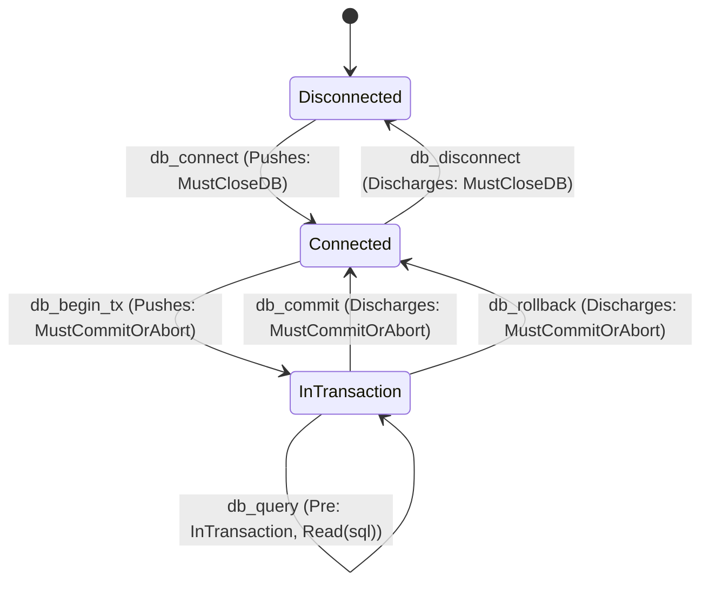
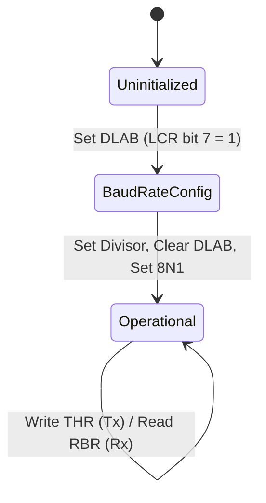

# API State Models, Boundary Contracts & The Universal `Callable` System

When low-level assembly routines interact with external operating system kernels, databases, GPU command processors, or hardware controllers, they cross **external execution boundaries**.

In `gasm`, external runtimes and APIs are formally modeled as **State Transition Systems**. Assembly routines cannot invoke boundary operations without presenting formal **proof witnesses** that satisfy the API's current state preconditions. All invocations—internal basic blocks, external symbols, function pointers, and syscalls—are unified under a single **`Callable` typeclass** operating within **Indexed Typestate Monads** carrying **Path-Sensitive Linear Obligations** and **Monotonic Causal Effects**.

---

## 1. The Composed State Model & Zero-Cost Proof Erasure

An execution state in `gasm` is a composite structure bundling the low-level machine registers/memory with high-level API typestate, concrete stack frame depth, discrete permission capabilities, linear obligation ledgers, and monotonic causal event clocks:

```lean
inductive PermissionShare where
  | ReadOnly  : PermissionShare  -- Shared reader permission (multiple readers allowed, 0 writers)
  | Exclusive : PermissionShare  -- Sole exclusive owner (1 writer, 0 readers)
  | Locked    : PermissionShare  -- Governed by atomic / locked instructions

structure ComposedState (Arch : Type) (ApiStateType : Type) where
  machine      : MachineState Arch
  stackDepth   : Nat                         -- Current stack frame depth relative to function entry
  api          : ApiStateType
  perms        : MemoryPermissions Arch     -- Discrete capability permissions (PermissionShare)
  obligations  : List Obligation             -- Linear obligation ledger (multiset of obligations)
  causalClock  : VectorClock                 -- Local monotonic logical timestamps
  eventHistory : EventTag → VectorClock      -- Monotonic event history map
```

### Zero Runtime Overhead via Proof Erasure

All API states, capability tokens, obligation ledgers, and causal clocks are **computational ghosts** in Lean 4:
- They exist solely at Lean typechecking and theorem verification time to mathematically eliminate invalid sequences (e.g. issuing SQL queries outside a transaction or writing to a closed file descriptor).
- During binary serialization (`toBinary`, `toELF`, `toPE`), all proof metadata is completely erased.
- The resulting machine binary consists only of raw, optimal instructions (`mov eax, 0x10`, `syscall`, `call sym`, `ret`) with **zero runtime overhead**.

---

## 2. The Indexed Typestate Monad (`BlockM`)

`BlockM` is a clean, 4-parameter indexed state monad transforming static typestates from $S_1 \to S_2$:

```lean
/-- Indexed Monad: Transforms typestate from S₁ to S₂ while tracking concrete state -/
def BlockM (Arch : Type) (S₁ S₂ : Type) (α : Type) : Type :=
  ComposedState Arch S₁ → (α × ComposedState Arch S₂)
```

---

## 3. The `Callable` Typeclass & Automatic Derivation

For **internal basic blocks**, `Callable` instances are **automatically derived** from the block's verified definition. For **external boundaries**, contracts define preconditions, obligations, and causal effects:

```lean
/-- Universal structural contract for invocations -/
class Callable (Arch : Type) (Target : Type) (InState : outParam Type) (OutState : outParam Type) where
  -- 1. Precondition that must hold before invocation
  Precondition          : ComposedState Arch InState → Prop
  
  -- 2. Valid typestate transition rule (constraining ghost state escalation)
  validTransition       : Target → InState → MachineState Arch → OutState → Prop
  
  -- 3. Obligations pushed onto the state (evaluated on post-machine state for path sensitivity)
  pushedObligations     : Target → MachineState Arch → List Obligation
  
  -- 4. Obligations discharged from the state by this call
  dischargedObligations : Target → ComposedState Arch InState → List Obligation
  
  -- 5. Monotonic causal events established by this call
  causalEffects         : Target → ComposedState Arch InState → List (EventTag × EventTag)
  
  -- 6. Mathematical state transformer (mutations, frame rule, and ledger updates)
  update                : ComposedState Arch InState → ComposedState Arch OutState
  
  -- 7. Emitted instruction AST
  emitInstruction       : Target → Instruction Arch
  
  -- 8. Mandatory Simulation Law (Machine Step + Multiset Obligation Ledger + Causal Ordering + Valid Typestate Transition)
  soundness             : ∀ (target : Target) (s : ComposedState Arch InState),
                          Precondition s →
                          MachineStep Arch (emitInstruction target) s.machine (update s).machine ∧
                          validTransition target s.api (update s).machine (update s).api ∧
                          (update s).obligations = List.eraseAll (s.obligations ++ pushedObligations target (update s).machine) (dischargedObligations target s) ∧
                          (∀ (e₁ e₂ : EventTag), (e₁, e₂) ∈ causalEffects target s → 
                            VectorClock.happensBefore ((update s).eventHistory e₁) ((update s).eventHistory e₂))
```

### 3.1 Linux Syscall Register Poisoning (`RCX` & `R11`)
On x86-64 Linux, executing `syscall` unconditionally clobbers `RCX` and `R11`. The Linux syscall `Callable` updates the machine state with poisoned scratch registers:

```lean
def linuxSyscallUpdate (s : ComposedState x86_64 InState) : ComposedState x86_64 OutState :=
  let s' := executeSyscall s
  { s' with machine := s'.machine.setReg .rcx RegVal.poisoned |>.setReg .r11 RegVal.poisoned }
```

---

## 4. BasicBlock Structure & Target-Parametric Terminators

A `BasicBlock` is parameterized **only by `InState`**. It executes instructions transforming `InState` to an internal exit state, producing a typed terminator strictly indexed over the resulting exit state `s_exit`:

```lean
class TargetArch (Arch : Type) where
  wordWidth  : Nat
  Terminator : ∀ {S : Type}, ComposedState Arch S → Type

structure BasicBlock (Arch : Type) [TargetArch Arch] (InState : Type) where
  label         : String
  expectedDepth : Nat
  entryProof    : ComposedState Arch InState → Prop
  body          : Σ (S_exit : Type), ComposedState Arch InState → (Σ (s_exit : ComposedState Arch S_exit), TargetArch.Terminator Arch s_exit)

inductive CpuTerminator (Arch : Type) [TargetArch Arch] {S : Type} (s_exit : ComposedState Arch S) where
  /-- Unconditional Direct Jump: Target InState, entryProof, and expected depth must match exit state -/
  | jmp   {TargetIn : Type}
          (target  : BasicBlock Arch TargetIn)
          (h_state : S = TargetIn)
          (h_entry : target.entryProof (h_state ▸ s_exit))
          (h_depth : target.expectedDepth = s_exit.stackDepth) : CpuTerminator Arch s_exit
  
  /-- Indirect Jump via Register: Target must belong to a verified Jump Table -/
  | jmpIndirect
          (reg     : Register Arch (TargetArch.wordWidth Arch))
          (targets : List (BasicBlock Arch S))
          (h_valid : s_exit.machine.getReg reg ∈ targets.map (·.labelAddress))
          (h_entry : ∀ (t ∈ targets), t.entryProof s_exit)
          (h_depth : ∀ (t ∈ targets), t.expectedDepth = s_exit.stackDepth) : CpuTerminator Arch s_exit

  /-- Conditional Branch (structured control flow) -/
  | jcc   {TrueIn FalseIn : Type}
          (cond        : ConditionCode Arch)
          (targetTrue  : BasicBlock Arch TrueIn)   (h_true    : S = TrueIn)
          (h_entry_t   : targetTrue.entryProof (h_true ▸ s_exit))
          (h_depth_t   : targetTrue.expectedDepth = s_exit.stackDepth)
          (targetFalse : BasicBlock Arch FalseIn) (h_false   : S = FalseIn)
          (h_entry_f   : targetFalse.entryProof (h_false ▸ s_exit))
          (h_depth_f   : targetFalse.expectedDepth = s_exit.stackDepth) : CpuTerminator Arch s_exit

  /-- Function Return: Requires local stackDepth = 0, obligations match exported list -/
  | ret   (exportedObligations : List Obligation) (bytesToPop : UInt16 := 0)
          (h_zero      : s_exit.stackDepth = 0)
          (h_match     : s_exit.obligations = exportedObligations)
          (h_callee    : CalleeDiscipline Arch s_exit) : CpuTerminator Arch s_exit
  
  /-- Clean Exit / Halt: All remaining obligations must be droppable on exit -/
  | sysExit (exitCode  : UInt8)
            (h_droppable : ∀ o ∈ s_exit.obligations, o.isDroppableOnExit) : CpuTerminator Arch s_exit

  | halt    (h_droppable : ∀ o ∈ s_exit.obligations, o.isDroppableOnExit) : CpuTerminator Arch s_exit
```

---

## 5. Target API Case Studies

### 5.1 Case Study 1: Database Transaction State Machine



```lean
inductive DBState where
  | Disconnected
  | Connected (conn : ConnectionHandle)
  | InTransaction (conn : ConnectionHandle) (txId : Nat)
  | Error (errCode : Nat)

class HasActiveTransaction (State : Type) where
  txId       : State → Nat
  connHandle : State → ConnectionHandle

def bb_query_loop [HasActiveTransaction S] : BasicBlock x86_64 S := {
  label := "bb_query_loop"
  expectedDepth := 64
  entryProof := fun s => s.machine.isReadableString s.machine.rsi "SELECT balance FROM users"
  body := ⟨S, fun s =>
    let s' := { s with machine := s.machine.setReg .rax SYS_DB_QUERY }
    ⟨s', CpuTerminator.jcc .ZeroFlag bb_commit_tx bb_query_loop (by decide) (by decide) (by decide) (by decide) (by decide) (by decide)⟩⟩
}
```

---

### 5.2 Case Study 2: Bare-Metal MMIO Device Controllers (Structured Polling Loop)



```lean
inductive UartState where
  | Uninitialized
  | InBaudConfig
  | Ready (baud : Nat)

def bb_uart_poll (ch : UInt8) (baud : Nat) : BasicBlock x86_64 (DeviceState .UART (.Ready baud)) := {
  label := "bb_uart_poll"
  expectedDepth := 0
  entryProof := fun s => s.machine.getReg .rdx = UART_LSR_ADDR
  body := ⟨DeviceState .UART (.Ready baud), fun s =>
    let s' := s -- In practice, machine execution of IN al, dx + TEST al, 0x20
    ⟨s', CpuTerminator.jcc .ZeroFlag (bb_uart_poll ch baud) (bb_uart_send ch baud) (by decide) (by decide) (by decide) (by decide) (by decide) (by decide)⟩⟩
}

def bb_uart_send (ch : UInt8) (baud : Nat) : BasicBlock x86_64 (DeviceState .UART (.Ready baud)) := {
  label := "bb_uart_send"
  expectedDepth := 0
  entryProof := fun s => s.machine.getReg .rdx = UART_THR_ADDR
  body := ⟨DeviceState .UART (.Ready baud), fun s =>
    let s' := s -- OUT dx, al
    ⟨s', CpuTerminator.ret [] 0 (by decide) (by decide) (by decide)⟩⟩
}
```
