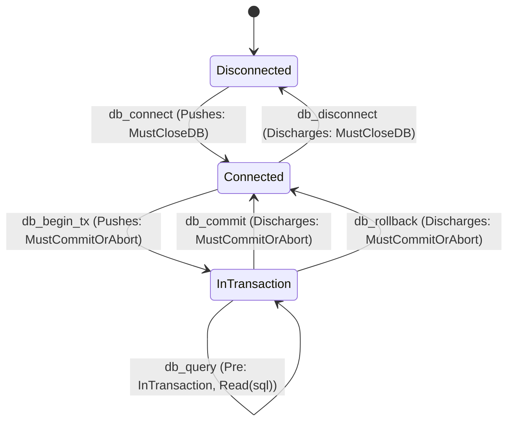
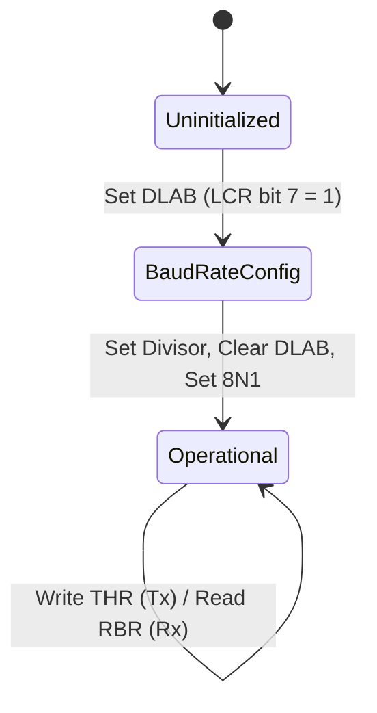

# API State Models, Boundary Contracts & The Universal `Callable` System

**Status (2026-08-28): design sketch with a partial substrate.** `ComposedState`, `BlockM`,
generic value-level permissions/obligations, vector-clock operations, and a narrower `Callable`
surface exist. Path-sensitive linear enforcement, typed lock/join obligations, closed indexed
constructors, and automatic `Callable` derivation do not. Fenced Lean below is illustrative unless
it names a current source declaration. The canonical completion design is
`docs/MEMORY_MODEL.md` §3, §§6–8, and §§11–15.

When low-level assembly routines interact with external operating system kernels, databases, GPU command processors, or hardware controllers, they cross **external execution boundaries**.

The target design models external runtimes and APIs as **state-transition systems**. Checked
assembly will require proof witnesses for boundary preconditions and will unify internal and
external calls through indexed contracts carrying typed resources and causal effects. The current
tree provides pieces of that representation, not the claimed end-to-end enforcement.

---

## 1. The Composed State Model & Zero-Cost Proof Erasure

The current `ComposedState` bundles low-level machine state with API state, stack depth,
value-level permission and obligation fields, and causal clocks. Those fields are not yet discrete
linear capabilities:

```lean
inductive PermissionShare where
  | ReadOnly  : PermissionShare  -- Shared reader permission (multiple readers allowed, 0 writers)
  | Exclusive : PermissionShare  -- Sole exclusive owner (1 writer, 0 readers)
  | Locked    : PermissionShare  -- Governed by atomic / locked instructions

structure ComposedState (Arch : Type) (ApiStateType : Type) where
  machine      : MachineState Arch
  stackDepth   : Nat                         -- Current stack frame depth relative to function entry
  api          : ApiStateType
  perms        : MemoryPermissions Arch     -- Discrete capability permissions (PermissionShare)
  obligations  : List ObligationToken        -- Current value-level token multiset
  causalClock  : VectorClock                 -- Local monotonic logical timestamps
  eventHistory : EventTag → VectorClock      -- Monotonic event history map
```

This sketch reflects the current field names but not a sound concurrent exit rule. M3 supplies the
scheduler/thread-lifecycle seam; M4's required thread terminator seals a result-indexed bundle
accounting for all authority, loans, grants, guards, and obligations, and M6-T proves the selected
hosted-thread refinement. Its one-shot `JoinRight` is a
task/thread contract, not process observation or reaping. Graceful root exit accounts for every live
thread and terminal bundle; a marker cannot discard a guard, loan or join right. Multiprocess types
and proofs are post-M9 work under `docs/FUTURE_PROCESS_MODEL.md`. See
`docs/MEMORY_MODEL.md` §§6.4–6.5 and 8–8.1.

### Intended zero runtime overhead via proof erasure

The intended checked-authoring metadata is computational ghost state in Lean 4:
- They exist solely at Lean typechecking and theorem verification time to mathematically eliminate invalid sequences (e.g. issuing SQL queries outside a transaction or writing to a closed file descriptor).
- During binary serialization (`toBinary`, `toELF`, `toPE`), all proof metadata is completely erased.
- The resulting machine binary consists only of raw, optimal instructions (`mov eax, 0x10`, `syscall`, `call sym`, `ret`) with **zero runtime overhead**.

---

## 2. The Indexed Typestate Monad (`BlockM`)

`BlockM` is a clean, 4-parameter indexed state monad transforming static typestates from $S_1 \to S_2$:

```lean
/-- Indexed Monad: Transforms typestate from S₁ to S₂ while tracking concrete state -/
def BlockM (Arch : Type) (S₁ S₂ : Type) (α : Type) : Type :=
  ComposedState Arch S₁ → (α × ComposedState Arch S₂)
```

---

## 3. The `Callable` Typeclass & Automatic Derivation

The sketch below describes a structural transition contract useful for verified internal blocks. It
does not by itself certify an external call, syscall, loader root, thread start or handler
boundary. The landed generic `ContextBoundaryRealization`, `EstablishedBoundaryEntry`, and
`VerifiedExportSet` types provide relational entry/exit, caller-establishment, and final-artifact
certificate shapes, but concrete target profiles and `Callable` integration remain unimplemented.
A completed concrete boundary additionally consumes the canonical boundary-profile closure rule in
`docs/MEMORY_MODEL.md` §3 and, where applicable, the selected lifecycle semantic realization. A
future process start is not a current profile. Automatic
derivation of the combined shape is not
implemented:

```lean
/-- Structural transition contract; not an external-boundary/link certificate by itself. -/
class Callable (Arch : Type) (Target : Type) (InState : outParam Type) (OutState : outParam Type) where
  -- 1. Precondition that must hold before invocation
  Precondition          : ComposedState Arch InState → Prop
  
  -- 2. Valid typestate transition rule (constraining ghost state escalation)
  validTransition       : Target → InState → MachineState Arch → OutState → Prop
  
  -- 3. Obligations pushed onto the state (evaluated on post-machine state for path sensitivity)
  pushedObligations     : Target → MachineState Arch → List Obligation
  
  -- 4. Obligations discharged from the state by this call
  dischargedObligations : Target → ComposedState Arch InState → List Obligation
  
  -- 5. Monotonic causal events established by this call
  causalEffects         : Target → ComposedState Arch InState → List (EventTag × EventTag)
  
  -- 6. Mathematical state transformer (mutations, frame rule, and ledger updates)
  update                : ComposedState Arch InState → ComposedState Arch OutState
  
  -- 7. Emitted instruction AST
  emitInstruction       : Target → Instruction Arch
  
  -- 8. Mandatory Simulation Law (Machine Step + Multiset Obligation Ledger + Causal Ordering + Valid Typestate Transition)
  soundness             : ∀ (target : Target) (s : ComposedState Arch InState),
                          Precondition s →
                          MachineStep Arch (emitInstruction target) s.machine (update s).machine ∧
                          validTransition target s.api (update s).machine (update s).api ∧
                          (update s).obligations = List.eraseAll (s.obligations ++ pushedObligations target (update s).machine) (dischargedObligations target s) ∧
                          (∀ (e₁ e₂ : EventTag), (e₁, e₂) ∈ causalEffects target s → 
                            VectorClock.happensBefore ((update s).eventHistory e₁) ((update s).eventHistory e₂))
```

For a normal call, the internal `Callable` theorem may be reused unchanged, but the caller still
proves the exact entry relation and precondition and the linker connects that call edge to the
selected artifact. Fresh logical identities or authority returned by OS/platform operations are
introduced only by the relational after-world witness; raw scalar result bits cannot manufacture
them.

### 3.1 Linux Syscall Register Poisoning (`RCX` & `R11`)
On x86-64 Linux, executing `syscall` clobbers `RCX` and `R11` according to the selected architectural
profile. A future M2-B[Linux-x86-syscall] boundary realization must represent those clobbers while
relating the physical result and after-world; no such `Callable` instance or update declaration
currently exists. The following is design-only pseudocode:

```lean
def linuxSyscallUpdate (s : ComposedState x86_64 InState) : ComposedState x86_64 OutState :=
  let s' := executeSyscall s
  { s' with machine := s'.machine.setReg .rcx RegVal.poisoned |>.setReg .r11 RegVal.poisoned }
```

---

## 4. BasicBlock Structure & Target-Parametric Terminators

A `BasicBlock` owns a dependent `BlockEntry`: an erased typestate, a label, an expected stack
depth, and the complete predicate demanded of predecessors. Its body can be invoked only with that
predicate established. A jump carries a `BlockEdge`, which supplies the destination state, preserves
the concrete machine and framed ghost resources, and proves the destination predicate. Conditional
edges make that last proof conditional on the target-owned meaning of the branch condition.

```lean
structure BlockEntry (Arch : Type) [TargetArch Arch] where
  State : Type
  label : String
  expectedDepth : Nat
  accepts : ComposedState Arch State → Prop

structure BlockEdge {Arch : Type} [TargetArch Arch] {Source : Type}
    (source : ComposedState Arch Source) where
  target : BlockEntry Arch
  targetState : ComposedState Arch target.State
  framePreserved : JumpFramePreserved source targetState
  depthEstablished : target.expectedDepth = targetState.stackDepth
  entryEstablished : target.accepts targetState

inductive CpuTerminator (Arch : Type) [TargetArch Arch] {S : Type} (s_exit : ComposedState Arch S) where
  | jmp (edge : BlockEdge s_exit)
  | jcc (cond : ConditionCode Arch)
      (targetTrue : ConditionalBlockEdge s_exit (cond.holds s_exit.machine))
      (targetFalse : ConditionalBlockEdge s_exit (¬ cond.holds s_exit.machine))
  | ret   (exportedObligations : List Obligation) (bytesToPop : UInt16 := 0)
          (h_zero      : s_exit.stackDepth = 0)
          (h_match     : s_exit.obligations = exportedObligations)
          (h_callee    : CalleeDiscipline Arch s_exit) : CpuTerminator Arch s_exit

structure BasicBlock (Arch : Type) [TargetArch Arch] where
  entry : BlockEntry Arch
  body : (state : ComposedState Arch entry.State) → entry.accepts state →
    Σ ExitState, Σ exit : ComposedState Arch ExitState, CpuTerminator Arch exit
```

Direct, conditional, and duplicate-free closed-set indirect edge constructors are implemented.
The final artifact still has to connect an indirect edge's target decoder to the emitted branch
operand. The generic finite-CFG reachability theorem remains required work; until that lands, this
module is not yet the complete routine-verification surface.

---

## 5. Target API Case Studies

### 5.1 Case Study 1: Database Transaction State Machine



```lean
inductive DBState where
  | Disconnected
  | Connected (conn : ConnectionHandle)
  | InTransaction (conn : ConnectionHandle) (txId : Nat)
  | Error (errCode : Nat)

class HasActiveTransaction (State : Type) where
  txId       : State → Nat
  connHandle : State → ConnectionHandle

def bb_query_loop [HasActiveTransaction S] : BasicBlock x86_64 S := {
  label := "bb_query_loop"
  expectedDepth := 64
  entryProof := fun s => s.machine.isReadableString s.machine.rsi "SELECT balance FROM users"
  body := ⟨S, fun s =>
    let s' := { s with machine := s.machine.setReg .rax SYS_DB_QUERY }
    ⟨s', CpuTerminator.jcc .ZeroFlag bb_commit_tx bb_query_loop (by decide) (by decide) (by decide) (by decide) (by decide) (by decide)⟩⟩
}
```

---

### 5.2 Case Study 2: Bare-Metal MMIO Device Controllers (Structured Polling Loop)



```lean
inductive UartState where
  | Uninitialized
  | InBaudConfig
  | Ready (baud : Nat)

def bb_uart_poll (ch : UInt8) (baud : Nat) : BasicBlock x86_64 (DeviceState .UART (.Ready baud)) := {
  label := "bb_uart_poll"
  expectedDepth := 0
  entryProof := fun s => s.machine.getReg .rdx = UART_LSR_ADDR
  body := ⟨DeviceState .UART (.Ready baud), fun s =>
    let s' := s -- In practice, machine execution of IN al, dx + TEST al, 0x20
    ⟨s', CpuTerminator.jcc .ZeroFlag (bb_uart_poll ch baud) (bb_uart_send ch baud) (by decide) (by decide) (by decide) (by decide) (by decide) (by decide)⟩⟩
}

def bb_uart_send (ch : UInt8) (baud : Nat) : BasicBlock x86_64 (DeviceState .UART (.Ready baud)) := {
  label := "bb_uart_send"
  expectedDepth := 0
  entryProof := fun s => s.machine.getReg .rdx = UART_THR_ADDR
  body := ⟨DeviceState .UART (.Ready baud), fun s =>
    let s' := s -- OUT dx, al
    ⟨s', CpuTerminator.ret [] 0 (by decide) (by decide) (by decide)⟩⟩
}
```
