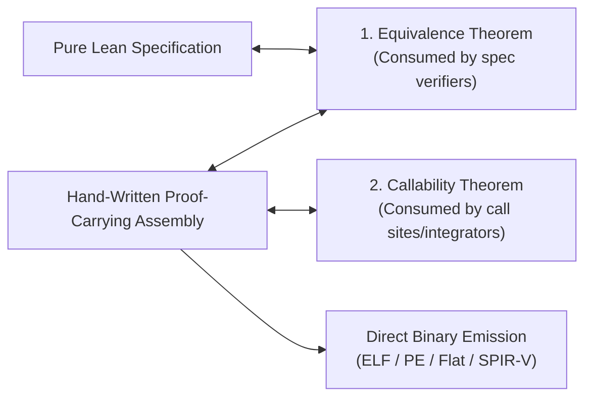

# `gasm` Architecture: Independent Vertical Slices

**Status (2026-08-28): architectural intent, not a literal tree map.** The live layout is
`Gasm/Core/`, `Gasm/Effects/`, and `Gasm/Targets/<Target>/`; the `Gasm/Common` and top-level target
paths shown below do not exist. Permission/lock names in the diagram are historical sketches, not
evidence of enforced borrowing. The current layout index is `docs/README.md`; the shared
concurrency boundary is `docs/MEMORY_MODEL.md` §5.3.

`gasm` is intended to preserve **independent vertical slices** per target, supported by small,
focused modules for common proof-facing contracts.

---

## 1. Design Philosophy: Simple Vertical Slices

Rather than building a heavyweight, over-abstracted compiler framework, `gasm` is organized into self-contained target trees:

```
gasm/
├── Gasm/
│   ├── Common/                  # Shared proof helper libraries
│   │   ├── Memory.lean          # Planned common authority/event contracts
│   │   ├── Simulation.lean      # Equivalence & step relation helpers
│   │   └── ApiState.lean        # LTS and boundary contract primitives
│   │
│   ├── X86_64/                  # Self-contained x86-64 vertical slice
│   │   ├── Machine.lean         # Machine state & step semantics
│   │   ├── DSL.lean             # Proof-carrying assembly builder
│   │   ├── ABI.lean             # SysV & Windows x64 caller/callee disciplines
│   │   └── Emit.lean            # Bytecode, ELF, PE serializers
│   │
│   ├── X86_32/                  # Self-contained x86-32 vertical slice
│   ├── X86_RealMode/            # Self-contained Real Mode vertical slice
│   ├── ARM/                     # Self-contained AArch64 / AArch32 vertical slice
│   └── SPIRV/                   # Self-contained SPIR-V shader & Vulkan slice
```

### Why Vertical Slices?
1. **Zero Over-Engineering**: No massive generic typeclass pyramids or artificial compilation abstractions.
2. **Independent Iteration**: We can implement, verify, and ship one target (e.g. `X86_64` or `X86_RealMode`) completely end-to-end without being blocked by other architectures.
3. **Target-Specific Idioms**: Each architecture models its own registers, encodings, and semantics naturally (e.g. x86 segments vs ARM condition codes vs SPIR-V SSA words) without being forced into an unnatural universal AST.

---

## 2. The Core Verification Flow

Each target slice implements the same straightforward verification pattern:



1. **Pure Lean Model**: Defines the high-level algorithm or API state protocol.
2. **Hand-Written Assembly Routine**: Authored in the target's DSL; selected properties are proved
   today, while universal memory-permission and obligation witnesses remain planned.
3. **Split Proofs for Independent Consumers**:
   - **Equivalence Theorem**: Proves functional correctness against the spec.
    - **Structural Callability Theorem**: Proves the selected routine's internal transition and ABI
      preservation facts (such as stack pointer and callee-saved registers). A caller/integrator also
      discharges M1's relational entry/world/precondition contract and the selected concrete M2-B
      target/admissibility/artifact-link certificate; `Callable` alone is not an external-boundary proof.
4. **Binary Emission**: Pure deterministic serialization from verified AST to machine bytes with zero runtime overhead.
