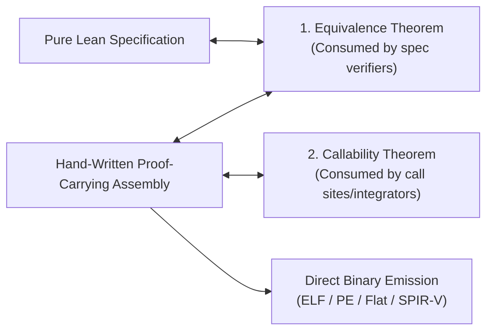

# `gasm` Architecture: Independent Vertical Slices

**Status (2026-08-28): architectural intent, not a literal tree map.** The live layout is
`Gasm/Core/`, `Gasm/Effects/`, and `Gasm/Targets/<Target>/`; the `Gasm/Common` and top-level target
paths shown below do not exist. Permission/lock names in the diagram are historical sketches, not
evidence of enforced borrowing. The current layout index is `docs/README.md`; the shared
concurrency boundary is `docs/MEMORY_MODEL.md` §5.3.

`gasm` is intended to preserve **independent vertical slices** per target, supported by small,
focused modules for common proof-facing contracts.

---

## 1. Design Philosophy: Simple Vertical Slices

Rather than building a heavyweight, over-abstracted compiler framework, `gasm` is organized into self-contained target trees:

```
gasm/
├── Gasm/
│   ├── Common/                  # Shared proof helper libraries
│   │   ├── Memory.lean          # Planned common authority/event contracts
│   │   ├── Simulation.lean      # Equivalence & step relation helpers
│   │   └── ApiState.lean        # LTS and boundary contract primitives
│   │
│   ├── X86_64/                  # Self-contained x86-64 vertical slice
│   │   ├── Machine.lean         # Machine state & step semantics
│   │   ├── DSL.lean             # Proof-carrying assembly builder
│   │   ├── ABI.lean             # Planned calling-convention/context realization seam
│   │   └── Emit.lean            # Bytecode, ELF, PE serializers
│   │
│   ├── X86_32/                  # Self-contained x86-32 vertical slice
│   ├── X86_RealMode/            # Self-contained Real Mode vertical slice
│   ├── ARM/                     # Self-contained AArch64 / AArch32 vertical slice
│   └── SPIRV/                   # Self-contained SPIR-V shader & Vulkan slice
```

### Why Vertical Slices?
1. **Zero Over-Engineering**: No massive generic typeclass pyramids or artificial compilation abstractions.
2. **Independent Iteration**: We can implement, verify, and ship one target (e.g. `X86_64` or `X86_RealMode`) completely end-to-end without being blocked by other architectures.
3. **Target-Specific Idioms**: Each architecture models its own registers, encodings, and semantics naturally (e.g. x86 segments vs ARM condition codes vs SPIR-V SSA words) without being forced into an unnatural universal AST.

---

## 2. The Core Verification Flow

Each target slice implements the same straightforward verification pattern:



1. **Pure Lean Model**: Defines the high-level algorithm or API state protocol.
2. **Hand-Written Assembly Routine**: Authored in the target's DSL; selected properties are proved
   today, while universal memory-permission and obligation witnesses remain planned.
3. **Split Proofs for Independent Consumers**:
   - **Equivalence Theorem**: Proves functional correctness against the spec.
   - **Structural Callability Theorem**: Proves the selected routine's internal transition and ABI
     preservation facts (such as stack pointer and callee-saved registers). A caller/integrator also
     consumes the canonical boundary-profile closure rule in `docs/MEMORY_MODEL.md` §3. The landed
     `ContextBoundaryRealization`, `EstablishedBoundaryEntry`, and `VerifiedExportSet` types provide
     the generic relational and artifact-certificate shapes, but concrete M2-B profiles and
     context-row integration with `Callable` remain required work; see
     [Composable Boundary ABI Contexts](ABI_CONTEXT.md).
4. **Binary Emission**: Pure deterministic serialization from verified AST to machine bytes with zero runtime overhead.

Internal control-flow boundaries obey the same assume/guarantee principle as function calls. A
direct or conditional jump targets a nominally identified typed basic-block entry contract, not an
untyped text label plus a stack-depth check. Human-readable linker/debug names are separate from
proof identity. The edge must establish the destination's complete entry relation—including the
ghost authority/obligation world—from the source exit world while preserving the concrete machine
state according to the instruction semantics. A generic CFG composition theorem turns edge-local
certificates into routine preservation; consumers must not replay whole paths. Indirect jumps add a
closed target-set and resolution certificate. This typed CFG certificate is applicable whenever
reachable code contains internal control flow and is one of the reusable leaves composed into
whole-program verification.

Macro assemblers and higher-level code generators are proof-producing frontends to this same
surface, not additional proof authorities. Their reusable lowering theorem maps source constructs
to typed calls, typed CFG edges, instruction semantics, and artifact-connection certificates; bulk
generated code then pays only source-level contracts and exceptional lowering deltas. Code paths
outside a frontend's proved fragment fall back to local certificates. `VerifiedProgram` checks the
resulting target certificates exactly as it does for hand-authored assembly and never trusts the
frontend merely because it produced bytes.

### 2.1 Platform-neutral whole-program boundary

`Gasm.Core.Platform.VerifiedProgram` is the sole whole-program proof authority and the canonical
proof-gated production-emission path. Its platform parameter selects the ISA and host execution
semantics; its `CapabilityComposition` argument selects library/runtime context independently. The
contract quantifies over the one canonical `Environment`, carries an exact target-checked
`VerifiedExportSet`, proves typed import coverage and root-context establishment, proves target
admissibility, and connects the semantic artifact to the exact bytes selected for emission.
Target-specific `VerifiedWindowsProgram`, `VerifiedLinuxProgram`, and `VerifiedWasmProgram`
alternatives do not exist. Public target-local raw serializers still exist and are used by
unmigrated/fuzzing paths; they confer no verification claim and must be made private or gated before
the “only emission path” property is mechanically true.

The accepted rebuild direction for external-provider nondeterminism is relational target execution,
described by `PROOF_LOWERING_CORE_DESIGN.md` and `SPIKE1_REBUILD_SEAM.md`; it is not implemented or
interface-frozen yet. `Environment` carries logical external inputs but neither selects a provider
nor asserts admission/authority. Every concrete provider transition is classified by exactly one
owner-defined result (universal soundness). The provider owner defines result eligibility, and the
selected target realization proves conditional coverage only for root-required or selected eligible
result classes under exact environment/profile premises. It neither requires every theoretical
failure in every state nor permits deterministic-success narrowing that omits eligible branches.

A deterministic runner may survive as a derived diagnostic for an exact closed transcript/profile
only after soundness and completeness against the relational semantics. It is not whole-program
behavior authority. The current functional `Platform.run` remains implementation evidence pending
the atomic rebuild; it cannot close the new Spike 1 short-write/failure root by itself.

The current pure `Platform.load : Artifact → Environment → State` cannot establish that identity is
generative. Two calls with equal arguments return equal states; a phantom type, hidden existential,
higher-rank eliminator, caller-supplied environment nonce, or relational `Capability.establishes`
claim does not mint a fresh target-owned root. Provider production therefore requires a
state-threaded load discipline connected directly to the sole `VerifiedProgram`:

- `LoadDiscipline` supplies a `World`, `WorldWF`, a target-owned `initialWorld` with an
  `initialWorld_wf : WorldWF initialWorld` witness, and
  `loadStep : World → Artifact → Environment → World × State`, together with preservation of
  `WorldWF`. Production starts from that witness and threads each returned world into the next load;
  a platform may not make the proof vacuous with `WorldWF := False`. `Platform` selects exactly one
  discipline. The old pure loader migrates through a canonical `Unit`/`True` adapter, so a
  nongenerative platform and its programs acquire no new local proof obligation.
- One named dependent load-result index records the input world, its validity witness, artifact,
  environment, exact output world/state, and equality to `loadStep`. The factored entry,
  admissibility, and behavior certificates share that same index rather than choosing or recomputing
  extensionally equal states. `VerifiedProgram` quantifies over every such result reachable from a
  well-formed input world; its entry context may depend on the result, and all three certificate
  families consume it. The observable specification remains `Environment → Observation`, so the
  theorem proves that allocation bookkeeping and the chosen fresh root are observationally
  irrelevant rather than exposing them as additional caller input.
- A separate target-owned `GenerativeLoadCertificate`, selected only by a generative platform,
  supplies `ExecutionInstanceId`, the world's allocated-root predicate, and the root of the loaded
  state. The certificate is indexed by the exact selected `LoadDiscipline` and its named load result;
  it proves freshness against the input world, exact one-root allocation extension, preservation of
  world validity, and initialization/reachability of the loaded state at that root. Provider
  transitions preserve that root and reachability. Root-indexed contexts and handles consume this
  allocation/reachability witness; bare root or sequence equality is diagnostic only. Platforms that
  do not select generative loading provide no such certificate or premises.
- Loads sequenced through one world produce distinct roots. Roots originating in independent worlds
  need no global physical inequality: even coincident diagnostic numbers confer no shared authority
  or cross-execution correlation. Operation and response handles carry the selected root and use
  independent monotone sequences; their constructors and provider-state mutation remain
  target-private. The generative certificate exports the derived two-load theorem: exact one-root
  extension after the first load plus freshness of the second load implies distinct authoritative
  roots.

This load discipline replaces authoritative uses of the old pure loader in `VerifiedProgram` and
its factored entry/admissibility/behavior certificates. It is not a parallel runner, a second
whole-program theorem, or a repurposing of `BoundaryWorld`, whose ABI authority role remains
separate. The signature migration and a stateless-platform compatibility proof must land before a
provider runner may claim generativity or production authority.

This is a staged core boundary, not yet a landed API. It may be integrated only in a reviewed
series where two materially different real provider operations consume the same envelope and a
runnable emitted demonstration closes through the sole production `VerifiedProgram`; the initial
graphics pair is Win32 `GetMessage` and a synchronous Vulkan scalar/out-buffer operation. Higher
vocabulary such as operation IDs, generative buffer loans, exact write frames, callbacks, and
asynchronous completion stays target-local until independent consumers establish a reusable shape.
Programs whose artifacts do not import and select a provider incur no provider setup or proof
obligation; shared unused-input framing is discharged by the platform, not replayed per program.
See `docs/GRAPHICS_ARCHITECTURE.md` §2.3 for the concrete validation and landing gate.

`VerifiedProgram` is assembled by one general rule over the current fixed artifact, provider,
entry-context, target-admissibility and behavioral-refinement certificates plus its export set.
Their dependent indices require agreement on the same platform, final artifact and capability
composition, so programs do not restate certificate internals. The broader applicability-key
closure is still review-derived, not mechanically generated: future work must derive exactly the
additional certificate families selected by reachable features and advertised guarantees. An
unselected optional feature must contribute no key, while adding a reachable feature must extend the
required set rather than weakening an existing proof.

Native x86-64 profiles expose `NativeObservable`, derived from the explicit `NativeRunOutcome`,
not a projected event list.  Their realized runtime carries a typed, caller-selected
`NativeProofBudget`, including evaluator fuel.  This is evaluator evidence, not an artifact
resource capability: `.fuelExhausted` is inadmissible for native emission until a future profile
proves an artifact-enforced budget and models its resource result.  The observable keeps normal
return, typed OS process exit, architectural HLT, and machine fault distinct.  Cleanup,
reclamation, and recovery claims for an actual resource failure must be expressed over the full
outcome and its final state before observation erases that state.  Profiles that do not select
native execution incur no such obligation.

The implemented spikes are the executable reference architecture for this rule, not disposable
integration tests. The trust-repair milestone is not complete merely because each spike happens to
construct a `VerifiedProgram`: every implemented spike must expose the same ownership-scoped
certificate factoring, reuse the general composition rule, and leave only its genuinely local
refinement deltas at the spike layer. A spike that reaches the theorem through a monolithic replay,
target-specific glue, or duplicated platform/library reasoning keeps the architecture unvalidated.

Non-total libraries use `Gasm.Core.VerifiedComponent`: the complete physical public manifest is
checked, every callable entry has an assume/guarantee `ContextBoundaryRealization` tied to the same
final artifact, lookup keys are unique, and the target proves the set jointly admissible. Callers
establish the required entry world. Composing components additionally requires a target-owned
final-link certificate; pairwise name or ABI-list agreement is not a sound substitute.
