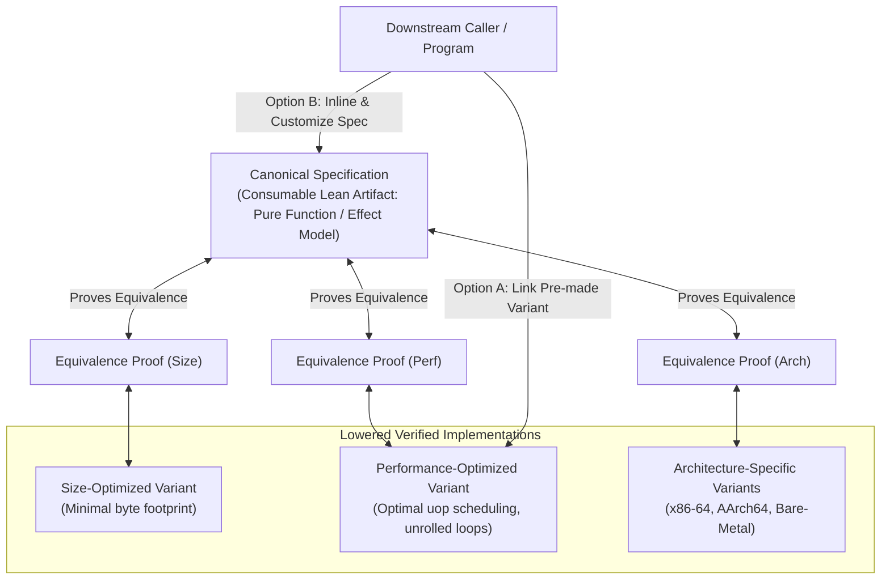

# Assembly Authoring Guide & Library Architecture in Gasm

This document establishes the guidelines, architectural principles, and best practices for authoring assembly routines and designing reusable library modules in `gasm`.

As we discover new patterns, optimization techniques, and verification idioms, this document will continue to evolve as a living guide.

---

## 1. The Core Vision: Compositional Abstraction in Verified Assembly

Abstraction is fundamental to software development. In traditional assembly programming, abstraction is fragile, ad-hoc, and error-prone—relying on convention, manual stack discipline, and unchecked register clobbers.

In `gasm`, **libraries are first-class, verified Lean 4 modules**. A Gasm library provides modular specifications, a menu of verified machine implementations tailored for diverse optimization goals, and formal equivalence proofs connecting them.

---

## 2. The Three-Layer Anatomy of a Gasm Library

Every library module in `gasm` is structured into three distinct, cooperating layers:

### 2.1 Layer 1: Canonical Specification (`Spec.lean`)
The specification is a clean, consumable Lean artifact that downstream code can import, reason about, and compose:
- **Pure Domain Functions**: Mathematical recurrence relations (e.g. `fibNat`), string transformers, arithmetic algorithms, or state machines.
- **Algebraic Effect Programs**: High-level effectful interactions expressed via `TraceM` and portable typeclasses (`MonadConsole`, `MonadFileSystem`, `MonadProcess`).
- **Purity**: Specifications must be completely free of machine-specific concepts (no registers, stack pointers, or binary encodings).

### 2.2 Layer 2: Menu of Verified Machine Implementations (`Program.lean`)
Rather than forcing a single rigid implementation, a Gasm library can provide a **menu of lowered machine implementations** tailored for specific deployment scenarios:
1. **Size-Optimized Variants (`impl_compact`)**: Prioritizes minimum byte length for bootloaders, embedded environments, or cold code paths.
2. **Throughput-Optimized Variants (`impl_fast`)**: Maximizes execution speed using loop unrolling, register renaming idioms (`xor r32, r32`), SIMD/vector instructions, and port-balanced micro-op scheduling.
3. **Concurrency Variants (`impl_single_threaded` vs. `impl_thread_safe`)**:
   - *Single-Threaded / Unsynchronized*: Zero synchronization overhead (no atomic `lock` prefixes, no mutex contention) for thread-local or single-threaded workloads.
   - *Thread-Safe / Concurrent*: Planned variants use the architecture-specific atomics, lock
     invariants, ownership transfer, and obligations in `docs/MEMORY_MODEL.md`. **Status:** no
     general thread-safe library variant is implemented today; the label must not be used until its
     target realization discharges that contract.
4. **Architecture / Platform Variants**: Implementations targeting different ISAs (x86-64, ARM64) and calling conventions (Windows Fastcall, Linux SysV, Freestanding).

### 2.3 Layer 3: Constructive Equivalence Proofs (`Equivalence.lean`)
Every concrete implementation variant ships with a formal, machine-checked theorem proving its semantic equivalence to the Layer 1 canonical specification:
- **Zero Cheats / Zero Sorries**: Every equivalence theorem must pass Lean's kernel without axioms or hand-waved steps.
- **Trace & Simulation Soundness**: Proofs demonstrate that for all valid inputs, the lowered machine execution traces correspond exactly to the high-level specification.

---

## 3. Consumer Economics & Deterministic Evolution

### 3.1 Caller Choice: Pre-Made Linking vs. Inlined Customization
When a downstream program or spike consumes a Gasm library, it has two principled choices:
- **Choice A: Link a Pre-Made Implementation**:
  The caller imports the pre-verified assembly routine (e.g. `impl_fast`) and calls it as a subroutine or basic block. The caller inherits the library's formal equivalence guarantees out of the box without needing to re-prove the routine's internal semantics.
- **Choice B: Inline and Specialize**:
  The caller inlines the specification into its own custom CFG (for example, fusing loops or co-allocating registers with surrounding caller code). The caller then proves equivalence for the specialized composed block against the imported specification.

### 3.2 Deterministic Upstream Evolution
Because all specifications, implementations, and proofs are bound together in Lean 4:
- If a library author improves or generalizes a specification in `Spec.lean`, the Lean typechecker and proof engine immediately and deterministically verify all downstream implementations.
- Breaking changes or semantic discrepancies are caught instantly at compile time, eliminating silent behavioral drift across library boundaries.

---

## 4. Practical Guidelines for Authoring Assembly in Gasm

### Rule 1: Relocate Infrastructure to Gasm (The Ergonomics Invariant)
- **Never calculate offsets or byte counts by hand**: Always use symbolic labels (`label "loop"`, `jmp_label "loop"`, `je_label "done"`). Let `Gasm.Targets.X86_64.Assembler` resolve all displacements automatically.
- **Never construct PE/ELF binary headers manually**: Always use `Gasm.Targets.Windows.Linker` or platform linkers to bind IAT symbols (`call_import "WriteFile"`), layout data (`lea_data .rdx "msg"`), and generate executables.
- **Never encode ad-hoc execution dispatchers in proof files**: Use `Gasm.Targets.X86_64.Semantics` (`runProgramWithLoops`, `callSubroutine`, `instructionAtRip`) so that equivalence proofs focus purely on mathematical reasoning.

### Rule 2: Design with Micro-ops (uops) and Execution Ports in Mind
- When authoring throughput-critical routines, consult the microarchitectural uop definitions in `Gasm/Targets/X86_64/Uop.lean`.
- Use zeroing idioms (`xor r32, r32`) instead of `mov r64, 0` to leverage zero-latency register renaming in modern superscalar out-of-order execution pipelines.
- Balance memory loads/stores across ports (Port 2/3/7) and ALU operations across execution ports (Port 0/1/5/6) to avoid execution port saturation bottlenecks.
- Measure cycle bounds with `computeCycleBounds` in `Performance.lean` to verify optimization progress.

### Rule 3: Maintain Trio Purity
Every component should strictly follow the separation of concerns:
1. `Spec.lean`: Domain intent and high-level logic.
2. `Program.lean`: Clean, readable symbolic assembly ASTs.
3. `Equivalence.lean`: Formal simulation proofs connecting Spec and Program.
