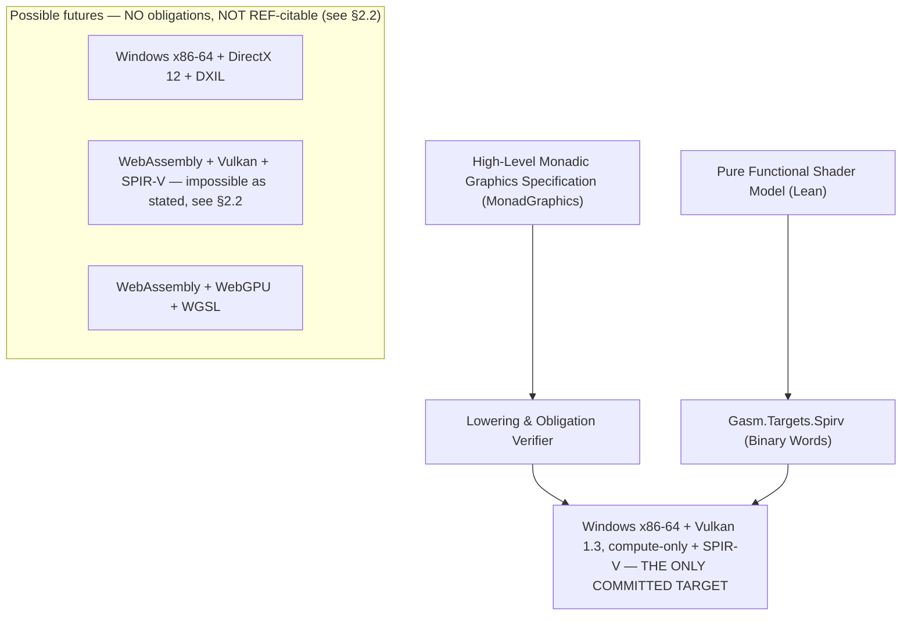

# Graphics Architecture Specification: GPU Compute Pipelines & Shader Lowering

> **Status note (2026-08-27)**: This document was rewritten after a pre-build review found it,
> before any graphics Lean code existed, in violation of Law 9 (pointwise Spike 6), the
> observation standard (`docs/EQUIVALENCE_PROOFS.md` §1.1), and the demand-driven-growth
> decision in `docs/DECISIONS.md` §1 (six speculative targets, zero built). Two subsystems this
> document previously asserted as settled design —
> GPU synchronization and floating-point kernel determinism — are marked **SUPERSEDED** below
> and retained as explicit design gaps; this document does not invent their replacements.

## 1. Overview

`gasm` extends its formally verified multi-target compilation engine to modern GPU compute
hardware. We define a unified, high-level, fine-grained monadic graphics specification in
Lean, together with a formal state machine model and a binary code generator for **its one
committed target slice** (§2.1) — with the remaining five target combinations explicitly
demoted to a non-obligating "possible futures" appendix (§2.2), per `docs/VISION.md` §3.3's
demand-driven-growth principle and `docs/DECISIONS.md` §1.

**Present truth**: zero graphics Lean code exists in this repository. Every section below is
unimplemented design — a specification for what will be built, not a description of anything
built yet. No `/- REF: ... -/` annotation cites this document (verified: grepping the tree
for citations into `GRAPHICS_ARCHITECTURE.md` returns nothing), so nothing here is yet a
Law-2 implementation obligation.



---

## 2. Committed Target & Possible Futures

### 2.1 Committed Target (the only one this document obligates)

| Target Slice | Host Platform / ISA | Graphics API | Shader Target & Format | Host Calling Mechanism |
| :--- | :--- | :--- | :--- | :--- |
| **Windows x86-64 + Vulkan 1.3 (compute-only)** | Windows x86-64 | Vulkan 1.3, compute pipeline only — no rasterization, no render pass, no presentation | `Gasm.Targets.Spirv` (Binary Words) | `vulkan-1.dll` / Win32 Fastcall |

Initial reference registration exists: the SPIR-V specification, machine-readable SPIR-V grammar,
and Vulkan specification are content-hashed as `spirv-spec`, `spirv-grammar`, and `vulkan-spec`
entries in `references.json`. Normative profile intake is **not** complete: the committed target
names Vulkan 1.3 while the registered Vulkan source is a rolling 1.4 page, the SPIR-V specification
uses a versionless rolling page, and the grammar source tracks an unpinned upstream branch. Before
the synchronization or validator design begins, its
stage-entry gate must select one exact Vulkan/SPIR-V execution profile, immutable upstream
revisions, required capabilities/features and errata disposition, plus matching Khronos formal
memory-model artifacts. A build-time Lean SPIR-V validator with a grammar-driven encode/decode
roundtrip theorem remains future graphics work tracked by `docs/ROADMAP.md` §1; it is not
implemented by this document.

### 2.2 Possible Futures (No Obligations, No REF Targets)

> **This appendix is explicitly non-obligating.** Per Law 2 (Implementation Completeness),
> the moment any Lean `/- REF: ... -/` annotation cites a specification section, that
> section becomes a 100%-implementation obligation. None of the slices below may be cited by
> a `REF:` annotation until its own reference-ingestion and design-doc work lands and a
> dedicated target document is authored and reviewed under Law 5. This table is a
> demand-driven backlog note (`docs/VISION.md` §3.3), not a commitment — the prior version of
> this document declared six target slices as a flat, equally-weighted matrix, which the
> pre-build review identified as exactly the bulk-import pattern `docs/DECISIONS.md` §1 forbids.

| Former Slice | Status | What's missing before it's buildable |
| :--- | :--- | :--- |
| Win-DX12 (Windows x86-64, DirectX 12, DXIL) | Deferred | `docs/TARGETS/DXIL_D3D12.md` does not exist; DXBC container format, LLVM-3.7 bitcode, DXC signing, root signatures, and COM vtable calling conventions are all undesigned. No DXIL/DXBC/D3D12 source is registered in `references.json` — Law 4 blocks this target until the exact authoritative sources are hash-pinned there. |
| Wasm-Vulkan (WebAssembly, Vulkan, SPIR-V) | **Impossible as stated** | Browsers have no Vulkan; WASI has no GPU. The prior version of this table's "Host FFI / Native Vulkan Trampolines" column named inventing host imports with no documented import surface — the same defect class as Spike 4's fabricated `sock_*` calls. This slice is recorded here only so it is not silently reintroduced; it cannot be resurrected without an entirely different, real, ingested, documented host-import ABI. |
| Wasm-WebGPU (WebAssembly, WebGPU, WGSL) | Deferred | `docs/TARGETS/WGSL_WEBGPU.md` does not exist, and no WGSL or WebGPU source is registered in `references.json`. It needs hash-pinned authoritative specifications plus a real, documented host/JS import surface (unlike Wasm-Vulkan, WebGPU is at least a real browser/WASI-adjacent API — but nothing here has been designed or ingested yet). |
| Win-Compute (Vulkan/DX12 compute, no longer a distinct slice) | Absorbed | The Vulkan-compute half is already the committed target (§2.1); the DX12-compute half is blocked on Win-DX12's prerequisites above. |
| Wasm-Compute (WebGPU compute, no longer a distinct slice) | Absorbed | Blocked on Wasm-WebGPU's prerequisites above; not an independent gap. |

Windowing/presentation (Spike 7) has its own prerequisite, independent of the graphics-API
slices above: `docs/TARGETS/WIN32_WINDOWING.md` (`RegisterClassEx`/`CreateWindowEx`/
`GetMessage`/`DispatchMessage`/`WM_*`) does not exist, and no windowing source is registered in
`references.json`.

---

## 3. High-Level Monadic Specification (`Gasm.Targets.Vulkan`)

> **Namespace note**: this document uses `Gasm.Targets.Vulkan` for the monadic host-API /
> effect-hierarchy layer defined in this section and `Gasm.Targets.Spirv` for the shader
> binary target (§5.1) — one namespace family, both under `Gasm/Targets/*`, matching this
> repository's real tree convention and closing the naming-drift housekeeping item (a prior
> revision named this section's namespace `Gasm.Graphics.Core` while its own code block used
> `Gasm.Targets.Vulkan` and the mermaid diagram used `Gasm.Targets.Spirv` — three names for
> what should be one family).

### 3.1 Design Philosophy: Explicit Fine-Grained Lifecycle
Modern explicit graphics APIs (Vulkan, DX12, WebGPU) share a unified mental model of GPU hardware execution. Rather than lowest-common-denominator abstractions that obscure capabilities, `gasm` models the **full, explicit lifecycle** as fine-grained monadic steps that can be elided where specific targets manage them automatically:

1. **Instance & Physical Device Selection**: Enumerate adapters, query queue families, verify feature capabilities.
2. **Logical Device & Queues**: Acquire logical device handle and separate queue handles (Graphics, Compute, Transfer).
3. **Memory & Buffers**: Explicit host-visible staging buffers, device-local textures, and linear memory allocation.
4. **Shader Modules & Pipeline Layouts**: Bind shader binaries, define push constants / root constants, and allocate descriptor sets / heaps.
5. **Pipelines (PSO)**: Immutable graphics and compute pipeline state objects.
6. **Command Allocation & Recording**: Command pools/allocators, command buffers, render pass / dynamic rendering attachments, scissor/viewport, draws, and dispatches.
7. **Resource Barriers & Layout Transitions**: Explicit pipeline barriers, image layout transitions (`UNDEFINED` $\to$ `COLOR_ATTACHMENT` $\to$ `TRANSFER_SRC` $\to$ `PRESENT`), and queue ownership transfers.
8. **Queue Submission & Synchronization**: Fences, semaphores, timeline semaphores, and queue submission.
9. **Readback & Presentation**: Buffer-to-host readback for headless execution or Swapchain presentation for windowed display.

> **Spike 6 scope note**: the committed target (§2.1) is compute-only. Spike 6 exercises
> steps 1–4, 6 (dispatch only, no draws), 7 (barriers only, no image-layout/render-target
> transitions), 8, and the readback half of step 9. Render-pass attachments, draws, image
> layout transitions for color attachments, and presentation remain future-scope, gated on
> the target slices in §2.2 and, for presentation specifically, on Spike 7.

### 3.2 Effect Hierarchy: Contract Trace vs. Audit Trace

Per `docs/EQUIVALENCE_PROOFS.md` §1.1
("Contract trace vs. audit trace"), GPU effects are split into two distinct event types
rather than one undifferentiated trace:

- **`GpuAuditEvent`**: resource/command-stream bookkeeping — device creation, buffer/pipeline
  creation, queue submission. These are the graphics-domain analog of
  `VirtualAlloc`/`VirtualFree`: obligations attached to the Vulkan target's typeclass
  instance under Law 8, proven to occur for safety/obligation purposes, but **not
  equivalence observables**. A trace containing these events can never be compared against
  a trace from a different target's API, because the two APIs' audit-trace shapes are not
  the same language — this is why the prior version of this document's claim of "100%
  constructive trace equivalence across all 4 target pairings" was incoherent under the
  observation standard, independent of the single-target shrink in §2. Render-pass
  bracketing and image-layout transitions are **not** included below: the compute-only
  committed target (§2.1) never emits them, and Law 8 (anti-dead-abstraction) prohibits
  carrying constructors no committed target can produce. They return only alongside a future
  rasterization-capable target (§2.2).
- **`GpuContractEvent`**: the dispatch/readback surface that IS an equivalence observable —
  at the **library-routine level** of `docs/EQUIVALENCE_PROOFS.md` §1.1 (the GPU dispatch
  call's own contract footprint), not the whole-program level. Critically, `readbackPixels`
  carries the actual returned payload — the prior version of this event recorded only that a
  readback happened and how many pixels, which the audit identified as its sharpest finding:
  *"an implementation rendering garbage satisfies trace equality"* against that shape, the
  graphics-domain instance of the canned-output vulnerability `docs/VISION.md` §2 exists to
  prevent everywhere else in the project. `draw` is likewise **not** included below: the
  compute-only committed target never emits it (no rasterization), so per Law 8 it is
  dropped rather than left as a dead constructor; it returns only alongside a future
  rasterization-capable target.

**Which level is which, precisely** (closing the ambiguity between the two claims below):
`GpuContractEvent` is the *library-routine*-level contract for one dispatch — it is what a
per-dispatch equivalence theorem (`∀ b, readback = specFn(b)`, §7) ranges over. Spike 6's
*whole-program* contract, per `docs/EQUIVALENCE_PROOFS.md` §1.1's "For whole programs" clause,
is coarser still: the syscall-boundary bytes and effects crossing out of the process, which
for Spike 6 is exactly "PNG bytes on disk + exit code" (below) — the dispatch/readback event
stream itself never crosses that boundary and is not the top-level observable.

```lean
namespace Gasm.Targets.Vulkan

/-- GPU audit-trace events: resource/command-stream bookkeeping attached to the
    Vulkan target's typeclass instance under Law 8. NOT equivalence observables
    (`docs/EQUIVALENCE_PROOFS.md` §1.1) — the GPU-domain analog of `VirtualAlloc`.
    Scoped to what the compute-only committed target (§2.1) can actually emit;
    see the prose above for why render-pass/layout-transition constructors are
    absent rather than merely unused. -/
inductive GpuAuditEvent where
  | createDevice (adapterName : String)
  | createBuffer (size : Nat) (usage : BufferUsage)
  | copyBuffer (src dst : BufferHandle) (size : Nat)
  | createPipeline (shaderHash : UInt64)
  | submitQueue (queue : QueueHandle)
  deriving Repr, DecidableEq

/-- GPU contract-trace events: the dispatch/readback surface that IS a
    library-routine-level equivalence observable (see the prose above for the
    whole-program-vs-library-routine boundary). `readbackPixels` carries the
    actual payload, not merely a count, closing the canned-output gap the
    audit identified. `deriving Repr` is intentionally omitted: Lean's
    `ByteArray` has no `Repr` instance; `DecidableEq` alone is derived. -/
inductive GpuContractEvent where
  | dispatch (groupCountX groupCountY groupCountZ : Nat)
  | readbackPixels (buffer : BufferHandle) (payload : ByteArray)
  deriving DecidableEq

end Gasm.Targets.Vulkan
```

For Spike 6 specifically: the **contract trace is exactly "PNG bytes on disk + exit code"**
— what leaves the process, matching every other whole-program contract in this codebase —
and every `GpuAuditEvent` above is audit trace attached to the Vulkan target instance, never
part of that contract's equivalence obligation.

### 3.3 Synchronization Model — SUPERSEDED, replacement pending

> **SUPERSEDED.** This document previously modeled GPU barriers as a resource-layout FSM
> claiming Write-After-Read/Write-After-Write prevention. The pre-build review found that model omits Read-After-Write
> hazards entirely — Spike 6's own critical hazard, shader store → transfer read — and that a
> layout FSM can "prove" a barrier correct with an empty `srcAccessMask` (a real, classic
> class of Vulkan bug). See `docs/TARGETS/SPIRV_VULKAN.md` §2's superseded note for the exact
> prior claim and its replacement pointer.
>
> **Ratified direction** (not yet designed here): synchronization is modeled on Vulkan's own
> first-class relations and state — program order, storage-class-parameterized inter-thread
> happens-before, system-synchronizes-with, execution and memory dependencies, scopes, memory
> domains, and per-write availability/visibility — grounded in the exact profile intake required
> above. The SPIR-V/Vulkan shader memory-model happens-before relation is non-transitive and is not
> by itself sufficient to make a write visible; it is also distinct from Vulkan's API execution-
> dependency order. Neither may be identified with this repository's transitive `VectorClock`
> reachability. A vector clock may cache only a separately proved transitive causal projection,
> while the source Vulkan relations and labels remain authoritative. Submission order alone creates
> no execution or memory dependency; queue submission, fence signal plus successful host wait,
> semaphore signal/wait, events, and pipeline barriers instead receive their exact profile-defined
> scopes and availability/visibility consequences, with RAW included alongside WAR/WAW. The full
> DSL design — total race-freedom, relation-soundness, visibility, and host/queue/shader refinement
> theorems over the command-stream language, per `docs/DECISIONS.md` §2's DSL-as-proof-leverage
> principle — remains a prerequisite in `docs/ROADMAP.md` §1. This document does not sketch that
> design; it only retracts the prior layout-FSM and direct-vector-clock claims and records the
> required replacement boundary. That design must also retain convergent/dynamically uniform
> participation for collective barriers and explicit target/device progress premises. It may not
> instantiate the CPU blocking-mutex contract for shader invocations merely because shader atomics
> exist; any specialized shader lock must prove the participation, scheduling, residency, and
> progress properties its algorithm needs, without assuming per-invocation independent progress
> unless the selected target profile guarantees it.
>
> Sparse and aliased resources also require time-indexed bind/unbind/rebind generations. Logical
> resource/view/descriptor identity remains distinct from the resolved physical backing footprint:
> rebinding invalidates stale backing-resolution witnesses, while resource destruction and invalid
> use of freed backing follow their own lifetime rules. Hazard and visibility checks must retain both
> the logical reference scopes and the resolved backing overlap; neither raw handle equality nor raw
> address equality is an alias proof.

### 3.4 Floating-Point Kernel Determinism — SUPERSEDED, replacement pending

> **SUPERSEDED / previously silent.** This document (and `docs/TARGETS/SPIRV_VULKAN.md`) did
> not previously discuss floating-point equivalence at all — the pre-build audit (§2) calls
> this "MAJOR, docs silent." The Vulkan specification itself states cross-implementation results
> are **not** guaranteed pixel/bit exact (the invariance appendix in the registered
> `vulkan-spec` source),
> and per-device repeatability is relaxed for shaders with side effects — i.e. storage-buffer
> compute, Spike 6's exact shape — absent specific decorations. §5.4 below states the
> resulting qualification on this document's one shader-equivalence claim.
>
> **Ratified direction** (not yet designed here): a **Deterministic Shader Profile** — a
> restricted kernel-operation grammar (integers plus basic FP ops, mandatory
> `NoContraction`, `float-controls` execution modes declared as hard device preconditions) —
> inside which both-ways byte-equal equivalence is provable exactly as any other contract in
> this codebase; outside that profile, an explicit ULP-tolerance-refinement-plus-liveness
> contract shape, with cross-driver bit-exact equality abandoned honestly rather than
> claimed. Authoring this profile as a DSL (per `docs/DECISIONS.md` §2, so determinism and
> ULP-bound theorems are proven once per kernel-language membership rather than once per
> shader) remains a prerequisite in `docs/ROADMAP.md` §1. This document does not sketch that
> grammar; it only retracts the unqualified equivalence claim in §5.4 and records the required
> replacement shape.

---

## 4. Lowering & Linear Obligation Tracking

During lowering from the pure monadic specification to concrete target assembly, `gasm` enforces **Linear Obligation Tracking**:
1. **GPU Handle Invariant**: Every allocated GPU object (`Device`, `Buffer`, `Pipeline`, `CommandPool`) must have an active obligation token that is strictly freed before process exit (or released via device destruction).
2. **Resource Barrier Invariant**: Buffers must have all in-scope memory-barrier proof obligations discharged (e.g. a shader store made visible to a subsequent transfer read before readback) prior to issuing dependent commands, subject to §3.3's superseded-and-pending synchronization model. Image-layout transitions are out of scope for the compute-only committed target (§2.1) — `GpuAuditEvent` (§3.2) accordingly carries no `transitionLayout` constructor; that concept returns only alongside a future rasterization-capable target (§2.2).
3. **Descriptor Set Allocation Invariant**: Descriptor-set and slot generations obey the exact
   selected descriptor profile. Ordinary descriptors retain an unchanged-use lease for the required
   in-flight interval; update-after-bind slots record the profile-permitted nondeterministic
   consumption point; partially bound entries need validity only when dynamically used. Descriptor
   identity and contents remain distinct from a sparse resource's current backing binding.

The GPU memory-capability model (device-local provenance, descriptor handoff as
capability transfer, fence-guarded temporal release) is a separate, not-yet-designed
extension of Law 11 to GPU memory ranges — tracked by `docs/ROADMAP.md` §1 and out of this
document's scope.

---

## 5. Shader Compilation & Targets (`Gasm.Targets.*`)

### 5.1 `Gasm.Targets.Spirv` (SPIR-V 1.6 Binary Target)
- Binary generator producing physical 32-bit word streams (`Array UInt32` / `ByteArray`).
- Physical layout: Magic number `0x07230203`, version `0x00010600`, generator ID, bound ID, schema.
- Opcode encoding: `OpCapability`, `OpMemoryModel`, `OpEntryPoint`, `OpExecutionMode`, `OpTypeFloat`, `OpTypeVector`, `OpVariable`, `OpLoad`, `OpStore`, `OpFAdd`, `OpFMul`, `OpReturn`.

### 5.2 `Gasm.Targets.Dxil` (DirectX Intermediate Language Target) — possible future, see §2.2

> **Non-obligating, not REF-citable** (same prohibition as §2.2, repeated here verbatim so it
> holds regardless of which section a future reader lands on first): per Law 2, the moment
> any Lean `/- REF: ... -/` annotation cites this subsection, it becomes a 100%-implementation
> obligation. This subsection may **not** be cited by a `REF:` annotation until
> `docs/TARGETS/DXIL_D3D12.md` exists, its reference corpus is ingested (Law 4), and it is
> reviewed under Law 5 as its own target document.

- Binary generator producing DXBC container wrapping LLVM 3.7 bitcode payloads.
- Not part of the committed target; blocked on the reference-ingestion and design-doc gaps stated in §2.2's Win-DX12 row.

### 5.3 `Gasm.Targets.Wgsl` (WebGPU Shading Language Target) — possible future, see §2.2

> **Non-obligating, not REF-citable** (same prohibition as §2.2, repeated here verbatim): per
> Law 2, the moment any Lean `/- REF: ... -/` annotation cites this subsection, it becomes a
> 100%-implementation obligation. This subsection may **not** be cited by a `REF:` annotation
> until `docs/TARGETS/WGSL_WEBGPU.md` exists, its reference corpus is ingested (Law 4), and it
> is reviewed under Law 5 as its own target document.

- Deterministic text/AST generator producing strictly compliant WGSL shader modules.
- Not part of the committed target; blocked on the reference-ingestion and design-doc gaps stated in §2.2's Wasm-WebGPU row.

### 5.4 Shader Computational Equivalence

Every shader program in `gasm` is accompanied by a mathematical specification in Lean. Per
§3.4 above, the claim below is qualified: it holds **only for kernels inside the
Deterministic Shader Profile** (§3.4) — not unconditionally, as a prior version of this
document stated.

$$\forall x \in \text{profile domain}, \quad \text{evalShader}(\text{loweredBytecode}, x) = \text{pureShaderFunction}(x)$$

discharged constructively via mechanical proof **for kernels within the profile**. A kernel
using an operation, decoration, or execution mode outside the profile is not covered by this
theorem and instead carries §3.4's ULP-tolerance-refinement-plus-liveness contract shape; no
cross-driver bit-exact equality is claimed for it. Until that profile design lands and defines the
profile grammar precisely, no shader in this codebase may cite this section as satisfied.

---

## 6. Standard Library Components: `Stdlib/Png` & `Stdlib/Zlib`

To support headless rendering and verified image export without OS dependencies, `gasm` includes standalone, formally verified image and compression codecs (`docs/STDLIB_PNG.md`):

- **Reusable Compression (`Stdlib/Zlib`)**: Reusable RFC 1950 (ZLIB format, Adler-32) and RFC 1951 (DEFLATE / INFLATE with uncompressed, fixed, and dynamic Huffman coding, plus ISO 3309 CRC-32).
- **Streaming Image Pipeline (`Stdlib/Png`)**:
  - `PngScanlineSink` typeclass for row-by-row streaming decoding directly into GPU texture staging buffers.
  - Push-based `PngWriter` state machine streaming filtered scanlines and compressed IDAT chunks into any `ByteSink` / `MonadFileSystem`.
  - All 5 PNG filter algorithms (None, Sub, Up, Average, Paeth) and fail-fast `PngError` taxonomy.
- **Canonical 1.5-Roundtrip Soundness Theorem**: see
  [`docs/STDLIB_PNG.md#6-formal-theorems-15-roundtrip-soundness`](STDLIB_PNG.md#6-formal-theorems-15-roundtrip-soundness)
  (`png_idempotent_canonical_roundtrip`) — cited here rather than duplicated, per Law 12's
  single-source-of-truth preference order (a doc-level instance of the same rule that
  governs Lean-level twins).

---

## 7. Roadmap & Spikes

1. **`Stdlib/Png` & `Stdlib/Zlib`**: Verified streaming PNG image codec and reusable DEFLATE engine with 1.5-roundtrip theorems and CRC32/Adler32 validation.
2. **Spike 5: Dual-Target GZIP/GUNZIP Utility (`Stdlib/Zlib`)**:
   - Streaming RFC 1952 compression & decompression across Windows x86_64 and WebAssembly WASI.
3. **Spike 6: Headless Parametric Compute Pipeline (`Stdlib/Png`)** — redefined by Law 9 and
   `docs/VISION.md` §2's canned-output prohibition:
   - **Parametric compute, not a fixed gradient.** The kernel takes an arbitrary input
     buffer `b` (within declared bounds) and the equivalence obligation is
     `∀ b, readback = specFn(b)` — a compute-only dispatch, no rasterization, no fixed or
     precomputed output. The prior "gradient/triangle" specification is deleted: it took no
     input, making its equivalence theorem pointwise by construction and satisfiable by a
     shader that stores a precomputed table (the canned-output pattern `docs/VISION.md` §2
     exists to prohibit).
   - **Golden-image / pixel-comparison tests are pointwise and are prohibited** as a
     verification method for this or any future rasterization spike, per Law 9's
     anti-pointwise mandate.
   - Targets the single committed target only (§2.1): Windows x86-64 + Vulkan 1.3,
     compute-only. No DX12/Wasm/WebGPU dual-target execution is claimed or attempted.
   - Pixel readback to host memory is carried as the `GpuContractEvent.readbackPixels`
     payload (§3.2), then exported to disk via `Stdlib/Png`.
   - **Contract trace = PNG bytes on disk + exit code**; GPU resource/command events are
     audit trace attached to the Vulkan target's typeclass instance (§3.2) — not equivalence
     observables. The prior claim of "100% constructive trace equivalence across all 4
     target pairings" is deleted: with one committed target there is no cross-target pairing
     left to claim, and the claim was independently incoherent under the observation
     standard even before the shrink (a trace containing Vulkan resource events can never
     equal a different API's audit-trace shape).
   - **Synchronization**: superseded; see §3.3.
   - **Floating-point determinism**: previously undesigned; see §3.4. Spike
     6's kernel must fall inside the profile defined there, or explicitly carry its
     ULP-tolerance-refinement fallback contract; no bit-exact cross-driver claim is made
     here.
   - **Differential validation**: no harness exists yet; its design must include the oracle
     stack and Law 13 positive/negative/device-loss/driver-absent/FP-canary controls scoped to
     this one committed target (`docs/ROADMAP.md` §1).
   - **Performance**: **Spike 6 carries NO performance contract** until the GPU/PCIe cost
     models are calibrated under `docs/CALIBRATION_GOVERNANCE.md`. No cycle/latency/bandwidth budget may be attached to
     this spike before then.
4. **Spike 7: Interactive Windowed Swapchain & Event Loop**:
   - Win32 window creation / HTML5 canvas binding with continuous frame swapchain presentation.
   - Blocked on `docs/TARGETS/WIN32_WINDOWING.md` (§2.2) and on the reactive-contract /
     multi-loop-composition design that Spike 6 itself already exercises (host + device
     queue are two agents), tracked separately under the graphics task track.
