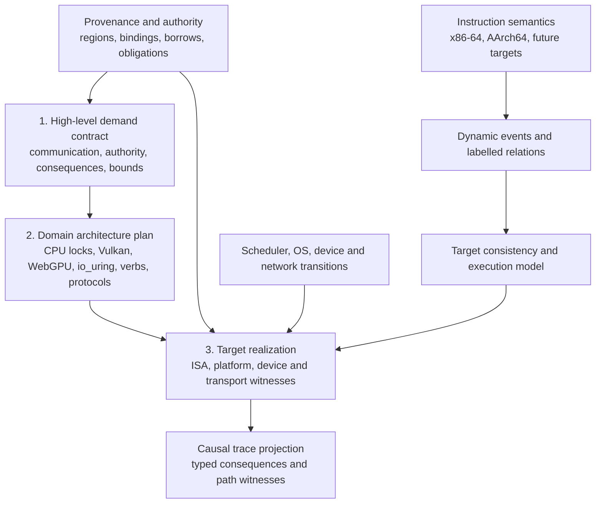

# Memory, Concurrency, Ownership, and Synchronization Model

**Status:** canonical cross-architecture design and implementation roadmap. The repository
currently implements only the single-threaded pieces identified in §2. Everything else is a
requirement, not a claim about existing Lean declarations.

This document supersedes the retired x86-only memory-model and borrowing plans and owns the
architecture shared by Spike 8. Target documents own
instruction encodings and platform details; this document owns how their memory, concurrency,
ownership, and synchronization semantics fit together.

The design has one central rule:

> Ownership transfer and synchronization have one architecture-neutral contract, but each ISA
> and execution environment must separately prove that its instructions and services implement
> that contract.

Consequently, x86 TSO is not the generic memory model, AArch64 is not implemented as “TSO plus
more fences,” Linux futexes are not treated as memory barriers, and bare-metal SMP is not treated
as an operating-system thread API.

---

## 1. Goals, Guarantees, and Scope

The completed system must provide all of the following:

1. **Architecture-correct concurrent execution:** x86-64 TSO and AArch64 weak-memory behavior,
   including the atomic and barrier instructions used by real synchronization code.
2. **Capability-enforced memory safety:** every dynamic access is covered by a provenanced,
   in-bounds authority; conflicting ordinary accesses cannot be authorized concurrently.
3. **Cross-thread ownership transfer:** spawn, join, successful lock acquisition, and lock release
   move capabilities rather than copying them.
4. **Lock invariants and linear cleanup:** an implementation-defined atomic synchronization
   representation can guard a different region; successful acquisition creates a guard and a
   must-release obligation, and release consumes both.
5. **Blocking synchronization:** Linux `FUTEX_WAIT`/`FUTEX_WAKE` and Windows `WaitOnAddress`
   wrappers refine the narrow address-parking contract. Composite waits, bare-metal notification
   loops, interrupts, and other waits use separately proved scheduler/target adapters.
6. **Two bare-metal SMP stories:** x86 application-processor bring-up and AArch64 processing-
   element bring-up satisfy one lifecycle contract through architecture-specific mechanisms.
7. **Honest causal traces:** effect traces faithfully project the selected admitted labelled source
   paths—including program, scheduler, API/GPU, device, transport, and persistence causality—while
   retaining their witnesses; vector clocks stand in for neither a target consistency model nor
   profile-native relation labels.
8. **Differential validation:** bounded model outcomes, emitted binaries, native silicon, and
   architecture-appropriate negative controls remain linked.

The first supported concurrent profile is deliberately bounded:

- naturally aligned 32-bit and 64-bit shared words;
- cacheable normal memory (x86 WB; AArch64 Normal, coherent, shareable memory);
- target-proved single-copy atomicity for each admitted atomic object, with no common assumption that
  every supported CPU or system is multi-copy atomic;
- no mixed-size atomic overlap, self-modifying code, persistent memory, or non-temporal access;
- explicit Device/MMIO operations, kept out of ordinary RAM reasoning;
- process-private futex wait/wake first, with other futex operations deferred explicitly;
- two-thread litmus and lock programs first, with the model itself parameterized by thread count.

These restrictions are acceptance boundaries, not silent assumptions. Widening any one requires a
new validation demand and an update here before implementation.

This first profile is CPU concurrency, not a claim that CPU-shaped event fields are universal.
WebAssembly shared-memory threads, SPIR-V/Vulkan, WGSL/WebGPU, DMA submission/completion
interfaces, network and IPC protocols, and durable storage need additional execution agents,
locations, scopes, relations, and consequences.
They may reuse the common authority, obligation, event-identity, and causal-projection framework,
but must not be encoded as x86/AArch64 threads or as opaque “device fences.” Before M0 fixes public
types, §15 decision 2 must preserve target-indexed extension points for those domains.

---

## 2. Verified Current Baseline

As of 2026-08-28, the tree has the following relevant machinery:

| Area | Present | Missing |
|---|---|---|
| x86-64 memory | Sealed byte memory, width-indexed access API, mandatory per-instruction `memAccesses`, frame lemmas | Atomic memory forms, fences, store buffers, concurrent machine |
| AArch64 memory | Sealed byte memory and an `AArch64MemAccessSpec` vocabulary | The descriptor is not a field of `AArch64Instruction`; no atomic order, barriers, exclusives, or concurrent machine |
| Capabilities | `PermissionShare`, `MemoryPerm`, `MemoryPermissions` | Enforcement at instruction construction, provenanced pointer authoring, temporal loans, cross-thread transfer |
| Obligations | Generic `ObligationToken` list and return/exit predicates | Typed lock/join/wait obligations and an index that prevents forged ledger replacement |
| Indexed programs | `BlockM Arch S₁ S₂ α` with indexed bind | A borrow/obligation index used by assembly programs; safe constructors that prevent arbitrary state replacement |
| Causality | `ThreadId`, vector clocks, `CausalEvent`, single-thread stamping | Concurrent execution graph, correct synchronizes-with generation, multi-thread trace projection |
| OS threads | Single-state Win32 and Linux hooks | Runnable/blocked thread state, clone/CreateThread lifecycle, joins, futexes, wait queues |
| Bare metal | Single-CPU x86 and AArch64 execution paths | SMP bring-up, coherent shared-memory assumptions, interrupt/wakeup model, per-CPU/PE state |

No concurrency theorem may be presented as implemented until it is stated against a machine with
at least two threads or processing elements. A single-thread ordering theorem cannot validate a
concurrent memory model.

---

## 3. Layering and Ownership of Semantics

The implementation is organized through a three-level synchronization lens:



At level 1, a program says **what must be communicated or synchronized**: the source and
destination operations/agents, resource and location footprint, authority/lifetime transfer,
required visibility, completion, delivery, persistence, failure and progress consequences, and
observable performance/security bounds. It does not choose an instruction, API, queue topology, or
lock algorithm.

At level 2, a concrete domain plan chooses the relevant architecture independently of the host ISA:
for example a mutex protocol, Vulkan queue/semaphore/barrier plan, WebGPU submission plan,
`io_uring` ring/resource protocol, libverbs QP/CQ/MR plan, network acknowledgement protocol, or
storage durability protocol. Its proof refines every level-1 demand into domain-native agents,
scopes, relations, bindings, consequences, failure modes, and composition laws. Several demands may
share a mechanism, or one demand may require several mechanisms, when the refinement proves the
exact requested envelope.

At level 3, each supported realization proves that the selected domain plan is implemented by the
actual ISA, platform, device, provider, and transport behavior: instructions and barriers, cache and
DMA ownership, syscalls, doorbells, interrupts, queue transitions, packet/acknowledgement paths, and
persistence operations. A domain proof is therefore reusable across x86-64, AArch64, and future
ISAs, but no end-to-end claim exists until the applicable level-3 witnesses are composed. Conversely,
an ISA fence theorem cannot choose or justify a Vulkan, RDMA, network, or storage architecture by
itself.

The connection theorems between layers are mandatory:

- every program-origin memory event comes from an instruction descriptor and actual instruction
  step; initial, platform, and device events come from their corresponding initialization or
  transition rule and cannot masquerade as program instructions;
- every program event is covered by the executing thread's current authority; platform and device
  events use explicitly scoped environment/device authority, while initial events satisfy the
  initialization invariant;
- every architecture-specific execution admitted by the interpreter satisfies that ISA’s
  consistency predicate;
- every emitted synchronization instruction decodes to the modeled instruction, and program
  emission preserves relocation targets, layout, and the instruction stream used by the proof;
- the remaining model-to-hardware semantics boundary is recorded as a cited TCB assumption and
  challenged by architecture-appropriate differential tests;
- every first-profile CPU release/acquire synchronizes-with edge is backed by the atomic read-from
  or lifecycle event that creates it; every other target relation has its own profile-indexed
  witness and connection theorem rather than being forced into the CPU witness shape;
- every observable trace order carries a target/profile-indexed `TraceProjectionWitness` from an
  admitted labelled source path, and every source path declared trace-observable by that projection
  is retained; fidelity is to induced reachability, not to a chosen primitive-edge set or transitive
  reduction;
- every address-wait operation refines the narrow scheduler address-parking contract, while a
  composite wait, notification instruction, interrupt, or device signal uses its own proved adapter.

Without these the layers are parallel descriptions, not a verified system.

---

## 4. Common Dynamic Memory-Event Vocabulary

Static instruction descriptors remain target-specific where addressing demands it: x86 SIB
operands and AArch64 pre/post-indexed operands should not be forced into one operand type. They
must, however, instantiate a checked target projection into the common event envelope after
effective addresses are known.

The sketch below states the information required by the first **CPU byte-memory projection**. It is
not an accepted universal Lean representation: §15 decision 2 must first choose target-indexed
agent, memory-object/reference, location-set, scope, semantics, and relation interfaces. A shader,
DMA, or storage profile adds its own required information through those interfaces rather than
pretending every operation has a CPU `ThreadId` and numeric `AddressRange`, or by filling a common
record with meaningless optional fields.

M0 fixes only the thin interchange boundary: generative event identity, profile-indexed agent,
reference, location, event/transition payload, relation, and consequence families, well-formed
target projections, labelled path witnesses, and trace-projection laws. Concrete relation and
consequence constructors for a future target remain owned by that target's hash-pinned reference
intake. This prevents a CPU-first
implementation from closing the extension seam without prematurely guessing Vulkan, WebGPU,
`io_uring`, libverbs, or storage semantics.

Reference resolution at that boundary is time-indexed rather than a timeless
`reference -> location set` function. The common interfaces must be able to instantiate equivalents
of a generative `ObjectInstanceId`, target-indexed `BindingKey`, `BindingGeneration`, and a resolved
`BindingRef` carrying the key and generation, object instance, rights, and covered logical and
backing footprints. A backing footprint need not be a numeric physical address. Profile-owned
`Bind`, `Unbind`, and `Rebind` transitions create or retire those witnesses; explicit
alias/overlap relations say when distinct references resolve to the same object or backing
locations. Raw numeric equality across different namespaces does not establish aliasing, while
different raw keys may alias one object.

Each asynchronous resource operand resolves and captures its binding generation at that profile's
declared snapshot/consumption event. Some profiles capture at operation acceptance; others select a
provided buffer or consume an update-after-bind descriptor later. Once captured, later effects,
results, resource returns, and cleanup refer to that generation rather than re-resolving a reused
file descriptor, handle, registered-resource index, `rkey`, IOVA, descriptor, or address. M0 includes
the generic negative control `capture K -> A/g; rebind K -> B/(g+1); later effect`: that effect may
affect or return only `A/g`. A dynamic-binding
profile states precisely what a transition invalidates. For example, sparse-resource rebinding can
invalidate a cached backing-footprint witness without itself destroying the logical resource or
descriptor; destruction and freed-backing misuse have separate lifetime rules. A Vulkan profile
therefore uses distinct generative logical-resource/view, backing-allocation, range-binding,
descriptor-slot, and device-instance identities, while another target instantiates only the
distinctions it actually has.

The CPU projection should carry information equivalent to:

```lean
inductive AccessRole where
  | read
  | write
  | readWrite

inductive AccessClass where
  | plain
  | atomicLoad
  | atomicStore
  | atomicRmw      (succeeded : Option Bool) -- none for an unconditional RMW
  | exclusiveRead  (reservation : ReservationId)
  | exclusiveWrite (reservation : ReservationId) (succeeded : Bool)

inductive MemoryOrder where
  | relaxed
  | acquire
  | release
  | acquireRelease
  | seqCst

inductive MemoryDomain where
  | normal
  | device
  | portIO

inductive EventKey where
  | thread   (thread : ThreadId) (sequence : LocalSequence)
  | platform (platformInstance : PlatformInstanceId) (sequence : LocalSequence)
  | device   (deviceInstance : DeviceInstanceId) (sequence : LocalSequence)
  | initial  (range : AddressRange)

inductive EventOrigin where
  | instruction (descriptor : StaticAccessId)
  | platform    (transition : PlatformTransitionId)
  | device      (transition : DeviceTransitionId)
  | initial

structure MemoryEvent where
  key           : EventKey
  origin        : EventOrigin
  range         : AddressRange
  role          : AccessRole
  accessClass   : AccessClass
  explicitOrder : Option MemoryOrder
  domain        : MemoryDomain
  targetAttrs   : TargetMemoryAttributes
  readValue     : Option ByteVector
  writeValue    : Option ByteVector
```

Only well-formed events enter a graph. `MemoryEvent.WellFormed` or indexed constructors enforce at
least: role/value presence and absence; value width equals range width; failed
`atomicRmw (some false)` and failed exclusive stores have no write value, while unconditional or
successful RMW/store-exclusive actions do; order is valid for the access class (for example no release-only load or
acquire-only store); target width/alignment and single-copy-atomicity premises hold; the domain
agrees with the target memory attributes; and origin agrees with the key form. Target projections
prove their additional constraints.
The orthogonal fields are an interchange vocabulary, not permission to construct malformed
combinations.

`explicitOrder = none` means the ISA encoding carries no explicit ordering mode; it does not decide
the orthogonal `AccessClass`. It may describe a plain access or an approved atomic access such as an
aligned x86 `atomicStore` realized by `MOV`, but it is not another spelling of `relaxed`. A protocol
proof may show that one such x86 store implements the release half of a particular lock; that derived
synchronization role does not relabel every ordinary store as an ISA release operation. Value fields
are width-indexed byte strings (or an equivalent representation) so value consistency, CAS results,
exclusive-store success, forwarding, and litmus final states are expressible.

The concrete spelling is an implementation decision; the information content is not. Barrier
events are separate from accesses because a barrier orders events but does not access a fake empty
range. A normalized barrier records its target kind, source and destination access-class sets,
source and destination memory-domain sets, shareability/scope, whether it imposes ordering or
completion, and whether it synchronizes the instruction stream. Architecture-specific semantics
interpret those fields; they are not collapsed into one architecture-neutral notion of “full
fence.” Target projections retain any finer encoding needed by the ISA—for example asymmetric
RISC-V `FENCE` predecessor/successor `I`, `O`, `R`, and `W` sets—rather than forcing it through a
lossy architecture-neutral `MemoryOrder` value.

Cache clean/invalidate/flush operations, address-translation or IOMMU maintenance, and similar
target operations are likewise first-class profile transitions over explicit location/cache-granule
sets with completion and ownership consequences. They are not encoded as fake loads/stores or
generic barriers, and partial-range/alias rules remain available to the target proof.

CPU mutex protocol synchronization is a proof-produced layer over concrete event keys, not another
ISA order tag. A `SyncWitness` (or equivalent) names the protocol/lock instance and generation, the release
key, the acquire-observation key, any distinct success-linearization key (for example AArch64's
load-exclusive plus successful store-exclusive), the relevant reads-from/value or RMW relation, and
the target-specific proof that those events implement release/acquire. It is the canonical source
of a first-profile mutex synchronizes-with edge, not the universal shape for Vulkan system
synchronization, API dependencies, DMA completion, or other target relations. Thus an x86 `MOV`
unlock may have `explicitOrder = none` while one proved
protocol use is a release; unrelated stores are not relabelled, and a failed compare/exchange or
store-exclusive creates no witness.

An execution graph contains at least:

- per-thread program order (`po`);
- syscall/API invocation-to-platform-transition, ordered platform subevent, block/resume, and
  return-to-thread edges;
- byte/range-granular reads-from (`rf`) for Normal memory, relating each returned byte to a write
  byte;
- per-location Normal-memory coherence/modification order (`co`), with an explicit initial write
  for every modeled Normal location;
- Normal-memory from-read (`fr`), derived where appropriate;
- address, data, and control dependencies needed by the target model;
- barrier-order edges;
- atomic-RMW and exclusive-pair/reservation relations where the target requires them;
- lifecycle events such as spawn and join;
- target device-transition/value relations for Device and port-I/O events, including destructive
  reads, request acceptance, effect completion, result/notification delivery, and device-local order
  as distinct profile events where applicable, without inventing Normal-memory initial writes or
  coherence edges.

Origin and domain are orthogonal: for example, every concurrent kernel child-TID set/clear in the
pinned clone profile is a platform-origin `atomicStore` to a registered, stable, aligned 32-bit
Normal-memory object. It participates in the same `rf`/`co` relations and requires the target's
single-copy-atomicity proof; it is not an unclassified write that bypasses the atomic/plain mode
invariant. An MMIO register access instead uses the device relation. Invocation/return and device
request/result/notification edges keep those events linked to the program that caused or observed
them, making release-before-notify and API refinement statable in the graph without collapsing their
consequences.

The graph's `rf` relation, not a duplicate single-source field in `MemoryEvent`, is authoritative.
Byte/range granularity permits a read to be assembled from multiple writes and avoids baking a
same-width assumption into the common interface even though the first executable profiles defer
mixed-size races. Program keys are thread-local, platform/device keys are local to their stable
instance, and initial keys are structural; graph and trace equality must not depend on a global
allocation order. Logical `ThreadId` values are generative and never reused within an execution or
trace; platform TIDs, handles, APIC IDs, and MPIDR values map to the current logical instance but are
not program-event or vector-clock identities.

The event graph is the common proof-facing representation. Each ISA may use the executable model
best suited to it, provided connection theorems relate that model to this graph.

---

## 5. Architecture-Specific Consistency Models

### 5.1 x86-64: TSO for Write-Back Memory

The first x86 model is an operational TSO machine over WB memory. Before M2-X, the profile must pin
whether it is Intel-64-only or the cited common subset of Intel 64 and AMD64. A CPU outside that
source-backed vendor/profile set may run functional controls but reports memory-model validation as
`not-validated`.

- each x86 execution agent owns a FIFO store buffer;
- a plain store enters that buffer;
- an approved naturally aligned non-locked atomic load/store follows the same operational
  load/forwarding or store-buffer transition as its underlying `MOV`; `AccessClass.atomicLoad` or
  `.atomicStore` changes its authority and single-copy-atomicity contract, not its TSO queue order;
- a load forwards from the youngest same-range or covering supported store in its own buffer,
  otherwise reading shared memory; partial-overlap composition is deferred from the first x86
  executable profile but remains representable in the common graph;
- a model-internal drain publishes the oldest buffered store;
- locked RMW operations drain prior stores and execute as indivisible globally ordered actions;
- `MFENCE` has its architectural full load/store ordering contract; an implementation may realize
  that contract by draining prior stores and preventing later loads and stores from crossing it;
- naturally aligned supported-width ordinary accesses are untearable as required by the selected
  x86 profile.

The standard-library `ParkedMutex32` implementation uses a naturally aligned 32-bit word because
Linux futexes operate on 32-bit words on every supported architecture. Its initial x86 instruction
demand therefore includes memory `XCHG r/m32` (implicitly locked), `LOCK CMPXCHG r/m32` (plus any
64-bit forms independently demanded), and optionally `PAUSE`. `MFENCE` belongs independently to the
broader M2-X synchronization and litmus surface; it becomes a library dependency only if the pinned
`ParkedMutex32` algorithm actually emits it. Release of a simple x86 mutex may use an approved
aligned `MOV` atomic-object store only when the x86 model proves the required
prior-write-before-release visibility. This is the instruction demand of that reusable library
implementation, not a width or encoding restriction on the portable mutex contract.

UC/WC/MMIO ordering is not folded into WB TSO. LAPIC accesses and other devices use the device
model in §10 and force an explicitly cited x86 memory-type extension.

Required x86 connection theorems:

1. one-thread, drained executions agree observationally with the existing sequential interpreter;
2. an atomic descriptor corresponds to one indivisible dynamic action;
3. every admitted operational execution satisfies the x86 execution-graph consistency predicate;
4. bounded graph-consistent executions are represented by the operational enumerator (adequacy),
   so the two views have equal observable litmus outcomes rather than only one-way soundness;
5. the model-derived outcome sets for the x86 litmus suite match the stated TSO profile.

### 5.2 AArch64: Weak Memory, Acquire/Release, and Exclusives

AArch64 gets a separate consistency model sourced from a pinned Arm Architecture Reference Manual
profile and its matching official `cat`/herd7 material. The pinned formal model is the exact outcome
oracle; native hardware observations test that implementations produce only allowed outcomes, but
cannot establish the entire allowed set. AArch64 must not inherit x86 ordering defaults.

The first supported instruction and semantic surface includes:

- ordinary `LDR`/`STR` as plain weakly ordered accesses, not relaxed atomics;
- `LDAR`/`STLR` acquire and release accesses;
- `LDXR`/`STXR` and acquire/release variants as an exclusive-monitor protocol;
- `CLREX` as an explicit monitor-clearing transition;
- `DMB` with the scopes needed for shareable RAM and device interaction;
- `DSB` and `ISB` where device bring-up or system-register sequencing demands them;
- `WFE`/`SEV` for the bare-metal parking adapter, without treating either as a RAM fence.

Per-PE state includes a local reservation plus an abstraction of the architecture's local/global
exclusive monitors and reservation granule. An exclusive store is conditional: it writes only if
the monitor permits it and returns success/failure in the architectural status register. Conflicting
writes, `CLREX`, and modeled lifecycle/exception transitions invalidate monitor state as required by
the selected profile; permitted spurious `STXR` failure is represented. A successful `STXR`/`STLXR`,
not the preceding load-exclusive, is the lock-acquisition linearization point. Any eventual-success
claim needs a separately named fairness/progress assumption. An exclusive pair is therefore not
encoded as one indivisible `.atomicRmw` descriptor.

The v1 model covers aligned 32-bit and 64-bit operations in coherent shareable Normal memory. LSE
atomics, RCpc forms, mixed-size overlap, and non-shareable memory remain deferred until a consumer
requires them. A verified executable instruction surface containing an `LDAPR`-family instruction
is outside v1. Its event may not inherit `LDAR`-specific RCsc, ordering, or realization facts solely
because both project to a generic acquire label. A later FEAT_LRCPC profile must retain RCsc and RCpc
as distinct target semantics and add distinguishing litmus, decoding, emission, and connection
tests; genuinely common acquire theorems remain reusable only through that refinement.

Required AArch64 connection theorems mirror x86 but are architecture-specific:

1. one-PE executions preserve the current sequential instruction semantics where ordering is
   unobservable;
2. exclusive-monitor success and failure correspond to the emitted event sequence;
3. acquire, release, and barrier descriptors are faithful to dynamic ordering behavior;
4. every admitted execution satisfies the chosen AArch64 consistency predicate;
5. every bounded execution consistent with the pinned Arm predicate is represented by the
   executable enumerator (adequacy), so it cannot pass by silently excluding allowed executions;
6. bounded outcome sets equal those of the pinned formal Arm profile, including but not limited to
   the named litmus suite, and every native observation is contained in that set.

### 5.3 What Is Shared and What Is Not

Shared:

- event identities and graph relations;
- provenance and authority;
- lock, guard, and obligation contracts;
- scheduler lifecycle and parking contracts;
- validation protocol and causal-trace projection.

Architecture-specific:

- allowed execution graphs;
- instruction encodings and static addressing descriptors;
- store-buffer versus exclusive-monitor state;
- fence/barrier semantics and scope;
- normal/device memory attributes;
- bare-metal CPU/PE bring-up.

---

## 6. Provenance, Borrowing, and Cross-Thread Authority

Memory ordering cannot repair an unauthorized or out-of-bounds access. Authority is checked before
the architecture consistency model is consulted.

### 6.1 Regions and Provenanced Pointers

Every allocatable region has a fresh, generative `RegionId`; identity is not derived solely from its
address because an address may be freed and reused. A pointer preserves its region identity while
offsetting. Constructing a pointer from an arbitrary integer is unavailable to ordinary assembly
authors. Dereference requires:

- a pointer into the named region;
- a proof that the dynamic range is in bounds and non-wrapping;
- authority for the requested access kind;
- any alignment and stable-address properties required by atomics, futexes, or devices.

External memory enters through explicit environment grants at loader, allocator, syscall, or device
boundaries. A grant is a reviewed trust boundary, not a general unchecked cast.

#### 6.1.1 Pointer-valued memory (v1 boundary)

Stored bytes do not carry provenance. Loading an address-sized integer never manufactures a
`ProvenancedPtr` or authority. A v1 program may store address bytes, but it may later dereference
that value only through a registered typed view whose ghost slot map still associates the field
with a live `RegionId`; moving or swapping the field must move that slot binding as well. Pointee
authority remains in the indexed context and is never reconstructed from bytes. Arbitrary external
bytes remain integers until an explicit boundary grant validates and associates them with a live
region.

Generic recursive or existential heap structures that recover ownership-carrying pointers are
outside v1. A consumer such as the line-sort descriptor table must use a purpose-built typed view
and prove preservation of its slot map, or wait for that later extension.

Deferred-reclamation schemes do not weaken this boundary. Future RCU, hazard-pointer, and epoch
profiles use different protection and reclamation protocols, but each must associate an observed
typed published pointer/reference with a live `RegionId` through an explicit protect/dereference
operation. That operation yields a protection-guard-bound provenance and lifetime witness, not
general read/write authority over mutable node fields; field access still requires the profile's
separate access and ordering authority. RCU read-side sections and ordered grace periods, hazard
publication plus source revalidation and an ordered scan, and epoch entry/retirement/quiescence are
not interchangeable witnesses; none converts arbitrary address bytes into a pointer or authority.

#### 6.1.2 Indirect resources, bindings, and aliases

A logical API reference or device address is not automatically a provenanced CPU pointer and need
not identify its backing allocation. A profile with indirect resources supplies the generative
object/backing/binding types described in §4 and an event-time resolution witness covering the exact
resource and backing generations, device/namespace instance, rights, and range. Authority to name a
resource, modify its binding, access its contents, or reclaim its backing are separate capabilities.

Unbind, rebind, backing free, object/view destruction, descriptor update, and external-memory import
have profile-specific invalidation rules. Sparse unbound access follows the selected target's
explicit nonresident result—such as rejected, zero/discard, or undefined—rather than one universal
CPU dereference rule. Overlap/hazard checks use resolved backing footprints, while relation scope and
visibility retain the logical reference identity required by the target. Incompatible alias
interpretations can create target-defined undefined contents as well as ordinary race obligations.
An external-memory import is an explicit trust-boundary grant associating local generative handles
with the selected underlying object; raw handle/address/key bytes never create that association.

### 6.2 Authority States

The canonical authority algebra distinguishes:

- `Exclusive`: one context may read or write ordinary memory;
- `SharedRead`: one or more contexts may read and none may write;
- `Atomic`: contexts may access a specifically declared atomic object, but only with supported
  atomic operations.

`Atomic` is not authority to mutate an entire mutex-protected region. The mutex implementation's
synchronization representation has atomic authority; the protected region moves as exclusive
authority to the successful acquirer.

This is a resource algebra, not a pairwise-disjoint list. Spatial composition requires disjoint
regions, while same-region composition permits identified shared-read leases and separately
shareable atomic-object authority. Atomic grants are instance- and generation-scoped leases under
an authoritative object record, not timeless facts derivable from an address. An exclusive owner
that lends reads is represented by a frozen owner fragment plus unique `LoanId -> holder` records;
a scalar reader count cannot prove which borrower returned which loan. Reclaim consumes the exact
matching loan token, and exclusive authority is restored if and only if the loan map becomes empty.
The borrower carries `MustReturnLoan loan issuer holder region`, or an equivalent result-indexed
terminal promise, so return and thread exit cannot lose a live loan.

Temporal borrowing is tracked in the indexed program type, not by duplicable capability values:

- lending a read suspends exclusive writes until all read loans are reclaimed;
- donation removes authority from the donor and installs it in the recipient in one modeled causal
  handoff: spawn, successful join, lock transfer, or a specified linear channel. V1 does not permit
  an unsynchronized write into an already-running thread's authority context;
- splitting a region suspends/consumes overlapping parent access authority and produces disjoint
  child authorities plus their obligations. Rejoin consumes the exact complete sibling set, with
  no outstanding descendant, loan, or typed view, before restoring parent authority;
- transmogrification creates a typed view only from a proof and carries a destruction/discharge
  obligation before the underlying raw authority returns.

The current `PermissionShare.Locked` constructor is compatibility vocabulary, not the final lock
model. Migration should separate atomic-object authority from protected-region ownership.

### 6.3 Global Cross-Thread Invariant

For every concrete byte range, the family of thread authority contexts satisfies a global access-
mode invariant:

- at most one context has ordinary write authority;
- if one context has ordinary write authority, no other context has read or write authority;
- multiple read authorities may coexist;
- a registered atomic object admits only its supported atomic accesses: atomic authority may overlap
  on that declared region, but no ordinary read or write authority may coexist until the object is
  unregistered and every atomic grant is consumed.

From this invariant and descriptor fidelity, prove that two authorized conflicting ordinary
accesses from distinct threads cannot occur and that a registered atomic object cannot be accessed
through a plain instruction. Atomic accesses are not waved away as “synchronized”; their safety and
ordering are discharged by the atomic-object and architecture models.

This is the first **data-race-free CPU authority profile**, not a claim that every lower-level
concurrency protocol is expressible through its three modes. A future seqcount/seqlock profile may
authorize race-tolerant reads only through a separate speculative access protocol. Such reads
produce an `UnvalidatedSnapshot` (or equivalent quarantined value), not ordinary read authority:
its contents cannot affect a committed architectural result, contract-visible output, authority
transition, pointer dereference, or irreversible external effect until a sequence-generation and
ordering witness commits the permitted scalar/copied snapshot. A pointer dereference additionally
requires an independent pointee-lifetime witness; a Linux seqcount-only profile forbids pointer-
bearing protected data. The profile must also pin writer serialization, sequence wrap/generation
rules, width and tearing assumptions, and its scheduling, preemption/interruption, and
retry/progress premises. Linux's profile requires a writer to be non-preemptible and non-
interruptible wherever a reader that can interrupt it could otherwise spin indefinitely. Failed
validation yields only the specified failure/retry outcome and no snapshot-content-derived
consequence. This exception is profile-local and does not relax the ordinary no-race theorem above.

### 6.4 Spawn, Join, and Termination

Spawn accepts an explicit capability partition. Donated regions disappear from the parent before
the child can become runnable—even on a platform where the child may execute before the spawn API
returns. A failed spawn restores the pre-spawn partition; success commits it exactly once.
Shared-read and atomic grants may be installed in both contexts only when the global invariant
permits them.

Successful spawn creates a fresh logical `ChildInstanceId` and, for a joinable child, one unique
`JoinRight` carrying the child's result-indexed terminal contract. Neither identity is an OS thread
ID, child-TID address, reusable handle value, or raw `ThreadId`. Timeout, failed wait, or
observation-only wait preserves the right. Successful logical join consumes it exactly once and
returns only the sealed terminal bundle promised by the child's postcondition; it does not
manufacture every capability originally donated. Platform handles and their close obligations are
separate observation resources.

Every thread terminal transition seals a bundle that accounts for its entire resource context:
each authority, loan, atomic grant, guard, and obligation is returned, donated through a specified
handoff, discharged by its contract, or transferred to an explicitly named process-owned sink. An
obligation-free exclusive capability left in a dead thread is still invalid. Detach consumes a
`JoinRight` only when the child contract returns no join-owned linear resource, or atomically
redirects the declared terminal bundle to a process-owned sink. Process termination is separate,
checks every thread context and sealed terminal bundle, and may discharge only resources explicitly
declared process-scoped. A graceful process-exit theorem requires that accounting. Forced process
termination with live threads is instead an explicit abort/world-invalidation outcome: the host may
reclaim process resources, but that does not prove that thread-owned guards or protocol obligations
were normally discharged, nor may it be used as the clean inverse of initialization.

Spawn and join contribute program-happens-before only through a proved lifecycle-visibility
refinement. Parent-to-child spawn must make the promised pre-spawn writes visible before the child
uses donated authority; child-to-parent join must make the terminal bundle's promised writes visible
after successful join. A runnable/signaled state, child-TID clear, or wake event alone is not that
proof. Each platform adapter must cite an API/architecture guarantee that provides the edge or use an
explicit release/acquire publication word alongside its lifecycle mechanism.

---

## 7. Lock Invariants and Unlock Obligations

The portable v1 mutex contract is nonrecursive and connects an opaque, implementation-owned stable
atomic core footprint `rCore`, a disjoint protected region `p`, and an implementation-declared class
of auxiliary resources that may be contributed by a contender or borrowed from scoped scheduler,
per-agent, or library infrastructure. It deliberately does not fix the number or width of core
atomic objects, bit layout, parking strategy, concrete acquisition algorithm, or whether an admitted
implementation uses auxiliary queue nodes.

Initialization consumes raw exclusive authority for `rCore` and `p`, establishes an
implementation-defined unlocked representation (including any admitted initial payload), registers
each declared core atomic object, and creates a fresh `LockInstanceId`. It need not pre-own every
resource that a future acquisition will contribute. That instance identity is distinct from the
fresh acquisition generation created on every ownership-granting acquisition result:

```lean
structure LockInv
    (implementation : MutexImplementationId)
    (lockInstance : LockInstanceId)
    (representationCore : MutexRepresentationId)
    (protectedRegion : RegionId) where
  -- When unlocked, the invariant owns protectedRegion.
  -- When locked, exactly one live guard owns protectedRegion.
  invariant : LockStateRelation implementation representationCore protectedRegion
```

The synchronization representation's physical state does not by itself prove ownership. The ghost
invariant relates its implementation-defined state, profile-owned logical owner identity and
acquisition generation, protected authority, wait state, lifecycle, live auxiliary-resource loans,
and any additional packed payload. Contenders receive only the implementation-declared atomic grants
for `rCore`; mixed atomic/plain access or separately claimed authority for overlapping fields of any
core object is rejected. The invariant owns `p` while available, and exactly one live guard owns `p`
while held.

Auxiliary resources remain owned by their contributor or infrastructure until a checked acquisition
transition lends them to the lock protocol. A queue-node implementation such as MCS may therefore
take one generative contender node per acquisition; a qspinlock-like profile may use a compact core
word plus generation- and nesting-tracked per-agent nodes. Publication, predecessor/successor
handoff, cancellation, withdrawal, and reuse each carry typed obligations, and the node's storage
remains live while any
published reference can reach it. Returning or reusing a node requires proof that the exact loan and
all such references are retired. These implementations are not in the first library profile, but the
portable contract must not exclude them by pretending initialization owns their nodes.
The two-CPU/PE M7 acceptance path still uses `ParkedMutex32`; queued locks are a future scalability
profile, not an unstated prerequisite for that baseline.

### 7.1 Acquire

Acquire has an extensible, result-dependent postcondition. The common result surface leaves room for:

- `notAcquired reason`: no guard or protected authority is transferred; every acquisition-scoped
  auxiliary loan is returned, although proved implementation-internal contention metadata may have
  changed;
- `acquiredHealthy`: at the target's acquisition linearization point, atomically create
  `LockGuard lock owner generation protectedRegion`, transfer exclusive protected authority, and add
  the matching `MustRelease lock owner generation`;
- `acquiredNeedsRecovery`: transfer exceptional ownership plus a profile-specific typed
  recovery/repair obligation. A POSIX robust profile can require `pthread_mutex_consistent` to
  promote the guard and make unlock-before-consistent poison the mutex; a Windows abandoned-mutex
  profile grants ownership while reporting the protected application state potentially inconsistent
  and must not import POSIX's kernel-level consistent/not-recoverable state machine. Each profile
  states what evidence restores its application invariant and what release is permitted; and
- `notRecoverable reason`: report the permanent protocol state without granting ownership.

The first `ParkedMutex32` profile exposes only `notAcquired` and `acquiredHealthy`. Robust and
abandoned hosted profiles require their own reference intake and refinement; the M5-S type shape must
not force an ownership-granting exceptional result into either ordinary success or unchanged-state
failure.

A blocking acquire returns one of its declared acquired or terminal non-acquisition outcomes and
carries a liveness theorem only at the progress class it advertises. The common taxonomy is:

- **safety only**: mutual exclusion and resource preservation, with no termination claim;
- **system progress under named fairness**: while eligible work remains, some contender makes
  progress;
- **starvation-free under named fairness**: every continuously eligible contender eventually makes
  progress; and
- **bounded wait**: a profile-specific finite bound on overtaking, steps, or time under stated
  scheduling and interference premises.

A barging mutex may claim system progress without starvation freedom. A caller demanding a stronger
class admits only an implementation proving that class. Mutual exclusion itself never depends on
fairness. Per-lock system progress also does not prove §7.5's multi-lock no-deadlock property.

`owner` is a profile-owned logical identity, not universally a native thread ID. The first CPU
mutex profile is thread-affine; migration of that same logical `ThreadId` between execution agents
does not change the owner and needs no guard reindexing. A task/fiber or async profile may instead
provide a checked guard-handoff/reindex transition: it consumes the old guard and release
obligation, causally moves the protected authority, and creates the matching new-owner guard and
obligation while preserving the lock instance and acquisition generation. A profile without that
theorem rejects acquisition on
one worker followed by release on another.

A pending asynchronous acquire holds only a generative `PendingAcquire` protocol resource. It
creates no guard, protected authority, or must-release obligation until the profile-designated
successful completion transition; cancellation, timeout, or failure creates none and returns every
pending/acquisition-scoped resource exactly once.

An acquire synchronizes with the particular prior release it observes only when the architecture
model proves the required release/acquire relation. The proof cannot be generated merely because
both events mention the same address.

### 7.2 Release

Release requires the current logical owner’s instance- and generation-matched guard,
protected-region authority, and must-release obligation. At the target's physical release
linearization point it atomically returns the capability to the lock invariant and consumes the
guard and obligation. It also proves prior protected writes become visible before another acquire
can receive the capability;
the ghost transfer may not occur before or after an unrelated physical event.

Target realizations differ:

- x86 may use locked acquire/CAS plus an aligned `MOV` release store under the TSO proof. On a
  registered atomic word that approved authoring operation emits `AccessClass.atomicStore` with
  `explicitOrder = none`; it is not authorized or modeled as a `.plain` access, even though the
  machine instruction is an ordinary `MOV`. A packed implementation may use this replacement store
  only when its whole-word transition proof shows that no concurrently mutable auxiliary field is
  clobbered; otherwise it requires a proved RMW loop;
- the first-profile AArch64 realization uses an acquire-capable load/exclusive sequence and `STLR`
  or a proven barrier sequence for release. A packed release may analogously require a
  release-capable exclusive update rather than a whole-word `STLR` replacement; later profiles may
  add LSE through the same implementation-refinement boundary.

### 7.3 Typed Obligations

The obligation model must replace string-only protocol knowledge with typed resources including:

- `MustRelease lock owner generation`;
- `MustRecover lock owner generation` for a selected robust/abandoned profile;
- `MustWithdrawQueueNode lock acquisition node` or the implementation's equivalent auxiliary loan;
- `MustJoin child` or explicit detachment;
- `MustUnregisterWait queueEntry`;
- `MustKeepAliveWhileWaiters region`;
- existing allocation/view destruction and OS-resource obligations.

Acquire, release, wait, wake, join, cancellation, and termination update the obligation index through
safe constructors. A general operation capable of replacing `ComposedState.perms` or
`.obligations` arbitrarily is outside the checked authoring surface.

Scheduler-owned wait registrations are distinct from author-visible linear obligations: a blocked
thread cannot unregister itself. Wake, timeout, supported interruption/cancellation, and thread exit
must remove them through scheduler transitions. Mutex destruction requires authoritative lifecycle
control, an unlocked state, and proof that no guard, waiter, in-flight access, reservation, or
scheduler registration remains. It revokes and consumes every instance-scoped atomic grant,
consumes the `LockInv` and `LockInstanceId`, invalidates stale handles by generation, and returns raw
exclusive authority for every region in `rCore` and for `p`. It also proves that every contributed
or infrastructure-owned auxiliary loan has been withdrawn and returned; destruction never absorbs a
contender node. The implementation's complete core representation has stable lifetime until that
transition completes. Forced thread termination while holding a guard is unsupported in v1 rather
than silently discarding the guard or poisoning the invariant. A later robust profile must model
abandonment and recovery explicitly rather than treating termination as an unlock.

### 7.4 Implementations and Library Selection

Higher-level checked code targets the portable mutex contract above. A concrete
`MutexImplementation` (or equivalent refinement record) supplies the stable core representation,
any acquisition- or infrastructure-scoped auxiliary resource family, valid states, initialization
and destruction rules, acquire/recovery/release linearization points and results, owner/handoff
policy, target event witnesses, declared progress properties, and any parking adapter. The proof,
rather than a hard-coded word layout, makes that implementation eligible wherever its advertised
traits satisfy the mutex demand.

`ParkedMutex32` is the planned standard verified library implementation and preferred default for
ordinary hosted and bare-metal mutex requests. It will own a dedicated, naturally aligned 32-bit
atomic word, use one pinned simple/contended state machine, and supply reusable x86-64, AArch64,
Linux futex, Windows address-wait, and bare-metal refinements. Spike 8 validates this implementation
as the portable baseline. Pinning its state values is necessary before proving this library; it does
not freeze the representation of every future mutex. It contributes no external queue nodes and
therefore proves the no-auxiliary-resource specialization of the portable contract.

Specialized libraries may implement the same mutex contract with a different state machine or with
additional state packed into the atomic representation—for example a version, waiter count, owner
metadata, or application-specific bits. Such an implementation must prove all of the following:

- every declared object has a target-supported width, alignment, memory type, and scope. Packed
  fields within one overlapping word form one registered atomic object; a companion parking word is
  a separate disjoint core object accounted for by the same implementation footprint. Any auxiliary
  node family separately declares contribution, publication, cancellation, handoff, lifetime, and
  exact-return rules;
- every transition uses approved atomic operations and preserves the encoding and packed-payload
  invariant; no client obtains plain or independently writable authority to a bit field inside it;
- every reachable physical value has a defined simulation to abstract lock state and auxiliary ghost
  state; reserved encodings are unreachable or explicitly handled, and field updates cannot overflow,
  carry into, or silently overwrite neighboring fields. Several concrete values may refine one
  abstract lock state when the simulation and retry proofs account for them;
- the physical transitions have the claimed acquire/recovery/release linearization points and refine
  the exact result-indexed `LockGuard`, recovery, owner-handoff, and `MustRelease` discipline. A
  simple implementation proves the healthy-only specialization; it does not invent exceptional
  outcomes;
- its parking projection supplies an exact observed wait value, retry rule, release-before-notify
  order, and lost-wakeup proof. Linux futex comparison is over the full aligned 32-bit word, so a
  wider representation needs a separate 32-bit parking word or another proved adapter. Auxiliary
  changes may cause safe value-mismatch retries, but every transition that makes acquisition possible
  must discharge the implementation's notification responsibility;
- every architecture, platform, and profile the implementation claims to support supplies its own
  realization and validation evidence.

Hidden waiter, version, and owner metadata are simply part of the implementation invariant.
Application-visible auxiliary state instead requires an enriched typed interface whose whole-word
atomic accessors relate the decoded payload to ghost state, together with an erasure theorem showing
that the enriched implementation still refines the ordinary mutex contract. Holding the guard does
not authorize a plain subword access to that payload because contenders retain atomic authority over
the overlapping object.

An implementing agent may preferentially select `ParkedMutex32`, but it may select or author a
specialized implementation when the higher-level contract permits it and the refinement record
checks. Generic mutex clients see the common guard, ownership, visibility, and cleanup contract;
only clients of an explicitly richer library see its packed-state operations. Selection is
trait-directed: a caller may demand blocking support, a platform profile, a progress class, a
footprint or ABI, or enriched payload operations without prescribing an algorithm, and only an
implementation proving those traits is admissible.

M5-S initially contracts over CPU threads with the scheduler and progress premises in §§8–10. It is
not automatically eligible for shader invocations, device agents, or another execution topology
that lacks those premises. Such a target needs a separate refinement proving participation,
visibility, safety, no-deadlock, and progress for the exact agent topology. In particular, a
spinning or blocking lock whose release may depend on an invocation or workgroup without an
independent-forward-progress guarantee is rejected; collective/barrier plans instead carry their
target's convergent or dynamically uniform participation proof.

### 7.5 Multi-lock ordering and deadlock demands

The portable mutex contract proves per-instance mutual exclusion and visibility; it does not by
itself prove that a program using several locks is deadlock-free. Higher-level code may demand a
strict, well-founded acquisition relation over lock instances or lock classes. In a rank-based
realization, acquiring `next` while holding a set `held` requires a proof that every blocking lock in
`held` precedes `next`; guards carry enough lock-set/rank evidence for the checked authoring surface
to reject an order inversion. A separate trait may require properly nested LIFO release, but lock
ordering alone need not.

Rank order is one proof library, not the definition of deadlock freedom. A higher-level
no-deadlock demand may instead be discharged by an ordered multi-lock primitive, try-lock plus
proved rollback/backoff, a scheduler or transaction protocol, lock fusion/elimination, or another
target plan whose wait-for graph is proved acyclic under its explicit progress assumptions. The
specification may require a particular order when that order is an interoperability, audit, or
performance requirement; otherwise it should demand the safety/liveness consequence and let the
implementor select the proof plan.

Similarly, one physical lock may discharge synchronization demands for several protected regions
only when its invariant transfers authority for their exact union and coarser exclusion preserves
all progress, observability, footprint, and performance contracts. Separate locks remain admissible
when their composition proof establishes the requested ordering/deadlock properties. Neither
fusion nor separation is inferred merely because two demands mention synchronization.

---

## 8. Thread Machine and Scheduler

The concurrent machine separates process-shared and per-thread state:

```text
ProcessState
  shared normal memory
  device and OS state
  thread table
  wait queues
  handles and lifecycle records

ThreadState tid
  registers, flags/status, PC/SP
  runnable | blocked reason | terminated result
  authority/obligation context

ExecutionAgentState agentId
  running : Option ThreadId
  x86: store buffer and required logical-processor-local state
  AArch64: local/global exclusive-monitor abstraction and required PE-local state

SchedulerMapping
  logical thread <-> current execution agent / not running
```

Architecture-local state belongs to the execution agent, not to a migratable logical thread. An
AArch64 reservation is never copied to another PE; descheduling, migration, exception transitions,
and explicit `CLREX` invalidate it as required by the pinned profile. An x86 store buffer remains
with its logical processor and may drain according to the TSO machine rather than migrating inside
`ThreadState`. The scheduler/platform connection theorem accounts for these transitions; a bounded
profile may pin threads to agents only if that restriction is explicit in both the model and runner.

A global step chooses one of:

- a runnable thread instruction on its assigned execution agent;
- an architecture-internal propagation/drain action;
- a kernel/API transition such as block, wake, spawn, terminate, join, context switch, or migration;
- a modeled device transition.

Scheduling nondeterminism is universally quantified in safety theorems. Progress theorems state
their fairness hypotheses explicitly. Fuel-bounded execution remains a test runner, not a proof of
termination or absence of deadlock.

### 8.1 Restartable Sequences

Linux restartable sequences are a valuable future CPU/scheduler profile, but they are not a mutex or
a transaction that rolls memory back. An attempt is tied to one registered logical thread, the
profile's observed CPU or memory-concurrency-domain identity, and a declared critical PC range,
commit instruction, and abort target. On the exact pinned preemption, migration, signal, or other
kernel event, the platform transition updates the registration state and redirects the saved user PC
to the abort path before returning to user mode. Only the designated final instruction creates the
protocol's commit consequence.

Earlier loads, stores, and external effects are not undone. The program must prove every pre-commit
effect restart-safe, idempotent, quarantined, or explicitly compensatable, and authority cannot be
transferred irreversibly before commit. Repeated aborts require named scheduler/interference
assumptions or a proved fallback path. Registration ownership, nesting prohibition, signal behavior,
migration/CPU-ID validation, libc or `librseq` integration, code layout, and architecture-specific
compiler barriers/instructions are all profile inputs. An rseq commit or abort supplies neither a
mutex guard nor a memory-visibility edge unless a separate target synchronization witness proves it.

### 8.2 Direct User-Scheduling Handoffs

Google's published `SwitchTo` work and the later proposed `FUTEX_SWAP` operation are useful prior art
for a separate user-directed scheduling profile, not a current upstream Linux primitive and not an
alias for rseq. Such a profile models a fused scheduler transition that selects/resumes a target
logical thread and blocks or yields the caller, while preserving the two logical thread identities.
It must state races with timeout, signal, exit, cancellation and competing wakeups, exact result and
runtime-accounting consequences, agent rebinding, and the generation/lifetime of every wait record.

The scheduling handoff creates only the proved control-causality edge. It does not itself hand off a
thread-affine mutex guard or publish ordinary memory; those require separate typed authority and
memory-order transitions. Because the public `SwitchTo` material describes non-upstream/private or
proposed interfaces, no implementation claim may depend on it until an exact available ABI and
authoritative reference set pass their own intake gate. A different upstream user-scheduling design
receives its own profile rather than inheriting guessed `SwitchTo` semantics.

### 8.3 Interrupt, Exception, Signal, and Trap Contexts

An interrupt-driven profile models handler contexts as a stack on an execution agent, not as
migratable logical threads. Synchronous CPU exceptions, asynchronous device interrupts, hosted OS
signals, Wasm traps, and embedding cancellation are different transitions with separate outcome and
cleanup rules. The selected profile pins entry/return event keys and control edges, masks and
priorities, nesting/reentrancy, save/restore state, stack authority, and architecture-local effects
such as exclusive-reservation invalidation.

The interrupted thread's authority and obligations are suspended, not silently transferred to the
handler. A handler receives only explicitly registered handler/device authority, and return restores
the suspended context exactly as the profile permits. A handler cannot block or spin on a lock that
the interrupted context may hold unless masking, lock rank, reentrancy, or another interrupt-safe
protocol proves self-deadlock impossible. Fatal exception/process termination accounts for every
linear resource through a declared unrecoverable abort outcome; it is not normal obligation
discharge. §10.4 separately models signal routing and the path from handler work to any later driver
unblock or scheduler wake.

---

## 9. Address Parking and Composite Platform Waits

The first parking contract is a narrow **address-wait adapter**, separate from memory ordering:

```text
park-if-equal(key, expected) -> blocked | value-changed | error
notify(key, policy)          -> profile-specific NotificationResult
```

It captures Linux `FUTEX_WAIT`/`FUTEX_WAKE` and the comparison/recheck wrapper around Windows
`WaitOnAddress`. It is not the universal scheduler wait interface. `PAUSE`, `WFE`/`SEV`, monitor/wait
instructions, and IPIs are target notification or stuttering mechanisms that can participate in a
proved wrapper, but they are not silently reclassified as atomic compare-and-enqueue operations.
Linux `FUTEX_WAKE` exposes a count of woken waiters; Windows `WakeByAddress*` exposes no such count.
The common result therefore records only profile-supported observations rather than fabricating a
portable `number-woken`.

The scheduler separately needs a **composite wait-set** interface for profiles such as Linux
`futex_waitv` and Windows multiple-object waits. A selected profile supplies typed heterogeneous
entries, stable lifetime/generation rules, one atomic validation-and-registration transition,
wait-any and/or wait-all semantics, and result-indexed effects. Those effects can include the index
or set that became ready, timeout, interruption/APC delivery, failure, or exceptional ownership such
as an abandoned mutex. Wait-all authority transfers occur only when the selected platform theorem
establishes their joint result; repeated unary address waits cannot simulate that atomicity. The
first mutex library depends only on the narrow address adapter, so this wider scheduler seam does not
inflate `ParkedMutex32`.

A mutex slow path consumes the state machine supplied by its selected implementation: its fast and
slow transitions, waiter mark or projection, exact expected value passed to wait, unlock transition,
wake policy, and retry loop are part of the proof. The generic parking API does not choose or
silently repair that protocol. The standard `ParkedMutex32` library pins one 32-bit abstract state
machine under §15; specialized libraries supply and prove their own protocol.

The first Linux refinement supports process-private `FUTEX_WAIT` and `FUTEX_WAKE` operations. It
must model:

- a naturally aligned, mapped 32-bit futex word with stable lifetime;
- an atomic value check and waiter enqueue, preventing the lost-wakeup window;
- `EAGAIN` when the observed value differs from `expected`;
- queues keyed by address-space identity and address;
- waking at most the requested number of eligible waiters, with nondeterministic selection;
- the syscall return value and runnable/blocked transition;
- permitted wake/return without acquiring the user-space state, which is why the caller must
  recheck in a loop;
- removal of wait registrations on wake, supported cancellation, or thread exit;
- a caller loop that rechecks the user-space atomic state after every return.

Every park-if-equal adapter comparison is a well-formed `atomicLoad` of a registered, stable wait
object under scoped platform authority, at the exact width and alignment admitted by that
implementation and platform profile. The v1 Linux `FUTEX_WAIT` object is necessarily 32-bit, and
the standard Windows `ParkedMutex32` adapter selects a four-byte `WaitOnAddress` comparison. A
specialized Windows adapter may claim another documented comparison width only after the pinned
Windows profile and target proof admit it. Each target proves the operation's single-copy atomicity
and exact value comparison; no comparison is a hidden plain access that bypasses §6.3, and none
creates memory synchronization by itself.

The v1 profile may require a null timeout and no signal model, returning an explicit unsupported
result for other operations rather than inventing semantics. Timed waits, shared futexes, requeue,
PI futexes, robust lists, and signal interruption are follow-on profiles.

An address-wait notification such as `FUTEX_WAKE` is not a release fence and waking is not, by
itself, a synchronizes-with edge. The
user-space atomic protocol performs release/acquire publication; futex supplies blocking and
wakeup. Wake-to-resume is a scheduler-causality edge, not a memory synchronizes-with edge. The lock
proof composes the two. It must nevertheless prove that the lock-state release publication is
ordered before the implementation's notification side effect (`FUTEX_WAKE`, `WakeByAddress*`,
`SEV`, or IPI), adding a target barrier when required. That ordering prevents a resumed waiter from
re-enqueuing after the only wake; it is a lost-wakeup theorem, not a claim that scheduler/address
wake itself publishes protected data. Device interrupt delivery uses §11's distinct target-control
relation and may carry a profile-specific ordering witness; it is not governed by this negative rule.

### 9.1 Linux Thread Exit and Join

The first real Linux join uses child-TID lifecycle semantics: thread creation registers a stable,
naturally aligned 32-bit child-TID word as an atomic object; actual child exit clears it and performs
a futex wake that can wake at most one eligible waiter; and the parent waits in a loop through the
futex adapter using only approved atomic loads.
Every concurrent kernel set/clear selected by the pinned clone flags is a platform-authorized
`atomicStore` with the x86-64 or AArch64 single-copy-atomicity proof. A child-written ordinary done
flag is only a completion handoff; it does not prove the child has terminated or that its stack can
be reclaimed. Thread exit is distinct from process exit, and stack/TID storage and their atomic
registration remain live until join has completed and the registration can be revoked safely.

Child-TID clear/wake establishes lifecycle observation, not by itself the user-memory visibility
edge required by §6.4. The v1 Linux adapter therefore uses a target-specific release/acquire start
publication around child entry and a child-release/parent-acquire terminal publication in addition
to child-TID lifecycle join. Logical join completes only when both termination and visibility
conditions hold.

The precise clone flags, syscall ABI, error results, and child-TID clear/wake behavior must be
ingested from the Linux ABI before the adapter is implemented.

### 9.2 Windows Lifecycle and Parking

The Windows refinement models these facts explicitly:

- successful thread creation may make the child runnable before the API returns, so authority is
  partitioned before that transition; failure restores it;
- returning from a start routine and `ExitThread` terminate one thread, while `ExitProcess`
  terminates the process;
- a thread object becomes signaled at termination, but waiting for it, owning a join right, and
  closing its handle are separate protocol transitions and obligations;
- waits have success, timeout, and failure outcomes, and handle lifetime is preserved while a wait
  is pending;
- per-thread OS state such as last-error values lives in `ThreadState`, not process-global state;
- the v1 standard-library mutex slow path uses `WaitOnAddress` plus
  `WakeByAddressSingle`/`WakeByAddressAll` over the stable `ParkedMutex32` word; early returns and
  races are handled by always rechecking the user-space atomic state;
- thread-object signaling/waiting supplies lifecycle observation. The v1 adapter also uses explicit
  target-specific release/acquire start and terminal publication words; a later profile may remove
  them only after pinned Microsoft guarantees prove the same §6.4 visibility contract.

Bare metal has no futex or Win32 wait API: its parking adapter may begin with a proved
spin/`PAUSE` or spin/`WFE` loop and later use interrupts/IPIs, while preserving the same lock
contract. In such a wrapper the explicit atomic recheck supplies the comparison; `WFE`, `PAUSE`, or
interrupt wait supplies only stuttering/notification behavior.

---

## 10. Bare-Metal SMP and Device Memory

The shared bare-metal contract is small:

- discover or start a finite set of processing elements;
- assign each a unique `ThreadId` and per-CPU/PE stack;
- establish coherent shared Normal/WB memory before publishing work;
- bring secondaries through a rendezvous into the generic scheduler;
- provide park/wake and termination behavior;
- model device accesses as explicit device events with required ordering.

The selected x86 spin/`PAUSE` or interrupt strategy and AArch64 spin/`WFE`/interrupt strategy must
refine the generic wait contract explicitly. A spinning implementation may refine blocking only as
named stuttering steps; a notification optimization cannot be credited with RAM ordering.

INIT/SIPI, PSCI `CPU_ON`, spin-table release, `WFE`, and `SEV` are lifecycle or notification
mechanisms, not RAM synchronization. Publishing a boot mailbox and donated authority requires a
proved target-specific release/acquire rendezvous before the secondary consumes either.

### 10.1 x86-64

The x86 design must choose and verify:

- AP discovery and INIT–SIPI–SIPI through xAPIC, or a justified x2APIC route;
- the real-mode trampoline below 1 MiB, including the transition through protected to long mode,
  or an explicitly declared and differentially checked TCB byte blob;
- page-table and per-CPU stack setup;
- MTRR/PAT/page-table memory-type resolution and precedence proving shared RAM is WB and LAPIC/device
  mappings have the UC/device attributes assumed by their ordering rules;
- APIC-ID to `ThreadId` mapping;
- LAPIC UC-memory ordering and interrupt-command completion;
- QEMU `-smp` execution with accelerator classification.

### 10.2 AArch64

The AArch64 design must choose and verify:

- PSCI `CPU_ON`, spin-table release, or another explicitly supported platform mechanism;
- the exception level and SMC/HVC conduit assumptions;
- `MPIDR_EL1` to `ThreadId` mapping and per-PE stacks;
- coherent shareable mappings and the relevant MAIR/TCR/SCTLR configuration;
- GIC setup when interrupt-driven wakeups are introduced;
- `WFE`/`SEV` rendezvous and parking without confusing event-register behavior with a memory
  barrier;
- Device-memory and barrier semantics for GIC and PL011 MMIO.

### 10.3 DMA Coherency and Cache Ownership

Neither coherent Normal memory nor MMIO ordering is a complete DMA contract. Before a hosted or
bare-metal target claims DMA safety, its profile pins the CPU/device coherency domain, CPU virtual,
physical, IOMMU, and device-address mapping, transfer direction, cache-maintenance granule and
partial-line isolation, CPU/device ownership transitions, target cache operations and completion
point, barrier scopes, doorbell order, and the event that proves device completion.

The contract states consequences rather than one universal instruction recipe. A coherent mapping
may need ordering without explicit cache maintenance; a streaming or non-coherent mapping may need
direction-specific clean, invalidate, or combined transitions supplied by an OS DMA API or an exact
bare-metal architecture/platform refinement. Before device reads, the proof makes CPU-produced data
available to the device; before CPU reads device-written data, it separately proves device
completion and makes stale CPU cache state unable to hide those writes. CPU access while a streaming
buffer is device-owned is rejected unless the selected profile explicitly permits it. Dirty
partial-cache-line aliases are accounted for rather than invalidated into data loss.

A CPU memory barrier alone is not cache maintenance, cache maintenance alone is not proof that DMA
completed, and a doorbell or interrupt observation grants neither consequence without the selected
device/interconnect delivery witness. These
distinctions apply whenever a selected device, `io_uring`, or libverbs/RDMA refinement exposes or
claims its DMA implementation layer. An API-level refinement may instead rely on a pinned kernel or
provider completion-and-visibility contract without pretending to prove an unmodeled driver DMA
implementation.

### 10.4 Interrupt and Control Delivery

Interrupt delivery is a target/platform control relation, not scheduler wake and not generic memory
synchronization. A complete selected path may contain distinct events and edges for:

```text
device signal/assertion
  -> interrupt-controller pending and routing
  -> CPU/PE acceptance
  -> handler entry
  -> device status or completion observation
  -> device acknowledgement and controller EOI
  -> optional driver unblock
  -> optional scheduler wake and resumed thread
```

A device or DMA operation may complete without an interrupt. An interrupt may be shared, coalesced,
spurious, or observed before software has identified which operation—if any—completed. Handler entry
therefore proves neither effect completion nor DMA visibility, and it becomes scheduler causality
only through the explicit driver-unblock adapter. Conversely, an interrupt path can carry a
profile-specific ordered-delivery witness. For example, a pinned PCI/MSI profile may use its rule
that the interrupt message cannot pass prior device data writes; a different pin/legacy-interrupt
profile may require a status read or other bus-specific completion operation. Neither fact is
universalized as “interrupts are acquire fences.”

Required bare-metal negative controls include interrupt-as-completion, handler-entry-as-DMA-visible,
and handler-entry-as-scheduler-wake. Each must fail unless the exact selected relation path supplies
the missing consequence.

### 10.5 Emulation Honesty

QEMU is valuable for boot protocol, encoding, lifecycle, and deterministic functional negative
controls. In particular, a TCG run is not weak-memory evidence. A
backend that does not faithfully expose the architecture’s weak-memory outcomes cannot validate
the memory model. Every run records native/KVM/WHPX/TCG status and reports “not validated” rather
than manufacturing a pass when required witness outcomes are unavailable.

---

## 11. Causality and Observable Traces

The first CPU profile needs the first three relation classes below; heterogeneous profiles add the
fourth. The fifth is a checked projection, not another source consistency model:

1. **Target execution consistency** determines which executions are allowed. For a CPU ISA this uses
   `po`, `rf`, `co`, dependencies, barriers, and architecture rules; shaders, APIs, transports, and
   storage retain their own native consistency/execution relations rather than inheriting CPU rules.
2. **Program happens-before** in the first CPU profile is generated by same-thread order plus genuine
   synchronization: spawn, successful join, and release/acquire pairs linked by the relevant
   read-from or lifecycle relation.
3. **Scheduler control causality** includes edges such as address-wake-to-resume without implying
   memory visibility.
4. **Target/platform/domain causality** includes such distinct relations as API execution
   dependencies, GPU availability/visibility, asynchronous result publication, device and interrupt
   delivery, transport delivery/acknowledgement, and persistence. Each profile declares its labels,
   scopes, path laws, and consequences.
5. **Observable causal order** is selected by a target/profile `TraceProjection`. Each projected edge
   retains a `TraceProjectionWitness` to an admitted labelled source path; source labels are not
   collapsed into “program” or “scheduler” causality.

### 11.1 Global and heterogeneous order

There is one useful global **event envelope**, but there is no one unlabeled global memory
happens-before relation. “B happens after A” is meaningful only when it names either the source
relation or the consequence being proved. A target execution profile contributes its primitive
relations, scopes, and legal path-composition rules. Consumers then ask for typed consequences such
as:

- request publication, acceptance, and consumption;
- execution of one operation before another;
- visibility of a particular write to a particular agent/reference and location set;
- transfer or return of authority over a resource;
- effect completion and operation terminality, as separate facts;
- result/completion-record publication and observation or reap;
- notification emission and observation;
- permission to reuse an in-flight buffer or registration;
- submission-queue and completion-queue slot reclamation;
- remote delivery or application-level acknowledgement;
- persistence across a declared crash boundary; or
- observable causal dependence in the contract trace.

For each generative operation, a selected profile permits zero, one, or many events of each relevant
kind and states their correlation. A suppressed notification can yield zero notification events; a
multishot operation can publish several nonterminal result records; a zero-copy send can publish the
send result before a later lease-return notification; an `io_uring` SQ head can reclaim a submission
slot before effect completion, while CQ-head advance reclaims a result slot only after observation;
and a libverbs CQ notification can be acknowledged without itself being a retrieved work completion.
No constructor or shared operation ID supplies another consequence absent a profile theorem.
Negative controls must reject notification-as-completion, completion-as-terminal,
completion-as-resource-return, resource-return-as-slot-return, and local-completion-as-delivery.

A high-level synchronization demand states the required source/destination agents and operations,
resource footprint, scopes, consequences, progress/failure assumptions, and performance envelope —
not a preferred instruction or API call. A level-2 domain synchronization plan may fuse compatible
demands into one mechanism or discharge them separately; each level-3 target realization then proves
that plan. Fusion is accepted only with a proof that
the one plan entails every demand without widening ownership, violating participation/scope rules,
or breaking progress, failure, observability, or cost bounds. A specification requires a particular
fusion or primitive count only when that choice is itself observable, is an explicit
performance/ABI contract, or is required by a security, safety, platform, certification, or errata
constraint; otherwise the implementor retains the choice.

A path that proves one consequence cannot be silently coerced into another. CPU release/acquire
does not persist data, a scheduler wake does not publish ordinary memory, submission does not prove
completion, local network completion does not prove remote application processing, and storage I/O
completion is not durable completion unless the selected storage profile says so. Likewise, an
`io_uring` ring-index release/acquire pair can publish an SQE or CQE without giving every operation
represented by that entry the same execution, delivery, or durability guarantee.

The scheduler/address-wake rule does not forbid a device profile from proving ordered interrupt
delivery. When an exact interconnect/device witness orders prior DMA writes before a particular
signal and software performs the required completion/cache transition, that labelled path may prove
the stated visibility consequence. The witness is retained as device/control causality; it is not
relabelled as CPU release/acquire or generalized to unrelated interrupts.

“Happens-after” is therefore the inverse of a **named** relation, never a primitive universal fence.
A derived `causallyBefore` relation may project proved dependencies into observable traces, but its
only generic consequence is causal ordering; the path's source labels and witnesses remain
available. Relation-specific reachability may be cached only where that relation's composition law
is transitive. For example, the SPIR-V/Vulkan **shader memory-model** happens-before relation is
non-transitive even though its fixed-storage-class inter-thread-happens-before relations are
transitive; visibility also requires availability/visibility reasoning. That shader relation is not
the Vulkan API's separate execution-dependency order. A transitive vector clock therefore cannot
represent the shader relation directly. A Vulkan execution must retain its own relations and prove a
separate causal projection.

This gives heterogeneous programs a common composition surface without erasing their differences:
CPU threads, GPU queues and invocations, kernel/device queues, NICs, remote processes, and storage
devices can share stable event identities and typed cross-domain handoffs while their architecture,
API, transport, failure, and persistence profiles remain authoritative.

The explicit labelled edge graph is authoritative. In the first CPU profiles, vector clocks may
cache reachability only after relations 2 and 3 are established. More generally, a clock may cache
only a separately proved transitive causal projection, using distinct relation-aware clocks or
retaining the source-label/path witness on every edge. Comparing one clock over an unlabeled union
cannot recover whether an edge came from program synchronization, scheduler control, device
completion, delivery, persistence, or several of them, and may never synthesize such a label.
Clocks do not replace relation 1 or any target consistency relation. Plain reads-from is not
automatically synchronizes-with, and futex wake is not automatically synchronizes-with.

A target-indexed `ProjectedCausalEdge` (or equivalent) identifies its source and destination
canonical nodes, retains the original relation-labelled source path and scopes, and carries the
profile proof that this path is trace-observable with its exact causal consequence. It is not limited
to CPU program or scheduler edges. Audit-only/internal relations may remain unprojected when the
selected contract says they are unobservable.

Concurrent canonical traces require stable origin-local event identities and equality of labelled
partial orders modulo schedule-independent event-key renaming/poset isomorphism, not equality of
arbitrary list linearizations or raw vector-clock numbers. The trace theorem is bidirectional on
observable events through an explicit node quotient. Every raw observable maps to exactly one
canonical node; a node has a nonempty raw-event fiber and therefore cannot be invented. A fiber may
contain multiple events only under a named per-effect coalescing rule, with stream, label, payload
fold, and causal-barrier preservation proved. For distinct quotient nodes `A` and `B`, `A < B` in the
trace if and only if the selected `TraceProjection` accepts an admitted labelled source path between
members of their quotient fibers. Thus fidelity is to the induced reachable partial order, not to
whether the source graph stores `A -> C` explicitly, only stores `A -> B -> C`, or chooses another
transitive reduction. Every source path declared trace-observable is retained; every trace order has
its path witness. One-way soundness alone would permit canonicalization to drop isolated events or
required order.

---

## 12. Required Proof Package

The model is complete enough for use only when the following theorem families exist:

| Family | Required result |
|---|---|
| Instruction descriptor fidelity | Every program access/barrier is well formed and agrees with its static descriptor, target order/domain constraints, and actual step |
| Origin fidelity | Initial, instruction, platform, and device events have disjoint well-formed keys and refine only their owning transition rules and authority domains |
| Binding-generation fidelity | Bind/unbind/rebind transitions are generative and alias/overlap is explicit; every access uses an event-time, generation-matched live resolution or the profile's explicit nonresident behavior; stale resolution cannot revive after rebind/free/destroy or redirect a later effect/return; resolved backing overlap induces target alias/hazard obligations without erasing logical-reference scope/visibility |
| Bounds/provenance | Every emitted access is in bounds, non-wrapping, aligned as required, and retains its region identity |
| Authority preservation | Every step preserves the per-thread contexts and global access-mode invariant |
| No ordinary data race | Distinct threads cannot perform authorized conflicting ordinary accesses |
| Atomic-mode safety | Registered atomic bytes admit only approved atomic operations; mixed atomic/plain access and stale grants after destruction are unrepresentable |
| Architecture consistency | Every admitted x86/AArch64 execution satisfies its architecture model |
| Emission/decoding fidelity | Emitted synchronization programs decode to the modeled instructions with relocation and layout preservation; the residual hardware-semantics boundary is cited and differentially tested |
| Atomic fidelity | Approved aligned atomic loads/stores and x86 RMW/AArch64 exclusive actions match target single-copy-atomicity, width, alignment, memory-type, success, and failure premises |
| CPU protocol synchronization | Every claimed first-profile CPU release/acquire edge has an instance/generation-matched witness tied to concrete event keys, reads-from/RMW evidence, and a target realization proof |
| Target relation refinement | Every non-CPU profile retains its native relation/scope semantics and proves any projection into the common event envelope; no target synchronizes-with, visibility, completion, delivery, or persistence relation is manufactured through the CPU witness type |
| Consequence separation | A relation/path witness yields only consequences admitted by its labels and target profile; publication, acceptance, consumption, completion, terminality, result observation, notification, resource return, slot reclamation, delivery/acknowledgement, and persistence remain independent unless a profile theorem connects them; corresponding cross-kind negative controls fail |
| Lifecycle transfer | Spawn/donate, sealed termination, detach, and one-shot join preserve every authority, loan, grant, and obligation |
| Lock safety | At most one live healthy or exceptional guard owns a protected region; every result transfers exactly its declared authority/obligations, recovery promotes or poisons only as the selected profile permits, checked owner handoff is linear, and contributed auxiliary resources remain accounted for |
| Lock visibility | A new guard observes writes promised by the prior release under the target model |
| Multi-lock/deadlock claims | Every demanded acquisition-order or no-deadlock trait is backed by a well-founded lock order, acyclic wait-for proof, or another explicit protocol proof; per-lock mutual exclusion alone cannot discharge it |
| Mutex implementation refinement | Every admitted implementation's reachable core and auxiliary-resource states, initialization/destruction inverse, result-indexed atomic transitions, linearization events, packed payload, owner policy, and precisely classified progress claims refine the representation-independent mutex contract; erasing an enriched implementation yields the same applicable guard and release-obligation theorems |
| Parking-plan refinement | Every implementation claiming an address-park adapter supplies a stable wait object, exact comparison value and retry rule, profile-observable notification result, release-before-notify order, and lost-wakeup proof; a composite-wait profile separately proves atomic registration, any/all semantics and result-indexed authority; a spin-only implementation proves progress under explicit assumptions |
| Futex refinement | Linux `FUTEX_WAIT`/`FUTEX_WAKE` refines the narrow atomic address-park/notify contract without adding memory-order edges |
| Platform lifecycle | Windows, Linux, x86 bare metal, and AArch64 bare metal refine generic thread/PE transitions |
| Interrupt/exception context safety | Entry, nesting, return and fatal outcomes preserve or explicitly abort suspended-thread obligations, grant only registered handler authority, account for architecture-local state invalidation, and reject handler lock self-deadlock without a masking/rank/reentrancy proof |
| Device/domain fidelity | Effective attributes select Normal versus Device/port-I/O semantics correctly; device values/side effects and ordering/completion barriers refine the selected device specification; interrupt/control delivery does not imply completion, visibility, or scheduler wake without the exact adapter witness |
| Trace fidelity | The explicit observable-node quotient is total and non-inventing, preserves labels/payloads under named coalescing, and orders quotient nodes iff the selected projection accepts an admitted labelled source path between their fibers, modulo event-key renaming and independent of transitive reduction |
| One-thread preservation | Existing sequential proofs survive as the one-thread/one-PE specialization |
| Progress | Every implementation advertises only its proved safety-only, system-progress, starvation-free, or bounded-wait class under named fairness/platform premises; no terminating test is promoted into a stronger liveness class |

Safety and liveness remain separate. A safety theorem must not silently assume a fair scheduler, and
a terminating test run is not a liveness proof.

---

## 13. Validation Matrix

Each architecture owns a model-derived litmus suite. Tests share a declarative schema and harness
protocol, not hand-copied expected tables.

| Target | Model-side | Emitted/native | Bare metal |
|---|---|---|---|
| x86-64 | TSO outcome enumeration; locked/fenced variants | Windows and Linux x86-64 binaries on native or hardware-virtualized CPUs | AP bring-up, `ParkedMutex32` lock/counter, RAM litmus when accelerator is credible |
| AArch64 | Weak-memory outcome enumeration; plain, acquire/release, barrier, exclusive variants | Linux AArch64 binaries on native or KVM-backed systems | PE bring-up, `ParkedMutex32` lock/counter, RAM litmus when backend is credible |

Validation rules:

- every hardware-observed outcome must be model-allowed;
- reliably observable allowed outcomes are witness floors in scheduled stress runs, not flaky
  per-commit assumptions;
- histograms, seeds, architecture profile, per-execution-agent CPU/PE identity and feature set,
  topology, firmware/microcode where observable, hypervisor/backend, migration or affinity policy,
  and iteration budget are recorded; heterogeneous systems are not summarized by one CPU identifier;
- native validation runs only on CPUs covered by the pinned vendor/profile sources; other vendors
  report functional execution separately as `not-validated` for memory consistency;
- harness timeouts distinguish deadlock/hang from a forbidden memory outcome;
- negative controls deliberately remove or weaken a barrier/atomic/authority edge and must make the
  appropriate proof or test fail;
- harness correctness is verified independently enough that a stale result or serialized worker
  protocol cannot silently pass the model.

The standard-library `ParkedMutex32` lock counter is the baseline run on all supported targets, but
its instruction sequence is target-specific. A specialized mutex adds its own representation and
adapter validation matrix without changing the portable lock theorem. Litmus expected outcomes are
also target-specific.

---

## 14. Implementation Sequence and Exit Criteria

This roadmap replaces the deleted task-DAG references. A stage may be split into implementation
tasks, but its dependency and exit criteria remain here.

| Stage | Deliverable | Depends on | Exit criterion |
|---|---|---|---|
| M0 | Thin well-formed event/graph envelope and target projection interfaces: generative identities, dynamic binding generations/aliasing, profile-indexed agent/reference/location/event/relation/consequence families, labelled path and trace-projection witnesses | current memory hooks | Existing x86/AArch64 accesses plus a synthetic asynchronous-queue sentinel instantiate the envelope; the sentinel preserves submission, consumption, result publication/observation, independent notification/resource return, and separate SQ/CQ slot reclamation through round trips; identities, captured bindings, locations, labels, path witnesses, and exact consequences are preserved; malformed combinations, omissions, stale-rebind redirection, label forgery, and consequence escalation fail without predefining real future-domain semantics |
| M1 | Provenanced regions, typed views, indexed authority/obligation transitions, and canonical state normal forms plus simplification support | M0 | Unauthorized, stale, or byte-reloaded pointers without a live typed-view binding cannot be dereferenced; hierarchical allocation composes through the canonical normal forms; automation discharges representative indexed binds; representative real programs stay within a pinned elaboration time/memory budget and regression threshold |
| M2-X | x86 WB/TSO machine, atomics, fences, enumeration | M0 | x86 litmus theorems, one-thread theorem, decode/emission and relocation fidelity, and silicon validation |
| M2-A | AArch64 Normal-memory model, acquire/release, barriers, exclusives | M0 | Arm litmus theorems, one-PE theorem, decode/emission and relocation fidelity, and native validation |
| M3 | Generic process/thread scheduler, lifecycle, narrow address-parking contract, and extension seams for composite waits and target-control delivery | M0 | Two-thread stepping, park-if-equal/notify, spawn/join, and execution-agent state preservation; notification results remain platform-indexed, composite waits cannot be faked by repeated unary waits, and interrupt delivery cannot masquerade as scheduler wake |
| M4 | Cross-thread authority partition and lifecycle transfer | M1, M3 | Global access-mode/no-race theorems plus exact loan return, sealed terminal bundle, detach, and one-shot join conservation |
| M5-S | Representation-independent portable mutex contract with stable core plus contributed auxiliary resources, extensible acquisition/recovery results, profile-owned owner identity, typed obligations, pinned progress taxonomy, and implementation-refinement interface | M4 | Fresh-instance init, result-indexed try/blocking acquire, healthy/exceptional guard boundary, optional checked owner handoff, release visibility, exact auxiliary-node return, full destruction inverse, and stale-handle/grant rejection are stated without fixing a word width, encoding, parking API, algorithm, or queue-node policy; a concrete implementation discharges the contract only through checked representation, target-event, lifecycle, and claimed-progress proofs |
| M5-L | Standard-library `ParkedMutex32` abstract protocol and portable refinement | M3, M5-S | One reusable 32-bit state encoding, its fast/slow transitions, linearization points, waiter projection, exact wait values, release transition, wake policy, retry behavior, healthy-only results, thread affinity, and no-auxiliary-resource/payload invariant are pinned and proved to refine M5-S; no theorem exports those representation constants as generic mutex facts |
| M5-X | x86 `ParkedMutex32` realization and visibility theorem | M2-X, M5-L | The standard 32-bit library protocol implements M5-S under x86 TSO; specialized implementations use the same refinement interface and prove their own target realization |
| M5-A | AArch64 `ParkedMutex32` realization and visibility theorem | M2-A, M5-L | The standard 32-bit library protocol implements M5-S under the AArch64 model; specialized implementations use the same refinement interface, and LSE requires a later profile extension |
| M6-P | Hosted Linux and Windows lifecycle/wait refinements | M4 | Spawn failure/success, lifecycle visibility, real one-shot join, blocked/runnable state, handle/TID lifetime, terminal bundles, platform authority for registered lifecycle/parking atomic words, and API outcomes refine the generic contracts |
| M6-X | Linux x86-64 futex and Windows x86-64 lifecycle/parking adapters | M2-X, M6-P | Thread lifecycle, join, wait, and wake paths execute independently of mutex integration; child-TID set/clear and park-if-equal comparisons satisfy atomic-mode, alignment, and x86 single-copy-atomicity obligations |
| M6-A | Linux AArch64 futex and lifecycle adapter | M2-A, M6-P | Thread lifecycle, join, wait, and wake paths execute independently of mutex integration; child-TID set/clear and park-if-equal comparisons satisfy atomic-mode, alignment, and AArch64 single-copy-atomicity obligations |
| M6-LX | Linux/Windows x86 standard-library blocking-lock integration | M5-X, M6-X | `ParkedMutex32` separately refines Linux futex and Windows `WaitOnAddress`/`WakeByAddress*`, including release-before-notify, lost-wakeup, and spurious-return cases; the adapter interface remains open to other proved mutex libraries |
| M6-LA | AArch64 standard-library blocking-lock integration | M5-A, M6-A | `ParkedMutex32`, through AArch64-specific atomics, including release-before-notify, lost-wakeup, and spurious-return cases, refines the portable mutex and parking contracts; the adapter interface remains open to other proved mutex libraries |
| M7-X | x86 bare-metal SMP and device-memory extension | M2-X, M3, M5-X | Two CPUs prove boot-mailbox handoff, run the `ParkedMutex32` lock/counter, refine the selected wait strategy, and validate one device order/completion protocol plus barrier/attribute negative control; any selected DMA path additionally satisfies §10.3, and any interrupt-driven path satisfies §§8.3/10.4; backend honesty reported |
| M7-A | AArch64 bare-metal SMP and device-memory extension | M2-A, M3, M5-A | Two PEs prove boot-mailbox handoff, run the `ParkedMutex32` lock/counter, refine the selected wait strategy, and validate one device order/completion protocol plus barrier/attribute negative control; any selected DMA path additionally satisfies §10.3, and any interrupt-driven path satisfies §§8.3/10.4; backend honesty reported |
| M8 | Concurrent causal trace projection and equivalence integration | M3, M5-S | Total/non-inventing observable-node quotient plus bidirectional fidelity to profile-selected labelled source-path reachability, retaining each `ProjectedCausalEdge` witness modulo event-key renaming and independent of primitive-edge/transitive-reduction representation |
| M9 | Full cross-target Spike 8 validation matrix | M6-LX, M6-LA, M7-X, M7-A, M8 | Model, emitted binaries, OS adapters, and both bare-metal paths satisfy §13 |

M2-X and M2-A should proceed in parallel after M0 and their respective §15 entry gates. M1 can also
proceed in parallel after its entry gate, but no lock or thread-safety claim lands until the three
paths meet at M4/M5-S and a relevant implementation realization. The portable contract lands before
any library chooses a representation. The standard 32-bit `ParkedMutex32` protocol is fixed only as
an entry condition for M5-L, before its M5-X/M5-A realizations; those two target proofs do not
independently choose the library's state encoding or linearization points. A specialized mutex may
choose another encoding—including proved packed state—without changing M5-S, but it must supply the
same class of abstract, target, parking, lifecycle, and validation proofs before use.

Execution discipline:

- implementation work names the owning stage in its change and updates the stage's current-status
  evidence here; retired task IDs are not resurrected as a parallel dependency graph;
- a common-interface change supplies projections or an explicit design-only status for both x86-64
  and AArch64 in the same change, preventing silent TSO defaults;
- an ISA or platform refinement may advance independently once its own dependencies are complete;
  no cross-target dependency is added merely for scheduling convenience;
- each semantic increment lands with its connection lemma, model-level test, emitted/native test
  where available, and a planted negative control appropriate to its trust boundary;
- a stage is complete only on its stated exit criterion, not because representative examples pass.

---

## 15. Decisions Required Before Implementation

The following are deliberate stop-and-design gates:

1. **AArch64 formal profile:** exact Arm Architecture Reference Manual edition/revision and feature
   profile, shareability assumptions, applicable errata and the disposition of each, the matching
   official A-profile `aarch64.cat` revision and content hash, and the herd7 release/commit and hash
   used to run it.
2. **Common event representation:** concrete Lean types only for the stable interchange boundary:
   target/profile and generative event/object identities; profile-indexed agent, reference, location,
   event/transition payload, relation and consequence families; target-indexed binding keys, binding
   generations, resolved binding witnesses and bind/unbind/rebind/alias laws; well-formed
   projections; labelled path and
   `TraceProjection` witnesses; and whether bounded enumeration uses one graph engine or per-target
   engines connected to the envelope. Real asynchronous, GPU, RDMA, network, or storage relation and
   consequence constructors are introduced only after that profile's reference intake. Existing CPU
   projections and a synthetic asynchronous-queue sentinel must nevertheless instantiate the public
   seam before M0 exits, so it cannot silently equate every agent with a CPU thread, every location
   with a numeric address, every binding with a timeless lookup, or every causal order with
   transitive CPU happens-before.
3. **Indexed authoring surface:** how `BlockM` prevents arbitrary permission/obligation replacement
   while retaining usable errors; the canonical state normal forms and simplification/automation
   interface; and the representative-program elaboration time/memory budget and regression threshold.
4. **Windows wait profile:** pin the minimum supported Windows version plus exact
   `WaitOnAddress`/`WakeByAddress*`, thread-object wait, timeout, and error contracts. A thread-handle
   join is not a mutex parking primitive.
5. **x86 AP startup:** verified 16/32-bit trampoline versus a declared, validated TCB blob.
6. **AArch64 secondary startup:** PSCI conduit and QEMU/real-platform profile.
7. **Futex v1 errors:** exact supported return codes and explicit behavior for unsupported timeout,
   signal, and shared-process cases.
8. **Standard `ParkedMutex32` library protocol:** pin this library's 32-bit state values and
   transitions, fast/slow-path linearization points, waiter marking, exact wait expected value,
   release store, wake policy, and retry behavior. A 0/1 always-wake protocol and a 0/1/2 contended
   protocol are not proof-interchangeable. This decision gates the standard library only;
   specialized mutex libraries record an equally explicit representation decision and discharge the
   open M5-S refinement interface rather than silently inheriting these values.
9. **x86 vendor profile:** choose Intel 64 only or a common Intel/AMD64 subset and state the
   eligible CPU/vendor test matrix. AMD hardware is not covered by an Intel-only citation.
10. **Scheduler wait/control seams:** pin the Lean boundary between unary address parking,
    composite wait sets, target notification, interrupt/control delivery, and scheduler wake;
    platform-indexed observable results and typed result-dependent authority; registration lifetime,
    generation and cancellation rules; and which seams the first M3 profile instantiates versus only
    keeps open. No common type may require a visible wake count or manufacture memory visibility.
11. **Portable mutex refinement seam:** pin the stable-core/auxiliary-resource split, logical-owner
    parameter and first-profile thread affinity, healthy and exceptional result extension mechanism,
    recovery/poison and optional owner-handoff interfaces, the progress taxonomy and fairness fields,
    and destruction's exact resource inverse. The first profile may omit robust outcomes, handoff,
    and queue-node implementations only as explicit specializations, not by closing their type seams.

These decisions are hard stage-entry gates for normative implementation and theorem statements:

| Stage entry | Decisions that must be accepted and recorded first |
|---|---|
| M0 | Common event representation (2) |
| M1 | Indexed authoring surface, normal forms, automation, and elaboration budget (3) |
| M2-X | x86 vendor profile (9) and the x86-64 §15.1 reference intake |
| M2-A | AArch64 formal profile (1) and the complete AArch64 §15.1 reference intake |
| M3 | Scheduler wait/control seams (10) |
| M5-S | Portable mutex refinement seam (11), after the M4 ownership/obligation surface is fixed |
| M5-L (inherited by the standard-library M5-X and M5-A realizations) | The `ParkedMutex32` protocol (8), after the portable M5-S contract is fixed and before either standard-library architecture realization starts |
| M6-P, M6-X, M6-A | Applicable Windows wait (4), futex error (7), and hosted-platform §15.1 intake decisions |
| M7-X | x86 AP startup (5) and the x86 bare-metal §15.1 reference intake |
| M7-A | AArch64 secondary startup (6) and the AArch64 bare-metal §15.1 reference intake |

Exploratory prototypes may run before a gate only when marked nonnormative and isolated from the
public semantic API. They do not fix public type shapes, establish accepted theorem statements,
count as stage progress, or become dependencies of downstream work; after the decision they are
discarded or rebased onto the accepted design. Each accepted decision updates this document and
cites authoritative architecture or OS material before the corresponding Lean semantics are added.

### 15.1 Reference-intake gate

Implementation does not cite this design as architectural ground truth. Before the corresponding
stage starts, `references.json` must pin and hash authoritative material for:

| Surface | Required source family |
|---|---|
| x86-64 | the registered Intel SDM edition for an Intel-only profile; additionally the matching AMD64 Architecture Programmer's Manual material before AMD CPUs are eligible: WB/TSO rules, locked operations/fences, memory types, and multiprocessor initialization |
| AArch64 | the exact Arm Architecture Reference Manual edition/revision, selected feature profile and shareability assumptions, applicable errata with an explicit disposition, the matching official A-profile `aarch64.cat` revision and content hash, and the herd7 release/commit and hash |
| Linux | kernel UAPI/syscall ABI and Linux man-pages definitions for clone/child-TID lifecycle and futex wait/wake |
| Windows | Microsoft documentation for thread creation/exit, thread-object waits, handle lifetime, and the selected address-wait primitive |
| x86 bare metal | Intel startup/APIC material and selected platform/device specifications |
| AArch64 bare metal | Arm PSCI, exception-level, GIC, translation/memory-attribute, and selected platform/device specifications |
| RISC-V future profile | Exact unprivileged ISA, platform and extension profile; matching formal RVWMO artifact/tool hashes; preserved-program-order and dependency rules; `FENCE` predecessor/successor domain sets; AMO and LR/SC `.aq`/`.rl` semantics; and any separately selected Ztso profile |
| DMA and interrupt future profiles | Exact OS DMA API or bare-metal architecture, interconnect, IOMMU, interrupt controller and device revisions; coherent versus streaming rules, directions, cache-maintenance and barrier contracts, cache granules, binding/I/O-address generations, ownership handoffs, doorbells, signal routing/acknowledgement, and distinct completion/visibility evidence |
| Optimistic-concurrency and reclamation future profiles | Exact seqcount/seqlock contract and memory/compiler profile; separately, exact RCU, hazard-pointer, or epoch scheme with typed publication/protection, grace/quiescence, retirement, reclamation, and progress rules |
| WebAssembly threads future profile | Separate exact Core Wasm threads/atomics snapshot plus embedding profile; sequentially consistent atomic rules; full-defined-racy versus proved-DRF-subset choice and tearing; `memory.atomic.wait32`/`wait64` and notify outcomes, traps and non-spurious/queue-order rules; multi-memory identity; shared-memory/agent lifecycle; host-call reentrancy; trap/termination and embedding interruption/cancellation; blocking eligibility, asynchronous embedding APIs, and engine-validation matrix |
| SPIR-V/Vulkan future profile | Exact Vulkan/SPIR-V editions and feature profile, immutable Vulkan-Docs/SPIRV-Headers revisions, matching Khronos memory-model/formal-artifact revision, validator/tool hashes and errata; Resource Memory Association, Sparse Resources, Memory Aliasing, descriptor consumption/update-after-bind/partially-bound rules, device-group binding and external-memory identity; and the separation between API execution dependencies and shader memory-model relations |
| WGSL/WebGPU future profile | Exact W3C specification snapshots, browser/host execution environment and import surface, validation implementation/profile, and device-loss/resource-timeline semantics |
| Linux `io_uring` future profile | Exact Linux UAPI/kernel and liburing revisions, shared-ring memory-order protocol, selected setup/opcode/flag semantics, acceptance/consumption, multishot/zero-copy and suppressed-result behavior, independent notification/resource return/SQ-CQ reclamation, registered-resource replacement generations, cancellation, and filesystem/network operation consequences |
| libverbs/RDMA future profile | Exact rdma-core/libibverbs and provider revisions, selected transport/QP reliability and ordering profile, DMA-coherency premises, MR/MW registration and `rkey` generations, alias/lifetime rules, CQ notification/event acknowledgement versus retrieved work completion, buffer-return rules, remote observation, and any persistence extension |
| Network/IPC/storage future profiles | Selected protocol and OS IPC specifications, shared-object identity rules, filesystem/mount/device-cache persistence contract, and explicit loss, failure, crash, and recovery assumptions |
| Hosted synchronization extensions | Exact selected POSIX robust-mutex and Windows abandoned-mutex contracts kept as distinct recovery profiles; Linux futex2/`futex_waitv` and Windows multiple-object wait rules; result-indexed ownership, interruption and cancellation; and exact MCS/qspinlock sources plus node provenance, affinity, nesting and progress assumptions before those implementations are admitted |
| Linux restartable-sequence future profile | Exact kernel UAPI and implementation, libc/`librseq` ownership and ABI, architecture code-generation rules, registered CPU/memory-concurrency IDs, migration/preemption/signal and `membarrier` behavior, commit/abort layout, restart-safety obligations, validation, and fallback progress |
| Direct user-scheduling future profile | Exact available implementation and ABI for any user-directed switch/handoff mechanism, including timeout/signal/exit races, generation and accounting rules, control causality and separate publication; historical Google `SwitchTo` and unmerged `FUTEX_SWAP` material is prior art only, not an implementable Linux contract |

Each Lean declaration cites the narrowest applicable registered anchor. A hardware observation or
QEMU behavior is validation evidence, not a substitute for the architecture/OS contract.

---

## 16. Requirement Closure

| Need | Where it is satisfied |
|---|---|
| x86 TSO | §5.1, M2-X |
| AArch64 weak memory | §5.2, M2-A |
| Shared cross-architecture contract | §§3–4, §5.3, M0 |
| Provenanced pointers and borrowing | §6, M1/M4 |
| Pointer-valued fields and hierarchical allocation | §§6.1.1–6.2, M1 |
| Cross-thread donation and join | §6.4, M3/M4 |
| Lock invariants and implementation freedom | §7, M5-S/M5-L/M5-X/M5-A |
| Must-unlock obligations | §7.3, M5-S |
| Linux futex | §9, M6-P/M6-X/M6-A |
| Windows threads/waits | §§8–9, M6-P/M6-X |
| x86 bare-metal SMP | §10.1, M7-X |
| AArch64 bare-metal SMP | §10.2, M7-A |
| MMIO/device ordering | §4 and §10 |
| Causal traces | §11, M8 |
| Litmus and silicon validation | §13, M9 |
| Safety and liveness separation | §§8, 12 |

This table is the acceptance checklist for future plan changes. A proposed concurrency feature that
does not identify its authority rule, architecture ordering rule, lifecycle effect, obligation
effect, and validation vehicle is incomplete.
