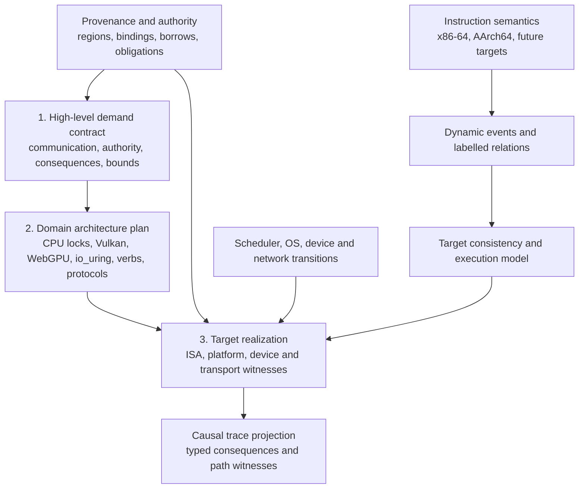

# Memory, Concurrency, Ownership, and Synchronization Model

**Status:** canonical cross-architecture design and implementation roadmap. The repository
currently implements only the single-threaded pieces identified in §2. Everything else is a
requirement, not a claim about existing Lean declarations.

This document supersedes the retired x86-only memory-model and borrowing plans and owns the
architecture shared by Spike 8. Target documents own
instruction encodings and platform details; this document owns how their memory, concurrency,
ownership, and synchronization semantics fit together.
[Composable boundary ABI contexts](ABI_CONTEXT.md) consume this model's common authority and
obligation world and prove that concrete calling mechanisms transport its transitions; they do not
define a parallel ownership, cancellation, or cleanup model.

The design has one central rule:

> Ownership transfer and synchronization have one architecture-neutral contract, but each ISA
> and execution environment must separately prove that its instructions and services implement
> that contract.

Consequently, x86 TSO is not the generic memory model, AArch64 is not implemented as “TSO plus
more fences,” Linux futexes are not treated as memory barriers, and bare-metal SMP is not treated
as an operating-system thread API.

---

## 1. Goals, Guarantees, and Scope

The completed system must provide all of the following:

1. **Architecture-correct concurrent execution:** x86-64 TSO and AArch64 weak-memory behavior,
   including the atomic and barrier instructions used by real synchronization code.
2. **Capability-enforced memory safety:** every dynamic access is covered by a provenanced,
   in-bounds authority; conflicting ordinary accesses cannot be authorized concurrently.
3. **Cross-thread ownership transfer:** spawn, join, successful lock acquisition, and lock release
   move capabilities rather than copying them.
4. **Lock invariants and linear cleanup:** an implementation-defined atomic synchronization
   representation can guard a different region; successful acquisition creates a guard and a
   must-release obligation, and release consumes both.
5. **Blocking synchronization:** Linux `FUTEX_WAIT`/`FUTEX_WAKE` and Windows `WaitOnAddress`
   wrappers refine the narrow address-parking contract. Composite waits, bare-metal notification
   loops, interrupts, and other waits use separately proved scheduler/target adapters.
6. **Two bare-metal SMP stories:** x86 application-processor bring-up and AArch64 processing-
   element bring-up satisfy one lifecycle contract through architecture-specific mechanisms.
7. **Honest causal traces:** effect traces faithfully project the selected admitted labelled source
   paths—including program, scheduler, API/GPU, device, transport, and persistence causality—while
   retaining their witnesses; vector clocks stand in for neither a target consistency model nor
   profile-native relation labels.
8. **Differential validation:** bounded model outcomes, emitted binaries, native silicon, and
   architecture-appropriate negative controls remain linked.
9. **Honest process boundaries:** the first thread scheduler is not mislabeled as a process model.
   A later hosted-process profile composes generative process instances, address-space and image
   generations, process-local handle namespaces, shared kernel/backing objects, explicit failure
   domains, and platform-specific termination observation and status consumption.

The first supported concurrent profile is deliberately bounded:

- naturally aligned 32-bit and 64-bit shared words;
- cacheable normal memory (x86 WB; AArch64 Normal, coherent, shareable memory);
- target-proved single-copy atomicity for each admitted atomic object, with no common assumption that
  every supported CPU or system is multi-copy atomic;
- no mixed-size atomic overlap, self-modifying code, persistent memory, or non-temporal access;
- explicit Device/MMIO operations, kept out of ordinary RAM reasoning;
- process-private futex wait/wake first, with other futex operations deferred explicitly;
- two-thread litmus and lock programs first, with the model itself parameterized by thread count.

The M3 implementation profile is intentionally one hosted address space or one bare-metal machine.
It supplies Spike 8's thread/PE topology and scheduler seam, but not the later platform adapters,
locks, trace proof or full M9 acceptance, and it is not multiprocessing. True hosted
process creation, image replacement, observation/reaping, shared mappings, handle inheritance and
IPC are the separately gated M6-P profile family described in §§6.5 and 8.1. This separation keeps process
work from silently inheriting thread-join or single-address-space assumptions.

These restrictions are acceptance boundaries, not silent assumptions. Widening any one requires a
new validation demand and an update here before implementation.

This first profile is CPU concurrency, not a claim that CPU-shaped event fields are universal.
WebAssembly shared-memory threads, SPIR-V/Vulkan, WGSL/WebGPU, DMA submission/completion
interfaces, network and IPC protocols, and durable storage need additional execution agents,
locations, scopes, relations, and consequences.
They may reuse the common authority, obligation, event-identity, and causal-projection framework,
but must not be encoded as x86/AArch64 threads or as opaque “device fences.” Before M0 fixes public
types, §15 decision 2 must preserve target-indexed extension points for those domains.

---

## 2. Verified Current Baseline

As of 2026-08-28, the tree has the following relevant machinery:

| Area | Present | Missing |
|---|---|---|
| x86-64 memory | Sealed byte memory, width-indexed access API, mandatory per-instruction `memAccesses`, frame lemmas | Atomic memory forms, fences, store buffers, concurrent machine |
| AArch64 memory | Sealed byte memory and an `AArch64MemAccessSpec` vocabulary | The descriptor is not a field of `AArch64Instruction`; no atomic order, barriers, exclusives, or concurrent machine |
| Capabilities | `PermissionShare`, `MemoryPerm`, `MemoryPermissions` | Enforcement at instruction construction, provenanced pointer authoring, temporal loans, cross-thread transfer |
| Obligations | Generic `ObligationToken` list and return/exit predicates | Typed lock/join/wait obligations and an index that prevents forged ledger replacement |
| Indexed programs | `BlockM Arch S₁ S₂ α` with indexed bind | A borrow/obligation index used by assembly programs; safe constructors that prevent arbitrary state replacement |
| Causality | `ThreadId`, vector clocks, `CausalEvent`, single-thread stamping | Concurrent execution graph, correct synchronizes-with generation, multi-thread trace projection |
| OS threads | Single-state Win32 and Linux hooks | Runnable/blocked thread state, clone/CreateThread lifecycle, joins, futexes, wait queues |
| OS processes | One implicit process; thread and process exit collapse into a whole-machine stop | Generative process/system state, address-space and image generations, fork/exec/CreateProcess, process objects/status/reaping, failure domains, shared-object survival, and typed IPC/handle transfer |
| Bare metal | Single-CPU x86 and AArch64 execution paths | SMP bring-up, coherent shared-memory assumptions, interrupt/wakeup model, per-CPU/PE state |

No concurrency theorem may be presented as implemented until it is stated against a machine with
at least two threads or processing elements. A single-thread ordering theorem cannot validate a
concurrent memory model.

---

## 3. Layering and Ownership of Semantics

The implementation is organized through a three-level synchronization lens:



At level 1, a program says **what must be communicated or synchronized**: the source and
destination operations/agents, resource and location footprint, authority/lifetime transfer,
required visibility, completion, delivery, persistence, failure and progress consequences, and
observable performance/security bounds. It does not choose an instruction, API, queue topology, or
lock algorithm.

At level 2, a concrete domain plan chooses the relevant architecture independently of the host ISA:
for example a mutex protocol, Vulkan queue/semaphore/barrier plan, WebGPU submission plan,
`io_uring` ring/resource protocol, libverbs QP/CQ/MR plan, network acknowledgement protocol, or
storage durability protocol. Its proof refines every level-1 demand into domain-native agents,
scopes, relations, bindings, consequences, failure modes, and composition laws. Several demands may
share a mechanism, or one demand may require several mechanisms, when the refinement proves the
exact requested envelope.

At level 3, each supported realization proves that the selected domain plan is implemented by the
actual ISA, platform, device, provider, and transport behavior: instructions and barriers, cache and
DMA ownership, syscalls, doorbells, interrupts, queue transitions, packet/acknowledgement paths, and
persistence operations. A domain proof is therefore reusable across x86-64, AArch64, and future
ISAs, but no end-to-end claim exists until the applicable level-3 witnesses are composed. Conversely,
an ISA fence theorem cannot choose or justify a Vulkan, RDMA, network, or storage architecture by
itself.

The connection theorems between layers are mandatory:

- every program-origin memory event comes from an instruction descriptor and actual instruction
  step; initial, platform, and device events come from their corresponding initialization or
  transition rule and cannot masquerade as program instructions;
- every program event is covered by the executing thread's current authority; platform and device
  events use explicitly scoped environment/device authority, while initial events satisfy the
  initialization invariant;
- every boundary at which the model claims verified-code execution—call, syscall, loader/application
  root, thread/process start, callback, handler or host/guest entry—uses a relational entry-origin
  witness from physical state to the exact logical arguments,
  binding and live authority/obligation world. A caller/link proof establishes an ordinary call;
  otherwise the loader or platform transition establishes the root/start/handler tuple. The
  same physical bits may carry different erased provenance, region/binding generations or protocol
  instances, so these values cannot be decoded by a privileged function from physical state alone;
  the entry-origin proof establishes the relation and precondition, the target profile proves complete
  physical admissibility, and the artifact proof connects that execution to the emitted bytes;
- exit results, outcomes, fresh identities and the after-world are relational whenever erased logical
  information is not uniquely recoverable from physical execution. A functional projection is
  permitted only for proved physical/scalar data and may neither mint provenance/authority nor choose
  a fresh generation; otherwise the exit relation binds those values and proves the exact transition;
- every architecture-specific execution admitted by the interpreter satisfies that ISA’s
  consistency predicate;
- every emitted synchronization instruction decodes to the modeled instruction, and program
  emission preserves relocation targets, layout, and the instruction stream used by the proof;
- the remaining model-to-hardware semantics boundary is recorded as a cited TCB assumption and
  challenged by architecture-appropriate differential tests;
- every first-profile CPU release/acquire synchronizes-with edge is backed by the atomic read-from
  or lifecycle event that creates it; every other target relation has its own profile-indexed
  witness and connection theorem rather than being forced into the CPU witness shape;
- every observable trace order carries a target/profile-indexed `TraceProjectionWitness` from an
  admitted labelled source path, and every source path declared trace-observable by that projection
  is retained; fidelity is to induced reachability, not to a chosen primitive-edge set or transitive
  reduction;
- every address-wait operation refines the narrow scheduler address-parking contract, while a
  composite wait, notification instruction, interrupt, or device signal uses its own proved adapter.

Without these the layers are parallel descriptions, not a verified system.

The ABI-context work expected to converge with this plan instantiates the entry half of this seam
through a relation such as `ContextBoundaryRealization.relatesEntry`; it is the implementation path
for M1, not a competing memory model. Before that interface freezes, Decision 3 must also make exit
result/outcome binding relational or prove that every functional projection is restricted to
non-authorizing physical/scalar data while all fresh erased identities live only in the relational
after-world. Merely constructing a boundary realization—especially one with a false entry/world
relation, vacuous admissibility, weak artifact relation, or identity-minting result projection—confers
no authority to execute it.

M1 freezes and tests only the abstract relation/link interface. A concrete ordinary call, syscall or
loader root additionally selects its exact M2-B architecture/platform/entry-kind profile. Thread
semantics belong to M6-T[Linux] or M6-T[Windows]; native lifecycle belongs to M6-NX[Linux],
M6-NX[Windows], or M6-NA[Linux]; optional address parking belongs separately to M6-X[Linux],
M6-X[Windows], or M6-A[Linux]. A process boundary belongs to M6-PL-X/A or M6-PW-X; and an asynchronous
entry on Decision 13 plus the selected hosted or M7 target. Nothing reaches `VerifiedProgram` until a
whole-program caller-or-loader link theorem establishes every exact entry tuple and precondition and
connects the target execution to the emitted artifact.

Launching or replacing an image with an **opaque environment program** is a different profile. The
model may prove OS lifecycle/object/termination semantics and explicit shared-memory/IPC/handle
channels without interpreting that program's internal execution, granting it internal linear
authority, or claiming a child `VerifiedProgram`; that profile therefore owes no application-artifact
or application-entry theorem. A **verified child/image** profile does owe the complete artifact and
entry connection. This distinction keeps an ordinary external `CreateProcess`/spawn/exec from
inheriting an unnecessary whole-program proof burden while preventing opaque code from receiving
verified-code authority by implication.

---

## 4. Common Dynamic Memory-Event Vocabulary

Static instruction descriptors remain target-specific where addressing demands it: x86 SIB
operands and AArch64 pre/post-indexed operands should not be forced into one operand type. They
must, however, instantiate a checked target projection into the common event envelope after
effective addresses are known.

The sketch below states the information required by the first **CPU byte-memory projection**. It is
not an accepted universal Lean representation: §15 decision 2 must first choose target-indexed
agent, memory-object/reference, location-set, scope, semantics, and relation interfaces. A shader,
DMA, or storage profile adds its own required information through those interfaces rather than
pretending every operation has a CPU `ThreadId` and numeric `AddressRange`, or by filling a common
record with meaningless optional fields.

M0 fixes only the thin interchange boundary: generative event identity, profile-indexed agent,
reference, location, event/transition payload, relation, and consequence families, well-formed
target projections, labelled path witnesses, and trace-projection laws. Concrete relation and
consequence constructors for a future target remain owned by that target's hash-pinned reference
intake. This prevents a CPU-first
implementation from closing the extension seam without prematurely guessing Vulkan, WebGPU,
`io_uring`, libverbs, or storage semantics.

Reference resolution at that boundary is time-indexed rather than a timeless
`reference -> location set` function. The common interfaces must be able to instantiate equivalents
of a generative `ObjectInstanceId`, target-indexed `BindingKey`, `BindingGeneration`, and a resolved
`BindingRef` carrying the key and generation, object instance, rights, and covered logical and
backing footprints. A backing footprint need not be a numeric physical address. Profile-owned
`Bind`, `Unbind`, and `Rebind` transitions create or retire those witnesses; explicit
alias/overlap relations say when distinct references resolve to the same object or backing
locations. Raw numeric equality across different namespaces does not establish aliasing, while
different raw keys may alias one object.

Each asynchronous resource operand resolves and captures its binding generation at that profile's
declared snapshot/consumption event. Some profiles capture at operation acceptance; others select a
provided buffer or consume an update-after-bind descriptor later. Once captured, later effects,
results, resource returns, and cleanup refer to that generation rather than re-resolving a reused
file descriptor, handle, registered-resource index, `rkey`, IOVA, descriptor, or address. M0 includes
the generic negative control `capture K -> A/g; rebind K -> B/(g+1); later effect`: that effect may
affect or return only `A/g`. A dynamic-binding
profile states precisely what a transition invalidates. For example, sparse-resource rebinding can
invalidate a cached backing-footprint witness without itself destroying the logical resource or
descriptor; destruction and freed-backing misuse have separate lifetime rules. A Vulkan profile
therefore uses distinct generative logical-resource/view, backing-allocation, range-binding,
descriptor-slot, and device-instance identities, while another target instantiates only the
distinctions it actually has.

The CPU projection should carry information equivalent to:

```lean
inductive AccessRole where
  | read
  | write
  | readWrite

inductive AccessClass where
  | plain
  | atomicLoad
  | atomicStore
  | atomicRmw      (succeeded : Option Bool) -- none for an unconditional RMW
  | exclusiveRead  (reservation : ReservationId)
  | exclusiveWrite (reservation : ReservationId) (succeeded : Bool)

inductive MemoryOrder where
  | relaxed
  | acquire
  | release
  | acquireRelease
  | seqCst

inductive MemoryDomain where
  | normal
  | device
  | portIO

inductive EventKey where
  | thread   (thread : ThreadId) (sequence : LocalSequence)
  | platform (platformInstance : PlatformInstanceId) (sequence : LocalSequence)
  | device   (deviceInstance : DeviceInstanceId) (sequence : LocalSequence)
  | initial  (range : AddressRange)

inductive EventOrigin where
  | instruction (descriptor : StaticAccessId)
  | platform    (transition : PlatformTransitionId)
  | device      (transition : DeviceTransitionId)
  | initial

structure MemoryEvent where
  key           : EventKey
  origin        : EventOrigin
  range         : AddressRange
  role          : AccessRole
  accessClass   : AccessClass
  explicitOrder : Option MemoryOrder
  domain        : MemoryDomain
  targetAttrs   : TargetMemoryAttributes
  readValue     : Option ByteVector
  writeValue    : Option ByteVector
```

Only well-formed events enter a graph. `MemoryEvent.WellFormed` or indexed constructors enforce at
least: role/value presence and absence; value width equals range width; failed
`atomicRmw (some false)` and failed exclusive stores have no write value, while unconditional or
successful RMW/store-exclusive actions do; order is valid for the access class (for example no release-only load or
acquire-only store); target width/alignment and single-copy-atomicity premises hold; the domain
agrees with the target memory attributes; and origin agrees with the key form. Target projections
prove their additional constraints.
The orthogonal fields are an interchange vocabulary, not permission to construct malformed
combinations.

`explicitOrder = none` means the ISA encoding carries no explicit ordering mode; it does not decide
the orthogonal `AccessClass`. It may describe a plain access or an approved atomic access such as an
aligned x86 `atomicStore` realized by `MOV`, but it is not another spelling of `relaxed`. A protocol
proof may show that one such x86 store implements the release half of a particular lock; that derived
synchronization role does not relabel every ordinary store as an ISA release operation. Value fields
are width-indexed byte strings (or an equivalent representation) so value consistency, CAS results,
exclusive-store success, forwarding, and litmus final states are expressible.

The concrete spelling is an implementation decision; the information content is not. Barrier
events are separate from accesses because a barrier orders events but does not access a fake empty
range. A normalized barrier records its target kind, source and destination access-class sets,
source and destination memory-domain sets, shareability/scope, whether it imposes ordering or
completion, and whether it synchronizes the instruction stream. Architecture-specific semantics
interpret those fields; they are not collapsed into one architecture-neutral notion of “full
fence.” Target projections retain any finer encoding needed by the ISA—for example asymmetric
RISC-V `FENCE` predecessor/successor `I`, `O`, `R`, and `W` sets—rather than forcing it through a
lossy architecture-neutral `MemoryOrder` value.

Cache clean/invalidate/flush operations, address-translation or IOMMU maintenance, and similar
target operations are likewise first-class profile transitions over explicit location/cache-granule
sets with completion and ownership consequences. They are not encoded as fake loads/stores or
generic barriers, and partial-range/alias rules remain available to the target proof.

CPU mutex protocol synchronization is a proof-produced layer over concrete event keys, not another
ISA order tag. A `SyncWitness` (or equivalent) names the protocol/lock instance and generation, the release
key, the acquire-observation key, any distinct success-linearization key (for example AArch64's
load-exclusive plus successful store-exclusive), the relevant reads-from/value or RMW relation, and
the target-specific proof that those events implement release/acquire. It is the canonical source
of a first-profile mutex synchronizes-with edge, not the universal shape for Vulkan system
synchronization, API dependencies, DMA completion, or other target relations. Thus an x86 `MOV`
unlock may have `explicitOrder = none` while one proved
protocol use is a release; unrelated stores are not relabelled, and a failed compare/exchange or
store-exclusive creates no witness.

An execution graph contains at least:

- per-thread program order (`po`);
- syscall/API invocation-to-platform-transition, ordered platform subevent, block/resume, and
  return-to-thread edges;
- byte/range-granular reads-from (`rf`) for Normal memory, relating each returned byte to a write
  byte;
- per-location Normal-memory coherence/modification order (`co`), with an explicit initial write
  for every modeled Normal location;
- Normal-memory from-read (`fr`), derived where appropriate;
- address, data, and control dependencies needed by the target model;
- barrier-order edges;
- atomic-RMW and exclusive-pair/reservation relations where the target requires them;
- lifecycle events such as spawn and join;
- target device-transition/value relations for Device and port-I/O events, including destructive
  reads, request acceptance, effect completion, result/notification delivery, and device-local order
  as distinct profile events where applicable, without inventing Normal-memory initial writes or
  coherence edges.

Origin and domain are orthogonal: for example, every concurrent kernel child-TID set/clear in the
pinned clone profile is a platform-origin `atomicStore` to a registered, stable, aligned 32-bit
Normal-memory object. It participates in the same `rf`/`co` relations and requires the target's
single-copy-atomicity proof; it is not an unclassified write that bypasses the atomic/plain mode
invariant. An MMIO register access instead uses the device relation. Invocation/return and device
request/result/notification edges keep those events linked to the program that caused or observed
them, making release-before-notify and API refinement statable in the graph without collapsing their
consequences.

The graph's `rf` relation, not a duplicate single-source field in `MemoryEvent`, is authoritative.
Byte/range granularity permits a read to be assembled from multiple writes and avoids baking a
same-width assumption into the common interface even though the first executable profiles defer
mixed-size races. Program keys are thread-local, platform/device keys are local to their stable
instance, and initial keys are structural; graph and trace equality must not depend on a global
allocation order. Logical `ThreadId` values are generative and never reused within an execution or
trace; platform TIDs, handles, APIC IDs, and MPIDR values map to the current logical instance but are
not program-event or vector-clock identities.

The aligned, non-overlapping v1 CPU subset has one reusable `CpuGraph.WellFormed` algebra rather
than target proofs rebuilding graph hygiene independently. It requires: every read byte has exactly
one `rf` source (an explicit initial write or a compatible write event); source and returned values,
locations, widths, and byte lanes agree; each modeled Normal-memory location has exactly one initial
write; `co` is a strict total order over writes to each location and contains no unrelated events;
`fr` is derived from `rf` and `co`, not freely supplied; and atomic/RMW/exclusive reads and successful
writes obey the profile's indivisibility and read-source constraints. Target consistency predicates
accept only a `CpuGraph.WellFormed` graph and then add ISA ordering rules. Mixed-size and overlapping
accesses require an explicit later extension of this algebra rather than weakening v1 well-formedness.

The event graph is the common proof-facing representation. Each ISA may use the executable model
best suited to it, provided connection theorems relate that model to this graph.

---

## 5. Architecture-Specific Consistency Models

### 5.1 x86-64: TSO for Write-Back Memory

The first x86 model is an operational TSO machine over WB memory. Before M2-X, the profile must pin
whether it is Intel-64-only or the cited common subset of Intel 64 and AMD64. A CPU outside that
source-backed vendor/profile set may run functional controls but reports memory-model validation as
`not-validated`.

- each x86 execution agent owns a FIFO store buffer;
- a plain store enters that buffer;
- an approved naturally aligned non-locked atomic load/store follows the same operational
  load/forwarding or store-buffer transition as its underlying `MOV`; `AccessClass.atomicLoad` or
  `.atomicStore` changes its authority and single-copy-atomicity contract, not its TSO queue order;
- a load forwards from the youngest same-range or covering supported store in its own buffer,
  otherwise reading shared memory; partial-overlap composition is deferred from the first x86
  executable profile but remains representable in the common graph;
- a model-internal drain publishes the oldest buffered store;
- locked RMW operations drain prior stores and execute as indivisible globally ordered actions;
- `MFENCE` has its architectural full load/store ordering contract; an implementation may realize
  that contract by draining prior stores and preventing later loads and stores from crossing it;
- naturally aligned supported-width ordinary accesses are untearable as required by the selected
  x86 profile.

The standard-library `ParkedMutex32` implementation uses a naturally aligned 32-bit word because
Linux futexes operate on 32-bit words on every supported architecture. Its initial x86 instruction
demand therefore includes memory `XCHG r/m32` (implicitly locked), `LOCK CMPXCHG r/m32` (plus any
64-bit forms independently demanded), and optionally `PAUSE`. `MFENCE` belongs independently to the
broader M2-X synchronization and litmus surface; it becomes a library dependency only if the pinned
`ParkedMutex32` algorithm actually emits it. Release of a simple x86 mutex may use an approved
aligned `MOV` atomic-object store only when the x86 model proves the required
prior-write-before-release visibility. This is the instruction demand of that reusable library
implementation, not a width or encoding restriction on the portable mutex contract.

UC/WC/MMIO ordering is not folded into WB TSO. LAPIC accesses and other devices use the device
model in §10 and force an explicitly cited x86 memory-type extension.

Required x86 connection theorems:

1. one-thread, drained executions agree observationally with the existing sequential interpreter;
2. an atomic descriptor corresponds to one indivisible dynamic action;
3. every admitted operational execution satisfies the x86 execution-graph consistency predicate;
4. every native observation is contained in the pinned model's allowed outcomes; and
5. the model-derived outcome sets for the finite named x86 litmus suite match the stated TSO profile.

Reverse inclusion—every bounded graph-consistent execution being produced by the operational
enumerator—is required only when that enumerator is advertised as a complete model checker. Such an
`EnumeratorComplete` profile proves general adequacy and obtains named-suite equality as a
corollary; ordinary verified programs and soundness-only execution engines do not pay that cost.

### 5.2 AArch64: Weak Memory, Acquire/Release, and Exclusives

AArch64 gets a separate consistency model sourced from a pinned Arm Architecture Reference Manual
profile and its matching official `cat`/herd7 material. The pinned formal model is the exact outcome
oracle; native hardware observations test that implementations produce only allowed outcomes, but
cannot establish the entire allowed set. AArch64 must not inherit x86 ordering defaults.

The first supported instruction and semantic surface includes:

- ordinary `LDR`/`STR` as plain weakly ordered accesses, not relaxed atomics;
- `LDAR`/`STLR` acquire and release accesses;
- `LDXR`/`STXR` and acquire/release variants as an exclusive-monitor protocol;
- `CLREX` as an explicit monitor-clearing transition;
- `DMB` with the scopes needed for shareable RAM and device interaction;
- `DSB` and `ISB` where device bring-up or system-register sequencing demands them;
- `WFE`/`SEV` for the bare-metal parking adapter, without treating either as a RAM fence.

Per-PE state includes a local reservation plus an abstraction of the architecture's local/global
exclusive monitors and reservation granule. An exclusive store is conditional: it writes only if
the monitor permits it and returns success/failure in the architectural status register. Conflicting
writes, `CLREX`, and modeled lifecycle/exception transitions invalidate monitor state as required by
the selected profile; permitted spurious `STXR` failure is represented. A successful `STXR`/`STLXR`,
not the preceding load-exclusive, is the lock-acquisition linearization point. Any eventual-success
claim needs a separately named fairness/progress assumption. An exclusive pair is therefore not
encoded as one indivisible `.atomicRmw` descriptor.

The v1 model covers aligned 32-bit and 64-bit operations in coherent shareable Normal memory. LSE
atomics, RCpc forms, mixed-size overlap, and non-shareable memory remain deferred until a consumer
requires them. A verified executable instruction surface containing an `LDAPR`-family instruction
is outside v1. Its event may not inherit `LDAR`-specific RCsc, ordering, or realization facts solely
because both project to a generic acquire label. A later FEAT_LRCPC profile must retain RCsc and RCpc
as distinct target semantics and add distinguishing litmus, decoding, emission, and connection
tests; genuinely common acquire theorems remain reusable only through that refinement.

Required AArch64 connection theorems mirror x86 but are architecture-specific:

1. one-PE executions preserve the current sequential instruction semantics where ordering is
   unobservable;
2. exclusive-monitor success and failure correspond to the emitted event sequence;
3. acquire, release, and barrier descriptors are faithful to dynamic ordering behavior;
4. every admitted execution satisfies the chosen AArch64 consistency predicate;
5. bounded outcome sets equal those of the pinned formal Arm profile for the finite named litmus
   suite; and
6. every native observation is contained in the pinned allowed set.

General reverse-inclusion adequacy is an optional `EnumeratorComplete` claim, not a prerequisite for
program soundness. A tool making that stronger claim proves every bounded graph-consistent execution
is represented; a soundness-only Arm execution engine proves operational execution implies pinned
consistency and is validated by the finite named-suite equality above.

### 5.3 What Is Shared and What Is Not

Shared:

- event identities and graph relations;
- provenance and authority;
- lock, guard, and obligation contracts;
- scheduler lifecycle and parking contracts;
- validation protocol and causal-trace projection.

Architecture-specific:

- allowed execution graphs;
- instruction encodings and static addressing descriptors;
- store-buffer versus exclusive-monitor state;
- fence/barrier semantics and scope;
- normal/device memory attributes;
- bare-metal CPU/PE bring-up.

The implementation packages those layers as composable certificates. A generic finite-transition
DFS library supplies search mechanics without claiming an ISA; each ISA proves a reusable induction
from one local operational step to its event projection; descriptor families prove parameterized
projection and emitted-stream/relocation fidelity once; `CpuGraph.WellFormed` is consumed by the
target consistency theorem; and observation projection derives the finite named-suite comparison.
A whole program composes certificates for its reachable descriptor classes, emitted artifact, and
selected target profile. It does not re-prove generic DFS correctness, per-instruction instances of
a descriptor-family theorem, or an optional enumerator-completeness result. Exceptional encodings
and semantics contribute only their refinement delta and any stronger property they advertise.

---

## 6. Provenance, Borrowing, and Cross-Thread Authority

Memory ordering cannot repair an unauthorized or out-of-bounds access. Authority is checked before
the architecture consistency model is consulted.

### 6.1 Regions and Provenanced Pointers

Every allocatable region has a fresh, generative `RegionId`; identity is not derived solely from its
address because an address may be freed and reused. A pointer preserves its region identity while
offsetting. Constructing a pointer from an arbitrary integer is unavailable to ordinary assembly
authors. Dereference requires:

- a pointer into the named region;
- a proof that the dynamic range is in bounds and non-wrapping;
- authority for the requested access kind;
- any alignment and stable-address properties required by atomics, futexes, or devices.

External memory enters through explicit environment grants at loader, allocator, syscall, or device
boundaries. A grant is a reviewed trust boundary, not a general unchecked cast.

#### 6.1.1 Pointer-valued memory (v1 boundary)

Stored bytes do not carry provenance. Loading an address-sized integer never manufactures a
`ProvenancedPtr` or authority. A v1 program may store address bytes, but it may later dereference
that value only through a registered typed view whose ghost slot map still associates the field
with a live `RegionId`; moving or swapping the field must move that slot binding as well. Pointee
authority remains in the indexed context and is never reconstructed from bytes. Arbitrary external
bytes remain integers until an explicit boundary grant validates and associates them with a live
region.

Generic recursive or existential heap structures that recover ownership-carrying pointers are
outside v1. A consumer such as the line-sort descriptor table must use a purpose-built typed view
and prove preservation of its slot map, or wait for that later extension.

Deferred-reclamation schemes do not weaken this boundary. Future RCU, hazard-pointer, and epoch
profiles use different protection and reclamation protocols, but each must associate an observed
typed published pointer/reference with a live `RegionId` through an explicit protect/dereference
operation. That operation yields a protection-guard-bound provenance and lifetime witness, not
general read/write authority over mutable node fields; field access still requires the profile's
separate access and ordering authority. RCU read-side sections and ordered grace periods, hazard
publication plus source revalidation and an ordered scan, and epoch entry/retirement/quiescence are
not interchangeable witnesses; none converts arbitrary address bytes into a pointer or authority.

#### 6.1.2 Indirect resources, bindings, and aliases

A logical API reference or device address is not automatically a provenanced CPU pointer and need
not identify its backing allocation. A profile with indirect resources supplies the generative
object/backing/binding types described in §4 and an event-time resolution witness covering the exact
resource and backing generations, device/namespace instance, rights, and range. Authority to name a
resource, modify its binding, access its contents, or reclaim its backing are separate capabilities.

Unbind, rebind, backing free, object/view destruction, descriptor update, and external-memory import
have profile-specific invalidation rules. Sparse unbound access follows the selected target's
explicit nonresident result—such as rejected, zero/discard, or undefined—rather than one universal
CPU dereference rule. Overlap/hazard checks use resolved backing footprints, while relation scope and
visibility retain the logical reference identity required by the target. Incompatible alias
interpretations can create target-defined undefined contents as well as ordinary race obligations.
An external-memory import is an explicit trust-boundary grant associating local generative handles
with the selected underlying object; raw handle/address/key bytes never create that association.

### 6.2 Authority States

The canonical authority algebra distinguishes:

- `Exclusive`: one context may read or write ordinary memory;
- `SharedRead`: one or more contexts may read and none may write;
- `Atomic`: contexts may access a specifically declared atomic object, but only with supported
  atomic operations.

`Atomic` is not authority to mutate an entire mutex-protected region. The mutex implementation's
synchronization representation has atomic authority; the protected region moves as exclusive
authority to the successful acquirer.

This is a resource algebra, not a pairwise-disjoint list. Spatial composition requires disjoint
regions, while same-region composition permits identified shared-read leases and separately
shareable atomic-object authority. Atomic grants are instance- and generation-scoped leases under
an authoritative object record, not timeless facts derivable from an address. An exclusive owner
that lends reads is represented by a frozen owner fragment plus unique `LoanId -> holder` records;
a scalar reader count cannot prove which borrower returned which loan. Reclaim consumes the exact
matching loan token, and exclusive authority is restored if and only if the loan map becomes empty.
The borrower carries `MustReturnLoan loan issuer holder region`, or an equivalent result-indexed
terminal promise, so return and thread exit cannot lose a live loan.

Temporal borrowing is tracked in the indexed program type, not by duplicable capability values:

- lending a read suspends exclusive writes until all read loans are reclaimed;
- donation removes authority from the donor and installs it in the recipient in one modeled causal
  handoff: spawn, successful join, lock transfer, or a specified linear channel. V1 does not permit
  an unsynchronized write into an already-running thread's authority context;
- splitting a region suspends/consumes overlapping parent access authority and produces disjoint
  child authorities plus their obligations. Rejoin consumes the exact complete sibling set, with
  no outstanding descendant, loan, or typed view, before restoring parent authority;
- transmogrification creates a typed view only from a proof and carries a destruction/discharge
  obligation before the underlying raw authority returns.

The current `PermissionShare.Locked` constructor is compatibility vocabulary, not the final lock
model. Migration should separate atomic-object authority from protected-region ownership.

### 6.3 Global Cross-Thread Invariant

For every event-time concrete mutable byte range, the family of live authority contexts in the
selected thread/process system satisfies a global access-mode invariant:

- at most one context has ordinary write authority;
- if one context has ordinary write authority, no other context has read or write authority;
- multiple read authorities may coexist;
- a registered atomic object admits only its supported atomic accesses: atomic authority may overlap
  on that declared region, but no ordinary read or write authority may coexist until the object is
  unregistered and every atomic grant is consumed.

From this invariant and descriptor fidelity, prove that two authorized conflicting ordinary
accesses from distinct execution contexts cannot occur and that a registered atomic object cannot be
accessed through a plain instruction. Distinct logical private regions may share only a frozen COW
snapshot under §6.5; neither obtains concrete write authority until its mapping is generation-rebound
to fresh backing before the store. Atomic accesses are not waved away as “synchronized”; their safety
and ordering are discharged by the atomic-object and architecture models.

This is the first **data-race-free CPU authority profile**, not a claim that every lower-level
concurrency protocol is expressible through its three modes. A future seqcount/seqlock profile may
authorize race-tolerant reads only through a separate speculative access protocol. Such reads
produce an `UnvalidatedSnapshot` (or equivalent quarantined value), not ordinary read authority:
its contents cannot affect a committed architectural result, contract-visible output, authority
transition, pointer dereference, or irreversible external effect until a sequence-generation and
ordering witness commits the permitted scalar/copied snapshot. A pointer dereference additionally
requires an independent pointee-lifetime witness; a Linux seqcount-only profile forbids pointer-
bearing protected data. The profile must also pin writer serialization, sequence wrap/generation
rules, width and tearing assumptions, and its scheduling, preemption/interruption, and
retry/progress premises. Linux's profile requires a writer to be non-preemptible and non-
interruptible wherever a reader that can interrupt it could otherwise spin indefinitely. Failed
validation yields only the specified failure/retry outcome and no snapshot-content-derived
consequence. This exception is profile-local and does not relax the ordinary no-race theorem above.

### 6.4 Task/thread spawn, join, and termination

Spawn accepts an explicit capability partition. Donated regions disappear from the parent before
the child can become runnable—even on a platform where the child may execute before the spawn API
returns. A failed spawn restores the pre-spawn partition; success commits it exactly once.
Shared-read and atomic grants may be installed in both contexts only when the global invariant
permits them.

Successful spawn creates a fresh logical `ChildTaskInstanceId` and, for a joinable task/thread, one
unique `JoinRight` carrying the child's result-indexed terminal contract. Neither identity is an OS
thread ID, child-TID address, process ID, reusable handle value, or raw `ThreadId`. Timeout, failed
wait, or observation-only wait preserves the right. Successful logical join consumes it exactly
once and returns only the sealed terminal bundle promised by the child's postcondition; it does not
manufacture every capability originally donated. Platform thread handles and their close
obligations are separate observation resources.

`JoinRight` is a high-level task/thread contract, not a platform process-lifecycle primitive. A
high-level task may eventually be implemented by a child process, but its adapter must separately
own the process-observation, status, reaping and IPC resources in §6.5 and prove how an explicit
channel realizes the task's terminal result. The one-shot task abstraction cannot be used to claim
that a repeatable process wait consumes an OS process object, or that process termination returns
the child's private address-space authority.

Every thread terminal transition seals a bundle that accounts for its entire resource context:
each authority, loan, atomic grant, guard, and obligation is returned, donated through a specified
handoff, discharged by its contract, or transferred to an explicitly named live recipient/system
sink whose own lifetime and cleanup contract remain tracked. An obligation-free exclusive
capability left in a dead thread is still invalid. Detach consumes a `JoinRight` only when the child
contract returns no join-owned linear resource, or atomically redirects the declared terminal
bundle to such a live sink. A dead or terminating process is not itself a magic recipient.

Spawn and join contribute program-happens-before only through a proved lifecycle-visibility
refinement. Parent-to-child spawn must make the promised pre-spawn writes visible before the child
uses donated authority; child-to-parent join must make the terminal bundle's promised writes visible
after successful join. A runnable/signaled state, child-TID clear, or wake event alone is not that
proof. Each platform adapter must cite an API/architecture guarantee that provides the edge or use an
explicit release/acquire publication word alongside its lifecycle mechanism.

### 6.5 Process lifecycle authority and interprocess resources

The real hosted-process model is the separately gated M6-P profile family. Its POSIX/Linux
(`M6-PL`) and Windows (`M6-PW`) members can advance independently and do not reuse the task/thread
join algebra. Their required information content includes a globally generative `ProcessInstanceId`;
time-indexed external PID bindings; process-world, image and address-space generations; independently
owned termination/status records; aliasable termination-observation and status-query grants; and,
where the platform has one, a distinct one-shot reap/status-consumption right. Raw PIDs and handle or
descriptor numbers are reusable namespace keys, never identities or capabilities.

Process creation refines mappings, typed views, pointer-slot bindings and authority together; copying
page bytes is not enough. In the POSIX/Linux profile:

- a private inherited mapping creates a fresh child `RegionId`, mapping generation, typed views and
  slot bindings through a generative parent-to-child rebase witness. While kernel copy-on-write
  shares the physical snapshot, its concrete backing is frozen and both mappings hold only the
  derived read grant there, even though each process owns its distinct logical private region. Before
  either process performs an ordinary write, a kernel COW transition allocates/copies and
  generation-rebinds that mapping to fresh concrete backing, installs its concrete exclusive grant,
  and only then lets the store resolve and execute. Thus two private logical owners never authorize
  ordinary writes to the same event-time concrete mutable range;
- a shared mapping preserves its backing-object identity and creates a child mapping/view reference,
  but access authority is only the read-shared, registered-atomic, partitioned or other grant derived
  by the pre-fork contract. Mapping inheritance never duplicates an `Exclusive` grant to a common
  backing;
- a `MADV_DONTFORK`-like disposition creates no child mapping or view, while a
  `MADV_WIPEONFORK`-like disposition creates the selected zero/reset child state and clears or
  regenerates every affected typed slot binding rather than retaining provenance for erased values;
- `vfork` creates none of those independent child grants: it carries only the scoped non-owning
  address-space/view borrow described in §8.1; successful exec invalidates old-image mappings, views
  and slot bindings before the replacement image establishes new ones.

The lifecycle transition may rebase a live typed pointer slot because it carries the parent binding
and exact mapping transform. Loading equal pointer-sized bytes in the child cannot manufacture that
witness. Fork is rejected or restricts the child's access if the proposed shared-mapping authority
split would violate the global access-mode invariant.

Process termination creates only the profile's terminal fact/status and resource-specific cleanup
transitions. It cannot seal arbitrary private-memory capabilities into an in-memory bundle for an
observer. Results or authority crossing a process boundary require an explicit shared-memory, IPC,
pipe/socket, inherited-object or handle-transfer channel and its own visibility/lifetime proof.
POSIX `waitid(..., WNOWAIT)`-style observation can preserve a waitable status record and a later reap
can consume it; Windows process-object signaling can be observed repeatedly through independently
owned handles. Neither platform shape is forced through `JoinRight`.

The common handle/object seam distinguishes at least:

- the source and destination process-local `HandleEntryId`/descriptor entry and binding generation;
- any intermediate open-file description or provider object, the underlying kernel/object instance,
  the exact rights, inheritability, and each local close obligation;
- copy/alias, move/donation, rights attenuation, creation-time inheritance, import/open by name, and
  object-specific export/import; attenuation and source closure are result-indexed dimensions rather
  than assumptions hidden in the word “transfer”;
- publication, receiver acceptance, source retention/closure, and failure atomicity as separate
  consequences.

Thus Linux `SCM_RIGHTS` is an alias-creation operation: the receiver obtains a fresh descriptor entry
to the same open-file description while the sender normally retains its entry. Windows
`DuplicateHandle` may preserve or transform rights, and `DUPLICATE_CLOSE_SOURCE` retires the source
even on an error outcome; sockets and other exceptional object types use their selected
object-specific transfer profile. Equal numeric entries in different namespaces prove no aliasing.

Every process world belongs to an explicit `FailureDomainId`, and every resource/effect declares its
termination disposition. Private mappings and local entries may be invalidated or forcibly closed;
shared mappings and refcounted kernel objects may survive through other bindings; a robust
process-shared lock may enter owner-dead recovery; children may survive, reparent, or be killed only
under a selected job/group rule; and device, network, filesystem and remote effects may complete,
cancel, persist, leak, or become indeterminate as their own profile states. Forced termination is an
abort of precisely that domain. It is never proof of normal guard release, global-world
invalidation, or clean destruction of surviving resources.

---

## 7. Lock Invariants and Unlock Obligations

The portable v1 mutex contract is nonrecursive and connects an opaque, implementation-owned stable
atomic core footprint `rCore`, a disjoint protected region `p`, and an implementation-declared class
of auxiliary resources that may be contributed by a contender or borrowed from scoped scheduler,
per-agent, or library infrastructure. It deliberately does not fix the number or width of core
atomic objects, bit layout, parking strategy, concrete acquisition algorithm, or whether an admitted
implementation uses auxiliary queue nodes.

Initialization consumes raw exclusive authority for `rCore` and `p`, establishes an
implementation-defined unlocked representation (including any admitted initial payload), registers
each declared core atomic object, and creates a fresh `LockInstanceId`. It need not pre-own every
resource that a future acquisition will contribute. That instance identity is distinct from the
fresh acquisition generation created on every ownership-granting acquisition result:

```lean
structure LockInv
    (implementation : MutexImplementationId)
    (lockInstance : LockInstanceId)
    (representationCore : MutexRepresentationId)
    (protectedRegion : RegionId) where
  -- When unlocked, the invariant owns protectedRegion.
  -- When locked, exactly one live guard owns protectedRegion.
  invariant : LockStateRelation implementation representationCore protectedRegion
```

The synchronization representation's physical state does not by itself prove ownership. The ghost
invariant relates its implementation-defined state, profile-owned logical owner identity and
acquisition generation, protected authority, wait state, lifecycle, live auxiliary-resource loans,
and any additional packed payload. Contenders receive only the implementation-declared atomic grants
for `rCore`; mixed atomic/plain access or separately claimed authority for overlapping fields of any
core object is rejected. The invariant owns `p` while available, and exactly one live guard owns `p`
while held.

Auxiliary resources remain owned by their contributor or infrastructure until a checked acquisition
transition lends them to the lock protocol. A queue-node implementation such as MCS may therefore
take one generative contender node per acquisition; a qspinlock-like profile may use a compact core
word plus generation- and nesting-tracked per-agent nodes. Publication, predecessor/successor
handoff, cancellation, withdrawal, and reuse each carry typed obligations, and the node's storage
remains live while any
published reference can reach it. Returning or reusing a node requires proof that the exact loan and
all such references are retired. These implementations are not in the first library profile, but the
portable contract must not exclude them by pretending initialization owns their nodes.
The two-CPU/PE M7 acceptance path still uses `ParkedMutex32`; queued locks are a future scalability
profile, not an unstated prerequisite for that baseline.

### 7.1 Acquire

Acquire has an extensible, result-dependent postcondition. The common result surface leaves room for:

- `notAcquired reason`: no guard or protected authority is transferred. Each acquisition-scoped
  auxiliary loan is either returned before the call returns or atomically converted into a typed,
  still-accounted outstanding-withdrawal obligation owned by a live contender/infrastructure
  context. The latter permits timeout-capable MCS/CLH-style protocols whose published node must be
  reclaimed lazily by a neighbor; it preserves node storage and forbids reuse until the exact
  reachability/withdrawal proof retires it. Proved implementation-internal contention metadata may
  also have changed;
- `acquiredHealthy`: at the target's acquisition linearization point, atomically create
  `LockGuard lock owner generation protectedRegion`, transfer exclusive protected authority, and add
  the matching `MustRelease lock owner generation`;
- `acquiredNeedsRecovery`: transfer exceptional ownership plus a profile-specific typed
  recovery/repair obligation. A POSIX robust profile can require `pthread_mutex_consistent` to
  promote the guard and make unlock-before-consistent poison the mutex; a Windows abandoned-mutex
  profile grants ownership while reporting the protected application state potentially inconsistent
  and must not import POSIX's kernel-level consistent/not-recoverable state machine. Each profile
  states what evidence restores its application invariant and what release is permitted; and
- `notRecoverable reason`: report the permanent protocol state without granting ownership.

The first `ParkedMutex32` profile exposes only `notAcquired` and `acquiredHealthy`. Robust and
abandoned hosted profiles require their own reference intake and refinement; the M5-S type shape must
not force an ownership-granting exceptional result into either ordinary success or unchanged-state
failure.

A blocking acquire returns one of its declared acquired or terminal non-acquisition outcomes and
carries a liveness theorem only at the progress class it advertises. Decision 11 must pin, for each
implementation, a predicate saying when an attempt is continuously eligible and exact progress
events/rank decreases; an arbitrary internal step or infinite retry loop is not progress. Every
class stronger than safety also names scheduling fairness, interference bounds, and the premise that
each current/future holder eventually releases, performs a checked handoff, or reaches the selected
owner-death/recovery transition. With those profile-owned definitions, the common taxonomy is:

- **safety only**: mutual exclusion and resource preservation, with no termination claim;
- **system acquisition progress under named premises**: while the mutex remains acquirable and at
  least one non-cancelled attempt remains continuously eligible, some non-cancelled eligible attempt
  eventually reaches its profile-declared successful acquisition event;
- **starvation-free under named premises**: every continuously eligible, non-cancelled contender
  eventually reaches its profile-declared successful acquisition event; and
- **bounded wait**: a profile-specific finite bound on overtaking, steps, or time under stated
  scheduling and interference premises.

A barging mutex may claim system acquisition progress without starvation freedom. A caller demanding a stronger
class admits only an implementation proving that class. Mutual exclusion itself never depends on
fairness. Per-lock system acquisition progress also does not prove §7.5's multi-lock no-deadlock property.
Cancellation, timeout, failed acquisition and deferred node withdrawal have separate operation-
terminality and cleanup-liveness claims. They can retire a caller or make resource-accounting
progress, but cannot by themselves witness mutex acquisition progress. A queue-lock profile that
permits lazy withdrawal must state the premises under which every published abandoned node is
eventually reclaimed; until then the node remains live and destruction is forbidden.

`owner` is a profile-owned logical identity, not universally a native thread ID. The first CPU
mutex profile is thread-affine; migration of that same logical `ThreadId` between execution agents
does not change the owner and needs no guard reindexing. A task/fiber or async profile may instead
provide a checked guard-handoff/reindex transition: it consumes the old guard and release
obligation, causally moves the protected authority, and creates the matching new-owner guard and
obligation while preserving the lock instance and acquisition generation. A profile without that
theorem rejects acquisition on
one worker followed by release on another.

A pending asynchronous acquire holds only a generative `PendingAcquire` protocol resource. It
creates no guard, protected authority, or must-release obligation until the profile-designated
successful completion transition; cancellation, timeout, or failure creates none and either returns
every pending/acquisition-scoped resource exactly once or converts a published auxiliary loan into
the same typed outstanding-withdrawal state permitted by `notAcquired`.

An acquire synchronizes with the particular prior release it observes only when the architecture
model proves the required release/acquire relation. The proof cannot be generated merely because
both events mention the same address.

### 7.2 Release

Release requires the current logical owner’s instance- and generation-matched guard,
protected-region authority, and must-release obligation. At the target's physical release
linearization point it atomically returns the capability to the lock invariant and consumes the
guard and obligation. It also proves prior protected writes become visible before another acquire
can receive the capability;
the ghost transfer may not occur before or after an unrelated physical event.

Target realizations differ:

- x86 may use locked acquire/CAS plus an aligned `MOV` release store under the TSO proof. On a
  registered atomic word that approved authoring operation emits `AccessClass.atomicStore` with
  `explicitOrder = none`; it is not authorized or modeled as a `.plain` access, even though the
  machine instruction is an ordinary `MOV`. A packed implementation may use this replacement store
  only when its whole-word transition proof shows that no concurrently mutable auxiliary field is
  clobbered; otherwise it requires a proved RMW loop;
- the first-profile AArch64 realization uses an acquire-capable load/exclusive sequence and `STLR`
  or a proven barrier sequence for release. A packed release may analogously require a
  release-capable exclusive update rather than a whole-word `STLR` replacement; later profiles may
  add LSE through the same implementation-refinement boundary.

### 7.3 Typed Obligations

The obligation model must replace string-only protocol knowledge with typed resources including:

- `MustRelease lock owner generation`;
- `MustRecover lock owner generation` for a selected robust/abandoned profile;
- `MustWithdrawQueueNode lock acquisition node` or the implementation's equivalent auxiliary loan;
- `MustJoin child` or explicit detachment;
- `MustUnregisterWait queueEntry`;
- `MustKeepAliveWhileWaiters region`;
- existing allocation/view destruction and OS-resource obligations.

Acquire, release, wait, wake, join, cancellation, and termination update the obligation index through
safe constructors. A general operation capable of replacing `ComposedState.perms` or
`.obligations` arbitrarily is outside the checked authoring surface.

Scheduler-owned wait registrations are distinct from author-visible linear obligations: a blocked
thread cannot unregister itself. Wake, timeout, supported interruption/cancellation, and thread exit
must remove them through scheduler transitions. Mutex destruction requires authoritative lifecycle
control, an unlocked state, and proof that no guard, waiter, in-flight access, reservation, or
scheduler registration remains. It revokes and consumes every instance-scoped atomic grant,
consumes the `LockInv` and `LockInstanceId`, invalidates stale handles by generation, and returns raw
exclusive authority for every region in `rCore` and for `p`. It also proves that every contributed
or infrastructure-owned auxiliary loan has been withdrawn and returned; destruction never absorbs a
contender node. The implementation's complete core representation has stable lifetime until that
transition completes. Forced thread termination while holding a guard is unsupported in v1 rather
than silently discarding the guard or poisoning the invariant. A later robust profile must model
abandonment and recovery explicitly rather than treating termination as an unlock.

### 7.4 Implementations and Library Selection

Higher-level checked code targets the portable mutex contract above. A concrete
`MutexImplementation` (or equivalent refinement record) supplies the stable core representation,
any acquisition- or infrastructure-scoped auxiliary resource family, valid states, initialization
and destruction rules, acquire/recovery/release linearization points and results, owner/handoff
policy, target event witnesses, declared progress properties, and any parking adapter. The proof,
rather than a hard-coded word layout, makes that implementation eligible wherever its advertised
traits satisfy the mutex demand.

`ParkedMutex32` is the planned standard verified library implementation and preferred default for
ordinary hosted and bare-metal mutex requests. It will own a dedicated, naturally aligned 32-bit
atomic word, use one pinned simple/contended state machine, and supply reusable x86-64, AArch64,
Linux futex, Windows address-wait, and bare-metal refinements. Spike 8 validates this implementation
as the portable baseline. Pinning its state values is necessary before proving this library; it does
not freeze the representation of every future mutex. It contributes no external queue nodes and
therefore proves the no-auxiliary-resource specialization of the portable contract.

Specialized libraries may implement the same mutex contract with a different state machine or with
additional state packed into the atomic representation—for example a version, waiter count, owner
metadata, or application-specific bits. Such an implementation must prove all of the following:

- every declared object has a target-supported width, alignment, memory type, and scope. Packed
  fields within one overlapping word form one registered atomic object; a companion parking word is
  a separate disjoint core object accounted for by the same implementation footprint. Any auxiliary
  node family separately declares contribution, publication, cancellation, handoff, lifetime, and
  exact-return rules;
- every transition uses approved atomic operations and preserves the encoding and packed-payload
  invariant; no client obtains plain or independently writable authority to a bit field inside it;
- every reachable physical value has a defined simulation to abstract lock state and auxiliary ghost
  state; reserved encodings are unreachable or explicitly handled, and field updates cannot overflow,
  carry into, or silently overwrite neighboring fields. Several concrete values may refine one
  abstract lock state when the simulation and retry proofs account for them;
- the physical transitions have the claimed acquire/recovery/release linearization points and refine
  the exact result-indexed `LockGuard`, recovery, owner-handoff, and `MustRelease` discipline. A
  simple implementation proves the healthy-only specialization; it does not invent exceptional
  outcomes;
- its parking projection supplies an exact observed wait value, retry rule, release-before-notify
  order, and lost-wakeup proof. Linux futex comparison is over the full aligned 32-bit word, so a
  wider representation needs a separate 32-bit parking word or another proved adapter. Auxiliary
  changes may cause safe value-mismatch retries, but every transition that makes acquisition possible
  must discharge the implementation's notification responsibility;
- every architecture, platform, and profile the implementation claims to support supplies its own
  realization and validation evidence.

Hidden waiter, version, and owner metadata are simply part of the implementation invariant.
Application-visible auxiliary state instead requires an enriched typed interface whose whole-word
atomic accessors relate the decoded payload to ghost state, together with an erasure theorem showing
that the enriched implementation still refines the ordinary mutex contract. Holding the guard does
not authorize a plain subword access to that payload because contenders retain atomic authority over
the overlapping object.

An implementing agent may preferentially select `ParkedMutex32`, but it may select or author a
specialized implementation when the higher-level contract permits it and the refinement record
checks. Generic mutex clients see the common guard, ownership, visibility, and cleanup contract;
only clients of an explicitly richer library see its packed-state operations. Selection is
trait-directed: a caller may demand blocking support, a platform profile, a progress class, a
footprint or ABI, enriched payload operations, or an asynchronous-context safety class without
prescribing an algorithm, and only an implementation proving those traits is admissible. The normal
blocking `ParkedMutex32` profile is not automatically interrupt-, NMI-, signal- or post-fork-safe.
An admitted handler lock use proves nonblocking behavior or the exact masking/priority/reentrancy and
lock-order premises that prevent the interrupted context from owning the awaited state.

M5-S initially contracts over CPU threads with the scheduler and progress premises in §§8–10. It is
not automatically eligible for shader invocations, device agents, or another execution topology
that lacks those premises. Such a target needs a separate refinement proving participation,
visibility, safety, no-deadlock, and progress for the exact agent topology. In particular, a
spinning or blocking lock whose release may depend on an invocation or workgroup without an
independent-forward-progress guarantee is rejected; collective/barrier plans instead carry their
target's convergent or dynamically uniform participation proof.

### 7.5 Multi-lock ordering and deadlock demands

The portable mutex contract proves per-instance mutual exclusion and visibility; it does not by
itself prove that a program using several locks is deadlock-free. Higher-level code may demand a
strict, well-founded acquisition relation over lock instances or lock classes. In a rank-based
realization, acquiring `next` while holding a set `held` requires a proof that every blocking lock in
`held` precedes `next`; guards carry enough lock-set/rank evidence for the checked authoring surface
to reject an order inversion. A separate trait may require properly nested LIFO release, but lock
ordering alone need not.

Rank order is one proof library, not the definition of deadlock freedom. A higher-level
no-deadlock demand may instead be discharged by an ordered multi-lock primitive, try-lock plus
proved rollback/backoff, a scheduler or transaction protocol, lock fusion/elimination, or another
target plan whose wait-for graph is proved acyclic under its explicit progress assumptions. The
specification may require a particular order when that order is an interoperability, audit, or
performance requirement; otherwise it should demand the safety/liveness consequence and let the
implementor select the proof plan.

Similarly, one physical lock may discharge synchronization demands for several protected regions
only when its invariant transfers authority for their exact union and coarser exclusion preserves
all progress, observability, footprint, and performance contracts. Separate locks remain admissible
when their composition proof establishes the requested ordering/deadlock properties. Neither
fusion nor separation is inferred merely because two demands mention synchronization.

### 7.6 Future CPU Synchronization-Library Profiles

The common demand/refinement architecture can admit other synchronization libraries, but they do
not inherit mutex semantics merely because a mutex may appear in one implementation. Each receives a
separate gated profile and exact platform refinement:

- a **read/write lock** transfers shared-read guards to compatible readers or one exclusive-write
  guard to a writer. Its profile chooses upgrade/downgrade operations, recursive cases if any,
  reader/writer preference, starvation/fairness and recovery; an upgrade is not modeled as retaining
  an ordinary read guard while waiting for exclusivity unless the selected algorithm proves that
  state safe and live;
- a **condition variable** couples a predicate protected by a selected mutex with one atomic
  release-and-wait-registration transition. Wake/notification alone publishes no memory and proves
  no predicate; callers retain a typed predicate-loop obligation, tolerate profile-permitted
  spurious wakeups, and regain a valid mutex guard before a successful, timeout, cancellation or
  interruption result is returned according to the selected platform contract; and
- a **semaphore** owns a bounded count of generative permit authority. Successful wait consumes one
  permit and post returns one, potentially from another thread; no owner-affine guard or protected
  invariant is inferred. The profile pins initial/max count, overflow, timeout/cancellation,
  destruction with waiters, visibility and progress/fairness separately.

These are explicit future extensions, not hidden M5-S exit requirements. Their reference intake and
negative controls must reject condition wake as publication, semaphore permit as mutex ownership,
reader/writer authority overlap, lost waiter registration, duplicated permits and unsafe destruction.

---

## 8. Thread/PE Machine and Scheduler

M3 is deliberately a **single-address-space logical-thread/PE machine**, not a process model. A
hosted instance has one admitted address-space identity; a bare-metal instance has one machine
memory topology. The concurrent machine separates domain-shared, per-thread and execution-agent
state:

```text
ThreadDomainState
  domain/address-space identity
  shared normal memory
  thread table
  scheduler wait registrations
  admitted thread-lifecycle records
  platform/device adapter state needed by this profile

ThreadState tid
  registers, flags/status, PC/SP
  runnable | blocked reason | terminated result
  authority/obligation context

ExecutionAgentState agentId
  running : Option ThreadId
  x86: store buffer and required logical-processor-local state
  AArch64: local/global exclusive-monitor abstraction and required PE-local state

SchedulerMapping
  logical thread <-> current execution agent / not running
```

`ThreadDomainState` does not own a generic process handle table, global kernel-object graph, child
process tree, PID namespace, or process status/reap record. Those belong to the M6-P family. Thread identifiers
are nevertheless generative and can later be qualified by a process instance; a raw OS TID or equal
virtual address is not allowed to close that future seam. M3's public API may expose only the opaque
owner/domain qualification needed for later composition, not a guessed `fork` or `CreateProcess`
record.

Architecture-local state belongs to the execution agent, not to a migratable logical thread. An
AArch64 reservation is never copied to another PE; descheduling, migration, exception transitions,
and explicit `CLREX` invalidate it as required by the pinned profile. An x86 store buffer remains
with its logical processor and may drain according to the TSO machine rather than migrating inside
`ThreadState`. The scheduler/platform connection theorem accounts for these transitions; a bounded
profile may pin threads to agents only if that restriction is explicit in both the model and runner.

A global step chooses one of:

- a runnable thread instruction on its assigned execution agent;
- an architecture-internal propagation/drain action;
- a kernel/API transition such as block, wake, spawn, terminate, join, context switch, or migration;
- a modeled device transition.

Scheduling nondeterminism is universally quantified in safety theorems. Progress theorems state
their fairness hypotheses explicitly. Fuel-bounded execution remains a test runner, not a proof of
termination or absence of deadlock.

### 8.1 Future hosted-process system layer

The M6-P family introduces the first genuine multi-process topology only after decision 12 and the
selected platform's reference intake. The following is required information content, not an
accepted Lean representation:

```text
SystemState
  process instances, address spaces and image generations
  handle tables, open descriptions and shared kernel/backing objects
  PID/handle namespaces and generational bindings
  process status/reap records, parent/reaper and job/group relations
  failure domains, execution agents, scheduler, platform and devices

ProcessState processInstance
  current image and address-space generation
  handle-table/namespace identity
  owned logical threads
  lifecycle, parent/reaper/group relations and failure domain
```

Address spaces and handle tables are referenced objects rather than assumed one-per-process values:
ordinary `fork` creates private descendants while retaining explicit shared backing aliases; selected
`clone` flags can share an address space or file table; and `vfork` requires a scoped address-space
borrow plus parent suspension and an exec-or-exit obligation. The POSIX/Linux `fork` profile models
registered at-fork handler ordering where applicable; `_Fork` runs no such handlers and exposes only
its exact async-signal-safe creator contract. On a successful transition, when the source process state and selected profile
require the multithreaded-child restriction, the child enters the selected restricted fork-child
lifecycle phase as an orthogonal dimension; a single-threaded child does not acquire that restriction
merely because the operation was named `fork` or `_Fork`. Independently, copied synchronization bytes
never create lock authority. When `_Fork` was called from a signal handler and the restricted phase
applies, the child initially carries the product of the copied handler context and that phase until a
profile-admitted returning or non-returning transition below.

At-fork callbacks do not replace any already active context. Prepare and parent callbacks intersect
their `AtForkPrepare`/`AtForkParent` traits with the caller's handler/lifecycle traits. After a
successful multithreaded fork, a child callback runs under
`AtForkChild × RestrictedForkChild` (and any copied handler trait); callback return removes only
`AtForkChild` and leaves the restriction in force until its admitted exec/immediate-exit/fatal
transition. `_Fork` creates no at-fork callback phase.

Every fork-/clone-/vfork-like creation transition is result-indexed. A creation failure creates no
child `ProcessInstance`, address space, image, external-ID binding, status/reap authority, lifecycle
phase or borrowed world, and leaves no vfork parent suspension; it has only the exact error and parent/
at-fork callback consequences admitted by the selected wrapper profile. Success creates distinct
parent and child return branches plus only the selected resources and relationships. Thus a prepare
callback may have run before a failed creation only when the pinned callback-order contract says so,
but failure can never leak an unreachable child identity or suspension.

A successful `fork` creates a fresh child process, address space, image-generation
identity (initialized with the copied image contents), table, thread and PID-binding generation,
retains only the calling thread in the
child, and applies a selected per-mapping disposition: private snapshot/copy-on-write, retained shared
backing alias, omitted mapping, zero/reset child contents, or another explicitly pinned policy. On
Linux this includes exact `MADV_DONTFORK` and `MADV_WIPEONFORK` behavior rather than pretending every
private mapping is copied. It creates child-local
descriptor entries to inherited open descriptions except where the selected close-on-fork contract
(including `FD_CLOFORK` when that POSIX Issue 8 feature is selected) removes an entry. A Linux target
that lacks that feature records it as unsupported rather than silently claiming the full profile.
Copied mutex bytes never clone a guard,
ownership, or must-release obligation; the multithreaded child remains in the platform's restricted
post-fork state while it performs only profile-admitted operations, and leaves that state only on
successful exec, `_Exit`/Linux `_exit`, or a separately modeled fatal termination. One admitted call
does not discharge the restriction. The selected POSIX edition and libc wrapper decide whether
ordinary `fork` itself is callable from a signal context; `_Fork`'s callable guarantee is not
silently transferred to `fork`.

The `vfork` profile is stricter: it suspends only the calling parent thread while other parent threads
may continue, gives the child a generative **non-owning** borrow of the parent's live address space
and stack without exclusive ordinary authority, and creates `MustExecOrExit`. Every allowed child
memory effect is pinned explicitly because concurrent parent threads may still access that world.
The checked child surface admits only the selected exec or immediate-exit
path (`_Exit`/Linux `_exit`) and any operation explicitly pinned by that exact platform profile; it
cannot call `exit`, return, retain a pointer beyond the lease, or use ordinary process state as
though privately owned. Failed exec preserves the restricted child and the borrow/obligation.
Successful exec or the admitted immediate-exit transition releases the parent and normally
discharges `MustExecOrExit`; fatal child termination also releases the suspension but aborts the
obligation through the selected failure disposition rather than pretending normal discharge. This
is not ordinary fork snapshot semantics.

Successful `exec` preserves the generative process instance while replacing its image/address-space
generation, invalidating old-image pointers/views, applying the selected close-on-exec and attribute
rules, and removing other threads through an abort disposition rather than fabricated normal thread
cleanup. Failure before the profile's commit preserves the old world; any admitted failure after an
irreversible teardown is a distinct fatal result. `posix_spawn` and Windows `CreateProcess` receive
their own profiles: neither is defined as a spelling of thread spawn or forced through a mandated
fork/exec implementation. The POSIX spawn profile orders file actions and distinguishes failure with
no returned child, returned-child execution, and any selected late setup/exec failure represented by
the child's status (including the profile's status-127 rule). Windows creation produces a distinct
process/address space and primary thread, with creation success, image initialization and later
terminality kept separate. `CreateProcess` failure creates no live process/address-space/primary-
thread/process-object identity, external PID/TID binding, returned handle entry or close obligation,
and restores any authority staged solely for creation. Success creates distinct process and primary-
thread objects, PID/TID generations, separate process/thread handle entries and `MustClose`
obligations. The selected profile pins `CREATE_SUSPENDED` and whether the primary thread may run before
the API returns. A later loader/DLL/image-initialization failure is terminality after successful
creation, not retroactive call failure.

Successful exec/process creation separates OS bootstrap from verified application entry. On Windows,
a platform bootstrap witness may schedule the fresh primary thread into the OS loader after binding
the new process/thread identities and loader-owned initial physical state; it does not yet claim that
application code, arguments or linear authority are established. Loader/DLL initialization may run
before `CreateProcess` returns and may later terminate the already-created process. Only a selected
verified-child profile adds a later application-entry witness that binds image/module/load and
dynamic-binding generations to exact artifact/entry bytes plus the logical authority/obligation world
before verified application code executes. An opaque-child profile stops at platform lifecycle and
explicit channel semantics.

Exec similarly retires the old-image entry witnesses and applies the selected disposition to the
calling logical-thread identity, external TID generation and removed threads. A verified replacement
establishes its exact application-entry witness after loader success; an opaque replacement leaves
the verified execution model without claiming the new program. Exec does not invent a fresh “primary
thread” by analogy to Windows. Equal entry addresses after reload, ASLR, exec or external-ID reuse
prove nothing.

Process execution terminality, status availability, notification/signaling, observation,
status consumption/reaping, external PID-name reuse, and lifecycle-object reclamation are distinct
consequences. A POSIX profile owns zombie/reparent/subreaper rules and, when it retains waitable
status, creates a unique reap authority; `WNOWAIT`-style observation preserves it. The alternative
exact explicit-ignore or `SA_NOCLDWAIT` auto-reap/no-zombie/no-later-reap branch creates no such
authority, rather than allocating one and making it vanish. The profile pins the complete `SIGCHLD`
disposition that selects among those branches. A Windows profile owns persistent signaled process objects,
duplicable rights-bearing handles, independently queryable status, job membership and exact handle
inheritance. Parentage alone is neither a failure domain nor authority transfer. The generic process-
wait seam creates only lifecycle/control causality. A selected profile may add an independently
labelled memory-synchronization consequence only from its exact platform theorem: the selected POSIX
profile must account for its specified successful `fork`/`wait`/`waitid`/`waitpid` memory-
synchronization rules, while Windows receives only the guarantees proved from its own sources. Such
an edge still does not consume or create reap rights, alias memory, manufacture authority, or turn a
process wait into `JoinRight`.

Windows parentage or parent exit alone does not terminate descendants. A selected job-object profile
may instead prove cascade transitions from explicit job membership plus `TerminateJobObject`, nested-
job rules, or last-handle close with `JOB_OBJECT_LIMIT_KILL_ON_JOB_CLOSE`; only that job witness—not
the process-tree label—authorizes the affected failure-domain transitions.

Windows termination request acceptance is distinct from process terminality, status availability,
object signaling and final object reclamation. Self-`TerminateProcess` is a selected non-returning
transition; an external successful `TerminateProcess` request returns asynchronously and is not a
terminal/signaled-now witness. Threads stop and pending I/O is canceled or completes under the exact
profile before terminality; open handles can retain the process object afterward. `ExitProcess` and
job termination receive their own request/commit rules rather than inheriting this shape by name.

Every M6-P-family profile plants common negative controls: equal virtual addresses in different spaces
do not alias; explicit shared mappings do; stale PID/handle/fd bindings do not retarget reused
instances; observation does not consume its status/reap/process-object resource; process exit does not
return a terminal capability bundle or invalidate surviving shared objects, children and remote/device
effects; handle alias creation is not silently treated as donation; and a generic wait cannot claim
memory synchronization without the selected platform witness.

M6-PL additionally rejects fork copying all threads or guards; exec creating a new
`ProcessInstanceId` or preserving old-image provenance; `_Fork` running at-fork handlers; a fork-child
call outside the admitted surface or one admitted call ending the restriction; inherited held non-
process-shared lock try/lock/unlock/destroy or fabricated child ownership; `vfork` creating a private
address space or suspending unrelated parent threads; failed exec discharging the restricted phase or
`MustExecOrExit`; and signal delivery granting parent-world authority, permitting a forbidden child
operation, mutating vfork-borrowed state without the combined proof, or making handler return clear the
child phase/borrow/obligation. Process-shared lock state follows only its selected M6-PS profile.

M6-PW additionally rejects CreateProcess failure creating any child/object/handle/close obligation;
one returned handle standing for both process and primary-thread objects; a primary thread running
without the selected OS-bootstrap/runnable-before-return proof; verified application entry before its
artifact/entry witness; an opaque child receiving internal linear authority; parentage or parent exit
alone cascading to children; successful external termination request implying terminal/signaled-now;
process observation consuming the persistent object; and job cascade without the exact membership/
operation/kill-on-close witness.

### 8.2 Restartable Sequences

Linux restartable sequences are a valuable future CPU/scheduler profile, but they are not a mutex or
a transaction that rolls memory back. An attempt is tied to one registered logical thread, the
profile's observed CPU or memory-concurrency-domain identity, and a declared critical PC range,
commit instruction, and abort target. On the exact pinned preemption, migration, signal, or other
kernel event, the platform transition updates the registration state and redirects the saved user PC
to the abort path before returning to user mode. Only the designated final instruction creates the
protocol's commit consequence.

Earlier loads, stores, and external effects are not undone. The program must prove every pre-commit
effect restart-safe, idempotent, quarantined, or explicitly compensatable, and authority cannot be
transferred irreversibly before commit. Repeated aborts require named scheduler/interference
assumptions or a proved fallback path. Registration ownership, nesting prohibition, signal behavior,
migration/CPU-ID validation, libc or `librseq` integration, code layout, and architecture-specific
compiler barriers/instructions are all profile inputs. An rseq commit or abort supplies neither a
mutex guard nor a memory-visibility edge unless a separate target synchronization witness proves it.

Composition with M6-PL is a separate required connection proof, not lifecycle silence. The exact
pinned kernel/libc profile decides how registration, CPU/concurrency IDs and an active critical
section change across `fork`/`_Fork`, selected `clone`/`clone3` flags, `vfork`, exec success/failure
and signal delivery. The Linux intake must in particular verify the selected source's
non-`CLONE_VM` copy behavior, `CLONE_VM` child reset, successful-exec reset, failed-exec forced ID
update with registration retention, and signal-driven pre-handler abort path before any theorem uses
them. Negative controls reject a child or replacement image silently retaining stale rseq identity,
or a handler entering while an abort-required critical section is still credited as active.

### 8.3 Direct User-Scheduling Handoffs

Google's published `SwitchTo` work and the later proposed `FUTEX_SWAP` operation are useful prior art
for a separate user-directed scheduling profile, not a current upstream Linux primitive and not an
alias for rseq. Such a profile models a fused scheduler transition that selects/resumes a target
logical thread and blocks or yields the caller, while preserving the two logical thread identities.
It must state races with timeout, signal, exit, cancellation and competing wakeups, exact result and
runtime-accounting consequences, agent rebinding, and the generation/lifetime of every wait record.

The scheduling handoff creates only the proved control-causality edge. It does not itself hand off a
thread-affine mutex guard or publish ordinary memory; those require separate typed authority and
memory-order transitions. Because the public `SwitchTo` material describes non-upstream/private or
proposed interfaces, no implementation claim may depend on it until an exact available ABI and
authoritative reference set pass their own intake gate. A different upstream user-scheduling design
receives its own profile rather than inheriting guessed `SwitchTo` semantics.

### 8.4 Interrupt, Exception, Signal, and Trap Contexts

An interrupt-driven profile models handler contexts as a stack on an execution agent, not as
migratable logical threads. Synchronous CPU exceptions, asynchronous device interrupts, hosted OS
signals, Wasm traps, and embedding cancellation are different transitions with separate outcome and
cleanup rules. The selected profile pins entry/return event keys and control edges, masks and
priorities, nesting/reentrancy, save/restore state, stack authority, and architecture-local effects
such as exclusive-reservation invalidation.

Safety is exposed as a profile-indexed callable trait, not one Boolean called `interruptSafe`. A
checked operation declares the asynchronous contexts that may call it, maximum nesting/priority and
mask state, authority footprint, reentrancy rule, permitted blocking/allocation/fault/host-call
effects, bounded-stack and completion/progress obligations, and cleanup behavior on interruption.
Hardware IRQ, NMI, synchronous exception and hosted signal/APC handler stacks have different
profiles. At-fork prepare/parent/child callbacks, `RestrictedForkChild`, and
`VforkBorrowedChild` are separately indexed lifecycle callable phases, not handler frames; a creator
call such as `_Fork` composes its caller-context trait with the resulting child phase explicitly.
“Async-signal-safe” therefore cannot be inferred from ordinary thread safety,
and an IRQ-safe routine cannot be reused in NMI context merely because both are asynchronous.

All simultaneously active handler, callback and lifecycle callable traits compose by intersection.
If a signal/exception handler enters
while `RestrictedForkChild` or `VforkBorrowedChild` is active, or a fork-like transition copies a
currently executing handler into a child phase, the child/handler retains every resource and
obligation already carried by that phase—including the address-space borrow and `MustExecOrExit` for
`VforkBorrowedChild`; every reachable effect must satisfy both the handler trait and the lifecycle-
phase trait. Entry grants no extra ordinary authority. Ordinary handler return
restores the same restricted phase. Successful exec is instead a non-returning image-replacement
transition: it retires the handler and suspended old-image frames, discharges the child restriction,
and resets, preserves or replaces signal dispositions, masks, pending state and alternate stacks only
as the exact exec profile specifies. Failed exec returns into the same handler/phase product without
losing its borrow or obligation. An admitted immediate process-exit transition is likewise
non-returning; fatal termination releases a suspended vfork parent only through the abnormal failure
disposition. This product rule prevents a handler from becoming an escape hatch from post-fork
restrictions while keeping return, exec, immediate exit and fatal abort distinct.

A selected Windows SEH profile additionally distinguishes continuation at a profile-permitted
possibly modified context, continue-search/propagation, and nonlocal unwind/catch. Unwind retires
intervening frames one by one, runs the selected termination/cleanup handlers, and accounts for each
frame's authority and obligations through an exact unwind-metadata and emitted-artifact witness.
Continuation proves that the context transformation is permitted; propagation preserves the live
exception and suspended-frame product for the next search step. Neither is ordinary return, and
continue-search is not fatal termination. Profiles that do not admit SEH-callable code have no SEH
proof burden.

The profile also states where interruption may occur and how every exposed intermediate state
preserves its invariant. A logical/API transition is either proved atomic with respect to that
context or supplies interruption/restart/compensation states and obligations. Blocking calls may
continue, restart, return an `EINTR`-/APC-/cancellation-like result, or commit a partial effect only as
their selected profile says; retry cannot duplicate an accepted external effect or lose a live wait
registration. Callable safety is transitive through the checked call graph: a routine can advertise a
context only when every reachable operation either supports that same context or is excluded by a
proved mask/priority/phase boundary.

Entry checks either prove the handler footprint is disjoint from suspended mutable authority or use
a selected interrupt-safe protocol (for example an exact mask/priority ceiling, lock rank,
reentrant state machine or lock-free operation). Calls that can sleep, park, allocate from a
non-reentrant allocator, take an unproved lock, fault into a blocking path, or invoke an unsafe host
runtime are rejected in a context that forbids them. Ordinary returning exit proves mask/priority,
stack, reservation, authority and obligation restoration even under nesting. A selected resume,
propagation or unwind outcome instead proves its exact result-indexed context/frame transformation.
A successful exec or admitted immediate-exit path proves its exact non-returning lifecycle and
frame-retirement disposition; a fatal path uses the resource-specific failure disposition below
rather than pretending restoration occurred.

The interrupted thread's authority and obligations are suspended, not silently transferred to the
handler. A handler receives only explicitly registered handler/device authority, and return restores
the suspended context exactly as the profile permits. A handler cannot block or spin on a lock that
the interrupted context may hold unless masking, lock rank, reentrancy, or another interrupt-safe
protocol proves self-deadlock impossible. Fatal exception/process termination accounts for every
affected resource through the selected execution domain's resource-specific abort disposition.
Hosted process profiles instantiate §§6.5/8.1; a bare-metal profile supplies its own machine/agent/
device failure boundary and does not depend on M6-P. Surviving shared, kernel, child, device and
remote resources remain outside that abort unless their own profile says otherwise. It is not normal
obligation discharge. §10.4 separately models signal routing and the
path from handler work to any later driver unblock or scheduler wake.

---

## 9. Address Parking and Composite Platform Waits

The first parking contract is a narrow **address-wait adapter**, separate from memory ordering:

```text
park-if-equal(key, expected) -> blocked | value-changed | error
notify(key, policy)          -> profile-specific NotificationResult
```

It captures Linux `FUTEX_WAIT`/`FUTEX_WAKE` and the comparison/recheck wrapper around Windows
`WaitOnAddress`. It is not the universal scheduler wait interface. `PAUSE`, `WFE`/`SEV`, monitor/wait
instructions, and IPIs are target notification or stuttering mechanisms that can participate in a
proved wrapper, but they are not silently reclassified as atomic compare-and-enqueue operations.
Linux `FUTEX_WAKE` exposes a count of woken waiters; Windows `WakeByAddress*` exposes no such count.
The common result therefore records only profile-supported observations rather than fabricating a
portable `number-woken`.

The scheduler separately needs a **composite wait-set** interface for profiles such as Linux
`futex_waitv` and Windows multiple-object waits. A selected profile supplies typed heterogeneous
entries, stable lifetime/generation rules, one atomic validation-and-registration transition,
wait-any and/or wait-all semantics, and result-indexed effects. Those effects can include the index
or set that became ready, timeout, interruption/APC delivery, failure, or exceptional ownership such
as an abandoned mutex. Wait-all authority transfers occur only when the selected platform theorem
establishes their joint result; repeated unary address waits cannot simulate that atomicity. The
first mutex library depends only on the narrow address adapter, so this wider scheduler seam does not
inflate `ParkedMutex32`.

A mutex slow path consumes the state machine supplied by its selected implementation: its fast and
slow transitions, waiter mark or projection, exact expected value passed to wait, unlock transition,
wake policy, and retry loop are part of the proof. The generic parking API does not choose or
silently repair that protocol. The standard `ParkedMutex32` library pins one 32-bit abstract state
machine under §15; specialized libraries supply and prove their own protocol.

The first Linux refinement supports process-private `FUTEX_WAIT` and `FUTEX_WAKE` operations. It
must model:

- a naturally aligned, mapped 32-bit futex word with stable lifetime;
- an atomic value check and waiter enqueue, preventing the lost-wakeup window;
- `EAGAIN` when the observed value differs from `expected`;
- queues keyed by address-space identity and address;
- waking at most the requested number of eligible waiters, with nondeterministic selection;
- the syscall return value and runnable/blocked transition;
- permitted wake/return without acquiring the user-space state, which is why the caller must
  recheck in a loop;
- removal of wait registrations on wake, supported cancellation, or thread exit;
- a caller loop that rechecks the user-space atomic state after every return.

Every park-if-equal adapter comparison is a well-formed `atomicLoad` of a registered, stable wait
object under scoped platform authority, at the exact width and alignment admitted by that
implementation and platform profile. The v1 Linux `FUTEX_WAIT` object is necessarily 32-bit, and
the standard Windows `ParkedMutex32` adapter selects a four-byte `WaitOnAddress` comparison. A
specialized Windows adapter may claim another documented comparison width only after the pinned
Windows profile and target proof admit it. Each target proves the operation's single-copy atomicity
and exact value comparison; no comparison is a hidden plain access that bypasses §6.3, and none
creates memory synchronization by itself.

The v1 profile may require a null timeout and no signal model, returning an explicit unsupported
result for other operations rather than inventing semantics. Timed waits, shared futexes, requeue,
PI futexes, robust lists, and signal interruption are follow-on profiles.

An address-wait notification such as `FUTEX_WAKE` is not a release fence and waking is not, by
itself, a synchronizes-with edge. The
user-space atomic protocol performs release/acquire publication; futex supplies blocking and
wakeup. Wake-to-resume is a scheduler-causality edge, not a memory synchronizes-with edge. The lock
proof composes the two. It must nevertheless prove that the lock-state release publication is
ordered before the implementation's notification side effect (`FUTEX_WAKE`, `WakeByAddress*`,
`SEV`, or IPI), adding a target barrier when required. That ordering prevents a resumed waiter from
re-enqueuing after the only wake; it is a lost-wakeup theorem, not a claim that scheduler/address
wake itself publishes protected data. A selected device/interconnect/interrupt profile may instead
prove a distinct ordered target-control path under §10.4/§11.1; absent that exact witness the same
negative rule applies. Delivering an address wake through an IPI does not reclassify a futex or
scheduler notification as device completion or memory publication.

### 9.1 Linux Thread Exit and Join

This subsection is thread-only and belongs to M6-T[Linux], its M6-NX[Linux]/M6-NA[Linux] native lifecycle
realizations, and the optional M6-X[Linux]/M6-A[Linux] parking adapters—not to an M6-P-family process wait/reap
profile. The first real Linux task/thread join uses child-TID lifecycle semantics: thread creation registers a stable,
naturally aligned 32-bit child-TID word as an atomic object; actual child exit clears it and performs
a futex wake that can wake at most one eligible waiter; and the parent waits in a loop through the
futex adapter using only approved atomic loads.
Every concurrent kernel set/clear selected by the pinned clone flags is a platform-authorized
`atomicStore` with the x86-64 or AArch64 single-copy-atomicity proof. A child-written ordinary done
flag is only a completion handoff; it does not prove the child has terminated or that its stack can
be reclaimed. Thread exit is distinct from process exit, and stack/TID storage and their atomic
registration remain live until join has completed and the registration can be revoked safely.

Child-TID clear/wake establishes lifecycle observation, not by itself the user-memory visibility
edge required by §6.4. The v1 Linux adapter therefore uses a target-specific release/acquire start
publication around child entry and a child-release/parent-acquire terminal publication in addition
to child-TID lifecycle join. Logical join completes only when both termination and visibility
conditions hold.

The precise clone flags, syscall ABI, error results, and child-TID clear/wake behavior must be
ingested from the Linux ABI before the adapter is implemented.

### 9.2 Windows Thread Lifecycle and Parking

The Windows refinement models these facts explicitly:

- successful thread creation may make the child runnable before the API returns, so authority is
  partitioned before that transition; failure restores it;
- returning from a start routine and `ExitThread` terminate one thread, while `ExitProcess`
  terminates the process;
- a thread object becomes signaled at termination, but waiting for it, owning a join right, and
  closing its handle are separate protocol transitions and obligations;
- waits have success, timeout, and failure outcomes, and handle lifetime is preserved while a wait
  is pending;
- per-thread OS state such as last-error values lives in `ThreadState`, not process-global state;
- the v1 standard-library mutex slow path uses `WaitOnAddress` plus
  `WakeByAddressSingle`/`WakeByAddressAll` over the stable `ParkedMutex32` word; early returns and
  races are handled by always rechecking the user-space atomic state;
- thread-object signaling/waiting supplies lifecycle observation. The v1 adapter also uses explicit
  target-specific release/acquire start and terminal publication words; a later profile may remove
  them only after pinned Microsoft guarantees prove the same §6.4 visibility contract.

This is likewise a thread-object profile. Windows process creation, persistent process-object
signaling, duplicable process handles, status-query rights, inheritance, jobs and resource-survivor
rules belong to M6-PW and §8.1. A repeatable process wait neither consumes a `JoinRight` nor returns
private process authority.

Bare metal has no futex or Win32 wait API: its parking adapter may begin with a proved
spin/`PAUSE` or spin/`WFE` loop and later use interrupts/IPIs, while preserving the same lock
contract. In such a wrapper the explicit atomic recheck supplies the comparison; `WFE`, `PAUSE`, or
interrupt wait supplies only stuttering/notification behavior.

---

## 10. Bare-Metal SMP and Device Memory

The shared bare-metal contract is small:

- discover or start a finite set of processing elements;
- assign each a unique `ThreadId` and per-CPU/PE stack;
- establish coherent shared Normal/WB memory before publishing work;
- bring secondaries through a rendezvous into the generic scheduler;
- provide park/wake and termination behavior;
- model device accesses as explicit device events with required ordering.

The selected x86 spin/`PAUSE` or interrupt strategy and AArch64 spin/`WFE`/interrupt strategy must
refine the generic wait contract explicitly. A spinning implementation may refine blocking only as
named stuttering steps; a notification optimization cannot be credited with RAM ordering.

INIT/SIPI, PSCI `CPU_ON`, spin-table release, `WFE`, and `SEV` are lifecycle or notification
mechanisms, not RAM synchronization. Publishing a boot mailbox and donated authority requires a
proved target-specific release/acquire rendezvous before the secondary consumes either.

### 10.1 x86-64

The x86 design must choose and verify:

- AP discovery and INIT–SIPI–SIPI through xAPIC, or a justified x2APIC route;
- the real-mode trampoline below 1 MiB, including the transition through protected to long mode,
  or an explicitly declared and differentially checked TCB byte blob;
- page-table and per-CPU stack setup;
- MTRR/PAT/page-table memory-type resolution and precedence proving shared RAM is WB and LAPIC/device
  mappings have the UC/device attributes assumed by their ordering rules;
- APIC-ID to `ThreadId` mapping;
- LAPIC UC-memory ordering and interrupt-command completion;
- QEMU `-smp` execution with accelerator classification.

### 10.2 AArch64

The AArch64 design must choose and verify:

- PSCI `CPU_ON`, spin-table release, or another explicitly supported platform mechanism;
- the exception level and SMC/HVC conduit assumptions;
- `MPIDR_EL1` to `ThreadId` mapping and per-PE stacks;
- coherent shareable mappings and the relevant MAIR/TCR/SCTLR configuration;
- GIC setup when interrupt-driven wakeups are introduced;
- `WFE`/`SEV` rendezvous and parking without confusing event-register behavior with a memory
  barrier;
- Device-memory and barrier semantics for GIC and PL011 MMIO.

### 10.3 DMA Coherency and Cache Ownership

Neither coherent Normal memory nor MMIO ordering is a complete DMA contract. Before a hosted or
bare-metal target claims DMA safety, its profile pins the CPU/device coherency domain, CPU virtual,
physical, IOMMU, and device-address mapping, transfer direction, cache-maintenance granule and
partial-line isolation, CPU/device ownership transitions, target cache operations and completion
point, barrier scopes, doorbell order, and the event that proves device completion.

The contract states consequences rather than one universal instruction recipe. A coherent mapping
may need ordering without explicit cache maintenance; a streaming or non-coherent mapping may need
direction-specific clean, invalidate, or combined transitions supplied by an OS DMA API or an exact
bare-metal architecture/platform refinement. Before device reads, the proof makes CPU-produced data
available to the device; before CPU reads device-written data, it separately proves device
completion and makes stale CPU cache state unable to hide those writes. CPU access while a streaming
buffer is device-owned is rejected unless the selected profile explicitly permits it. Dirty
partial-cache-line aliases are accounted for rather than invalidated into data loss.

A CPU memory barrier alone is not cache maintenance, cache maintenance alone is not proof that DMA
completed, and a doorbell or interrupt observation grants neither consequence without the selected
device/interconnect delivery witness. These
distinctions apply whenever a selected device, `io_uring`, or libverbs/RDMA refinement exposes or
claims its DMA implementation layer. An API-level refinement may instead rely on a pinned kernel or
provider completion-and-visibility contract without pretending to prove an unmodeled driver DMA
implementation.

### 10.4 Interrupt and Control Delivery

Interrupt delivery is a target/platform control relation, not scheduler wake and not generic memory
synchronization. A complete selected path may contain distinct events and edges for:

```text
device signal/assertion
  -> interrupt-controller pending and routing
  -> CPU/PE acceptance
  -> handler entry
  -> device status or completion observation
  -> device acknowledgement and controller EOI
  -> optional driver unblock
  -> optional scheduler wake and resumed thread
```

A device or DMA operation may complete without an interrupt. An interrupt may be shared, coalesced,
spurious, or observed before software has identified which operation—if any—completed. Handler entry
therefore proves neither effect completion nor DMA visibility, and it becomes scheduler causality
only through the explicit driver-unblock adapter. Conversely, an interrupt path can carry a
profile-specific ordered-delivery witness. For example, a pinned PCI/MSI profile may use its rule
that the interrupt message cannot pass prior device data writes; a different pin/legacy-interrupt
profile may require a status read or other bus-specific completion operation. Neither fact is
universalized as “interrupts are acquire fences.”

Required bare-metal negative controls include interrupt-as-completion, handler-entry-as-DMA-visible,
and handler-entry-as-scheduler-wake. Each must fail unless the exact selected relation path supplies
the missing consequence.

### 10.5 Emulation Honesty

QEMU is valuable for boot protocol, encoding, lifecycle, and deterministic functional negative
controls. In particular, a TCG run is not weak-memory evidence. A
backend that does not faithfully expose the architecture’s weak-memory outcomes cannot validate
the memory model. Every run records native/KVM/WHPX/TCG status and reports “not validated” rather
than manufacturing a pass when required witness outcomes are unavailable.

---

## 11. Causality and Observable Traces

The first CPU profile needs the first three relation classes below; heterogeneous profiles add the
fourth. The fifth is a checked projection, not another source consistency model:

1. **Target execution consistency** determines which executions are allowed. For a CPU ISA this uses
   `po`, `rf`, `co`, dependencies, barriers, and architecture rules; shaders, APIs, transports, and
   storage retain their own native consistency/execution relations rather than inheriting CPU rules.
2. **Program happens-before** in the first CPU profile is generated by same-thread order plus genuine
   synchronization: spawn, successful join, and release/acquire pairs linked by the relevant
   read-from or lifecycle relation.
3. **Scheduler control causality** includes edges such as address-wake-to-resume without implying
   memory visibility.
4. **Target/platform/domain causality** includes such distinct relations as API execution
   dependencies, GPU availability/visibility, asynchronous result publication, device and interrupt
   delivery, transport delivery/acknowledgement, and persistence. Each profile declares its labels,
   scopes, path laws, and consequences.
5. **Observable causal order** is selected by a target/profile `TraceProjection`. Each projected edge
   retains a `TraceProjectionWitness` to an admitted labelled source path; source labels are not
   collapsed into “program” or “scheduler” causality.

### 11.1 Global and heterogeneous order

There is one useful global **event envelope**, but there is no one unlabeled global memory
happens-before relation. “B happens after A” is meaningful only when it names either the source
relation or the consequence being proved. A target execution profile contributes its primitive
relations, scopes, and legal path-composition rules. Consumers then ask for typed consequences such
as:

- request publication, acceptance, and consumption;
- execution of one operation before another;
- visibility of a particular write to a particular agent/reference and location set;
- transfer or return of authority over a resource;
- effect completion and operation terminality, as separate facts;
- result/completion-record or process-status availability and observation;
- process-status consumption/reaping and lifecycle-object reclamation, separately;
- notification emission and observation;
- permission to reuse an in-flight buffer or registration;
- profile-defined producer/consumer capacity or queue-entry reclamation;
- remote delivery or application-level acknowledgement;
- persistence across a declared crash boundary; or
- observable causal dependence in the contract trace.

For each generative operation, a selected profile permits zero, one, or many events of each relevant
kind and states their correlation. A suppressed notification can yield zero notification events; a
multishot operation can publish several nonterminal result records; a zero-copy send can publish the
send result before a later lease-return notification; an `io_uring` SQ head can reclaim a submission
slot before effect completion, while CQ-head advance reclaims a result slot only after observation;
and a libverbs CQ notification can be acknowledged without itself being a retrieved work completion.
No constructor or shared operation ID supplies another consequence absent a profile theorem.
Negative controls must reject notification-as-completion, completion-as-terminal,
completion-as-resource-return, resource-return-as-slot-return, process-observation-as-reap,
generic/uncited process-wait-as-memory-publication, and local-completion-as-delivery. A selected
platform relation may pass only with its exact independent witness, such as the POSIX process-memory
synchronization rule described in §8.1.

A high-level synchronization demand states the required source/destination agents and operations,
resource footprint, scopes, consequences, progress/failure assumptions, and performance envelope —
not a preferred instruction or API call. A level-2 domain synchronization plan may fuse compatible
demands into one mechanism or discharge them separately; each level-3 target realization then proves
that plan. Fusion is accepted only with a proof that
the one plan entails every demand without widening ownership, violating participation/scope rules,
or breaking progress, failure, observability, or cost bounds. A specification requires a particular
fusion or primitive count only when that choice is itself observable, is an explicit
performance/ABI contract, or is required by a security, safety, platform, certification, or errata
constraint; otherwise the implementor retains the choice.

A path that proves one consequence cannot be silently coerced into another. CPU release/acquire
does not persist data, a scheduler wake does not publish ordinary memory, submission does not prove
completion, local network completion does not prove remote application processing, and storage I/O
completion is not durable completion unless the selected storage profile says so. Likewise, an
`io_uring` ring-index release/acquire pair can publish an SQE or CQE without giving every operation
represented by that entry the same execution, delivery, or durability guarantee.

The scheduler/address-wake rule does not forbid a device profile from proving ordered interrupt
delivery. When an exact interconnect/device witness orders prior DMA writes before a particular
signal and software performs the required completion/cache transition, that labelled path may prove
the stated visibility consequence. The witness is retained as device/control causality; it is not
relabelled as CPU release/acquire or generalized to unrelated interrupts.

Vulkan host-mapped-memory and WSI relations remain equally typed. A proved
`vkFlushMappedMemoryRanges`/`vkInvalidateMappedMemoryRanges` path carries the selected coherent or
noncoherent host-domain, atom-size/range and availability/visibility witness; it is not relabelled as
a CPU fence. An acquired swapchain image, queue-present acceptance, queue completion, presentation-
engine ownership return and display visibility are distinct consequences. Semaphores/fences relate
only the stages and scopes admitted by the pinned WSI profile, and surface/swapchain/device-loss
outcomes retain their own resource-generation effects.

“Happens-after” is therefore the inverse of a **named** relation, never a primitive universal fence.
A derived `causallyBefore` relation may project proved dependencies into observable traces, but its
only generic consequence is causal ordering; the path's source labels and witnesses remain
available. Relation-specific reachability may be cached only where that relation's composition law
is transitive. For example, the SPIR-V/Vulkan **shader memory-model** happens-before relation is
non-transitive even though its fixed-storage-class inter-thread-happens-before relations are
transitive; visibility also requires availability/visibility reasoning. That shader relation is not
the Vulkan API's separate execution-dependency order. A transitive vector clock therefore cannot
represent the shader relation directly. A Vulkan execution must retain its own relations and prove a
separate causal projection.

This gives heterogeneous programs a common composition surface without erasing their differences:
CPU threads, GPU queues and invocations, kernel/device queues, NICs, remote processes, and storage
devices can share stable event identities and typed cross-domain handoffs while their architecture,
API, transport, failure, and persistence profiles remain authoritative.

The explicit labelled edge graph is authoritative. In the first CPU profiles, vector clocks may
cache reachability only after relations 2 and 3 are established. More generally, a clock may cache
only a separately proved transitive causal projection, using distinct relation-aware clocks or
retaining the source-label/path witness on every edge. Comparing one clock over an unlabeled union
cannot recover whether an edge came from program synchronization, scheduler control, device
completion, delivery, persistence, or several of them, and may never synthesize such a label.
Clocks do not replace relation 1 or any target consistency relation. Plain reads-from is not
automatically synchronizes-with, and futex wake is not automatically synchronizes-with.

A target-indexed `ProjectedCausalEdge` (or equivalent) identifies its source and destination
canonical nodes, retains the original relation-labelled source path and scopes, and carries the
profile proof that this path is trace-observable with its exact causal consequence. It is not limited
to CPU program or scheduler edges. Audit-only/internal relations may remain unprojected when the
selected contract says they are unobservable.

Concurrent canonical traces require stable origin-local event identities and equality of labelled
partial orders modulo schedule-independent event-key renaming/poset isomorphism, not equality of
arbitrary list linearizations or raw vector-clock numbers. The trace theorem is bidirectional on
observable events through an explicit node quotient. The selected projected order must separately
prove irreflexivity/acyclicity and transitivity at the trace level; quotienting or composing admitted
paths may not create a self-edge or a cycle between distinct canonical nodes. Every raw observable maps to exactly one
canonical node; a node has a nonempty raw-event fiber and therefore cannot be invented. A fiber may
contain multiple events only under a named per-effect coalescing rule, with stream, label, payload
fold, and causal-barrier preservation proved. For distinct quotient nodes `A` and `B`, `A < B` in the
trace if and only if the selected `TraceProjection` accepts an admitted labelled source path between
members of their quotient fibers. Thus fidelity is to the induced reachable partial order, not to
whether the source graph stores `A -> C` explicitly, only stores `A -> B -> C`, or chooses another
transitive reduction. Every source path declared trace-observable is retained; every trace order has
its path witness. One-way soundness alone would permit canonicalization to drop isolated events or
required order.

---

## 12. Required Proof Package

For every stage/profile the repository claims, the applicable theorem families below must exist.
Rows owned by optional or future profiles (including the M6-P family/M6-PS and non-CPU domains) are conditional
on admitting that profile; they are not hidden prerequisites for an unrelated M9 CPU-thread claim.

Applicability is mechanically derived from the selected demand, reachable operations, target/domain
profiles, claimed safety/progress/performance properties and failure paths. An unselected profile or
stronger unclaimed property creates no proof obligation. Conversely, a selected claim brings its
entire transitive authority, ordering, lifecycle, platform, validation and negative-control closure;
authors cannot evade it by leaving a dependency unnamed. Generic contract/library proofs are reused
once, and a specialized implementation proves only its representation/target refinement delta plus
any stronger property it advertises. Review must reject both missing applicable proofs and universal
proof demands unrelated to the program or claim under review.

| Family | Required result |
|---|---|
| Instruction descriptor fidelity | Every program access/barrier is well formed and agrees with its static descriptor, target order/domain constraints, and actual step |
| Origin fidelity | Initial, instruction, platform, and device events have disjoint well-formed keys and refine only their owning transition rules and authority domains |
| Binding-generation fidelity | Bind/unbind/rebind transitions are generative and alias/overlap is explicit; every access uses an event-time, generation-matched live resolution or the profile's explicit nonresident behavior; stale resolution cannot revive after rebind/free/destroy or redirect a later effect/return; resolved backing overlap induces target alias/hazard obligations without erasing logical-reference scope/visibility |
| Bounds/provenance | Every emitted access is in bounds, non-wrapping, aligned as required, and retains its region identity |
| Authority preservation | Every step preserves the per-thread contexts and global access-mode invariant |
| No ordinary data race | Distinct threads cannot perform authorized conflicting ordinary accesses |
| Atomic-mode safety | Registered atomic bytes admit only approved atomic operations; mixed atomic/plain access and stale grants after destruction are unrepresentable |
| Architecture consistency | Every admitted x86/AArch64 execution satisfies its architecture model |
| Emission/decoding fidelity | Emitted synchronization programs decode to the modeled instructions with relocation and layout preservation; the residual hardware-semantics boundary is cited and differentially tested |
| Atomic fidelity | Approved aligned atomic loads/stores and x86 RMW/AArch64 exclusive actions match target single-copy-atomicity, width, alignment, memory-type, success, and failure premises |
| CPU protocol synchronization | Every claimed first-profile CPU release/acquire edge has an instance/generation-matched witness tied to concrete event keys, reads-from/RMW evidence, and a target realization proof |
| Target relation refinement | Every non-CPU profile retains its native relation/scope semantics and proves any projection into the common event envelope; no target synchronizes-with, visibility, completion, delivery, or persistence relation is manufactured through the CPU witness type |
| Consequence separation | A relation/path witness yields only consequences admitted by its labels and target profile; publication, acceptance, consumption, completion, terminality, result/status observation, process-status consumption/reaping, notification, resource return, slot reclamation, delivery/acknowledgement, and persistence remain independent unless a profile theorem connects them; corresponding cross-kind negative controls fail |
| Task/thread lifecycle transfer | Spawn/donate, sealed thread termination, detach, and one-shot task/thread join preserve every authority, loan, grant and obligation without claiming platform-process semantics |
| Process identity and lifecycle | M6-P-family process/address-space/image/handle/status generations, creation, exec replacement, terminality, status availability, observation, reaping/reclamation and external-ID reuse refine only their selected platform profiles; process wait cannot manufacture task results or memory authority |
| Process mapping/provenance refinement | Every fork-/clone-/vfork-/exec-like mapping outcome transforms RegionIds, mapping/binding generations, typed views, pointer slots and authority through a checked lifecycle witness: private descendants are generative; shared COW snapshots have only frozen concrete read grants until a pre-store allocation/rebind installs fresh exclusive backing; shared mappings never duplicate Exclusive authority; omitted/reset mappings grant no stale view; vfork has only its scoped borrow; and raw copied bytes manufacture no binding |
| Failure-domain preservation | Graceful and forced exit apply one resource-specific survivor, close, invalidate, owner-death, orphan/reparent, continue/cancel, leak or indeterminate transition to every affected resource/effect; no local abort proves global-world invalidation or normal discharge |
| Handle/object derivation | Every copy/alias, move, attenuation, inheritance, name import and object-specific transfer preserves local entry, intermediate description, underlying object, rights, close obligations, source disposition and failure atomicity; raw numeric equality grants nothing |
| Lock safety | At most one live healthy or exceptional guard owns a protected region; every result transfers exactly its declared authority/obligations, recovery promotes or poisons only as the selected profile permits, checked owner handoff is linear, and contributed auxiliary resources remain accounted for, including a deferred withdrawal obligation after a non-acquisition result |
| Lock visibility | A new guard observes writes promised by the prior release under the target model |
| Multi-lock/deadlock claims | Every demanded acquisition-order or no-deadlock trait is backed by a well-founded lock order, acyclic wait-for proof, or another explicit protocol proof; per-lock mutual exclusion alone cannot discharge it |
| Mutex implementation refinement | Every admitted implementation's reachable core and auxiliary-resource states, initialization/destruction inverse, result-indexed atomic transitions, linearization events, packed payload, owner policy, and precisely classified progress claims refine the representation-independent mutex contract; erasing an enriched implementation yields the same applicable guard and release-obligation theorems |
| Synchronization-library refinement | Every admitted read/write lock, condition-variable or semaphore profile proves its own result-indexed authority, wait/notification, cancellation, destruction, visibility and progress contract; none obtains mutex ownership, predicate truth or publication merely from a wake or permit |
| Parking-plan refinement | Every implementation claiming an address-park adapter supplies a stable wait object, exact comparison value and retry rule, profile-observable notification result, release-before-notify order, and lost-wakeup proof; a composite-wait profile separately proves atomic registration, any/all semantics and result-indexed authority; a spin-only implementation proves progress under explicit assumptions |
| Futex refinement | Linux `FUTEX_WAIT`/`FUTEX_WAKE` refines the narrow atomic address-park/notify contract without adding memory-order edges |
| Platform lifecycle | Windows, Linux, x86 bare metal, and AArch64 bare metal refine generic thread/PE transitions |
| Handler-context safety | The checked call graph proves every advertised IRQ/NMI/exception/signal/APC/trap context; every interruption point is atomic or exposes invariant-preserving restart/partial-effect obligations; entry, nesting, ordinary return, selected resume/continue-search/nonlocal-unwind, non-returning successful exec/immediate exit and fatal outcomes preserve, transform, retire or explicitly abort suspended-frame obligations exactly as their profile states; SEH unwind is tied to exact emitted unwind metadata and accounts for intervening cleanup handlers; failed exec preserves the handler×lifecycle-phase product; no entry grants more than registered handler authority; architecture-local state invalidation is accounted for; and handler lock self-deadlock is rejected without a masking/rank/reentrancy proof |
| Restricted lifecycle-callable safety | Each at-fork callback, restricted fork-child and vfork-borrowed-child phase admits only its selected call graph and exit transitions; simultaneous callback/handler/lifecycle phases use the intersection of all traits; an `AtForkChild` callback in a restricted multithreaded child cannot call outside that restriction and callback return removes only its own phase; one call cannot discharge a child restriction; copied non-process-shared lock state grants no operation/ownership; vfork obtains no exclusive address-space authority; and failure/termination releases suspension while distinguishing normal obligation discharge from abort |
| Device/domain fidelity | Effective attributes select Normal versus Device/port-I/O semantics correctly; device values/side effects and ordering/completion barriers refine the selected device specification; interrupt/control delivery does not imply completion, visibility, or scheduler wake without the exact adapter witness |
| Trace fidelity | The explicit observable-node quotient is total, non-inventing and acyclic, preserves labels/payloads under named coalescing, and orders quotient nodes iff the selected projection accepts an admitted labelled source path between their fibers, modulo event-key renaming and independent of transitive reduction |
| One-thread preservation | Existing sequential proofs survive as the one-thread/one-PE specialization |
| Progress | Every implementation advertises only its proved safety-only, system-acquisition-progress, starvation-free, or bounded-wait class against Gate-11-pinned eligibility and successful-acquisition predicates, eventual-holder-release/recovery, fairness and interference premises; cancellation, timeout and deferred-withdrawal termination use a separate cleanup-liveness theorem and cannot witness acquisition progress; no retry step, livelock or terminating test is promoted into a stronger class |
| Negative-control completeness | Planted failures reject authority from raw address/handle/PID/descriptor bytes, wake or generic/uncited process wait as memory visibility, failed acquire as a guard, deferred queue-node reuse before withdrawal, missing release, stale binding reuse, repeated unary wait as an atomic composite wait, interrupt as completion, handler entry as DMA-visible or scheduler wake, cross-consequence escalation, and dropped or cyclic causal order |

Safety and liveness remain separate. A safety theorem must not silently assume a fair scheduler, and
a terminating test run is not a liveness proof.

Every normative “reject,” “must fail,” or forbidden implication in this document must be entered in
the owning stage's negative-control registry with a concrete theorem/test name before that stage can
exit. At minimum the registry covers:

| Class | Required planted mutation | Owning stage/profile |
|---|---|---|
| Authority/provenance | raw or stale bytes/IDs manufacture a pointer, grant, guard, permit or handle right | M1/M4 or the importing profile |
| Lock/result accounting | failed/cancelled acquire creates a guard; deferred node is reused; cleanup is credited as acquisition progress; release/destruction drops a live obligation | M5-S and implementation profile |
| Wait/control separation | wake publishes memory; repeated unary waits simulate atomic wait-any/all; notification result is fabricated across platforms | M3/M6 adapter |
| Interrupt/DMA and nonlocal-control separation | interrupt means device completion; handler entry means DMA visibility; handler entry means scheduler wake; an IRQ-safe call is admitted in NMI/signal/APC context; SEH continue-search is treated as fatal, unwind as ordinary return, a resumable context is modified without permission, or a retired frame drops authority/obligations or lacks matching unwind metadata | M7 or selected asynchronous-context/device profile |
| Process/failure domain | raw PID/fd/HANDLE reuse retargets authority; wait equals `JoinRight`/reap or claims memory publication without the selected platform witness; local exit invalidates a surviving shared, child, kernel, device or remote resource | M6-P family/M6-PS |
| Heterogeneous consequences | submission equals completion, local completion equals delivery, flush equals CPU fence, present acceptance equals display visibility, or one target relation is relabelled as another | owning GPU/I/O/RDMA/network/storage profile |
| Trace projection | observable node/edge is dropped or invented, source label/path is lost, or quotienting creates a self-edge/cycle | M0/M8 |

---

## 13. Validation Matrix

Each architecture owns a model-derived litmus suite. Tests share a declarative schema and harness
protocol, not hand-copied expected tables.

| Target | Model-side | Emitted/native | Bare metal |
|---|---|---|---|
| x86-64 | TSO outcome enumeration; locked/fenced variants | Windows and Linux x86-64 binaries on native or hardware-virtualized CPUs | AP bring-up, `ParkedMutex32` lock/counter, RAM litmus when accelerator is credible |
| AArch64 | Weak-memory outcome enumeration; plain, acquire/release, barrier, exclusive variants | Linux AArch64 binaries on native or KVM-backed systems | PE bring-up, `ParkedMutex32` lock/counter, RAM litmus when backend is credible |

Hosted-process validation is separate from Spike 8/M9's thread acceptance. `M6-PL` and `M6-PW`
independently own the applicable lifecycle row; neither platform waits for the other. The last row is
the optional M6-PS process-shared synchronization extension and is not required for either lifecycle
profile to exit:

| Process profile | Model-side | Emitted/native negative and positive controls |
|---|---|---|
| M6-PL POSIX/Linux process lifecycle | result-indexed fork/clone/vfork creation and failure, per-mapping private/shared/omit/zero dispositions plus RegionId/view/slot/authority refinement and at-fork ordering, selected `clone`/`clone3` share sets, restricted multithreaded child, callback/handler×child-phase products, `vfork` borrow, exec/spawn replacement with opaque-versus-verified image selection, descriptor inheritance, terminal/status/reap sequence, POSIX memory relations, PID/pidfd generations, failure dispositions and `SCM_RIGHTS` outcomes | Target-specific M6-PL-X/A binaries validate the selected lifecycle/channel profile; a verified replacement proves its application artifact/entry witness, while an opaque image receives no internal linear authority and requires no child-code theorem. Controls reject fork-failure-creates-child, vfork-failure-leaves-parent-suspended, copied-pointer-bytes-manufacture-view, fork-duplicates-exclusive-shared-mapping-authority, COW-direct-write-through-shared-snapshot, COW-store-without-generation-rebind, `MADV_DONTFORK`-retained-view, `MADV_WIPEONFORK`-preserves-bytes-or-slots, unsupported clone/`FD_CLOFORK` claims, stale PID/fd, copied-lock operation/guard, atfork-child-unsafe-call, atfork-child-return-clears-restriction, handler-entry-grants-parent-world, unsafe-child-call, handler-return-clears-child-phase, exec-failure-retires-product, verified-app-entry-before-witness, opaque-image-receives-internal-authority, `WNOWAIT`-as-reap, vfork-private-world, uncited-wait-publication and exit-invalidates-shared-object mutations |
| M6-PW Windows process lifecycle | result-indexed distinct process/address space/primary thread creation, OS bootstrap versus optional verified application entry, opaque-child alternative, separate `PROCESS_INFORMATION` process/thread handles and close obligations, process-object/status persistence, asynchronous termination requests, rights-bearing observation/query handles, exact inheritance, job membership/cascade policy, object survival, `DuplicateHandle` and object-specific transfer | M6-PW-X validates creation failure with no child/handles, OS bootstrap before loader scheduling, an exact application artifact/ABI witness only for verified children, opaque children with channel-only authority, repeated waits, asynchronous external termination versus later terminal/signaled state, independent handle rights, inheritance, source-close-on-error, socket transfer and job-witnessed cascades; raw PID/HANDLE alias, CreateProcess-failure-creates-child, loader-runs-before-bootstrap-witness, verified-app-entry-before-witness, opaque-child-receives-internal-authority, process-handle-equals-thread-handle, termination-request-equals-terminal-now, wait-as-join/unproved-publication and parentage-alone-cascades mutations fail |
| M6-PS POSIX/Linux process-shared synchronization semantics | Process-shared wait-key identity, robust-list owner-death transition, recovery/poison authority and surviving shared backing compose with the selected process and portable-mutex profiles | Target-specific M6-PS-X/A binaries validate process-shared wait/wake and robust recovery; copied guard, owner-death-as-release, global invalidation and reuse-before-recovery mutations fail |

The M6-PW-X negative controls additionally reject using `PROCESS_INFORMATION` output after failed
`CreateProcess` and interpreting stale `GetLastError` after success.

Validation rules:

- every hardware-observed outcome must be model-allowed;
- reliably observable allowed outcomes are witness floors in scheduled stress runs, not flaky
  per-commit assumptions;
- histograms, seeds, architecture profile, per-execution-agent CPU/PE identity and feature set,
  topology, firmware/microcode where observable, hypervisor/backend, migration or affinity policy,
  and iteration budget are recorded; heterogeneous systems are not summarized by one CPU identifier;
- native validation runs only on CPUs covered by the pinned vendor/profile sources; other vendors
  report functional execution separately as `not-validated` for memory consistency;
- harness timeouts distinguish deadlock/hang from a forbidden memory outcome;
- negative controls deliberately remove or weaken a barrier/atomic/authority edge and must make the
  appropriate proof or test fail;
- harness correctness is verified independently enough that a stale result or serialized worker
  protocol cannot silently pass the model.

The standard-library `ParkedMutex32` lock counter is the baseline run on all supported targets, but
its instruction sequence is target-specific. A specialized mutex adds its own representation and
adapter validation matrix without changing the portable lock theorem. Litmus expected outcomes are
also target-specific.

---

## 14. Implementation Sequence and Exit Criteria

This roadmap replaces the deleted task-DAG references. A stage may be split into implementation
tasks, but its dependency and exit criteria remain here.

Bracketed M6 names are independently completed platform profiles, not one combined certificate:
finishing `M6-T[Linux]`, `M6-NX[Linux]`, or `M6-X[Linux]` says nothing about the Windows sibling,
and vice versa.
Family shorthand such as “M6-T” denotes the set, never a hidden cross-platform dependency.

`M2-B[p]` is likewise an independently selectable family: `p` names one exact architecture,
platform and entry kind. Profiles used below include `SysV-x86-call`, `Windows-x64-call`,
`AAPCS64-call`, `Linux-x86-syscall`, `Linux-AArch64-svc`, `ELF64-x86-root`,
`ELF64-AArch64-root`, `PE32+-x64-bootstrap`, `PE32+-x64-application-entry`, and selected native
thread-start/handler entries. Proving one confers nothing on another; a consumer
selects only the call/syscall/root/handler profiles it actually reaches.
For a platform/TCB bootstrap profile, the artifact/origin obligation identifies the pinned platform
transition or trusted bootstrap contract; it does not identify or verify an opaque child's
application bytes and grants no child-code theorem. A verified application root is a separate M2-B
profile.

| Stage | Deliverable | Depends on | Exit criterion |
|---|---|---|---|
| M0 | Thin well-formed event/graph envelope and target projection interfaces: generative identities, a minimal kind-indexed agent/reference/location/event/relation interface, CPU graph well-formedness, and target projection witnesses | current memory hooks | Existing x86/AArch64 accesses instantiate `CpuGraph.WellFormed`; one minimal opaque extension kind demonstrates that the public types are not CPU-closed, without requiring rebinding, arbitrary consequence cardinalities, round trips, or guessed future-domain protocols. Dynamic binding, labelled paths, consequences, and negative controls become mandatory when the selected non-CPU profile actually admits them |
| M1 | Provenanced regions, typed views, indexed authority/obligation transitions, abstract relational ABI/boundary entry-and-exit binding interface, and canonical state normal forms plus simplification support | M0 | Unauthorized, stale, or byte-reloaded pointers without a live typed-view binding cannot be dereferenced; hierarchical allocation composes through the canonical normal forms; the abstract seam represents entry-origin, precondition, target-admissibility and artifact-connection obligations without claiming a concrete target, and represents erased/fresh exit identities relationally (or restricts functional result projections to proved non-authorizing physical scalars); false/empty entry/world relations, vacuous admissibility, weak artifact relations and identity-minting projections confer no execution authority; automation discharges representative indexed binds and abstract boundary compositions within a pinned elaboration time/memory budget and regression threshold |
| M2-X | x86 WB/TSO machine, atomics, fences, enumeration | M0 | x86 litmus theorems, one-thread theorem, decode/emission and relocation fidelity, and silicon validation |
| M2-A | AArch64 Normal-memory model, acquire/release, barriers, exclusives | M0 | Arm litmus theorems, one-PE theorem, decode/emission and relocation fidelity, and native validation |
| M2-B[p] | One concrete relational boundary/ABI/loading/linking realization for exact profile `p` | M1 and the selected M2-X or M2-A ISA | For the selected entry kind and signature/result subset, exact physical-to-logical entry and relational exit/after-world binding, stack/register/save rules, target admissibility, relocation/link or loader origin, artifact identity and whole-program composition are proved; fresh logical identities remain relational and planted wrong-stack/save, unmet-precondition, erased-identity reconstruction and weak-artifact mutations fail. Ordinary-call, syscall, loader-root and handler profiles are independent; unwind/PAC/BTI/SEH obligations apply only when selected by `p` |
| M3 | Single-address-space logical-thread/PE scheduler and lifecycle, narrow address-parking contract, and extension seams for composite waits and target-control delivery | M0 | Two-thread/PE stepping, park-if-equal/notify, task/thread spawn/join and execution-agent state preservation; the stage makes no fork/exec/CreateProcess, process wait/reap, handle-table or multi-address-space claim; notification results remain platform-indexed, composite waits cannot be faked by repeated unary waits, and interrupt delivery cannot masquerade as scheduler wake |
| M4 | Cross-thread authority partition and task/thread lifecycle transfer | M1, M3 | Global access-mode/no-race theorems plus exact loan return, sealed thread terminal bundle, detach, and one-shot task/thread join conservation |
| M5-S | Representation-independent portable mutex contract with stable core plus contributed auxiliary resources, extensible acquisition/recovery results, profile-owned owner identity, typed obligations, pinned progress taxonomy, and implementation-refinement interface | M4 | Fresh-instance init, result-indexed try/blocking acquire, healthy/exceptional guard boundary, optional checked owner handoff, release visibility, exact auxiliary-node return or typed deferred-withdrawal accounting on every non-acquisition path, full return before destruction, and stale-handle/grant rejection are stated without fixing a word width, encoding, parking API, algorithm, or queue-node policy; a concrete implementation discharges the contract only through checked representation, target-event, lifecycle, cleanup, and claimed-progress proofs |
| M5-L | Standard-library `ParkedMutex32` abstract protocol and portable refinement | M3, M5-S | One reusable 32-bit state encoding, its fast/slow transitions, linearization points, waiter projection, exact wait values, release transition, wake policy, retry behavior, healthy-only results, thread affinity, no-auxiliary-resource/payload invariant, and a Gate-11-defined progress theorem or explicit safety-only classification are pinned and proved to refine M5-S; no theorem exports those representation constants or progress class as generic mutex facts |
| M5-X | x86 `ParkedMutex32` realization and visibility theorem | M2-X, M5-L | The standard 32-bit library protocol implements M5-S under x86 TSO; specialized implementations use the same refinement interface and prove their own target realization |
| M5-A | AArch64 `ParkedMutex32` realization and visibility theorem | M2-A, M5-L | The standard 32-bit library protocol implements M5-S under the AArch64 model; specialized implementations use the same refinement interface, and LSE requires a later profile extension |
| M6-T[Linux] | Linux hosted task/thread lifecycle and join semantics | M4 | Result-indexed thread creation, lifecycle visibility, one-shot logical task/thread join, runnable/blocked state, TID/child-TID lifetime, sealed terminal bundles and API outcomes refine the generic thread contracts without claiming a native ISA adapter |
| M6-T[Windows] | Windows hosted task/thread and persistent thread-object/wait semantics | M4 | Result-indexed thread creation, lifecycle visibility, one-shot logical task/thread join, runnable/blocked state, thread-object/handle/status/close lifetime, sealed terminal bundles and API outcomes refine the generic thread contracts without claiming a native ISA adapter |
| M6-PL | POSIX/Linux hosted-process system, lifecycle, failure-domain and IPC/descriptor-object semantic profile | M1, M3, M4, M6-T[Linux] | Decisions 12/13 fix the selected SystemState and restricted-child/callable seams; model-side proofs cover process/address-space/image/descriptor/status generations, result-indexed fork/clone/vfork/exec/spawn, mapping/view/slot/authority transformation, terminality versus observation/reaping/reclamation, PID reuse/pidfds, explicit IPC/shared mappings, resource-specific exit survival, POSIX memory-synchronization relations and exact descriptor/object derivation in its §13 row. It is not a Spike 8/M9 prerequisite, cannot borrow `JoinRight`, and does not claim native or M6-PS robust/process-shared synchronization |
| M6-PL-X / M6-PL-A | Linux process-profile target realization and native validation | M6-PL and respectively M2-X/M2-B[Linux-x86-syscall] or M2-A/M2-B[Linux-AArch64-svc]; matching ELF-root M2-B only for verified images | The applicable native x86-64 or AArch64 controls in the M6-PL §13 row pass; each architecture independently proves process syscall/lifecycle, atomic/publication and emission connection without requiring private parking or an ordinary-call ABI. A selected libc/helper path additionally depends on its ordinary-call M2-B profile. Every selected verified exec/spawn image additionally proves its matching ELF-root application-entry witness; an opaque image proves only lifecycle/channels and receives no internal child authority |
| M6-PW | Windows hosted-process system, lifecycle, failure-domain and IPC/handle-object semantic profile | M1, M3, M4, M6-T[Windows] | Decision 12 fixes the selected SystemState/profile; model-side proofs cover process/address-space/image/handle/status generations, result-indexed CreateProcess failure/success, universal OS-bootstrap before loader scheduling, optional verified application entry versus opaque-child lifecycle/channel semantics, terminality, distinct process/primary-thread handle obligations, persistent process-object observation, PID/HANDLE reuse, inheritance/job-witnessed cascades, explicit IPC/shared mappings, resource-specific exit survival and exact handle/object derivation in its §13 row. It advances independently of M6-PL, is not a Spike 8/M9 prerequisite and cannot borrow `JoinRight` |
| M6-PW-X | Windows x86-64 process-profile target realization and native validation | M6-PW, M2-X, M2-B[Windows-x64-call], M2-B[PE32+-x64-bootstrap]; M2-B[PE32+-x64-application-entry] only for verified children | The native Windows controls in the M6-PW §13 row pass; process API, handle/wait/termination and emission paths refine the semantic profile without requiring the unrelated `WaitOnAddress` adapter; every successful creation has an OS-bootstrap witness before loader scheduling, while only a selected verified child additionally binds fresh image/load generation and logical application state to exact artifact bytes before application entry |
| M6-NX[Linux] | Linux x86-64 native hosted-thread/lifecycle realization | M2-X, M2-B[Linux-x86-syscall], M6-T[Linux] | Native thread creation/exit/join and child-TID set/clear refine the semantic profile without requiring futex parking or an ordinary-call ABI; a selected libc helper adds M2-B[SysV-x86-call]. If the selected Linux thread profile admits a signal/cancellation surface, its exact native boundary profile, outcomes and negative controls also pass |
| M6-NX[Windows] | Windows x86-64 native hosted-thread/object realization | M2-X, M2-B[Windows-x64-call], M2-B[Windows-x64-thread-start], M6-T[Windows] | Native thread creation/exit, thread-object wait/status and handle close refine the semantic profile without requiring address parking; every selected APC/exception/cancellation surface additionally validates its exact native boundary profile and result-indexed return/resume/propagation/unwind/fatal paths, including emitted SEH metadata where applicable |
| M6-NA[Linux] | Linux AArch64 native hosted-thread/lifecycle realization | M2-A, M2-B[Linux-AArch64-svc], M6-T[Linux] | Native thread creation/exit/join and child-TID set/clear refine the semantic profile without requiring futex parking or an ordinary-call ABI; a selected libc helper adds M2-B[AAPCS64-call]. If the selected Linux thread profile admits a signal/cancellation surface, its exact native boundary profile, outcomes and negative controls also pass |
| M6-X[Linux] | Linux x86-64 process-private address-parking adapter | M2-X, M2-B[Linux-x86-syscall], M3 | Native 32-bit `FUTEX_WAIT`/`FUTEX_WAKE` satisfy exact wait-word lifetime, error, atomic-mode, alignment and x86 single-copy-atomicity obligations without claiming thread creation/join certification |
| M6-X[Windows] | Windows x86-64 address-parking adapter | M2-X, M2-B[Windows-x64-call], M3 | `WaitOnAddress` and `WakeByAddress*` satisfy exact comparison-width, registration, result, handle-independent, alignment and x86 atomicity obligations without claiming thread/object lifecycle certification |
| M6-A[Linux] | Linux AArch64 process-private address-parking adapter | M2-A, M2-B[Linux-AArch64-svc], M3 | Native 32-bit `FUTEX_WAIT`/`FUTEX_WAKE` satisfy exact wait-word lifetime, error, atomic-mode, alignment and AArch64 single-copy-atomicity obligations without claiming thread creation/join certification |
| M6-PS | Optional POSIX/Linux process-shared synchronization and robust-owner-death semantic profile | M5-S, M6-PL | Decision 14 extends the private parking/mutex semantics with shared backing/key and robust-list rules; owner-thread exit and the selected Linux exec transition produce their exact abstract owner-death/wake effects, while forked children inherit neither a guard nor lock ownership; exceptional acquisition/recovery/poison, surviving shared backing and eventual destruction refine the selected process and portable-mutex profiles. It makes no native-architecture claim and is not an M6-PL lifecycle exit requirement or a Spike 8/M9 prerequisite |
| M6-PS-X / M6-PS-A | Linux process-shared/robust target realization and native validation | M6-PS and respectively M6-PL-X/M6-NX[Linux]/M6-X[Linux] or M6-PL-A/M6-NA[Linux]/M6-A[Linux] | The applicable native x86-64 or AArch64 controls in the M6-PS §13 row pass; each architecture independently proves owner-thread-exit/exec, shared futex-key/backing, robust-list ABI, atomics/publication and emitted-code connection to the semantic profile. Completion on one architecture says nothing about the other |
| M6-LX[Linux] | Linux x86 standard-library blocking-lock integration | M5-X, M6-X[Linux] | `ParkedMutex32` refines Linux futex, including release-before-notify, lost-wakeup and spurious-return cases; the adapter interface remains open to other proved mutex libraries |
| M6-LX[Windows] | Windows x86 standard-library blocking-lock integration | M5-X, M6-X[Windows] | `ParkedMutex32` refines `WaitOnAddress`/`WakeByAddress*`, including release-before-notify, lost-wakeup and spurious-return cases; the adapter interface remains open to other proved mutex libraries |
| M6-LA[Linux] | Linux AArch64 standard-library blocking-lock integration | M5-A, M6-A[Linux] | `ParkedMutex32`, through AArch64-specific atomics and Linux futex, including release-before-notify, lost-wakeup and spurious-return cases, refines the portable mutex and parking contracts; the adapter interface remains open to other proved mutex libraries |
| M7-X | x86 bare-metal SMP and device-memory extension | M2-X, M3, M5-X; M2-B[SysV-x86-call] only if that call profile is selected | Two CPUs prove boot-mailbox handoff, run the `ParkedMutex32` lock/counter, refine the selected wait strategy, and validate one device order/completion protocol plus barrier/attribute negative control; a flat/no-call realization has no hosted ABI burden, while selected callable subroutines prove their exact M2-B profile; any selected DMA path additionally satisfies §10.3, and any interrupt-driven path satisfies §§8.4/10.4; backend honesty reported |
| M7-A | AArch64 bare-metal SMP and device-memory extension | M2-A, M3, M5-A; M2-B[AAPCS64-call] only if that call profile is selected | Two PEs prove boot-mailbox handoff, run the `ParkedMutex32` lock/counter, refine the selected wait strategy, and validate one device order/completion protocol plus barrier/attribute negative control; a flat/no-call realization has no hosted ABI burden, while selected callable subroutines prove their exact M2-B profile; any selected DMA path additionally satisfies §10.3, and any interrupt-driven path satisfies §§8.4/10.4; backend honesty reported |
| M8 | Concurrent causal trace projection and equivalence integration | M3, M5-S | Total/non-inventing observable-node quotient plus an explicit acyclicity/strict-partial-order theorem and bidirectional fidelity to profile-selected labelled source-path reachability, retaining each `ProjectedCausalEdge` witness modulo event-key renaming and independent of primitive-edge/transitive-reduction representation |
| M9 | Full cross-target Spike 8 validation matrix | M6-NX[Linux], M6-NX[Windows], M6-NA[Linux], M6-LX[Linux], M6-LX[Windows], M6-LA[Linux], M7-X, M7-A, M8 | Model, emitted binaries, independently completed native lifecycle and parking/lock adapters, and both bare-metal paths satisfy §13 |

M2-X and M2-A should proceed in parallel after M0 and their respective §15 entry gates. M1 can also
proceed in parallel after its entry gate, but no lock or thread-safety claim lands until the three
paths meet at M4/M5-S and a relevant implementation realization. Each M2-B[p] begins only after M1
and its selected ISA exist, and consumers depend on exact reachable boundary profiles rather than the
whole family. The portable contract lands before
any library chooses a representation. The standard 32-bit `ParkedMutex32` protocol is fixed only as
an entry condition for M5-L, before its M5-X/M5-A realizations; those two target proofs do not
independently choose the library's state encoding or linearization points. A specialized mutex may
choose another encoding—including proved packed state—without changing M5-S, but it must supply the
same class of abstract, target, parking, lifecycle, and validation proofs before use.

Execution discipline:

- implementation work names the owning stage in its change and updates the stage's current-status
  evidence here; retired task IDs are not resurrected as a parallel dependency graph;
- a common-interface change supplies projections or an explicit design-only status for both x86-64
  and AArch64 in the same change, preventing silent TSO defaults;
- an ISA or platform refinement may advance independently once its own dependencies are complete;
  no cross-target dependency is added merely for scheduling convenience;
- each independently breakable trust boundary—descriptor projection, encoding/relocation,
  consistency, and harness behavior—has a connection theorem and generated positive/negative test
  family. Generic descriptor-class theorems and mutation generators are reused across ordinary
  instructions; bespoke per-instruction controls are required only for exceptional semantic forms
  such as implicit-lock `XCHG`, barrier scopes, and failed `STXR`, or when a new instruction crosses
  one of those trust boundaries in a genuinely new way;
- a stage is complete only on its stated exit criterion, not because representative examples pass.

---

## 15. Decisions Required Before Implementation

The following are deliberate stop-and-design gates:

1. **AArch64 formal profile:** exact Arm Architecture Reference Manual edition/revision and feature
   profile, shareability assumptions, applicable errata and the disposition of each, the matching
   official A-profile `aarch64.cat` revision and content hash, and the herd7 release/commit and hash
   used to run it.
2. **Common event representation:** concrete Lean types only for the stable interchange boundary:
   target/profile and generative event/object identities; profile-indexed agent, reference, location,
   event/transition payload, relation and consequence families; target-indexed binding keys, binding
   generations, resolved binding witnesses and bind/unbind/rebind/alias laws; well-formed
   projections; labelled path and
   `TraceProjection` witnesses; and whether bounded enumeration uses one graph engine or per-target
   engines connected to the envelope. Real asynchronous, GPU, RDMA, network, or storage relation and
   consequence constructors are introduced only after that profile's reference intake. Existing CPU
   projections and one deliberately meaningless extension kind instantiate the minimal public seam
   before M0 exits, proving only that agents, locations, events, and relations are kind-indexed rather
   than CPU-closed. Rebinding, labelled paths, consequence cardinalities, round trips, and their
   negative controls are applicability-closed obligations of the first selected profile that uses
   them; M0 does not speculate about a producer/consumer ring, SQ/CQ correlation, GPU dependency, or
   another future-domain architecture merely to prove extensibility.
3. **Indexed authoring and boundary entry/exit surface:** how `BlockM` prevents arbitrary permission/
   obligation replacement while retaining usable errors; how a placement-free logical boundary uses
   a relation from physical entry state to arguments, a binding and the live world rather than
   functionally decoding erased provenance/generations; how a caller/link witness or a loader/platform
   start transition establishes that exact entry tuple and precondition; whether result/outcome/after-
   world binding is relational, or which proved physical/scalar results may remain functional while
   every fresh erased identity and authority change lives only in the relational after-world; the
   abstract target-admissibility and artifact-identity interfaces later concrete profiles must prove;
   the canonical state normal forms and simplification/automation interface; and the representative-
   program elaboration time/memory budget and regression threshold. M1 fixes this abstract seam but
   does not admit a concrete ABI, loader, syscall, handler or artifact by itself.
4. **Windows wait profiles (independently accepted):** (4a) pin thread-object lifetime, wait/status,
   timeout, abandonment where selected, handle rights and close behavior for M6-T[Windows]/
   M6-NX[Windows]; (4b) pin the
   minimum supported Windows version plus exact `WaitOnAddress`/`WakeByAddress*`, comparison, timeout
   and error contracts for M6-X[Windows]. Accepting either subprofile does not accept the other. A thread-handle
   join is not a mutex parking primitive.
5. **x86 AP startup:** verified 16/32-bit trampoline versus a declared, validated TCB blob.
6. **AArch64 secondary startup:** PSCI conduit and QEMU/real-platform profile.
7. **Futex v1 errors:** exact supported return codes and explicit behavior for unsupported timeout,
   signal, and shared-process cases.
8. **Standard `ParkedMutex32` library protocol:** pin this library's 32-bit state values and
   transitions, fast/slow-path linearization points, waiter marking, exact wait expected value,
   release store, wake policy, and retry behavior. A 0/1 always-wake protocol and a 0/1/2 contended
   protocol are not proof-interchangeable. This decision gates the standard library only;
   specialized mutex libraries record an equally explicit representation decision and discharge the
   open M5-S refinement interface rather than silently inheriting these values.
9. **x86 vendor profile:** choose Intel 64 only or a common Intel/AMD64 subset and state the
   eligible CPU/vendor test matrix, exact manual revisions, applicable architectural errata and the
   disposition of each. AMD hardware is not covered by an Intel-only citation, and a vendor test run
   does not silently waive an erratum.
10. **Scheduler wait/control seams:** pin the Lean boundary between unary address parking,
    composite wait sets, target notification, interrupt/control delivery, and scheduler wake;
    platform-indexed observable results and typed result-dependent authority; registration lifetime,
    generation and cancellation rules; and which seams the first M3 profile instantiates versus only
    keeps open. No common type may require a visible wake count or manufacture memory visibility.
11. **Portable mutex refinement seam:** pin the stable-core/auxiliary-resource split, logical-owner
    parameter and first-profile thread affinity, healthy and exceptional result extension mechanism,
    recovery/poison and optional owner-handoff interfaces, the progress taxonomy and fairness fields,
    acquisition progress separately from cancellation/timeout/deferred-withdrawal cleanup liveness,
    and destruction's exact resource inverse. Cleanup cannot witness acquisition progress. The first profile may omit robust outcomes, handoff,
    and queue-node implementations only as explicit specializations, not by closing their type seams.
12. **Hosted process/system seam:** before any M6-P-family profile, pin the common information
    boundary and the independently selected POSIX/Linux or Windows refinement for generative process, image, address-space, namespace,
    handle-entry, open-description/object, status and failure-domain identities; fork/clone/vfork
    mapping dispositions and their RegionId/view/slot/authority transformations,
    exec/spawn/CreateProcess consequences and result-indexed failures; OS-bootstrap transitions;
    opaque-environment versus verified-child/image selection; application artifact/root-entry
    witnesses and initial logical/physical state only for verified execution; observation versus status consumption/reaping; parent,
    reaper and job/group relations; external-ID reuse; resource-specific exit dispositions; explicit
    IPC/shared-memory result channels; and copy/move/attenuation/inheritance/name/object-specific
    handle derivation with result-indexed source disposition and failure atomicity. This decision does
    not turn the single-address-space M3 machine into a process model or reuse `JoinRight` as an OS
    process-wait resource.
13. **Asynchronous-context callable seam:** before admitting interrupt-, exception-, signal-, APC-,
    trap-, cancellation-, at-fork-callback-, restricted-fork-child-, or vfork-borrowed-child-callable
    code, pin the profile-indexed handler contexts and lifecycle phases, their product/intersection
    rule whenever handler, at-fork callback and restricted lifecycle phases overlap, including
    `AtForkChild × RestrictedForkChild` and callback return removing only its own phase;
    identities, ordinary-returning transitions, any selected resume/continue-search/propagation/
    nonlocal-unwind transitions (including frame-by-frame cleanup and exact unwind-metadata evidence),
    non-returning exec/immediate-exit transitions and fatal transitions, masks/priorities/nesting,
    suspended versus handler
    authority, stack and architecture-local state, permitted blocking/allocation/fault/host-call
    effects, reentrancy and lock-order rules, cleanup/abort dispositions, and progress/stack bounds.
    Safety in one context/phase cannot be generalized to another without a refinement proof.
14. **Process-shared futex and robust-recovery seam:** before M6-PS, extend—not silently reuse—the
    private futex decision with the exact shared backing/key identity across mappings/processes,
    wait-word and mapping lifetime, supported operations/errors/interruption, robust-list registration
    and traversal, owner identity/generation and the distinct owner-thread-exit/exec/fork lifecycle
    transitions, wake behavior, exceptional
    acquisition/recovery/consistent/poison states, and failure/leak behavior when cleanup cannot be
    completed. The M6-X[Linux]/M6-A[Linux] private adapters alone prove none of these facts.

These decisions are hard stage-entry gates for normative implementation and theorem statements:

| Stage entry | Decisions that must be accepted and recorded first |
|---|---|
| M0 | Common event representation (2) |
| M1 | Indexed authoring and abstract boundary entry/exit surface, relational fresh-result/after-world binding, normal forms, automation, and elaboration budget (3) |
| M2-X | x86 vendor profile (9) and x86-64 memory/ISA §15.1 intake; no unselected concrete call ABI is required |
| M2-A | AArch64 formal profile (1) and complete AArch64 memory/ISA §15.1 intake; no unselected concrete call ABI is required |
| M2-B[p] | Indexed boundary decision (3), exact Boundary ABI/loading/linking intake for profile `p`, its selected entry/signature/result subset and artifact/link negative controls; Decision 13 only when `p` admits an asynchronous/SEH-callable surface |
| M3 | Scheduler wait/control seams (10) |
| M5-S | Portable mutex refinement seam (11), after the M4 ownership/obligation surface is fixed |
| M5-L (inherited by the standard-library M5-X and M5-A realizations) | The `ParkedMutex32` protocol (8), after the portable M5-S contract is fixed and before either standard-library architecture realization starts |
| M6-T[Linux] | Linux hosted-thread §15.1 intake and Decision 13 for every asynchronous surface admitted by this profile |
| M6-T[Windows] | Windows thread-object wait subprofile (4a), Windows hosted-thread §15.1 intake, and Decision 13 for every exception/signal/APC/cancellation/other asynchronous surface admitted by this profile |
| M6-PL | Hosted process/system seam (12), asynchronous-context seam (13) for at-fork/restricted-fork/vfork phases, and the POSIX plus Linux process §15.1 intake decisions |
| M6-PW | Hosted process/system seam (12) and the Windows process §15.1 intake decisions; asynchronous-context seam (13) for every exception/signal/APC/cancellation/other asynchronous surface this selected profile admits |
| M6-PL-X / M6-PL-A | The accepted M6-PL semantic profile plus respectively M2-X/M2-B[Linux-x86-syscall] or M2-A/M2-B[Linux-AArch64-svc], exact process-syscall/lifecycle intake and native emission validation; selected helper calls and verified image roots add only their exact M2-B profiles; no private-parking gate unless used |
| M6-PW-X | The accepted M6-PW semantic profile plus M2-X/M2-B[Windows-x64-call]/M2-B[PE32+-x64-bootstrap], exact process API/lifecycle intake and native emission validation; a verified application entry adds its exact PE entry profile; no address-parking gate unless used |
| M6-NX[Linux] | M6-T[Linux], M2-X/M2-B[Linux-x86-syscall], Linux native thread/lifecycle intake; selected libc/thread-start paths add only their exact M2-B profiles; Decision 13 native validation only for selected asynchronous surfaces |
| M6-NX[Windows] | M6-T[Windows], thread-object wait subprofile (4a), M2-X/M2-B[Windows-x64-call] and exact selected thread-start profile, Windows native thread/object lifecycle intake; Decision 13 native validation for every selected APC/exception/cancellation surface, including applicable SEH unwind evidence |
| M6-NA[Linux] | M6-T[Linux], M2-A/M2-B[Linux-AArch64-svc], Linux native thread/lifecycle intake; selected libc/thread-start paths add only their exact M2-B profiles; Decision 13 native validation only for selected asynchronous surfaces |
| M6-X[Linux] | Futex error profile (7), M3, x86 architecture, M2-B[Linux-x86-syscall], and exact process-private futex intake |
| M6-X[Windows] | Windows address-wait subprofile (4b), M3, x86 architecture, M2-B[Windows-x64-call], and exact address-wait intake |
| M6-A[Linux] | Futex error profile (7), M3, AArch64 architecture, M2-B[Linux-AArch64-svc], and exact process-private futex intake |
| M6-PS | Portable mutex seam (11), hosted process/system seam (12), process-shared futex/robust seam (14), and exact process-shared/robust semantic §15.1 intake |
| M6-PS-X / M6-PS-A | The accepted M6-PS semantic profile plus respectively M6-PL-X/M6-NX[Linux]/M6-X[Linux] or M6-PL-A/M6-NA[Linux]/M6-A[Linux], and exact native robust-list/futex ABI and emission-validation intake |
| M7-X | x86 AP startup (5), asynchronous-context seam (13), x86 bare-metal/interrupt intake, and applicable Boundary ABI/loading/linking intake for every concrete entry/exit realization |
| M7-A | AArch64 secondary startup (6), asynchronous-context seam (13), AArch64 bare-metal/interrupt intake, and applicable Boundary ABI/loading/linking intake for every concrete entry/exit realization |

These rows are not an exemption mechanism: every stage that first admits a concrete call, syscall,
loader/root, thread/process start, callback, unwind, exception or handler boundary must also complete
the applicable Boundary ABI/loading/linking intake. Every stage admitting an asynchronous execution
surface completes Decision 13 even if that surface belongs to an ordinary hosted realization rather
than M6-PW or bare metal.

Exploratory prototypes may run before a gate only when marked nonnormative and isolated from the
public semantic API. They do not fix public type shapes, establish accepted theorem statements,
count as stage progress, or become dependencies of downstream work; after the decision they are
discarded or rebased onto the accepted design. Each accepted decision updates this document and
cites authoritative architecture or OS material before the corresponding Lean semantics are added.

### 15.1 Reference-intake gate

Implementation does not cite this design as architectural ground truth. Before the corresponding
stage starts, `references.json` must pin and hash authoritative material for:

| Surface | Required source family |
|---|---|
| Boundary ABI, loading and linking | Exact selected System V AMD64 psABI/ELF, Microsoft x64 plus PE/COFF unwind/exception, and AAPCS64/AAELF64 revisions as applicable; architecture/platform syscall and exception entry/return conventions; stack/red-zone/shadow-space/probe and unwind rules; loader relocation, symbol resolution, TLS/FLS, indirect-call and module/load-generation rules; CET/PAC/BTI or other selected control-flow protection; and the linker/artifact evidence required to establish each relational entry-origin tuple and every relational fresh-result/outcome/after-world binding rather than decode erased logical identity from physical bits |
| x86-64 | the exact registered Intel SDM edition/revision for an Intel-only profile; additionally the exact matching AMD64 Architecture Programmer's Manual revision before AMD CPUs are eligible: WB/TSO rules, locked operations/fences, memory types, multiprocessor initialization, and every applicable architectural erratum with an explicit disposition |
| AArch64 | the exact Arm Architecture Reference Manual edition/revision, selected feature profile and shareability assumptions, applicable errata with an explicit disposition, the matching official A-profile `aarch64.cat` revision and content hash, and the herd7 release/commit and hash |
| Linux hosted thread lifecycle | exact kernel, UAPI, libc and Linux man-pages definitions for clone/child-TID lifecycle, thread creation/exit/join, result branches and atomic publication, without importing a futex parking profile |
| Linux process-private address parking | exact kernel/UAPI/libc/man-pages profile for private aligned 32-bit futex wait/wake, comparison/block atomicity, supported errors/interruption, mapping and registered wait-word lifetime, wake result and retry behavior |
| Windows hosted thread/object lifecycle | exact supported Windows profile and Microsoft documentation for thread creation/exit, thread-object wait/status, access/handle lifetime, result branches and publication guarantees, without importing address parking |
| Windows address parking | exact minimum supported Windows version and Microsoft documentation for `WaitOnAddress`/`WakeByAddress*`, comparison widths, registration/lifetime, timeout/error/spurious-return behavior and observable wake results |
| POSIX process lifecycle | exact Issue/edition anchors for XBD §4.15.2 process-memory synchronization rules (including successful `fork`/`wait`/`waitid`/`waitpid`), `fork`, `_Fork`, creation errors and result branches, `pthread_atfork` ordering on both creation success and failure, async-signal-safe and restricted-child rules, signal disposition/mask/pending-signal inheritance across creation and reset/preservation across exec, `posix_spawn` ordered file actions and pre-return versus child-status failure, `_Exit`, status/wait/`WNOWAIT`, `SIGCHLD` ignore/`SA_NOCLDWAIT`, mapping private/shared behavior, descriptor/open-description inheritance, and Issue-8 `FD_CLOFORK`/close-on-fork semantics when selected |
| Linux process extensions | exact kernel/UAPI/libc/man-pages profile for libc `fork` wrapper/at-fork behavior and errors, `clone`/`clone3` sharing flags/errors, `vfork` success/failure, `MADV_DONTFORK`/`MADV_WIPEONFORK` mapping dispositions, signal delivery while fork/vfork child restrictions are active, `_exit`/`execve`/`exit_group`, PID namespaces/reuse and pidfds, wait/reaping/reparenting/subreapers/auto-reap, the explicit unsupported disposition for POSIX features such as `FD_CLOFORK` when absent, `SCM_RIGHTS`, ancillary truncation/limits and close-on-receive behavior |
| POSIX/Linux process-shared synchronization | exact POSIX process-shared/robust mutex contract and exact Linux shared-futex backing/key identity, mapping/wait-word lifetime, robust-list ABI plus owner-thread-exit/exec traversal and fork-child disposition, owner-death wake, errors, recovery/consistent/poison transitions and failure/leak behavior for Decision 14/M6-PS and its M6-PS-X/A realizations |
| Windows process lifecycle | exact supported Windows profile and Microsoft documentation for result-indexed `CreateProcess` failure/success, branch-valid output interpretation (`GetLastError` only after zero `BOOL`; failed-call `PROCESS_INFORMATION` grants nothing), process/thread ID and HANDLE namespace lifetime/reuse, `PROCESS_INFORMATION` process/thread handles and independent close obligations, loader/root initialization, `ExitProcess`, self-versus-external `TerminateProcess`, request acceptance versus later terminal/status/signaled state, pending-I/O completion/cancellation disposition, process-object/status lifetime, process access and wait/query rights, handle inheritance and attribute lists, jobs/nesting/breakaway plus `TerminateJobObject` and kill-on-close policies, `DuplicateHandle` including source-close-on-error, and object-specific transfer such as `WSADuplicateSocket` |
| x86 bare metal | Intel startup/APIC material and selected platform/device specifications |
| AArch64 bare metal | Arm PSCI, exception-level, GIC, translation/memory-attribute, and selected platform/device specifications |
| RISC-V future profile | Exact unprivileged ISA, platform and extension profile; matching formal RVWMO artifact/tool hashes; preserved-program-order and dependency rules; `FENCE` predecessor/successor domain sets; AMO and LR/SC `.aq`/`.rl` semantics; and any separately selected Ztso profile |
| DMA and interrupt future profiles | Exact OS DMA API or bare-metal architecture, interconnect, IOMMU, interrupt controller and device revisions; coherent versus streaming rules, directions, cache-maintenance and barrier contracts, cache granules, binding/I/O-address generations, ownership handoffs, doorbells, signal routing/acknowledgement, and distinct completion/visibility evidence |
| Asynchronous callable contexts | Exact architecture and platform contracts for each admitted hardware IRQ, NMI, synchronous exception, hosted signal/APC, trap and cancellation handler context, plus each at-fork callback, restricted fork-child and vfork-borrowed-child lifecycle phase: entry and ordinary return; every selected resume/continue-search/propagation/nonlocal-unwind outcome, intervening termination/cleanup handler and exact unwind-metadata rule; non-returning successful exec/image replacement or immediate exit; fatal abort and other phase-exit state; masks/priorities/nesting, stacks, reservation effects, callable/async-signal-safe surface, reentrancy, blocking/allocation/fault rules; and exact exec effects on caught dispositions, masks, pending state and alternate stacks plus cleanup/failure-domain behavior |
| Optimistic-concurrency and reclamation future profiles | Exact seqcount/seqlock contract and memory/compiler profile; separately, exact RCU, hazard-pointer, or epoch scheme with typed publication/protection, grace/quiescence, retirement, reclamation, and progress rules |
| WebAssembly threads future profile | Separate exact Core Wasm threads/atomics snapshot plus embedding profile; sequentially consistent atomic rules; full-defined-racy versus proved-DRF-subset choice and tearing; `memory.atomic.wait32`/`wait64` and notify outcomes, traps and non-spurious/queue-order rules; multi-memory identity; concurrent shared `memory.grow` size RMW/ordering, maximum, success/failure, zero-initialization and embedding buffer/view-length behavior; shared-memory/agent lifecycle; host-call reentrancy; trap/termination and embedding interruption/cancellation; blocking eligibility, asynchronous embedding APIs, and engine-validation matrix |
| SPIR-V/Vulkan future profile | Exact Vulkan/SPIR-V editions and feature profile, immutable Vulkan-Docs/SPIRV-Headers revisions, matching Khronos memory-model/formal-artifact revision, validator/tool hashes and errata; Resource Memory Association, Sparse Resources, Memory Aliasing, descriptor consumption/update-after-bind/partially-bound rules, device-group binding and external-memory identity; coherent/noncoherent host mapping and `nonCoherentAtomSize` rules including `vkFlushMappedMemoryRanges` and `vkInvalidateMappedMemoryRanges`; WSI acquire/present, image ownership/layout, semaphore/fence participation, presentation-engine and queue/device/surface-loss consequences; and the separation between API execution dependencies, presentation consequences and shader memory-model relations |
| WGSL/WebGPU future profile | Exact W3C specification snapshots, browser/host execution environment and import surface, validation implementation/profile, and device-loss/resource-timeline semantics |
| Linux `io_uring` future profile | Exact Linux UAPI/kernel and liburing revisions, shared-ring memory-order protocol, selected setup/opcode/flag semantics, acceptance/consumption, multishot/zero-copy and suppressed-result behavior, independent notification/resource return/SQ-CQ reclamation, registered-resource replacement generations, cancellation, and filesystem/network operation consequences |
| libverbs/RDMA future profile | Exact rdma-core/libibverbs and provider revisions, selected transport/QP reliability and ordering profile, DMA-coherency premises, MR/MW registration and `rkey` generations, alias/lifetime rules, CQ notification/event acknowledgement versus retrieved work completion, buffer-return rules, remote observation, and any persistence extension |
| Network/IPC/storage future profiles | Selected protocol and OS IPC specifications, shared-object identity rules, filesystem/mount/device-cache persistence contract, and explicit loss, failure, crash, and recovery assumptions |
| Hosted synchronization extensions | Exact selected POSIX robust-mutex and Windows abandoned-mutex contracts kept as distinct recovery profiles; Linux futex2/`futex_waitv` and Windows multiple-object wait rules; result-indexed ownership, interruption and cancellation; and exact MCS/qspinlock sources plus node provenance, affinity, nesting and progress assumptions before those implementations are admitted |
| CPU synchronization-library extensions | Exact selected POSIX/platform and algorithm contracts for read/write locks, condition variables and semaphores: authority/invariant ownership, read versus write admission, predicate publication and spurious/lost wake rules, waiter/cancellation lifetime, permit accounting, destruction, exceptional owner/failure outcomes and separately claimed progress/fairness |
| Linux restartable-sequence future profile | Exact kernel UAPI and implementation (including `include/linux/rseq.h` lifecycle transitions and fork/exec call sites), libc/`librseq` ownership and ABI, architecture code-generation rules, registered CPU/memory-concurrency IDs, non-`CLONE_VM` fork versus `CLONE_VM` clone/vfork child state, exec success/failure, migration/preemption/signal and `membarrier` behavior, commit/abort layout, restart-safety obligations, validation, and fallback progress |
| Direct user-scheduling future profile | Exact available implementation and ABI for any user-directed switch/handoff mechanism, including timeout/signal/exit races, generation and accounting rules, control causality and separate publication; historical Google `SwitchTo` and unmerged `FUTEX_SWAP` material is prior art only, not an implementable Linux contract |

Each Lean declaration cites the narrowest applicable registered anchor. A hardware observation or
QEMU behavior is validation evidence, not a substitute for the architecture/OS contract.

---

## 16. Requirement Closure

| Need | Where it is satisfied |
|---|---|
| x86 TSO | §5.1, M2-X |
| AArch64 weak memory | §5.2, M2-A |
| Shared cross-architecture contract | §§3–4, §5.3, M0 |
| Relational ABI/boundary entry/exit, fresh-result binding and artifact connection | §3, M1 abstract seam plus every applicable M2-B ordinary-call/syscall/root/handler profile and, where applicable, the selected lifecycle/handler semantic realization |
| Provenanced pointers and borrowing | §6, M1/M4 |
| Pointer-valued fields and hierarchical allocation | §§6.1.1–6.2, M1 |
| Cross-thread donation and join | §6.4, M3/M4 |
| Hosted process identity, lifecycle and failure containment | §§6.5, 8.1, independently selected M6-PL/M6-PW semantic profiles plus M6-PL-X/A or M6-PW-X native realization |
| IPC and handle/object derivation | §§6.5, 8.1, independently selected M6-PL/M6-PW semantic profiles plus the applicable native realization |
| Process-shared synchronization and robust recovery | §§6.5, 7, 9, M6-PS plus independently completed M6-PS-X/A realizations |
| Lock invariants and implementation freedom | §7, M5-S/M5-L/M5-X/M5-A |
| Must-unlock obligations | §7.3, M5-S |
| Linux hosted thread/join lifecycle | §§8–9, M6-T[Linux] plus independently selected M6-NX[Linux]/M6-NA[Linux] native realizations |
| Linux process-private futex | §9, M6-X[Linux]/M6-A[Linux] |
| Windows threads/waits | §§8–9, M6-T[Windows]/M6-NX[Windows]/M6-X[Windows] |
| Interrupt/exception/signal-context safety | §8.4, M7-X/M7-A and each later hosted profile that admits such calls |
| x86 bare-metal SMP | §10.1, M7-X |
| AArch64 bare-metal SMP | §10.2, M7-A |
| MMIO/device ordering | §4 and §10 |
| Causal traces | §11, M8 |
| Litmus and silicon validation | §13, M9 |
| Safety and liveness separation | §§8, 12 |

This table is the acceptance checklist for future plan changes. A proposed concurrency feature that
does not identify its authority rule, architecture ordering rule, lifecycle effect, obligation
effect, and validation vehicle is incomplete.
