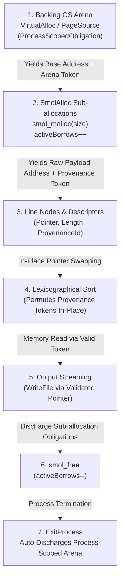

# Formal Memory Provenance & Dynamic Heap Allocation Model

In `gasm`, **Memory Provenance** is the formal discipline that attaches capability tokens, spatial bounds, and linear ownership typestates to raw machine pointers.

Spike 3 serves as the **First Spike of Memory Provenance**, establishing the bridge between unbounded external stream ingestion, dynamic OS page/heap allocation, in-memory pointer manipulation, and safe deallocation.

---

## 1. Core Principles of Memory Provenance



### 1.1 Spatial Bounds & Allocation Identity
Every allocated memory region $R = (\text{base}, \text{size}, \text{provenanceId})$ satisfies:
1. **Non-Overlap Invariant**: For two distinct active provenance tokens $p_1 \neq p_2$, their allocated address ranges $[base_1, base_1 + size_1)$ and $[base_2, base_2 + size_2)$ are disjoint.
2. **Dereference Guard**: Any memory load or store `read8(a)` or `write8(a, v)` is valid if and only if there exists an active provenance token $p$ such that $base(p) \le a < base(p) + size(p)$.

### 1.2 Hierarchical Provenance & Active Borrows
`smol_malloc` carves sub-allocations out of backing OS virtual memory pages (`VirtualAlloc` / `mmap`). To guarantee that a backing page is never prematurely released while sub-allocations remain live:
1. Backing OS arenas track an `activeBorrows : Nat` counter.
2. `smol_malloc` increments `activeBorrows`.
3. `smol_free` decrements `activeBorrows` upon returning the block to the freelist.
4. Backing page release has a linear precondition: `activeBorrows == 0`.

### 1.3 Process-Scoped Arena Retention & Auto-Discharge
For allocators such as `SmolAlloc`, backing OS virtual memory pages are retained for the entire duration of the process to serve future allocations without OS syscall thrashing. The backing page obligation is tagged with `isDroppableOnExit := true` (`ProcessScopedObligation`), which is automatically and soundly discharged by the kernel process teardown barrier upon `ExitProcess`.

---

## 2. Formal Provenance Typestates in Lean 4

```lean
/-- Unique identifier representing a discrete dynamic allocation block. -/
structure ProvenanceId where
  id : Nat
  deriving DecidableEq, Repr, Inhabited

/-- Formal memory region bounds and lifetime status. -/
structure ProvenanceBlock where
  provId    : ProvenanceId
  baseAddr  : Address
  sizeBytes : UInt64
  isLive    : Bool
  deriving DecidableEq, Repr, Inhabited

/-- Root backing allocation from OS page provider with active child borrow tracking. -/
structure ArenaPageToken where
  arenaId       : Nat
  baseAddress   : Address
  sizeBytes     : Nat
  activeBorrows : Nat := 0
  deriving DecidableEq, Repr, Inhabited

/-- Memory Provenance State tracking active allocations and discharged blocks. -/
structure ProvenanceState where
  allocations : List ProvenanceBlock := []
  nextId      : Nat := 1
```

---

## 3. Provenance Lifecycle in Spike 3 (Line Sorter)

| Phase | Action | Provenance Effect |
| :--- | :--- | :--- |
| **1. Ingestion** | Allocate backing arena via `VirtualAlloc` | Generates `ProcessPageObligation` (`isDroppableOnExit := true`) |
| **2. Chunk Streaming** | Read stdin chunks into `chunkBuf` | Allocates discrete `LineNode` and payload strings via `smol_malloc` (`activeBorrows++`) |
| **3. Permutation** | Bubble sort swaps descriptor pairs | Preserves spatial validity of all line pointers |
| **4. Emission** | Stream sorted lines to `WriteFile` | Guaranteed safe reads within active block bounds |
| **5. Deallocation** | Free sort table, nodes, and strings via `smol_free` | Frees all sub-blocks (`activeBorrows--`), discharging all strict obligations |
| **6. Termination** | Exit via `ExitProcess(0)` | Auto-discharges process-scoped backing page obligation |
