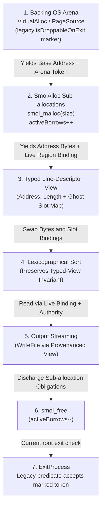

# Formal Memory Provenance & Dynamic Heap Allocation Model

**Status (2026-08-28): design sketch informed by allocator code.** The current allocator and
memory hooks do not provide generative region identities, provenanced pointer types, linear
ownership, or borrow-checked dereference. The required design is `docs/MEMORY_MODEL.md` §6 and
stages M1/M4. Fenced Lean and lifecycle tables below are intended shapes, not current declarations
unless a source file is cited explicitly.

In the target model, **memory provenance** attaches a fresh region identity and spatial bounds to a
pointer, while authority and lifetime resources live separately in an indexed program context.

Spike 3 exercises external stream ingestion, dynamic allocation, pointer manipulation, and
deallocation. It is motivation and a future migration target; it does not establish the missing
provenance and linear-ownership theorems.

---

## 1. Core Principles of Memory Provenance



The v1 boundary is explicit: memory bytes do not contain provenance, and reloading an address does
not recreate a pointer or ownership token. A line table therefore needs a registered typed view
whose ghost slot map associates each address field with a live payload `RegionId`; swapping table
entries must permute that map with the bytes. Generic ownership-carrying pointer fields and
recursive/existential heap views are deferred. See `docs/MEMORY_MODEL.md` §6.1.1.

### 1.1 Spatial Bounds & Allocation Identity
Every allocated memory region in the required model must satisfy:
1. **Hierarchical Non-Overlap Invariant**: Two distinct live regions that are incomparable in the
   allocation tree have disjoint ranges. An arena and its child intentionally overlap, but ancestor
   ordinary-access authority is frozen while a live descendant owns that subrange.
2. **Dereference Guard**: A memory load or store requires a pointer or typed-view slot retaining the
   live allocation identity, an in-bounds non-wrapping range proof, and the matching access authority
   in the current indexed context. Address membership alone is insufficient.

### 1.2 Hierarchical Provenance & Active Borrows
`smol_malloc` carves sub-allocations out of backing OS virtual memory pages (`VirtualAlloc` / `mmap`). To guarantee that a backing page is never prematurely released while sub-allocations remain live:
1. Backing OS arenas authoritatively track a finite set of uniquely identified live child
   allocations.
2. `smol_malloc` creates and registers one fresh child identity while freezing overlapping ancestor
   authority.
3. `smol_free` consumes that child's authority and removes exactly that identity before returning
   the block to the freelist.
4. Backing-page release requires the live-child set to be empty. An `activeBorrows : Nat` field may
   be a derived runtime count, but a scalar count alone is not the proof resource.

### 1.3 Arena Retention and the Legacy Exit Marker

Allocators such as `SmolAlloc` may retain backing OS virtual-memory pages for reuse until their
owning process/address-space lifetime ends. Current code can tag the value-level token with
`isDroppableOnExit := true`; `ObligationLedger.isValidAtExit` only tests that Boolean. It does not
perform a release, identify a process, prove a kernel teardown transition, or justify dropping the
same resource on thread exit.

The selected M6-PL/M6-PW process model must instead index a private virtual-memory lease by the owning
`ProcessInstanceId`, address-space/image generation and `FailureDomainId`, then prove the selected
platform's resource-specific exit disposition. A normal platform teardown may invalidate a private
mapping without an explicit `VirtualFree`/`munmap` call, but shared mappings, external backing,
duplicated handles and device/remote effects may survive. Forced termination likewise supplies no
global discharge theorem. Until that model exists, the marker is legacy bookkeeping rather than
promotion evidence for provenance or lifecycle safety.

---

## 2. Formal Provenance Typestates in Lean 4

```lean
/-- Opaque, generative identity; its constructor is not exported. -/
opaque ProvenanceId : Type

/-- Non-authoritative metadata for one identity known live in a ProvenanceState. -/
structure LiveRegionView where
  provId    : ProvenanceId
  baseAddr  : Address
  sizeBytes : UInt64
  parent     : Option ProvenanceId

/-- Opaque authoritative allocation forest; no public next-id or liveness setter. -/
opaque ProvenanceState : Type

opaque allocateFresh :
  ProvenanceState → Option ProvenanceId → Address → UInt64 →
    Except AllocError (ProvenanceState × LiveRegionView)

opaque releaseExact :
  ProvenanceState → ProvenanceId → Except ReleaseError ProvenanceState
```

This is an interface sketch, not a representation proposal. Only `allocateFresh` may create an
identity, its contract proves global freshness and the hierarchical range invariant, and
`releaseExact` consumes the matching live authority after all descendants/loans are gone. A
`LiveRegionView` is copyable metadata, not permission to dereference. The implementation must not
export numeric constructors, resettable `nextId`, Boolean liveness setters, or an `Inhabited`
instance that can forge a live identity.

---

## 3. Provenance Lifecycle in Spike 3 (Line Sorter)

| Phase | Action | Provenance Effect |
| :--- | :--- | :--- |
| **1. Ingestion** | Allocate backing arena via `VirtualAlloc` | Generates a legacy value-level token marked `isDroppableOnExit := true`; this is not yet process-indexed cleanup authority |
| **2. Chunk Streaming** | Read stdin chunks into `chunkBuf` | Allocates discrete payload regions and registers each address field in the line table's typed-view slot map |
| **3. Permutation** | Bubble sort swaps descriptor pairs | Permutes descriptor bytes and ghost slot bindings together, preserving region identity |
| **4. Emission** | Stream sorted lines to `WriteFile` | Uses the typed-view binding plus current read authority for in-bounds payload access |
| **5. Deallocation** | Free sort table, nodes, and strings via `smol_free` | Consumes each exact child identity/authority and discharges all strict obligations |
| **6. Termination** | Exit via `ExitProcess(0)` | Current exit predicate accepts the marked token; M6-PW must specify the private mapping's semantic exit disposition and M6-PW-X must prove the native `ExitProcess`/teardown lowering |
