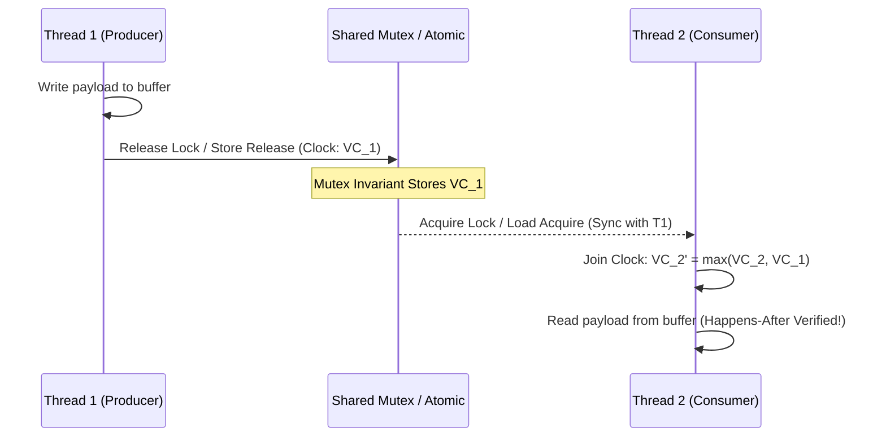

# Linear Obligations, Monotonic Causality & Synchronizes-With

When low-level systems code executes across threads, OS kernels, and MMIO hardware devices, it must guarantee two orthogonal safety properties:
1. **Linear Obligation Tracking**: Resources (file descriptors, database connections, locks, hardware channels) must be cleaned up along all control paths, preventing leaks.
2. **Monotonic Causal Ordering**: Concurrency operations across threads or asynchronous device queues must establish formal happens-before relationships, preventing data races and memory ordering bugs.

---

## 1. The Linear Obligation Ledger

In `gasm`, `ComposedState` contains an explicit `obligations : List Obligation` tracking open resources:

```lean
inductive ObligationType where
  | MustCloseFD (fd : Nat)
  | MustUnlockMutex (mutexAddr : Nat)
  | MustFreeMemory (addr : Nat) (size : Nat)
  | MustCommitOrAbortTx (txId : Nat)
  | MustResetDevice (devId : Nat)

structure Obligation where
  type              : ObligationType
  acquiredTimestamp : Nat
  isDroppableOnExit : Bool

def ObligationLedger := List Obligation
```

### 1.1 Multiset Obligation Subtraction (`List.eraseAll`)

When an operation discharges obligations, `gasm` uses exact multiset subtraction rather than naive set removal, preventing double-free or ghost obligation duplication exploits:

```lean
def List.eraseAll {α : Type} [DecidableEq α] (xs : List α) (toRemove : List α) : List α :=
  toRemove.foldl (fun acc x => acc.erase x) xs
```

---

## 2. Obligation Preservation across Control Flow Transitions

### 2.1 Function Returns (`CpuTerminator.ret`)
A function cannot issue `ret` while holding un-exported local obligations:

```lean
inductive CpuTerminator (Arch : Type) [TargetArch Arch] {S : Type} (s_exit : ComposedState Arch S) where
  | ret (exportedObligations : List Obligation) (bytesToPop : UInt16 := 0)
        (h_zero   : s_exit.stackDepth = 0)
        (h_match  : s_exit.obligations = exportedObligations)
        (h_callee : CalleeDiscipline Arch s_exit) : CpuTerminator Arch s_exit
```

### 2.2 Unconditional Exits (`CpuTerminator.sysExit`)
When an application terminates via `exit(code)` or halts, all remaining obligations must have `isDroppableOnExit = true`:

```lean
  | sysExit (exitCode : UInt8)
            (h_droppable : ∀ o ∈ s_exit.obligations, o.isDroppableOnExit) : CpuTerminator Arch s_exit

  | halt    (h_droppable : ∀ o ∈ s_exit.obligations, o.isDroppableOnExit) : CpuTerminator Arch s_exit
```

---

## 3. Monotonic Causality & Vector Clocks

To model concurrent execution across CPU cores, GPU threads, and DMA devices, `gasm` embeds **Vector Clocks**:

```lean
def ThreadId := Nat

structure VectorClock where
  clock : ThreadId → Nat

def VectorClock.happensBefore (vc₁ vc₂ : VectorClock) : Prop :=
  (∀ t, vc₁.clock t ≤ vc₂.clock t) ∧ (∃ t, vc₁.clock t < vc₂.clock t)

def VectorClock.join (vc₁ vc₂ : VectorClock) : VectorClock :=
  { clock := fun t => max (vc₁.clock t) (vc₂.clock t) }

def VectorClock.tick (vc : VectorClock) (t : ThreadId) : VectorClock :=
  { clock := fun tid => if tid = t then vc.clock tid + 1 else vc.clock tid }
```

### 3.1 Inter-Thread Causal Handover & Synchronizes-With

When Thread 1 releases a lock (`atomic_store_release`) and Thread 2 acquires the lock (`atomic_load_acquire`), a **synchronizes-with** edge is established:



```lean
def acquireLockSoundness (s : ComposedState Arch InState) (mutex : MutexState) : ComposedState Arch OutState :=
  let newClock := VectorClock.join s.causalClock mutex.lastReleaseClock
  { s with causalClock := newClock }
```
