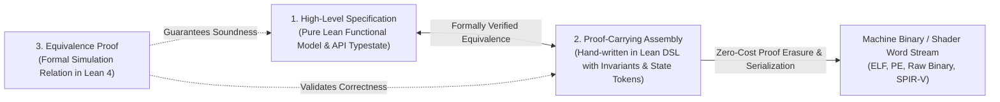

# `gasm`: Generated Assembly Framework in Lean 4

`gasm` is a formal framework in Lean 4 for writing **proof-carrying assembly routines**, expressing **high-level behavioral specifications**, and formally proving the **mathematical equivalence** between the two across multiple hardware, shader, and OS targets.

**Implementation status:** this README describes the intended framework as well as current pieces.
Universal memory-capability enforcement and concurrent x86/AArch64 semantics are not implemented;
their honest current inventory and canonical completion plan are in
[**`docs/MEMORY_MODEL.md`**](MEMORY_MODEL.md) §2 and §14.

---

## Vision: The Specification Is the Program

`gasm` is built on three insights (see [**`docs/VISION.md`**](VISION.md) for the full statement and consequences):

- **Insight 0 — Implementation code is discardable.** Concrete implementation text (Rust, C, assembly) is a regenerable artifact; implementation languages are dead languages. The durable artifact is the formal boundary: specs, models, and proofs.
- **Insight 1 — Programs are formal boundaries.** What matters is large-scale system correctness: a program is a high-level formal statement of what MUST be true of any implementation.
- **Insight 2 — Agents generate the low level.** AI agents can creatively and rapidly produce assembly and other low-level artifacts when given a formal machine model and formal boundaries to satisfy.

The consequence: **the validation gate is the product**. Generated implementations are untrusted by construction; trust lives in universally-quantified, kernel-checked contracts (Laws 9–10), differentially-validated machine/OS models, capability-enforced memory safety (Law 11), and checked-in performance budgets that let agents optimize assembly without executing it.

---

## Core Philosophy: The Tripartite Verification Paradigm

Unlike traditional automated compilers, `gasm` does not perform automated lowering or heuristics-based register allocation. Instead, `gasm` provides a rigorous environment for verified systems programming where performance-critical machine routines are hand-authored, annotated with explicit invariants and API state witnesses, and proven equivalent to pure high-level Lean models.

### The Three Pillars

1. **High-Level Model (`Spec`)**:
   - A pure, idiomatic Lean 4 function, state transition system, or monadic specification representing the intended algorithm and API protocol contracts.
2. **Hand-Written Proof-Carrying Assembly (`Program`)**:
   - Assembly routines hand-authored using `gasm`'s typed assembly DSL (`BlockM`).
   - Embeds machine invariants (discrete memory capabilities, stack disciplines, register preservation) and API state witness tokens.
3. **Formal Equivalence Proof (`Proof`)**:
   - A rigorous Lean 4 proof establishing observational equivalence / forward simulation between the assembly routine's step-by-step operational semantics on `MachineState` and the high-level `Spec`.

---

## Spikes & Continuous Integration

Progress in `gasm` is driven by continuous, end-to-end executable **Spikes** connecting formal Lean models directly to real hardware binaries. Spikes 1–5 each ship for both the Windows x64 (PE32+) and WebAssembly/WASI targets; Spike 6 does not — see its own entry below:
- **Spike 1**: "Hello, World!" (PE32+ Kernel32 IAT / WASI `fd_write`).
- **Spike 2**: Fibonacci sequence printer (loops, division-based itoa, hand-proved loop invariants).
- **Spike 3**: Stdin line sorter (`Stdlib.SmolAlloc` dynamic memory, streaming I/O, provenance tracking).
- **Spike 4**: Continuous HTTP 1.1 server (WinSock2 / WASI socket extensions, per-route equivalence).
- **Spike 5**: GZIP/GUNZIP utility over `Stdlib.Zlib` (RFC 1950/1951/1952, differential fuzzing vs. Python oracle).
- **Spike 6 (planned)**: Headless parametric compute pipeline (`Stdlib.Png`, SPIR-V/Vulkan 1.3, compute-only) — Windows x64 + Vulkan only, no Wasm/DX12/WebGPU (see `docs/GRAPHICS_ARCHITECTURE.md` §2).
- **Spike 7 (planned)**: Interactive windowed swapchain & event loop.
- **Spike 8 (planned)**: Cross-architecture multithreading across x86-64 and AArch64, hosted and
  bare-metal, including borrowing, locks, futex/parking, and causal traces.

See [**`docs/SPIKES.md`**](SPIKES.md) for roadmap and continuous verification details.

---

## Software Modeling SDLC: From Typeclasses to Assembly

Software in `gasm` is engineered through a 4-stage pipeline:
1. **Pure Domain Modeling**: Model abstract capabilities and micro-theorems as pure Lean typeclasses.
2. **Theorem Weaving**: Prove end-to-end macro system theorems by composing domain typeclasses.
3. **Architectural Decomposition**: Cut the proven macro system into natural component boundaries (**Seams**).
4. **`gasm` Assembly Realization**: Realize each component as a verified `BlockM` assembly routine proven equivalent to its pure specification.

See [**`docs/SOFTWARE_MODELING_SDLC.md`**](SOFTWARE_MODELING_SDLC.md) for full details.

---

## Citation Laws & Bidirectional Review Protocol

To guarantee mathematical integrity and eliminate ad-hoc inventions, the repository is governed by fourteen laws (canonical statements in [**`docs/REVIEW.md`**](REVIEW.md)):
- **Law 1 (No Invention)**: Every Lean item is completely defined by its attached `/- REF: <doc>#<section> -/` notes.
- **Law 2 (100% Realization)**: Once referenced, a markdown section must be 100% implemented by the Lean codebase.
- **Law 3 (Automated Backlog Tracking)**: Unreferenced sections represent the unimplemented backlog, verified automatically via `scripts/check_refs.py`.
- **Law 4 (External Reference Ingestion)**: Official external documentation (hardware manuals, OS API docs, binary specifications) must be cited from an authoritative source, not invented.
- **Law 5 (Stop-and-Design Invariant)**: When a spike demands unmodeled behavior, stop and design it thoroughly first.
- **Law 6 (Reference Reproducibility)**: Every cited external document is a hash-pinned `references.json` registry entry, independently refetchable and verified via `scripts/check_references.py --offline`/`--refresh` -- no third-party prose is vendored into the repository (see `docs/REFERENCE_INDEX.md`).
- **Law 7 (Target Separation & Proof Purity)**: The `Spec`/`Program`/`Equivalence` trio stays clean; infrastructure lives in `Gasm` itself.
- **Law 8 (Anti-Facade)**: No dead abstractions; ground-instance checks are labeled `*_inst`, never presented as soundness theorems.
- **Law 9 (Anti-Pointwise)**: Whole-program contracts are universally quantified over all environment inputs; single-vector verification is prohibited.
- **Law 10 (Kernel-Checked Gates)**: `native_decide` is admissible only for propositions exhaustively quantified over their entire finite domain; infinite-domain claims require structural proof.
- **Law 11 (Memory Capability Mandate)**: Memory-touching instructions must carry capability proofs and fail to assemble without them.
- **Law 12 (Connection Theorems)**: Duplicated encodings of the same fact must be linked by proved equivalence theorems.
- **Law 13 (Findings Become Gates)**: Every defect found by review, fuzzing, or debugging must terminate in a mechanical prevention of its entire class, not just a fix of the instance.
- **Law 14 (Calibration Data Governance)**: measured data is a third reference class — checked in, harness-regenerable, provenance-stamped, never hand-edited; coefficients cite calibration artifacts instead of carrying bare literals.

---

## Supported & Eventual Targets

| Category | Targets | Design Specification |
| :--- | :--- | :--- |
| **Architectures (ISAs)** | x86-64 | [`docs/TARGETS/X86_64.md`](TARGETS/X86_64.md) |
| | x86-32 (IA-32 Protected Mode) | [`docs/TARGETS/X86_32.md`](TARGETS/X86_32.md) |
| | x86 Real Mode (16-bit) | [`docs/TARGETS/X86_REALMODE.md`](TARGETS/X86_REALMODE.md) |
| | ARM (AArch64 & AArch32) | [`docs/TARGETS/ARM.md`](TARGETS/ARM.md) |
| **Shaders & Virtual ISAs** | SPIR-V | [`docs/TARGETS/SPIRV_VULKAN.md`](TARGETS/SPIRV_VULKAN.md) |
| | WebAssembly (Wasm 2.0) | [`docs/TARGETS/WASM.md`](TARGETS/WASM.md) |
| **Host APIs & Runtimes** | WASI Preview 1 | [`docs/TARGETS/WASI.md`](TARGETS/WASI.md) |
| **Host APIs & Runtimes** | Vulkan Host API | [`docs/TARGETS/SPIRV_VULKAN.md`](TARGETS/SPIRV_VULKAN.md) |
| **Operating Systems** | Linux (SysV Syscall ABI, ELF) | [`docs/TARGETS/LINUX.md`](TARGETS/LINUX.md) |
| | Windows (MS x64 Fastcall, PE/COFF) | [`docs/TARGETS/WINDOWS.md`](TARGETS/WINDOWS.md) |
| **Execution Environments** | Bare Metal (Freestanding, MMIO, Paging) | [`docs/TARGETS/BARE_METAL.md`](TARGETS/BARE_METAL.md) |

---

## Documentation Index

- [**Vision**](VISION.md): The three insights, the gate-is-the-product trust model, modular contract decomposition, and performance modeling as the optimizing-compiler superpower.
- [**Canonical Memory & Concurrency Model**](MEMORY_MODEL.md): Common event graph, x86-TSO and
  AArch64 weak memory, borrowing, locks/obligations, scheduler, futex/Windows parking, and both
  bare-metal SMP paths, with staged exit criteria.
- [**Spikes & Integration Roadmap**](SPIKES.md): Spike progression, continuous testing, and stop-and-design invariant.
- [**Review Protocol & Citation Laws**](REVIEW.md): `REF:` syntax, repository laws, and automated backlog tool.
- [**Continuous Integration**](CI.md): the GitHub Actions gate inventory, Windows/Linux platform matrix, caching soundness argument, and cost split.
- [**Software Modeling & Architecture SDLC**](SOFTWARE_MODELING_SDLC.md): Typeclasses, theorem weaving, seams, and lowering.
- [**Global Architecture**](ARCHITECTURE.md): System architecture, vertical slices, and common helper libraries.
- [**API State Models**](API_STATE_MODELS.md): Current state/contract substrate and the explicitly
  unimplemented indexed protocol surface.
- [**Linear Obligations & Causality**](OBLIGATIONS_AND_CAUSALITY.md): Current generic tokens and
  vector clocks versus the required typed obligations and labelled causal relations.
- [**Stack Discipline & Jump Typing**](STACK_DISCIPLINE.md): Stack-indexed basic blocks and local jump obligations automating stack preservation.
- [**Composable Boundary ABI Contexts**](ABI_CONTEXT.md): Per-boundary ghost and runtime capabilities, placement, composition, scoped allocation accounting, cancellation, and zero-overhead erasure.
- [**Proof-Carrying Assembly DSL**](PROOF_CARRYING_ASSEMBLY.md): Current typed assembly pieces and
  design-only capability/memory-discipline boundaries.
- [**Equivalence Proofs**](EQUIVALENCE_PROOFS.md): Split Theorem Principle (`Functional Equivalence`, `Callability & ABI`, `Memory Safety`) and layered function proof composition.
- [**Target Specifications**](TARGETS/TARGET_MODEL.md): Target models, calling conventions, and platform specifics.
