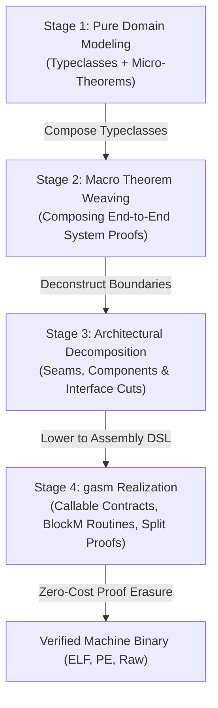

# Software Modeling & Architecture SDLC: From Typeclass Theorems to `gasm`

This document specifies the software engineering and verification methodology for modeling systems in `gasm`: proceeding from **Pure Typeclasses & Micro-Theorems**, through **Theorem Weaving & Macro System Proofs**, into **Architectural Decomposition (Seams & Components)**, and finally realizing the design as **Concrete `gasm` Proof-Carrying Assembly**.

**Status**: this is a methodology document. Every Lean block below is a **worked illustration** of
the stage it appears in — the `KeyValueStore`, the signed-message verifier, the transaction
manager — chosen for pedagogy, not drawn from the tree. None of these typeclasses or theorems
exists in `Gasm/`, `Stdlib/` or `Spikes/`, and none is a planned deliverable; they are the shape a
real model takes, written out in full so the pipeline's four stages have something concrete to
operate on. Read every declaration here as "this is what such a thing looks like", never as "this
is proved".

---

## 1. The 4-Stage Verification & Engineering Pipeline



---

## 2. Stage 1: Pure Domain Modeling (Typeclasses & Micro-Theorems)

In the initial stage, domain concepts are modeled without regard to machine registers, stack pointers, or calling conventions. Systems are defined as **pure Lean 4 Typeclasses** paired with **Micro-Theorems**:

```lean
/-- Abstract Key-Value Storage Typeclass -/
class KeyValueStore (Store : Type) where
  get   : Store → Key → Option Value
  put   : Store → Key → Value → Store
  del   : Store → Key → Store

/-- Storage Micro-Theorems -/
theorem get_after_put (s : Store) [KeyValueStore Store] (k : Key) (v : Value) :
  KeyValueStore.get (KeyValueStore.put s k v) k = some v

theorem get_after_del (s : Store) [KeyValueStore Store] (k : Key) :
  KeyValueStore.get (KeyValueStore.del s k) k = none
```

```lean
/-- Cryptographic Hash & Signature Typeclass -/
class CryptoProvider (Crypto : Type) where
  sha256 : Bytes → Hash
  sign   : PrivateKey → Bytes → Signature
  verify : PublicKey → Bytes → Signature → Bool

/-- Crypto Micro-Theorem -/
theorem verify_signed_message [CryptoProvider Crypto] (priv : PrivateKey) (msg : Bytes) :
  CryptoProvider.verify (pubKey priv) msg (CryptoProvider.sign priv msg) = true
```

---

## 3. Stage 2: Theorem Weaving (Proving the Macro System)

Once domain typeclasses and micro-theorems are established, they are **woven together** into higher-level macro specifications. You prove the end-to-end correctness of the *entire composed system* in pure Lean:

```lean
/-- High-Level Verified Transaction Processing System -/
def processTransaction [KeyValueStore Store] [CryptoProvider Crypto]
    (s : Store) (tx : SignedTransaction) (ledgerKey : Key) : Option Store := do
  guard (CryptoProvider.verify tx.senderPubKey tx.payload tx.signature)
  let currentBalance ← KeyValueStore.get s ledgerKey
  guard (currentBalance ≥ tx.amount)
  let s₁ := KeyValueStore.put s ledgerKey (currentBalance - tx.amount)
  let s₂ := KeyValueStore.put s₁ tx.recipientKey tx.amount
  pure s₂

/-- End-to-End System Macro-Theorem: Value Conservation -/
theorem system_value_conservation [KeyValueStore Store] [CryptoProvider Crypto]
    (s : Store) (tx : SignedTransaction) (k₁ k₂ : Key) (s' : Store) :
  processTransaction s tx k₁ = some s' →
  totalBalance s' = totalBalance s := by
  intro h_tx
  -- Weave together get_after_put and arithmetic lemmas to prove macro property!
  sorry
```

At this stage, the business logic and system safety guarantees are **100% mathematically proven** at the abstract functional level.

---

## 4. Stage 3: Architectural Decomposition (Seams & Components)

With the total macro-system proved sound, we **architect (deconstruct)** the system into concrete modular components that naturally work together across clear boundaries (**Seams**):

```
+-------------------------------------------------------------------------+
|                  Top-Level Component: TransactionManager                 |
|  - Implements: processTransaction logic                                 |
|  - Consumes Seam 1: StorageSeam                                         |
|  - Consumes Seam 2: CryptoSeam                                          |
+-------------------------------------------------------------------------+
                    |                                   |
           [Seam 1: StorageSeam]               [Seam 2: CryptoSeam]
                    |                                   |
                    v                                   v
+------------------------------------+  +------------------------------------+
|     Component: LMDBStorageEngine   |  |      Component: Ed25519Engine     |
| - Owns physical DB file descriptors|  | - Implements SIMD / AVX2 crypto    |
| - Exports: get, put, del           |  | - Exports: sha256, verify          |
+------------------------------------+  +------------------------------------+
```

---

## 5. Stage 4: Realization in `gasm` Proof-Carrying Assembly

Each decomposed component is implemented as a set of structured, hand-written `BasicBlock` routines using `gasm` constructs:

```
                            +-------------------------------+
                            |   Architectural Component     |
                            +-------------------------------+
                                            |
                                            v
     +-----------------------------------------------------------------------------+
     |                       gasm Concrete Realization                             |
     +-----------------------------------------------------------------------------+
     | 1. Seam Interface     --> Callable Boundary Contract with Linear Obligations|
     | 2. Pure Lean Spec     --> Spec Functional Model (processTransaction)       |
     | 3. Hand-written ASM   --> Structured BasicBlock CFG (SESE Blocks)           |
     | 4. Verification       --> Tripartite Split Theorems (Equivalence, ABI, Mem) |
     +-----------------------------------------------------------------------------+
                                            |
                                            v
                            +-------------------------------+
                            |  Zero-Cost Proof Erasure &    |
                            |   Optimal Machine Binary      |
                            +-------------------------------+
```

### 5.1 Structured Single-Entry Single-Exit (SESE) Basic Block CFG

In `gasm`, branching **never occurs as sequential statements in `BlockM`**. All control flow transfers are mediated strictly through `BasicBlock` terminators (`CpuTerminator.jcc`):

```lean
/-- Block 1: Verify cryptographic signature -/
def bb_verify_tx (tx : SignedTransaction) : BasicBlock x86_64 InState := {
  label := "bb_verify_tx"
  expectedDepth := 0
  entryProof := fun s => s.machine.rsp % 16 == 0
  body := ⟨OutState, do
    mov rdi, tx.pubKey
    mov rsi, tx.payload
    asmCall symEd25519Verify (by decide)
    test rax, rax
    pure (CpuTerminator.jcc .ZeroFlag (bb_tx_rejected tx) (bb_balance_check tx)
           (by decide) (by decide) (by decide) (by decide) (by decide) (by decide))⟩
}

/-- Block 2: Check balance -/
def bb_balance_check (tx : SignedTransaction) : BasicBlock x86_64 OutState := {
  label := "bb_balance_check"
  expectedDepth := 0
  entryProof := fun s => s.machine.getReg .rax ≠ 0
  body := ⟨OutState, do
    mov rdi, tx.ledgerKey
    asmCall symDbGet (by decide)
    cmp rax, tx.amount
    pure (CpuTerminator.jcc .BelowFlag (bb_insufficient_funds tx) (bb_commit_tx tx)
           (by decide) (by decide) (by decide) (by decide) (by decide) (by decide))⟩
}

/-- Block 3: Apply balance mutation -/
def bb_commit_tx (tx : SignedTransaction) : BasicBlock x86_64 OutState := {
  label := "bb_commit_tx"
  expectedDepth := 0
  entryProof := fun s => s.machine.getReg .rax ≥ tx.amount
  body := ⟨OutState, do
    sub rax, tx.amount
    mov rsi, rax
    asmCall symDbPut (by decide)
    pure (CpuTerminator.ret [] 0 (by decide) (by decide) (by decide))⟩
}

/-- Block 4: Transaction rejection epilogue -/
def bb_tx_rejected (tx : SignedTransaction) : BasicBlock x86_64 OutState := {
  label := "bb_tx_rejected"
  expectedDepth := 0
  entryProof := fun s => s.machine.getReg .rax == 0
  body := ⟨OutState, do
    mov rax, (1 : Imm64) -- Error code
    pure (CpuTerminator.ret [] 0 (by decide) (by decide) (by decide))⟩
}
```

#### 2. Proving Component Equivalence against the Macro Spec
The component CFG's equivalence is proved using `gasm`'s Tripartite Split Theorems:

```lean
/-- Theorem 1: Functional Equivalence directly proves that the assembly CFG simulates processTransaction -/
theorem tx_manager_functional_equivalence :
  ∀ (m₀ : MachineState x86_64) (s : Store) (tx : SignedTransaction),
    runUntilHalt tx_manager_program m₀ steps = some m_final ∧
    m_final.readState = processTransaction s tx tx.ledgerKey
```

---

## 6. Summary of Benefits

1. **Top-Down Mathematical Integrity**: You prove total system correctness at the high-level typeclass tier before writing a single line of assembly.
2. **Natural Architectural Seams**: Deconstruction creates clean, decoupled component boundaries informed by the proved mathematical dependencies.
3. **Zero Impedance Mismatch**: Component seam contracts map 1-to-1 to `gasm`'s `Callable` typeclass and `BlockM` typestates.
4. **Optimal Bare-Metal Performance**: The resulting software runs as bare-metal machine code with hand-optimized register scheduling and **zero proof runtime overhead**.
