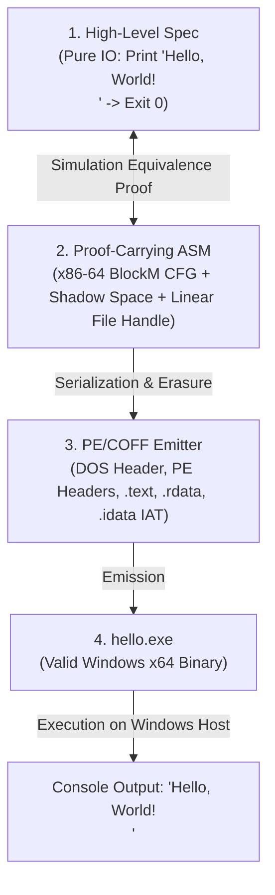

# Spikes Methodology & Integration Roadmap

In `gasm`, **Spikes** are minimal, fully vertical, end-to-end executable artifacts that drive progress, force architectural integration across all layers, and ensure that theoretical formal proofs connect directly to real operating systems and silicon hardware.

Spikes are continuously built, verified, and executed as part of automated CI.

---

## 1. The Spike Discipline & Core Laws

> **Note**: The canonical, complete enumeration of repository laws lives in [`docs/REVIEW.md`](REVIEW.md) (Laws 1–14). The three restated below are the spike-facing subset (they correspond to Laws 5, 4, and 7 respectively); if this section and `REVIEW.md` ever disagree, `REVIEW.md` wins.

### 1.1 The Stop-and-Design Invariant
> **Whenever a spike demands any concept, instruction, ABI rule, binary header, or API contract that is not yet fully designed in the repository, implementation MUST STOP immediately.**
> The missing specification must be authored, reviewed, and committed to `docs/` before any Lean code for that spike is written.

### 1.2 The External Reference Ingestion Law
> **Official reference documentation (e.g. Intel/AMD hardware manuals, Microsoft Win32 API documentation, PE/COFF specification) must be brought into the repository directly as authoritative sources.**
> We do NOT write or synthesize ad-hoc approximations of hardware or external OS specifications; we import the official, authoritative reference texts so our formal models cite genuine ground truth.

### 1.3 The Authoring Ergonomics Mandate
> **The primary user-facing objective of `gasm` is that it MUST be exceptionally clean and effortless to author the core spike trio: `Spec.lean`, `Program.lean`, and `Equivalence.lean`.**
> Contributors must actively work to minimize distractions and boilerplate in that trio by aggressively relocating infrastructure responsibilities (instruction address decoding, branch/loop execution, calling convention state setup, binary emission) into `Gasm` itself.

---

## 2. Spike 1: Windows x64 "Hello World!" PE Binary

**Goal**: Hand-author and formally verify a complete 64-bit Windows PE executable that outputs `"Hello, World!\n"` to stdout and exits cleanly with status `0`.



### 2.1 Architectural Capabilities Forced by Spike 1

| Component | Forced Capabilities |
| :--- | :--- |
| **x86-64 Machine Model** | `RAX, RCX, RDX, R8, R9, RSP, RBP`, `sub rsp, 40`, `mov`, `lea`, `call`, `xor ecx, ecx` |
| **Data Sections & Memory** | `.rdata` string literal `"Hello, World!\n"`, discrete capability tokens |
| **Microsoft x64 Fastcall ABI** | 32-byte caller shadow space + 8-byte 5th argument (`lpOverlapped = 0`), 16-byte stack alignment ($RSP \equiv 0 \pmod{16}$ before `CALL`), `RCX/RDX/R8/R9` argument staging |
| **Windows Win32 API Contracts** | `GetStdHandle` (`STD_OUTPUT_HANDLE = -11`), `WriteFile` (5 arguments: `RCX`, `RDX`, `R8`, `R9`, `[RSP + 32]`), `ExitProcess` (terminating with `CpuTerminator.sysExit`) |
| **PE/COFF Serialization** | MZ DOS header, PE Signature (`PE\0\0`), File Header, Optional Header 64 (`0x20B`, Subsystem `IMAGE_SUBSYSTEM_WINDOWS_CUI`), Section Table (`.text`, `.rdata`, `.idata`), Import Address Table (IAT) binding to `KERNEL32.dll` |

---

## 3. Spike Progression Roadmap

```
+---------------------------------------------------------------------------------------------------+
| Spike 1: Hello World Executable (Windows x64 Fastcall PE/COFF & WebAssembly WASI)                 |
+---------------------------------------------------------------------------------------------------+
                                                  |
                                                  v
+---------------------------------------------------------------------------------------------------+
| Spike 2: Recursive & Iterative Fibonacci (Pure Control Flow, Memory & Trace Equivalence)          |
+---------------------------------------------------------------------------------------------------+
                                                  |
                                                  v
+---------------------------------------------------------------------------------------------------+
| Spike 3: Streaming Sort Lines (Dynamic Allocator SmolAlloc, In-Memory Quicksort, Linear I/O)     |
+---------------------------------------------------------------------------------------------------+
                                                  |
                                                  v
+---------------------------------------------------------------------------------------------------+
| Spike 4: Dual-Target HTTP 1.1 Server (WinSock2 WS2_32.dll, WASI Sockets, Linear Socket Handles)   |
+---------------------------------------------------------------------------------------------------+
                                                  |
                                                  v
+---------------------------------------------------------------------------------------------------+
| Spike 5: GZIP / GUNZIP Streaming Utility (Stdlib.Zlib, RFC 1951 DEFLATE, RFC 1952, CRC32)         |
+---------------------------------------------------------------------------------------------------+
                                                  |
                                                  v
+---------------------------------------------------------------------------------------------------+
| Spike 6: Headless Parametric Compute Pipeline (Stdlib.Png, SPIR-V, Vulkan 1.3, compute-only)      |
+---------------------------------------------------------------------------------------------------+
                                                  |
                                                  v
+---------------------------------------------------------------------------------------------------+
| Spike 7: Interactive Windowed Swapchain & Event Loop (Win32 Window, HTML5 Canvas, Presentation)  |
+---------------------------------------------------------------------------------------------------+
                                                  |
                                                  v
+---------------------------------------------------------------------------------------------------+
| Spike 8: Multithreading (x86-TSO Litmus Battery, XCHG Spinlock, Windows/Linux Threads, SMP)       |
+---------------------------------------------------------------------------------------------------+
```

Spike 8 is design-stage only (`docs/SPIKES/SPIKE8_MULTITHREADING.md`, tasks MT1–MT6);
its ordering relative to Spikes 6/7 in this diagram is roadmap numbering, not a build
dependency — the multithreading and graphics paths are independent.

---

## 4. Continuous Spike Testing & Verification Protocol

1. **Formal Proof Typechecking**: `lake build` verifies that all specifications, proof-carrying assembly routines, and equivalence theorems typecheck with zero errors and zero unapproved axioms.
2. **Citation Audit**: `python scripts/check_refs.py` validates that all Lean items cite in-tree documentation and reports progress on the specification backlog.
3. **Binary Emission & Hash Verification**: The compiled Lean tool executes to emit physical binaries (e.g. `spikes/spike1_hello_windows/hello.exe`).
4. **Hardware Execution Check**: The emitted binary is executed on the target host (e.g. Windows x64 powershell), capturing stdout and verifying exact string matching and exit code `0`.
5. **Host Wasm Runtime Absence Is a Failure, Not a Pass**: for Wasm spikes, the in-Lean formal trace check (step 1) is never treated as a substitute for actually executing the emitted binary on a host engine. Each spike's `Wasm/Test.lean` uses the shared `Spikes.Common.WasmHostRunner` helper to probe `node`, `wasmtime`, `wasmer`, and `deno` in turn; the resulting exit code distinguishes three outcomes so CI/tooling can tell them apart: exit `0` = in-Lean check passed AND a host runner executed and verified the binary; exit `1` = a genuine verification failure (in-Lean mismatch, or a found runner produced the wrong output); exit `2` = no host Wasm CLI runner was found on PATH at all — host-runtime validation did NOT run, and this must be reported honestly rather than as a synthesized "100% sound" success (Law 13(4)).
