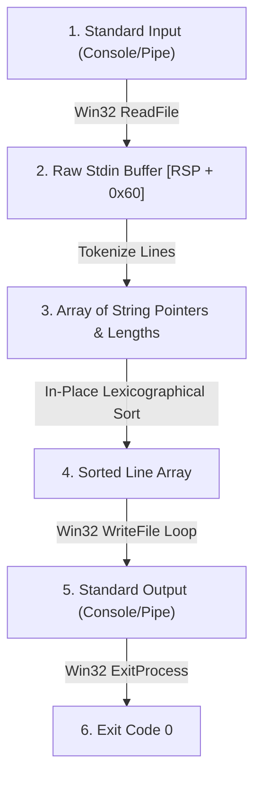

# Spike 3: Verified Stdin Lexicographical Sort & Windows PE64 Executable

**Status (2026-08-29): implemented vertical slice with narrow verification coverage.** The
native and Wasm lowerings retain concrete checked trace-equality facts only for literal inputs;
these are not proofs over arbitrary `ByteArray` input. The source-level streaming decoder and
the ghost line-world establish reusable universal logical facts, including a sealed-preparation
resource boundary, but no theorem yet connects a lowered tokenizer, descriptor table, sort loop,
or writer to those facts. The precise remaining
bridge is recorded in §6.

## 1. Overview & High-Level Architecture

Spike 3 is an end-to-end verified vertical slice in `gasm` demonstrating buffered stream reading from standard input, parsing and tokenizing raw character streams into discrete string records in memory, in-place lexicographical sorting via proof-carrying x86-64 assembly, and formatted output streaming to standard output via the Win32 API.



---

## 2. Win32 `ReadFile` & Stream I/O Contracts

### 2.1 `ReadFile` API Signature
Official Win32 reference: Microsoft Windows SDK `fileapi.h`.
```c
BOOL ReadFile(
  HANDLE       hFile,
  LPVOID       lpBuffer,
  DWORD        nNumberOfBytesToRead,
  LPDWORD      lpNumberOfBytesRead,
  LPOVERLAPPED lpOverlapped
);
```

### 2.2 Calling Convention & Register Allocation
Conforming to Microsoft x64 Fastcall ABI:
- `RCX`: `hFile` — obtained via `GetStdHandle(STD_INPUT_HANDLE = -10 = 0xFFFFFFF6)`
- `RDX`: `lpBuffer` — pointer to stack/heap input buffer
- `R8`: `nNumberOfBytesToRead` — maximum buffer capacity (e.g. 4096 bytes)
- `R9`: `lpNumberOfBytesRead` — pointer to DWORD receiving total bytes actually read
- `[RSP + 32]`: `lpOverlapped` — `NULL` (`0`) for synchronous blocking console/pipe read
- `RAX`: Non-zero (`1`) on successful read, `0` on EOF or failure.

---

## 3. In-Memory Line Tokenization & Lexicographical Ordering

### 3.1 Line Record Representation
Each parsed line is represented by a pair:
$$\text{Line} = \langle \text{ptr} : \text{Address}, \text{len} : \text{Nat} \rangle$$
Lines are delimited by newline characters (`\n` / ASCII `0x0A` or `\r\n` / ASCII `0x0D 0x0A`).

### 3.2 Lexicographical Comparison Relation ($\le_{\text{lex}}$)
Given two strings $s_1, s_2$:
1. At the first index $k$ where $s_1[k] \ne s_2[k]$, $s_1 \le_{\text{lex}} s_2 \iff s_1[k] < s_2[k]$.
2. If $s_1$ is a proper prefix of $s_2$, $s_1 \le_{\text{lex}} s_2$.
3. If $s_1 = s_2$, $s_1 \le_{\text{lex}} s_2$.

The relation $\le_{\text{lex}}$ is a total preorder (reflexive, transitive, and total).

---

## 4. Current Memory and Ingestion Boundary

Spike 3 exercises streamed input and pointer-rich lowered code, but it does not yet establish the
repository's planned provenance model:

### 4.1 Native finite-arena failure boundary

The native Linux and Win32 variants take an explicit bounded `Spike3NativeArenaGrant`; neither receives an
implicit allocator budget.  Resource-aware execution constructs the emitted artifact with the
grant's `UInt32` reservation immediate (with a 64 KiB minimum so failure still exercises a valid
reservation request), so a larger grant can genuinely select a larger arena. A successful reservation materializes a `NativeArenaCapability` whose
`base` and `endExclusive` are the same values the lowered entry sequence installs in `RAX` and
`R15`.  The entry sequence rejects an unrepresentable `base + 65536` before initializing `R11`.

- Linux reservation refusal returns raw `-ENOMEM` (`0xfffffffffffffff4`), in the ordinary Linux
  unsigned raw-error interval `[-4095, -1]`.  The emitted program tests `RAX >=
  0xfffffffffffff001` and branches to `resource_exhausted`; it does not treat a null pointer as
  the Linux failure convention.
- Win32 reservation refusal returns null from `VirtualAlloc` and takes the corresponding
  `resource_exhausted` branch.
- `smol_malloc` checks overflow of `size + 7` and aligned-size `+ 32`, as well as the finite
  `R11`/`R15` capacity test, before modifying `R11`, `R10`, or allocator memory.  Failure returns
  null with no allocator-memory mutation.
- The WASM caller separately guards `lineLen + 1`, `lineCap * 2`, and `lineCount * 8` before
  performing guest `i32` arithmetic.  Arithmetic overflow therefore takes the same explicit
  resource-failure exit as allocation refusal; a wrapped request is never presented to SmolAlloc
  as though it were the intended size.
- The reusable theorems in `NativeRuntime`/`NativeOutcome` quantify over the reservation state:
  they establish the raw-or-null result, exact process exit boundary for Win32, and memory
  preservation.  Literal empty-input runs are explicit `NativeRegression.lean` probes, not
  evidence of a universal sorting theorem.

Retry is a new invocation with the same stdin and a fresh sufficient grant. It rebuilds the
bounded native artifact with that larger reservation amount and reaches the concrete platform
reservation base; it is not a mutation of the failed invocation's arena state.

### 4.2 Sealed preparation and total post-preparation work

The logical contract makes one deliberate phase cut. Ingestion/preparation reads arbitrary input,
materializes line storage, and allocates/materializes the post-EOF sort table. It either aborts
with explicit preparation/resource failure or seals `ReadyToSort`, carrying the exact completed
line identities and initial table order. There is no `resourceFailureSorting` or
`resourceFailureEmitting` outcome: after this seal sorting is finite, total, allocation-free, and
creates no new resource obligation. Emission is likewise allocation-free; it either completes the
exact sorted output or stops at an explicit host output refusal/error, retaining any emitted prefix.

`ReadyToSortCertificate` and `TargetBridge.ReadyState` are staging interfaces, not claims that
the current native or WASI lowerings establish allocation/accounting facts. Construction requires
an explicit target-owned relation over the active world, exact physical storage/table evidence,
and equality to the actual reader state. The future link gate must establish that relation from
canonical obligations/capabilities and actual allocation calls; the current `ObligationLedger` is
legacy and is not used as a fake governor instance.

The common cursor records byte-exact short writes, including a split inside a line or CRLF, and
requires an explicit refused write result *and* a target-owned concrete-write observation before
the output-refusal terminal can be formed.
However, no current Linux/Win32/WASI lowered program is connected to that terminal: the stock
WASI `fd_write` host model always returns success and the current native writers do not branch on
short/error results. Thus this is a required bridge shape, not a claim that current artifacts
recover from output refusal. API-specific output errors (`write`, `WriteFile`, `fd_write`) must be
modeled and linked before that claim may be made.

- **Specification reader**: `readAllLinesFueled` is structurally recursive with an explicit
  `specMaxStdinLines` bound; it is not an unbounded termination proof.
- **Lowered buffers**: the Windows and Wasm programs use concrete bounded buffers and fixed read
  sizes. They do not prove scaling to available RAM or a general dynamic-heap theorem.
- **Pointer safety**: the current program and trace checks do not carry the generational typed-view
  and capability witnesses required by `docs/MEMORY_MODEL.md` §§6–7. That remains future M1/M4
  work, not a property this spike may claim today.

---

## 5. Mathematical Sortedness & Permutation Theorems

The functional specification defines `sortStrings : List String → List String` and an
`IsSorted` predicate. The byte-total model retains the public `insertByteLine` and
`sortByteLines` names as transparent wrappers over `Stdlib.Sort`. Its universal theorems prove
pairwise lexicographic ordering and permutation for arbitrary byte-line lists. The standard
library separately proves projected-key stability by exact mutual-preorder class projections.
`StableSortRegression.lean` makes that claim non-vacuous with distinct tagged records sharing an
equal byte key: a smaller intervening record moves ahead while the equal-key origins remain in
their original order. These pure model facts do not establish target execution or artifact
authority; those remain subject to the simulation boundary below.

### 5.1 Framed ghost line-world layer

`Spikes/Spike3SortLines/LogicalWorld.lean` factors the intended universal proof shape without
making a machine or `VerifiedProgram` claim. An immutable nominal `LineId -> bytes` universe is
separated from the mutable tokenizer state, sorting order, and output prefix. A
`ReadFragmentCertificate` is indexed by the exact input, capacity, and `ChunksOf` read schedule,
and contains a `ReadingState.Reaches` derivation from the initial state. Its decoder projection
therefore reaches the production `ByteLineStream.feed stdin`; two legal schedules for the same
finite input have equal decoder observations. Fresh delimiter allocation also proves nominal IDs
are unique, and erasing them recovers the exact completed byte-line sequence.

`StorageCertificate` is indexed by that same input-derived reader, line universe, and source
order. It requires each resident ID to carry both its exact generation and immutable bytes, and
rejects stale storage entries outside the source. `ReadyToSortCertificate` additionally ties the
physical sort table to the sealed initial order. The sorting state retains an exact nominal
permutation. Entering emission requires an ordered sorting state; each emission transition retains
both orderedness and the source permutation. The byte comparator is proved lexicographic, so an
ordered nominal permutation erases to exactly `sortByteLines` of the input-derived byte records,
including repeated equal byte lines. A target terminal may additionally carry an explicit
byte-cursor output refusal retaining its prefix; it is not a free line-world transition.

The logical layer intentionally contains no resource frame or purported linearity law. Its
`PreparationAuthority` is an explicit, target-supplied relation indexed by the one active world:
a target bridge must separately establish allocation, retry, cleanup, and discharge through the
future obligation/capability link gate. This is a reusable logical staging point, not evidence
that native/WASI code realizes the states, block contracts, allocation failure handling, or
arbitrary-input termination.

---

## 6. End-to-End Simulation & Verification Invariant

The target contract is that execution of the assembled machine program $\mathcal{P}_{\text{asm}}$
from a valid Windows entry state $\sigma_{\text{entry}}$, for arbitrary standard-input bytes $I$,
yields a canonical effect trace $\mathcal{T}_{\text{asm}}$ identical to the monadic functional
specification $\mathcal{T}_{\text{spec}}(\text{sortLinesSpec}(I))$.

**Current proof boundary:** this universal statement is not proved. The four remaining Spike 3
`native_decide` facts are Linux empty/canonical, Windows canonical, and Wasm canonical. None has
a proved logical-to-native simulation bridge, so this work does not replace any of them merely
because the ghost facts are available.

The exact remaining target lemma is a platform bridge for each lowered implementation: for every
finite `stdin` and every legal `Gasm.Effects.ChunksOf stdin capacity chunks` schedule, concrete
ingestion/preparation either reaches its checked abort path or seals a `ReadyToSortCertificate`
with a link-gate-established world relation. From that seal, the concrete descriptor/sort loop
must reach a `SortedCertificate` without further allocation. A later writer bridge must either
realize `EmissionState.completed_sorted_permutation` or a byte-cursor-preserving refused write;
current lowerings have not implemented that latter branch. Coupled with the existing
`ByteLineStream.feedChunks_of_chunksOf`, successful accepted output yields the actual target trace
equal to `spike3ByteSortSpec` for that exact `Environment.stdin`. Proving this requires block/loop
simulation for each target, an obligation-world link gate, and dynamically justified fuel where a
platform exposes fuel exhaustion; it cannot be discharged by a literal evaluator or a finite
selector.
