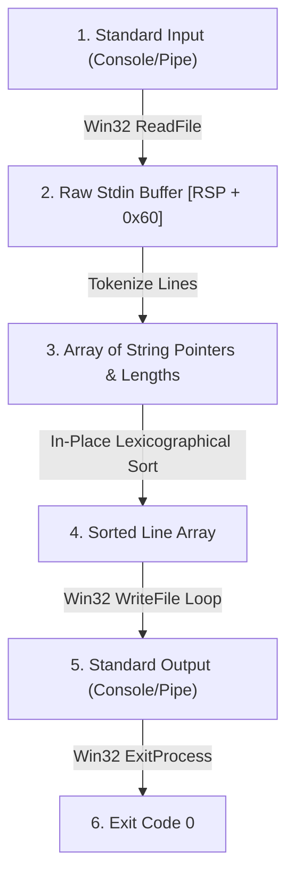

# Spike 3: Verified Stdin Lexicographical Sort & Windows PE64 Executable

**Status (2026-08-29): implemented vertical slice with narrow verification coverage.** The
Windows lowering has checked trace-equality facts for exactly two stdin values: empty input and
`defaultSampleInput`. Its `VerifiedProgram Bool` instance composes those two facts; `Bool` is a
two-element selector, not a proof over arbitrary `ByteArray` input. The source-level reader,
bounded hook wiring, and executable tests cover more behavior operationally, but no theorem yet
proves end-to-end equivalence, sortedness, or permutation for every stdin stream. The precise
boundary is documented in §6 and
`Spikes/Spike3SortLines/Windows/Equivalence.lean`.

## 1. Overview & High-Level Architecture

Spike 3 is an end-to-end verified vertical slice in `gasm` demonstrating buffered stream reading from standard input, parsing and tokenizing raw character streams into discrete string records in memory, in-place lexicographical sorting via proof-carrying x86-64 assembly, and formatted output streaming to standard output via the Win32 API.



---

## 2. Win32 `ReadFile` & Stream I/O Contracts

### 2.1 `ReadFile` API Signature
Official Win32 reference: Microsoft Windows SDK `fileapi.h`.
```c
BOOL ReadFile(
  HANDLE       hFile,
  LPVOID       lpBuffer,
  DWORD        nNumberOfBytesToRead,
  LPDWORD      lpNumberOfBytesRead,
  LPOVERLAPPED lpOverlapped
);
```

### 2.2 Calling Convention & Register Allocation
Conforming to Microsoft x64 Fastcall ABI:
- `RCX`: `hFile` — obtained via `GetStdHandle(STD_INPUT_HANDLE = -10 = 0xFFFFFFF6)`
- `RDX`: `lpBuffer` — pointer to stack/heap input buffer
- `R8`: `nNumberOfBytesToRead` — maximum buffer capacity (e.g. 4096 bytes)
- `R9`: `lpNumberOfBytesRead` — pointer to DWORD receiving total bytes actually read
- `[RSP + 32]`: `lpOverlapped` — `NULL` (`0`) for synchronous blocking console/pipe read
- `RAX`: Non-zero (`1`) on successful read, `0` on EOF or failure.

---

## 3. In-Memory Line Tokenization & Lexicographical Ordering

### 3.1 Line Record Representation
Each parsed line is represented by a pair:
$$\text{Line} = \langle \text{ptr} : \text{Address}, \text{len} : \text{Nat} \rangle$$
Lines are delimited by newline characters (`\n` / ASCII `0x0A` or `\r\n` / ASCII `0x0D 0x0A`).

### 3.2 Lexicographical Comparison Relation ($\le_{\text{lex}}$)
Given two strings $s_1, s_2$:
1. At the first index $k$ where $s_1[k] \ne s_2[k]$, $s_1 \le_{\text{lex}} s_2 \iff s_1[k] < s_2[k]$.
2. If $s_1$ is a proper prefix of $s_2$, $s_1 \le_{\text{lex}} s_2$.
3. If $s_1 = s_2$, $s_1 \le_{\text{lex}} s_2$.

The relation $\le_{\text{lex}}$ is a total preorder (reflexive, transitive, and total).

---

## 4. Current Memory and Ingestion Boundary

Spike 3 exercises streamed input and pointer-rich lowered code, but it does not yet establish the
repository's planned provenance model:

- **Specification reader**: `readAllLinesFueled` is structurally recursive with an explicit
  `specMaxStdinLines` bound; it is not an unbounded termination proof.
- **Lowered buffers**: the Windows and Wasm programs use concrete bounded buffers and fixed read
  sizes. They do not prove scaling to available RAM or a general dynamic-heap theorem.
- **Pointer safety**: the current program and trace checks do not carry the generational typed-view
  and capability witnesses required by `docs/MEMORY_MODEL.md` §§6–7. That remains future M1/M4
  work, not a property this spike may claim today.

---

## 5. Mathematical Sortedness & Permutation Theorems

The functional specification defines `sortStrings : List String → List String` and an
`IsSorted` predicate. The checked theorem population is narrower than the intended general
contract: `sortStrings_nil`, `sortStrings_single`, and one concrete three-element example exist.
There is no universal sortedness theorem and no universal permutation theorem in the tree yet.
Those remain required before the mathematical contract below can be claimed for arbitrary lists.

---

## 6. End-to-End Simulation & Verification Invariant

The target contract is that execution of the assembled machine program $\mathcal{P}_{\text{asm}}$
from a valid Windows entry state $\sigma_{\text{entry}}$, for arbitrary standard-input bytes $I$,
yields a canonical effect trace $\mathcal{T}_{\text{asm}}$ identical to the monadic functional
specification $\mathcal{T}_{\text{spec}}(\text{sortLinesSpec}(I))$.

**Current proof boundary:** this universal statement is not proved. The Windows equivalence file
checks the empty and canonical sample inputs and provides explicit-hypothesis wrappers for exactly
those two values. Its `EnvironmentLoader Bool`/`VerifiedProgram Bool` composition exhausts the
selector type but does not quantify over stdin bytes. Closing the gap requires a live read-binder
obligation plus induction over the streaming-ingestion loop; see `docs/READ_BINDER_CONTRACT.md`
§§8–9 and `docs/REVIEW.md` Law 9.
