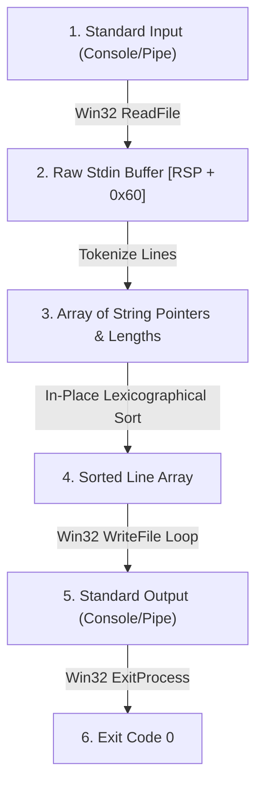

# Spike 3: Verified Stdin Lexicographical Sort & Windows PE64 Executable

## 1. Overview & High-Level Architecture

Spike 3 is an end-to-end verified vertical slice in `gasm` demonstrating buffered stream reading from standard input, parsing and tokenizing raw character streams into discrete string records in memory, in-place lexicographical sorting via proof-carrying x86-64 assembly, and formatted output streaming to standard output via the Win32 API.



---

## 2. Win32 `ReadFile` & Stream I/O Contracts

### 2.1 `ReadFile` API Signature
Official Win32 reference: Microsoft Windows SDK `fileapi.h`.
```c
BOOL ReadFile(
  HANDLE       hFile,
  LPVOID       lpBuffer,
  DWORD        nNumberOfBytesToRead,
  LPDWORD      lpNumberOfBytesRead,
  LPOVERLAPPED lpOverlapped
);
```

### 2.2 Calling Convention & Register Allocation
Conforming to Microsoft x64 Fastcall ABI:
- `RCX`: `hFile` — obtained via `GetStdHandle(STD_INPUT_HANDLE = -10 = 0xFFFFFFF6)`
- `RDX`: `lpBuffer` — pointer to stack/heap input buffer
- `R8`: `nNumberOfBytesToRead` — maximum buffer capacity (e.g. 4096 bytes)
- `R9`: `lpNumberOfBytesRead` — pointer to DWORD receiving total bytes actually read
- `[RSP + 32]`: `lpOverlapped` — `NULL` (`0`) for synchronous blocking console/pipe read
- `RAX`: Non-zero (`1`) on successful read, `0` on EOF or failure.

---

## 3. In-Memory Line Tokenization & Lexicographical Ordering

### 3.1 Line Record Representation
Each parsed line is represented by a pair:
$$\text{Line} = \langle \text{ptr} : \text{Address}, \text{len} : \text{Nat} \rangle$$
Lines are delimited by newline characters (`\n` / ASCII `0x0A` or `\r\n` / ASCII `0x0D 0x0A`).

### 3.2 Lexicographical Comparison Relation ($\le_{\text{lex}}$)
Given two strings $s_1, s_2$:
1. At the first index $k$ where $s_1[k] \ne s_2[k]$, $s_1 \le_{\text{lex}} s_2 \iff s_1[k] < s_2[k]$.
2. If $s_1$ is a proper prefix of $s_2$, $s_1 \le_{\text{lex}} s_2$.
3. If $s_1 = s_2$, $s_1 \le_{\text{lex}} s_2$.

The relation $\le_{\text{lex}}$ is a total preorder (reflexive, transitive, and total).

---

## 4. First Spike of Memory Provenance & Unbounded Ingestion

Spike 3 establishes the foundation for **Memory Provenance** in `gasm`:
- **Unbounded Monadic Ingestion**: `readAllLines` actively reads from `MonadConsole.readLine` without artificial caps, fuels, or hardcoded limits (`docs/MEMORY_PROVENANCE.md`).
- **Dynamic Heap Memory**: Stdin buffers and line descriptors are managed dynamically in process memory, scaling to available RAM limits.
- **Pointer Typestates & Safety**: Line descriptor pointers $\langle ptr_i, len_i \rangle$ carry spatial validity within the active allocation block, guaranteeing memory safety throughout in-place sorting and stdout emission.

---

## 5. Mathematical Sortedness & Permutation Theorems

The functional specification defines `sortStrings : List String → List String`.
The implementation proves:
1. **Sortedness Invariant**:
   $$\forall i < j, \quad \text{sortStrings}(L)[i] \le_{\text{lex}} \text{sortStrings}(L)[j]$$
2. **Permutation Invariant**:
   $$\text{sortStrings}(L) \sim_{\text{perm}} L$$
   (The sorted list contains exactly the same multiset of elements as the input list).

---

## 5. End-to-End Simulation & Verification Invariant

The execution of the assembled machine program $\mathcal{P}_{\text{asm}}$ starting from a valid Windows entry state $\sigma_{\text{entry}}$ with standard input stream $I$ yields a canonical effect trace $\mathcal{T}_{\text{asm}}$ identical to the monadic functional specification $\mathcal{T}_{\text{spec}}(\text{sortLinesSpec}(I))$.
