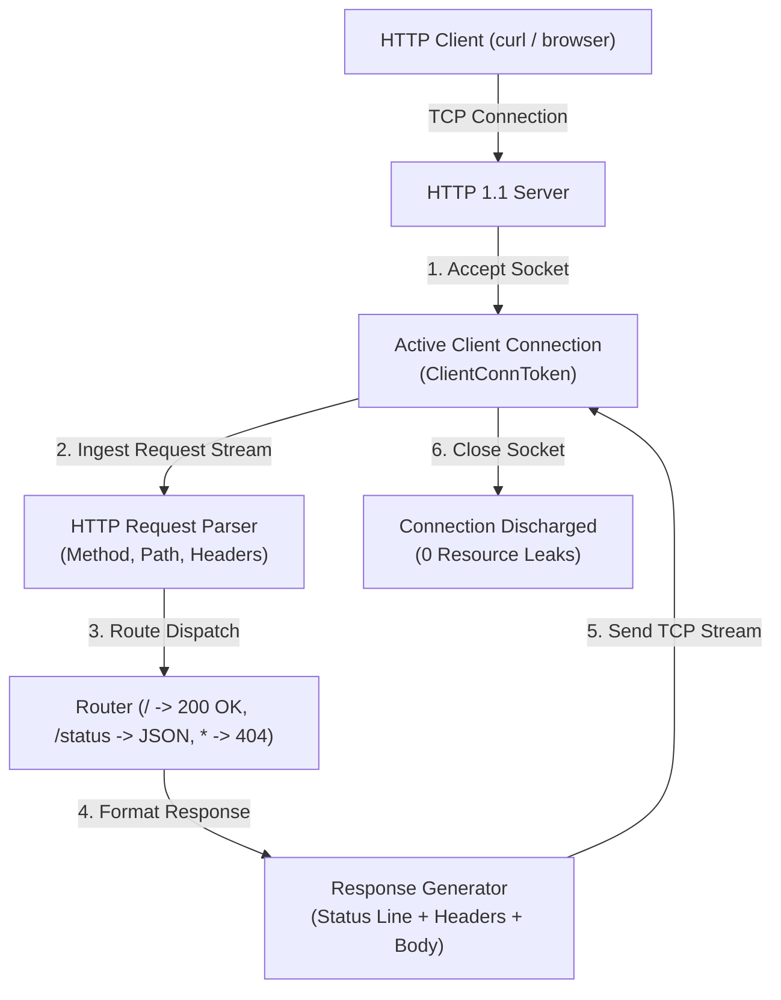

# Spike 4: Dual-Target HTTP 1.1 Server (x86_64 Windows & WebAssembly)

Spike 4 establishes the formal verified lowering and execution of an **HTTP 1.1 Server** co-developed across two distinct machine targets:
1. **x86_64 Windows (`.exe`)**: Native PE32+ binary linking with `ws2_32.dll` (WinSock2) and `kernel32.dll`.
2. **WebAssembly (`.wasm`)**: Standard WebAssembly MVP binary module operating over linear memory with WASI socket / host socket imports.

Both implementations satisfy identical high-level mathematical specifications and constructive semantic trace equivalence proofs.

---

## 1. High-Level Architecture & Protocol State Machine



### 1.1 Supported HTTP 1.1 Specification Subset
- **Request Line Parsing** — the model (`Spikes/Spike4HttpServer/Spec.lean`'s `parseRequestLine`)
  delegates to `Stdlib.Http11.parseRequestLine`, so the accepted grammar is that library's:
  - Methods: the nine `Stdlib.Http11.Method` tokens — `GET`, `HEAD`, `POST`, `PUT`, `DELETE`,
    `CONNECT`, `OPTIONS`, `TRACE`, `PATCH`. Any other token is 400 Bad Request. Routing itself is
    by target only, so all nine methods reach the same three responses.
  - URI Path: origin-form targets — `/`, `/status`, and arbitrary other paths (404).
  - Protocol Version: `HTTP/1.1` only. `HTTP/1.0` is 400 Bad Request.
  - Exactly three SP-separated fields; any other shape is 400 Bad Request.
- **What the three lowerings implement of that grammar**: the method-token check and the
  target-based routing (`Spikes/Spike4HttpServer/MethodDispatch.lean` for the x86-64 targets and
  `Wasm/Program.lean`'s `wasmMethodValidationInstrs` for WASI, both generated from
  `Spec.allHttpMethods`). The field-count, origin-form-target and version obligations are **not**
  implemented in the assembly, so the lowerings and the model genuinely disagree on request lines
  that violate only those. Each such class is a checked counterexample in
  `Spikes/Spike4HttpServer/Equivalence.lean`'s `spike4GeneralClaimCounterexamples` rather than a
  silent gap.
- **Headers**:
  - `Host: <hostname>`
  - `Connection: close` (default server mode for Spike 4 to simplify connection lifecycle)
  - `Content-Length: <len>`
  - `Content-Type: text/plain`, `text/html`, or `application/json`.
- **Response Format**:
  ```http
  HTTP/1.1 200 OK\r\n
  Content-Type: text/plain\r\n
  Content-Length: 13\r\n
  Connection: close\r\n
  \r\n
  Hello, World!
  ```

---

## 2. Linear Socket Obligations & Resource Discipline

Sockets are operating system and runtime capability handles that must be strictly conserved without leaks:

```lean
structure SocketObligation where
  sockId            : Nat
  isServerListening : Bool
  deriving DecidableEq, Repr, Inhabited

structure ClientConnObligation where
  connId     : Nat
  serverSock : Nat
  deriving DecidableEq, Repr, Inhabited
```

### 2.1 Socket Lifecycle Rules
1. `bind` + `listen` creates a `SocketObligation` representing the listening server socket.
2. `accept` generates an ephemeral `ClientConnObligation` representing the active TCP client stream.
3. Every client request processing loop **must** execute `closesocket` / `sock_close` along all termination paths (success, error, 404, or client disconnect), strictly discharging the `ClientConnObligation`.
4. Upon server shutdown, the listening socket is closed, and any process-scoped network resources are auto-discharged upon process exit.

---

## 3. Dual-Target Architectural Realization

### 3.1 x86_64 Windows (`ws2_32.dll`)
- Multi-DLL PE/COFF `.idata` generation importing from both `KERNEL32.dll` and `WS2_32.dll`.
- WinSock2 initialization via `WSAStartup(wVersionRequired = 0x0202, &wsaData)`.
- Socket creation: `socket(AF_INET = 2, SOCK_STREAM = 1, IPPROTO_TCP = 6)`.
- Socket binding to `127.0.0.1:8080` via `sockaddr_in` struct (16 bytes: `sin_family=AF_INET`, `sin_port=htons(8080)=0x901F`, `sin_addr=INADDR_ANY=0`).
- Streaming request reception via `recv`, parsing in heap memory via `SmolAlloc`, generating response, transmitting via `send`, and discharging socket with `closesocket`.

### 3.2 WebAssembly (`.wasm`)
- WebAssembly module binary encoding with WASI socket imports (`sock_accept`, `sock_recv`, `sock_send`, `sock_close`).
- Execution in WASM linear memory with `SmolAlloc` managing buffer allocations.
- Direct invocation of HTTP parser and response generator using WASM integer load/store instructions.

---

## 4. Semantic Trace Equivalence & VerifiedProgram Contract

The high-level server model produces system effect events in the `Network`, `Console`, and `Process` domains:
- `Net.Listen(port = 8080)`
- `Net.Accept(clientAddr)`
- `Net.Recv(requestBytes)`
- `Net.Send(responseBytes)`
- `Net.Close(clientConn)`

**Status** (corrected 2026-08-28): this paragraph previously read "the lowering theorems for both
Windows x86_64 (`spike4_windows_canonical_trace_equivalence`) and WebAssembly
(`spike4_wasm_canonical_trace_equivalence`) prove constructive trace equivalence via
`native_decide`, establishing that both distinct physical binaries execute identical verified
protocol semantics." **Neither of those two theorem names has ever existed in the tree**, and the
property the sentence asserted is not established — `scripts/gate_allowlist.txt` records, in the
six `spike4_*_trace_equivalence` entries, PA17's finding that widening these theorems to the real
per-request domain **"would be FALSE"**. What follows is what is actually proved.

What exists, in `Spikes/Spike4HttpServer/Equivalence.lean`:

- **Nine pointwise trace-equivalence theorems**, `spike4_{windows,wasm,linux}_{root,status,404}_trace_equivalence`
  (`:99`–`:172`) — three targets, not two; the Linux lowering landed alongside the other two. Each
  is a single `native_decide` check against **one literal request string**, not a statement about
  arbitrary requests.
- **Three route-indexed compositions**, `spike4_{windows,wasm,linux}_route_equivalence (r : HttpRoute)`
  (`:232`, `:241`, `:250`). The `∀ (r : HttpRoute)` binder is genuinely exhaustive, but `HttpRoute`
  is a **three-element proxy** for the three literal request strings `routeRequestStr` maps it to —
  it is not the `∀ (request : ByteArray)` domain a server-correctness claim needs.
- **Two honest restatements**, `spike4_{windows,wasm}_trace_equivalence_for_request` (`:267`,
  `:278`), which make that narrow domain an explicit hypothesis (`h : req = routeRequestStr r`)
  instead of hiding it behind the `HttpRoute` case split — the shape
  the domain-honesty review requires.
- **`spike4WindowsVerifiedProgram` / `spike4LinuxVerifiedProgram` / `spike4WasmVerifiedProgram`**
  (`:451`, `:460`, `:472`), each carrying a `NOTE (PA17 domain-honesty finding)` recording in the
  source that this is **not** a Law-9-compliant universal claim despite `VerifiedProgram`'s type
  signature.

**Why the universal claim is false, not merely unproven.** A counterexample class exists and is
recorded in the tree. Historically it was route-prefix confusion: the x86-64 lowering matched a
5-byte `"/stat"` prefix and the WASI lowering a single byte after `"/"`, so `"/static"`,
`"/status_check"`, `"/search"` and others were misrouted relative to `Spec.lean`'s
`parseRequestLine`/`routeRequest`. **That bug is fixed** — the stack-buffer audit
made all three targets compare the full 8 bytes `"/status "`, and `spike4RouteFixedOnAllTargets`
(`:354`) re-checks every witness the former "KNOWN DIVERGENCE" note named. The allowlist entries
now cite the surviving malformed-request mismatch rather than that retired bug.

The falsity survives the fix for an independent reason, recorded in the same file: `parseRequestLine`
returns `none` (400 Bad Request) for any request line that is not exactly three space-separated
tokens, and **no lowering can emit that response class at all**. A fully universal
`∀ (request : ByteArray)` equivalence is therefore false on malformed request lines regardless of
routing correctness. Reaching a genuine universal statement needs PA6's read-binder contract and
PA7's reactive-program contract first, per PA17's sequencing.

So: three distinct physical binaries are checked to execute identical protocol semantics **on three
literal requests each**, plus the broader concrete witness set `spike4RouteFixedOnAllTargets`
exercises. That is a pointwise result, not the universal one the retired sentence claimed.
