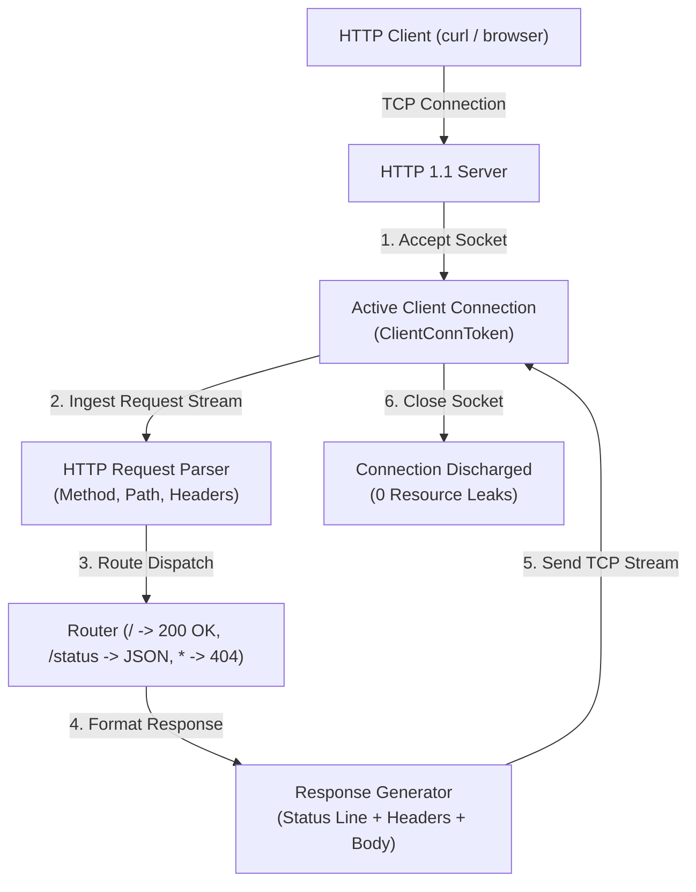

# Spike 4: Dual-Target HTTP 1.1 Server (x86_64 Windows & WebAssembly)

Spike 4 establishes the formal verified lowering and execution of an **HTTP 1.1 Server** co-developed across two distinct machine targets:
1. **x86_64 Windows (`.exe`)**: Native PE32+ binary linking with `ws2_32.dll` (WinSock2) and `kernel32.dll`.
2. **WebAssembly (`.wasm`)**: Standard WebAssembly MVP binary module operating over linear memory with WASI socket / host socket imports.

Both implementations satisfy identical high-level mathematical specifications and constructive semantic trace equivalence proofs.

---

## 1. High-Level Architecture & Protocol State Machine



### 1.1 Supported HTTP 1.1 Specification Subset
- **Request Line Parsing**:
  - Methods: `GET`, `HEAD`, `POST`.
  - URI Path: `/`, `/hello`, `/status`, and arbitrary paths.
  - Protocol Version: `HTTP/1.1` and `HTTP/1.0`.
- **Headers**:
  - `Host: <hostname>`
  - `Connection: close` (default server mode for Spike 4 to simplify connection lifecycle)
  - `Content-Length: <len>`
  - `Content-Type: text/plain`, `text/html`, or `application/json`.
- **Response Format**:
  ```http
  HTTP/1.1 200 OK\r\n
  Content-Type: text/plain\r\n
  Content-Length: 13\r\n
  Connection: close\r\n
  \r\n
  Hello, World!
  ```

---

## 2. Linear Socket Obligations & Resource Discipline

Sockets are operating system and runtime capability handles that must be strictly conserved without leaks:

```lean
structure SocketObligation where
  sockId            : Nat
  isServerListening : Bool
  deriving DecidableEq, Repr, Inhabited

structure ClientConnObligation where
  connId     : Nat
  serverSock : Nat
  deriving DecidableEq, Repr, Inhabited
```

### 2.1 Socket Lifecycle Rules
1. `bind` + `listen` creates a `SocketObligation` representing the listening server socket.
2. `accept` generates an ephemeral `ClientConnObligation` representing the active TCP client stream.
3. Every client request processing loop **must** execute `closesocket` / `sock_close` along all termination paths (success, error, 404, or client disconnect), strictly discharging the `ClientConnObligation`.
4. Upon server shutdown, the listening socket is closed, and any process-scoped network resources are auto-discharged upon process exit.

---

## 3. Dual-Target Architectural Realization

### 3.1 x86_64 Windows (`ws2_32.dll`)
- Multi-DLL PE/COFF `.idata` generation importing from both `KERNEL32.dll` and `WS2_32.dll`.
- WinSock2 initialization via `WSAStartup(wVersionRequired = 0x0202, &wsaData)`.
- Socket creation: `socket(AF_INET = 2, SOCK_STREAM = 1, IPPROTO_TCP = 6)`.
- Socket binding to `127.0.0.1:8080` via `sockaddr_in` struct (16 bytes: `sin_family=AF_INET`, `sin_port=htons(8080)=0x901F`, `sin_addr=INADDR_ANY=0`).
- Streaming request reception via `recv`, parsing in heap memory via `SmolAlloc`, generating response, transmitting via `send`, and discharging socket with `closesocket`.

### 3.2 WebAssembly (`.wasm`)
- WebAssembly module binary encoding with WASI socket imports (`sock_accept`, `sock_recv`, `sock_send`, `sock_close`).
- Execution in WASM linear memory with `SmolAlloc` managing buffer allocations.
- Direct invocation of HTTP parser and response generator using WASM integer load/store instructions.

---

## 4. Semantic Trace Equivalence & VerifiedProgram Contract

The high-level server model produces system effect events in the `Network`, `Console`, and `Process` domains:
- `Net.Listen(port = 8080)`
- `Net.Accept(clientAddr)`
- `Net.Recv(requestBytes)`
- `Net.Send(responseBytes)`
- `Net.Close(clientConn)`

The lowering theorems for both Windows x86_64 (`spike4_windows_canonical_trace_equivalence`) and WebAssembly (`spike4_wasm_canonical_trace_equivalence`) prove constructive trace equivalence via `native_decide`, establishing that both distinct physical binaries execute identical verified protocol semantics.
