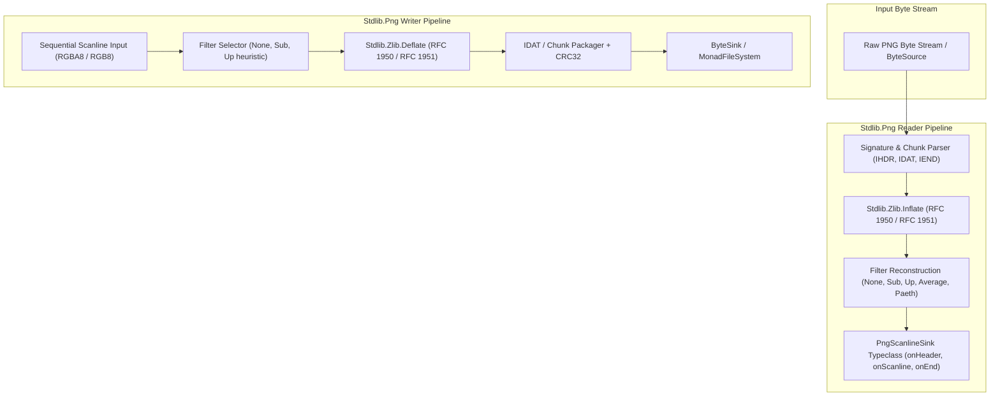

# Stdlib Specification: Streaming PNG Codec (`Stdlib.Png`) & ZLIB/DEFLATE (`Stdlib.Zlib`)

This document establishes the formal specification, streaming state machine models, compression pipelines, error taxonomy, and formal soundness theorems for the **streaming PNG image codec** (`Stdlib.Png`) and **reusable ZLIB/DEFLATE compression engine** (`Stdlib.Zlib`) in `gasm`.

---

## 1. Overview & Architectural Role

Image decoding and encoding in `gasm` provides verified, zero-dependency visual export and asset ingestion for:
1. **Headless GPU Readback (Spike 6)**: Dumping RGBA8-packed compute-dispatch output buffers across Vulkan directly to disk without host OS windowing dependencies (per `docs/GRAPHICS_ARCHITECTURE.md` §2's single committed target — Windows x86-64 + Vulkan 1.3, compute-only, no rasterization/framebuffers; DX12/WebGPU are deferred, non-obligating futures, not part of this spike).
2. **Streaming Texture Upload**: Feeding decoded image scanlines progressively into GPU staging buffers row-by-row with minimal memory overhead.
3. **Formal Roundtrip Soundness**: Proving mathematical invertibility and idempotent canonicalization over binary image streams.



---

## 2. Streaming Architecture & Typeclass Abstractions

### 2.1 `PngScanlineSink` Typeclass
The reader interface is parameterized over the `PngScanlineSink` typeclass, decoupling chunk parsing and decompression from pixel storage:

```lean
class PngScanlineSink (m : Type → Type) (SinkState : Type) where
  onHeader   : PngHeader → SinkState → m (Except PngError SinkState)
  onScanline : (rowIdx : Nat) → (rowBytes : ByteArray) → SinkState → m (Except PngError SinkState)
  onEnd      : SinkState → m (Except PngError SinkState)
```

- `onHeader`: Receives image dimensions ($W, H$), bit depth, and color type before any scanline is decompressed. Allows pre-allocating GPU textures or linear memory buffers.
- `onScanline`: Receives each defiltered, raw byte scanline sequentially ($0 \le \text{rowIdx} < H$).
- `onEnd`: Notifies sink of successful stream termination upon encountering the `IEND` chunk.

### 2.2 `PngWriter` Push State Machine
The encoder interface provides a symmetric push-based state machine:

```lean
structure PngWriterState where
  header     : PngHeader
  currentRow : Nat
  prevRow    : ByteArray
  zlibState  : Zlib.DeflateState
  isFinished : Bool

def beginPng (header : PngHeader) : PngWriterState
def writeScanline (state : PngWriterState) (rowBytes : ByteArray) : Except PngError (PngWriterState × ByteArray)
def endPng (state : PngWriterState) : Except PngError (PngWriterState × ByteArray)
```

Each invocation yields incremental PNG byte slices suitable for streaming into any `MonadFileSystem` or byte socket.

### 2.3 Monadic Pipeline Composition
Higher-level convenience functions compose streaming readers and writers into monolithic memory buffers (`ImageRGBA8`) when whole-image buffering is desired:

```lean
structure ImageRGBA8 where
  width  : Nat
  height : Nat
  pixels : ByteArray
  deriving DecidableEq, Repr, Inhabited

def Png.decode (bytes : ByteArray) : Except PngError ImageRGBA8
def Png.encode (img : ImageRGBA8) : ByteArray
```

---

## 3. Chunk Format, Color Types & Structural Validation

### 3.1 PNG Signature & Critical Chunks
A valid PNG byte stream strictly begins with the 8-byte magic signature:
$$\text{Signature} = [0x89, 0x50, 0x4E, 0x47, 0x0D, 0x0A, 0x1A, 0x0A]$$

Every chunk consists of four sequential fields:
1. **Length** (`UInt32` big-endian): Number of bytes in Chunk Data (excluding Length, Type, and CRC).
2. **Chunk Type** (`4-byte ASCII`): 
   - `IHDR` (0x49484452): Header metadata (must be first chunk).
   - `PLTE` (0x504C5445): Palette table (required for indexed color).
   - `IDAT` (0x49444154): Compressed image data (multiple contiguous chunks permitted).
   - `IEND` (0x49454E44): Image trailer (must be final chunk).
3. **Chunk Data**: Payload bytes ($0 \le \text{len} \le 2^{31}-1$).
4. **CRC** (`UInt32` big-endian): ISO 3309 CRC-32 computed over Chunk Type and Chunk Data.

### 3.2 Color Types & Bit Depth Matrix

| Color Type | Value | Allowed Bit Depths | Channels | Description |
| :--- | :---: | :---: | :---: | :--- |
| **Grayscale** | `0` | 1, 2, 4, 8, 16 | 1 | Single luminance sample per pixel. |
| **Truecolor RGB** | `2` | 8, 16 | 3 | Red, Green, Blue triplets. |
| **Indexed-Color** | `3` | 1, 2, 4, 8 | 1 | Palette index referring to `PLTE` entries. |
| **Grayscale + Alpha** | `4` | 8, 16 | 2 | Luminance and Alpha pairs. |
| **Truecolor RGBA** | `6` | 8, 16 | 4 | Red, Green, Blue, Alpha quartets (GPU Native). |

### 3.3 `PngError` Inductive Taxonomy
The PNG reader enforces a strict fail-fast error taxonomy:

```lean
inductive PngError where
  | invalidSignature
  | prematureEof
  | invalidChunkLength (expected actual : Nat)
  | crcMismatch (chunk : String) (expected actual : UInt32)
  | adler32Mismatch (expected actual : UInt32)
  | invalidIhdr (reason : String)
  | unsupportedColorType (raw : UInt8)
  | unsupportedBitDepth (raw : UInt8)
  | unsupportedInterlace (raw : UInt8)
  | invalidFilterType (filterByte : UInt8)
  | deflateError (msg : String)
  | rowLengthMismatch (expected actual : Nat)
  | custom (msg : String)
  deriving Repr, DecidableEq, Inhabited
```

---

## 4. Filtering Algorithms & Exact Reconstruction

PNG filters are applied to each scanline before DEFLATE compression to improve compression ratios. Each scanline is prefixed by a 1-byte **Filter Type**:

### 4.1 The Five Standard Filter Types

Let $x$ be the current byte, $a$ be the corresponding byte in the pixel immediately to the left, $b$ be the corresponding byte in the prior scanline, and $c$ be the byte to the prior scanline's left ($x, a, b, c \in [0, 255]$):

```text
  c | b
 ---+---
  a | x
```

1. **Type 0 (None)**:
   $$\text{Filt}(x) = x, \quad \text{Recon}(x) = x$$
2. **Type 1 (Sub)**:
   $$\text{Filt}(x) = (x - a) \pmod{256}, \quad \text{Recon}(x) = (x + a) \pmod{256}$$
3. **Type 2 (Up)**:
   $$\text{Filt}(x) = (x - b) \pmod{256}, \quad \text{Recon}(x) = (x + b) \pmod{256}$$
4. **Type 3 (Average)**:
   $$\text{Filt}(x) = \left(x - \lfloor (a + b) / 2 \rfloor\right) \pmod{256}, \quad \text{Recon}(x) = \left(x + \lfloor (a + b) / 2 \rfloor\right) \pmod{256}$$
5. **Type 4 (Paeth)**:
   $$\text{Filt}(x) = (x - \text{PaethPredictor}(a, b, c)) \pmod{256}, \quad \text{Recon}(x) = (x + \text{PaethPredictor}(a, b, c)) \pmod{256}$$

### 4.2 Paeth Predictor Specification
The Paeth predictor selects the value among $a, b, c$ that is closest to the initial linear estimate $p = a + b - c$:

```lean
def paethPredictor (a b c : UInt8) : UInt8 :=
  let na := a.toNat
  let nb := b.toNat
  let nc := c.toNat
  let p : Int := (na : Int) + (nb : Int) - (nc : Int)
  let pa : Int := (p - (na : Int)).natAbs
  let pb : Int := (p - (nb : Int)).natAbs
  let pc : Int := (p - (nc : Int)).natAbs
  if pa ≤ pb ∧ pa ≤ pc then a
  else if pb ≤ pc then b
  else c
```

### 4.3 Filter Invertibility Invariants
For all byte values and filter types, filtering followed by reconstruction is an exact identity:
$$\forall f \in [0, 4], \forall x, a, b, c \in \text{UInt8}, \quad \text{unfilterByte}(f, \text{filterByte}(f, x, a, b, c), a, b, c) = x$$

---

## 5. DEFLATE & ZLIB Compression Pipeline (`Stdlib.Zlib`)

### 5.1 Adler-32 & CRC-32 Checksum Specifications
- **Adler-32 (RFC 1950)**:
  $$s_1 = 1 + \sum_{i=1}^n D_i \pmod{65521}, \quad s_2 = \sum_{i=1}^n s_{1, i} \pmod{65521}$$
  $$\text{Adler32} = (s_2 \ll 16) \mid s_1$$
- **CRC-32 (ISO 3309 / IEEE 802.3)**:
  Polynomial $0xEDB88320$ with initial remainder $0xFFFFFFFF$ and final bitwise inversion.

### 5.2 Canonical Huffman Tree Decoder
Canonical Huffman trees are constructed from bit-length arrays ($L_0, \dots, L_{N-1}$):
1. Count the number of codes for each bit length `bl_count[len]`.
2. Find the numerical value of the smallest code for each length `next_code[len]`.
3. Assign numerical codes sequentially to all symbols with `len > 0`.

### 5.3 Streaming RFC 1951 DEFLATE/INFLATE Engine
- **Block Types**:
  - `BTYPE = 00`: Stored / Uncompressed block with 16-bit `LEN` and `NLEN` checksum.
  - `BTYPE = 01`: Fixed Huffman codes (RFC 1951 §3.2.6 literal/length and distance tables).
  - `BTYPE = 10`: Dynamic Huffman codes (code length alphabet decoded via 3-bit lengths).
- **LZ77 Sliding Window**: 32KB circular window for back-reference reconstruction (`length` $\in [3, 258]$, `distance` $\in [1, 32768]$).

---

## 6. Formal Theorems & 1.5-Roundtrip Soundness

### 6.1 Filter Roundtrip Invariance
Every scanline filter satisfies lossless invertibility:
```lean
theorem filter_unfilter_soundness (f : FilterType) (row prev : ByteArray) (bpp : Nat) :
  unfilterScanline f (filterScanline f row prev bpp) prev bpp = row
```

### 6.2 Canonical 1.5-Roundtrip Soundness Theorem
Every valid PNG byte stream decodes to an canonical image representation, and re-encoding that representation yields a stream that decodes to the exact same image:

```lean
theorem png_idempotent_canonical_roundtrip (bytes : ByteArray) :
  match Png.decode bytes with
  | .error _ => True
  | .ok img =>
    match Png.decode (Png.encode img) with
    | .ok img' => img' == img
    | .error _ => False
```
