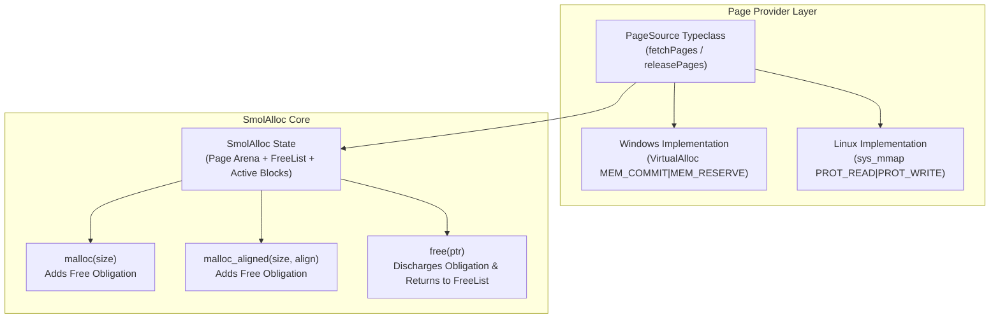

# Stdlib Specification: SmolAlloc (Tiny First-Fit Memory Allocator)

This document establishes the formal specification, state invariants, and machine implementation requirements for **SmolAlloc**, the foundational dynamic memory allocator in the `gasm` standard library (`Stdlib.SmolAlloc`).

---

## 1. Overview & Architectural Role

Dynamic memory management in `gasm` must satisfy two complementary requirements:
1. **High-Level Formal Verification**: Allocation and deallocation must strictly adhere to linear memory permissions, capability non-forgery, and linear obligations (`free` obligations discharged).
2. **Low-Level Machine Execution**: Assembly routines must execute real-world machine allocations backed by OS virtual memory pages (e.g. `VirtualAlloc` on Windows, `mmap` on Linux).

**SmolAlloc** is a minimal, first-fit dynamic memory allocator that manages memory blocks with size/alignment prefixes backed by an abstract page provider.



---

## 2. The Abstract Page Source Typeclass (`PageSource`)

SmolAlloc is decoupled from specific operating system system calls via the `PageSource` typeclass.

### 2.1 Typeclass Definition
```lean
class PageSource (m : Type → Type) where
  pageSize     : Nat := 4096
  fetchPages   : (numPages : Nat) → m (Option Address)
  releasePages : (baseAddr : Address) → (numPages : Nat) → m Bool
```

### 2.2 Platform Realizations
- **Windows (`Stdlib.SmolAlloc.Windows`)**: Calls `VirtualAlloc(NULL, size, MEM_COMMIT | MEM_RESERVE, PAGE_READWRITE)` and `VirtualFree(addr, 0, MEM_RELEASE)`.
- **Linux (`Stdlib.SmolAlloc.Linux`)**: Calls `mmap(NULL, size, PROT_READ | PROT_WRITE, MAP_PRIVATE | MAP_ANONYMOUS, -1, 0)` and `munmap(addr, size)`.
- **Bare-Metal (`Stdlib.SmolAlloc.BareMetal`)**: Advances a bump pointer over a reserved physical RAM segment.

---

## 3. Block Structure & FreeList State Model

### 3.1 Block Header Layout
Every allocated or free chunk of memory carries an 8-byte aligned metadata prefix immediately preceding the usable payload pointer:

| Offset | Field | Type | Description |
| :--- | :--- | :--- | :--- |
| `0x00` | `blockSize` | `UInt64` | Total usable byte capacity of the payload. |
| `0x08` | `isFree` | `UInt64` | `1` if currently free and in freelist; `0` if active. |
| `0x10` | `alignment` | `UInt64` | Byte alignment requirement ($2^k$, default 8 or 16). |
| `0x18` | `nextFree` | `UInt64` | Pointer to the next free block header in the freelist (0 if null). |
| `0x20` | `payload` | `Byte[]` | User-accessible memory region returned to caller. |

### 3.2 First-Fit FreeList Search
When satisfying an allocation request of size $S$:
1. Traverse the singly-linked `freeList` starting at `freeListHead`.
2. Find the first block where `isFree == 1` and `blockSize >= S`.
3. If found, mark `isFree := 0`, remove from `freeList`, and return the payload pointer `headerAddr + 0x20`.
4. If no suitable free block exists, request $\lceil (S + 32) / \text{pageSize} \rceil$ fresh pages from the `PageSource`, format a new block header, and return the payload.

#### Native finite-arena realization

The x86 native routine is embedded with an explicit `NativeArenaCapability { base, endExclusive }`:
`R11` holds the next header and `R15` holds the exact exclusive end selected by the platform
reservation.  It does not infer an end from a default capacity.  Before any allocator-state or
allocator-memory mutation, the lowered routine rejects carry from both `S + 7` (alignment) and
`align8(S) + 32` (header), then rejects `R11 > R15` or insufficient remaining bytes.  Only the
post-check path advances `R11` and writes a header.  Consequently an overlarge request, wrapped
alignment/header calculation, or exhausted arena returns null with `R11`, `R10`, and allocator
memory unchanged.

`NativeArenaCapability.ofReservation` is the semantic counterpart of the entry sequence's checked
`base + bytes` computation: it constructs the capability only for a nonzero reservation whose
exclusive end is representable.  The Spike 3 Linux and Win32 runtimes use that capability to
materialize the same base/end interval the emitted code consumes.

### 3.3 Deallocation (`free`)
When freeing payload pointer $P$:
1. Recover header address $H = P - 0x20$.
2. Assert $H$ is valid and active (`isFree == 0`).
3. Set `isFree := 1`, link $H$ to the front of `freeList` (`nextFree := freeListHead`, `freeListHead := H`).
4. Discharge the corresponding `free` linear obligation.

---

## 4. Linear Obligations & Memory Invariants

### 4.1 Linear Obligation Conservation
- **Allocation Rule**: Every successful call to `malloc(size)` or `malloc_aligned(size, align)` returning `some ptr` adds a linear obligation:
  $$\text{Obligation.mustFree}(\text{ptr})$$
- **Deallocation Rule**: Calling `free(ptr)` consumes and discharges $\text{Obligation.mustFree}(\text{ptr})$.
- **Payload-Leak Requirement**: A completed allocator client must discharge every payload `free`
  obligation. The current specification also retains value-level page tokens marked
  `isDroppableOnExit`; it does not prove an empty total ledger or automatic page teardown. The
  current root profile must replace that marker with a typed root-lifetime resource and the selected
  platform teardown proof under `docs/MEMORY_MODEL.md` §6.4. Future multiprocess qualification is
  deferred to `docs/FUTURE_PROCESS_MODEL.md`.

### 4.2 FreeList Re-use Theorem
The formal specification proves that deallocating a block of size $S$ guarantees that a subsequent allocation request of size $S' \le S$ successfully reuses the freed block without requesting new pages from the underlying `PageSource`.
