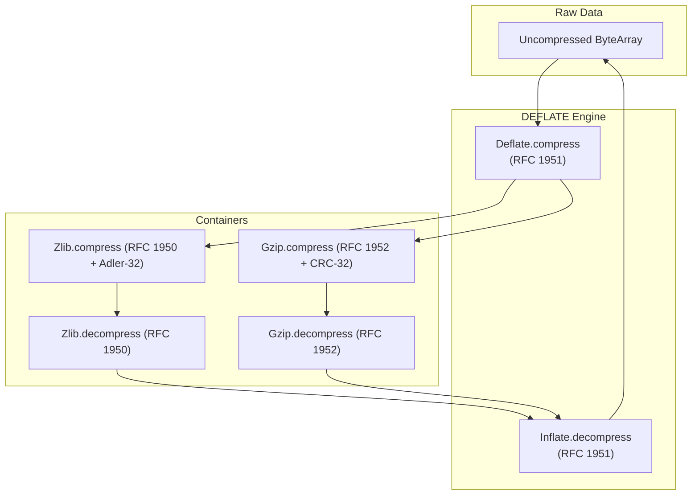

# Stdlib Specification: Reusable ZLIB / DEFLATE / GZIP Engine (`Stdlib.Zlib`)

This document establishes the formal specification, state machines, bitstream encoding/decoding, error taxonomy, and formal roundtrip & 1.5-roundtrip soundness theorems for **`Stdlib.Zlib`** in `gasm`.

---

## 1. Overview & Architectural Role

`Stdlib.Zlib` is a pure, zero-dependency compression and decompression library providing:
1. **Adler-32 Checksum Algorithm** (RFC 1950 §9).
2. **CRC-32 Checksum Algorithm** (ISO 3309 / IEEE 802.3).
3. **Canonical Huffman Tree Construction & Decoding** (RFC 1951 §3.2.2).
4. **RFC 1951 DEFLATE & INFLATE Engine** supporting Uncompressed (BTYPE=00), Fixed Huffman (BTYPE=01), and Dynamic Huffman (BTYPE=10) blocks.
5. **RFC 1950 ZLIB Container Format** (CMF, FLG, Adler-32 verification).
6. **RFC 1952 GZIP Container Format** (ID1, ID2, CM, FLG, CRC32, ISIZE).



---

## 2. Checksum Specifications

### 2.1 Adler-32 (RFC 1950)
- Accumulates two 16-bit sums modulo $65521$:
  $$s_1 = 1 + \sum_{i=0}^{n-1} D[i] \pmod{65521}$$
  $$s_2 = \sum_{i=0}^{n-1} s_{1, i} \pmod{65521}$$
- Checksum: $(s_2 \ll 16) \mid s_1$.

### 2.2 CRC-32 (ISO 3309 / IEEE 802.3)
- Polynomial $0xEDB88320$ (reversed).
- Pre-conditioned with $0xFFFFFFFF$, inverted post-processing.
- Supports byte-at-a-time lookup tables and verified pure functional bitwise computation.

---

## 3. Huffman Tree Construction & Bitstream Encoding

### 3.1 Canonical Huffman Code Generation
Given symbol bit lengths $L[0 \dots N-1]$:
1. Count code lengths: `bl_count[len] = count of symbols with bit length len`.
2. Compute starting code values:
   $$\text{code} = (\text{code} + \text{bl\_count}[\text{len}-1]) \ll 1$$
3. Assign sequential codes to all active symbols with bit length $\ge 1$.

### 3.1.1 Length-Limited Code Length Computation (Encoder Side)
For dynamic-Huffman (BTYPE=10) block emission, per-block code lengths are computed from symbol
frequencies by the package-merge (coin-collector) algorithm (`packageMergeLengths`): build
`maxBits` levels of packaged-then-merged weight-sorted lists over the leaves, take the first
$2n - 2$ items of the final list, and read each symbol's code length off as its occurrence count
among the taken items. This yields lengths $\le$ `maxBits` (15 for the literal/length and distance
alphabets, 7 for the code-length alphabet) satisfying the Kraft equality — a complete prefix
code — for any $n \ge 2$ leaf distribution. Frequency arrays are padded to at least two nonzero
entries (`padFrequencies`, mirroring zlib `trees.c`), so every transmitted tree is complete.
Encoding tables are then produced by the same `buildHuffmanTable` §3.1 describes, which the
decoder also applies to the transmitted lengths — encoder and decoder agree by construction.

### 3.2 Fixed Huffman Tables (RFC 1951 §3.2.6)
- **Literal/Length Alphabet (0–287)**:
  - Symbols 0–143: 8 bits (`00110000` through `10111111`, values 48–191).
  - Symbols 144–255: 9 bits (`110010000` through `111111111`, values 400–511).
  - Symbols 256–279: 7 bits (`0000000` through `0010111`, values 0–23).
  - Symbols 280–287: 8 bits (`11000000` through `11000111`, values 192–199).
- **Distance Alphabet (0–31)**:
  - All distance codes are 5 bits fixed.

---

## 4. DEFLATE Bitstream Engine (RFC 1951)

### 4.1 Bitstream Reader & Writer
- Reads bits LSB-first within each byte.
- Writes bits LSB-first into bytes.
- Byte-aligns when transitioning to uncompressed blocks (BTYPE=00).

### 4.2 Block Formats
- **Header**: 1 bit `BFINAL` (1 if last block), 2 bits `BTYPE`:
  - `00`: Non-compressed (16-bit `LEN`, 16-bit `NLEN = ~LEN`, followed by raw literal bytes).
  - `01`: Compressed with Fixed Huffman codes.
  - `10`: Compressed with Dynamic Huffman codes.
  - `11`: Reserved / Error.
- **Encoder block selection**: `compress` tokenizes the input once (greedy LZ77 via
  `tokenize`, each candidate back-reference certified by the total `matchValid` predicate —
  the `findLongestMatch` search itself stays an untrusted heuristic), then chooses between one
  final fixed-Huffman block and one final dynamic-Huffman block by exact bit-cost comparison
  (`dynPlanBitCost` vs `fixedBitCost`; ties favor fixed). The dynamic path (`buildDynPlan`,
  `emitDynamicBlock`) transmits the RFC 1951 §3.2.7 HLIT/HDIST/HCLEN header, the
  code-length-alphabet lengths in the §3.2.7 permutation order, and the run-length-encoded
  code-length sequence using symbols 16 (repeat previous 3–6), 17 (zeros 3–10), and
  18 (zeros 11–138). `compressFixed` (the assembly-engine twin) remains fixed-Huffman-only.

---

## 5. ZLIB & GZIP Containers

### 5.1 ZLIB Format (RFC 1950)
- `CMF` (1 byte): Compression method (8 = Deflate), Window info ($CINFO \le 7$).
- `FLG` (1 byte): Check bits such that $(CMF \times 256 + FLG) \pmod{31} = 0$.
- `Compressed Data`: RFC 1951 Deflate bitstream.
- `ADLER32` (4 bytes big-endian): Checksum over uncompressed data.

### 5.2 GZIP Format (RFC 1952)
- Header: `ID1 = 0x1F`, `ID2 = 0x8B`, `CM = 8`, `FLG`, `MTIME (4 bytes)`, `XFL`, `OS`.
- `Compressed Data`: RFC 1951 Deflate bitstream.
- Trailer: `CRC32` (4 bytes little-endian), `ISIZE` (4 bytes little-endian).

---

## 6. Formal Theorems & 1.5-Roundtrip Soundness

### 6.1 Checksum Invariance Theorems
- **Adler-32 Step Soundness**: Accumulating an empty byte array returns initial state $1$.
- **CRC-32 Step Soundness**: CRC32 of known test vectors matches IEEE standard.

### 6.2 DEFLATE & ZLIB Roundtrip Soundness Theorems
Every valid byte array roundtrips losslessly through compression and decompression:

```lean
theorem deflate_roundtrip_soundness (data : ByteArray) :
  Deflate.decompress (Deflate.compress data) = some data

theorem zlib_roundtrip_soundness (data : ByteArray) :
  Zlib.decompress (Zlib.compress data) = some data

theorem gzip_roundtrip_soundness (data : ByteArray) :
  Gzip.decompress (Gzip.compress data) = some data
```

### 6.3 Canonical 1.5-Roundtrip Soundness Theorems
For any arbitrary binary stream, either decompression fails cleanly with an error, or the decompressed data can be re-compressed and re-decompressed to produce the exact same data:

```lean
theorem deflate_idempotent_canonical_roundtrip (bytes : ByteArray) :
  match Deflate.decompress bytes with
  | none => True
  | some data => Deflate.decompress (Deflate.compress data) = some data

theorem zlib_idempotent_canonical_roundtrip (bytes : ByteArray) :
  match Zlib.decompress bytes with
  | none => True
  | some data => Zlib.decompress (Zlib.compress data) = some data

theorem gzip_idempotent_canonical_roundtrip (bytes : ByteArray) :
  match Gzip.decompress bytes with
  | none => True
  | some data => Gzip.decompress (Gzip.compress data) = some data
```

### 6.4 LZ77 Token-Layer Roundtrip Soundness
The LZ77 layer of the DEFLATE roundtrip — below Huffman coding and bitstream framing — is
proven universally and kernel-checked (no `native_decide`): for every input, the greedy
tokenizer's output (literals plus certified back-references, including self-overlapping
RFC 1951 §3.2.3 matches with `dist < len`) expands back to exactly the input under the
reference token decoder, whose copy loop is byte-for-byte the semantics of
`decodeHuffmanStream`'s match-copy loop:

```lean
theorem lz77_roundtrip_soundness (data : ByteArray) :
  expandTokens (tokenize data) = data
```

This is the L3 (match certificate) + L4 (self-overlapping copy induction) + token-level L5
content of the PA16 decomposition (`docs/PA16_CODEC_SOUNDNESS.md` §4), stated over total
functions only; the remaining distance to the full `deflate_roundtrip_soundness` in §6.2 is
the Huffman/bitstream layer, which is blocked on PA16 P0 (the decoder's `partial def`
conversion).
