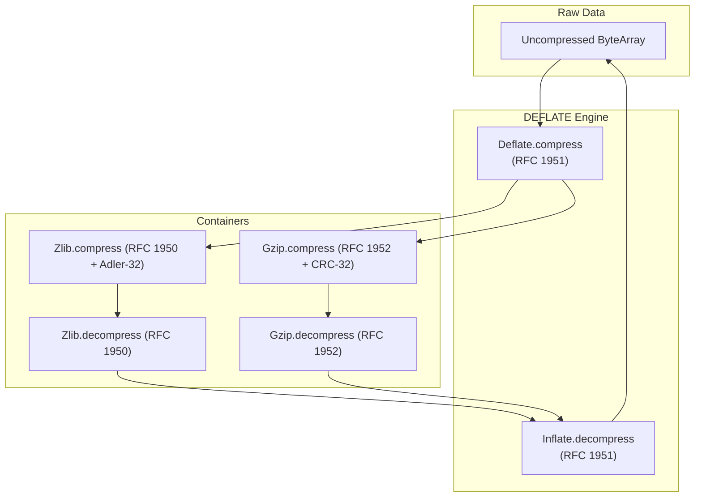

# Stdlib Specification: Reusable ZLIB / DEFLATE / GZIP Engine (`Stdlib.Zlib`)

This document establishes the formal specification, state machines, bitstream encoding/decoding, error taxonomy, and formal roundtrip & 1.5-roundtrip soundness theorems for **`Stdlib.Zlib`** in `gasm`.

---

## 1. Overview & Architectural Role

`Stdlib.Zlib` is a pure, zero-dependency compression and decompression library providing:
1. **Adler-32 Checksum Algorithm** (RFC 1950 §9).
2. **CRC-32 Checksum Algorithm** (ISO 3309 / IEEE 802.3).
3. **Canonical Huffman Tree Construction & Decoding** (RFC 1951 §3.2.2).
4. **RFC 1951 DEFLATE & INFLATE Engine** supporting Uncompressed (BTYPE=00), Fixed Huffman (BTYPE=01), and Dynamic Huffman (BTYPE=10) blocks.
5. **RFC 1950 ZLIB Container Format** (CMF, FLG, Adler-32 verification).
6. **RFC 1952 GZIP Container Format** (ID1, ID2, CM, FLG, CRC32, ISIZE).



---

## 2. Checksum Specifications

### 2.1 Adler-32 (RFC 1950)
- Accumulates two 16-bit sums modulo $65521$:
  $$s_1 = 1 + \sum_{i=0}^{n-1} D[i] \pmod{65521}$$
  $$s_2 = \sum_{i=0}^{n-1} s_{1, i} \pmod{65521}$$
- Checksum: $(s_2 \ll 16) \mid s_1$.

### 2.2 CRC-32 (ISO 3309 / IEEE 802.3)
- Polynomial $0xEDB88320$ (reversed).
- Pre-conditioned with $0xFFFFFFFF$, inverted post-processing.
- Supports byte-at-a-time lookup tables and verified pure functional bitwise computation.

---

## 3. Huffman Tree Construction & Bitstream Encoding

### 3.1 Canonical Huffman Code Generation
Given symbol bit lengths $L[0 \dots N-1]$:
1. Count code lengths: `bl_count[len] = count of symbols with bit length len`.
2. Compute starting code values:
   $$\text{code} = (\text{code} + \text{bl\_count}[\text{len}-1]) \ll 1$$
3. Assign sequential codes to all active symbols with bit length $\ge 1$.

### 3.1.1 Length-Limited Code Length Computation (Encoder Side)
For dynamic-Huffman (BTYPE=10) block emission, per-block code lengths are computed from symbol
frequencies by the package-merge (coin-collector) algorithm (`packageMergeLengths`): build
`maxBits` levels of packaged-then-merged weight-sorted lists over the leaves, take the first
$2n - 2$ items of the final list, and read each symbol's code length off as its occurrence count
among the taken items. This yields lengths $\le$ `maxBits` (15 for the literal/length and distance
alphabets, 7 for the code-length alphabet) satisfying the Kraft equality — a complete prefix
code — for any $n \ge 2$ leaf distribution. Frequency arrays are padded to at least two nonzero
entries (`padFrequencies`, mirroring zlib `trees.c`), so every transmitted tree is complete.
Encoding tables are then produced by the same `buildHuffmanTable` §3.1 describes, which the
decoder also applies to the transmitted lengths — encoder and decoder agree by construction.

### 3.2 Fixed Huffman Tables (RFC 1951 §3.2.6)
- **Literal/Length Alphabet (0–287)**:
  - Symbols 0–143: 8 bits (`00110000` through `10111111`, values 48–191).
  - Symbols 144–255: 9 bits (`110010000` through `111111111`, values 400–511).
  - Symbols 256–279: 7 bits (`0000000` through `0010111`, values 0–23).
  - Symbols 280–287: 8 bits (`11000000` through `11000111`, values 192–199).
- **Distance Alphabet (0–31)**:
  - All distance codes are 5 bits fixed.

---

## 4. DEFLATE Bitstream Engine (RFC 1951)

### 4.1 Bitstream Reader & Writer
- Reads bits LSB-first within each byte.
- Writes bits LSB-first into bytes.
- Byte-aligns when transitioning to uncompressed blocks (BTYPE=00).

### 4.2 Block Formats
- **Header**: 1 bit `BFINAL` (1 if last block), 2 bits `BTYPE`:
  - `00`: Non-compressed (16-bit `LEN`, 16-bit `NLEN = ~LEN`, followed by raw literal bytes).
  - `01`: Compressed with Fixed Huffman codes.
  - `10`: Compressed with Dynamic Huffman codes.
  - `11`: Reserved / Error.
- **Encoder block selection**: `compress` tokenizes the input once (greedy LZ77 via
  `tokenize`, each candidate back-reference certified by the total `matchValid` predicate —
  the `findLongestMatch` search itself stays an untrusted heuristic), then chooses between one
  final fixed-Huffman block and one final dynamic-Huffman block by exact bit-cost comparison
  (`dynPlanBitCost` vs `fixedBitCost`; ties favor fixed). The dynamic path (`buildDynPlan`,
  `emitDynamicBlock`) transmits the RFC 1951 §3.2.7 HLIT/HDIST/HCLEN header, the
  code-length-alphabet lengths in the §3.2.7 permutation order, and the run-length-encoded
  code-length sequence using symbols 16 (repeat previous 3–6), 17 (zeros 3–10), and
  18 (zeros 11–138). `compressFixed` (the assembly-engine twin) remains fixed-Huffman-only.

---

## 5. ZLIB & GZIP Containers

### 5.1 ZLIB Format (RFC 1950)
- `CMF` (1 byte): Compression method (8 = Deflate), Window info ($CINFO \le 7$).
- `FLG` (1 byte): Check bits such that $(CMF \times 256 + FLG) \pmod{31} = 0$.
- `Compressed Data`: RFC 1951 Deflate bitstream.
- `ADLER32` (4 bytes big-endian): Checksum over uncompressed data.

### 5.2 GZIP Format (RFC 1952)
- Header: `ID1 = 0x1F`, `ID2 = 0x8B`, `CM = 8`, `FLG`, `MTIME (4 bytes)`, `XFL`, `OS`.
- `Compressed Data`: RFC 1951 Deflate bitstream.
- Trailer: `CRC32` (4 bytes little-endian), `ISIZE` (4 bytes little-endian).

---

## 6. Formal Theorems & 1.5-Roundtrip Soundness

### 6.1 Checksum Invariance Theorems
- **Adler-32 Step Soundness**: Accumulating an empty byte array returns initial state $1$.
- **CRC-32 Step Soundness**: CRC32 of known test vectors matches IEEE standard.

### 6.2 DEFLATE & ZLIB Roundtrip Soundness Theorems

Until 2026-08-28 this section displayed three universally-quantified theorems
(`deflate_roundtrip_soundness`, `zlib_roundtrip_soundness`, `gzip_roundtrip_soundness`) under the
sentence "Every valid byte array roundtrips losslessly through compression and decompression".
Those three names **have never existed anywhere in the tree**, and the displayed signatures were
wrong in a second way as well: they returned `some data`, while no function in `Stdlib.Zlib`
returns an `Option` — `decompress` returns `Except ZlibError ByteArray`.
This owning document now states the accurate status. What follows is what
`Stdlib/Zlib/Equivalence.lean` actually contains.

**Universal, kernel-checked, no `native_decide` — one theorem** (`Equivalence.lean:1875`, the
PA16 L7 fixed-block instance). Unconditional: one binder, no hypotheses, axiom-clean (`propext`,
`Classical.choice`, `Quot.sound` only).

```lean
theorem emitFixedBlock_roundtrip_soundness (data : ByteArray) :
    decompress (flushBitWriter (emitFixedBlock (tokenize data))) = .ok data
```

Note what it quantifies over and what it does not: for **every** `ByteArray`, inflating the
flushed *fixed-Huffman* block emitted for that input's greedy LZ77 tokenization returns the
original bytes exactly. It says nothing about `compress`, which chooses between block types.

**`compress` itself — conditional** (`Equivalence.lean:1884`). The hypothesis is load-bearing, so
it is quoted here verbatim rather than paraphrased away:

```lean
theorem compress_roundtrip_of_fixed_choice (data : ByteArray)
    (h : ¬ dynPlanBitCost (buildDynPlan (tokenize data)) (tokenize data) <
        fixedBitCost (tokenize data)) :
    decompress (compress data) = .ok data
```

`h` says the exact bit-cost comparison did **not** favour the dynamic-Huffman plan — i.e.
`compress` took its fixed-Huffman branch. When `compress` takes the dynamic branch, this theorem
says nothing at all.

**How much of `compress`'s real input space that covers — measured, not assumed.** On the standard
`lake exe gzip_fuzzer` run (100 randomized vectors plus 8 deterministic edge cases, seed
13374242), `compress` chose the dynamic-Huffman block (BTYPE=10) on **55 of 108** vectors and the
fixed-Huffman block (BTYPE=01) on **53 of 108**. So `compress_roundtrip_of_fixed_choice` covers
roughly **half** of the inputs this codebase's own fuzzer generates — not a corner case the
dynamic branch fills in around, but close to an even split. The dynamic half has no roundtrip
theorem, universal or conditional.

**The `_inst` declarations are not universal theorems.** `deflate_roundtrip_soundness_inst`,
`zlib_roundtrip_soundness_inst`, `gzip_roundtrip_soundness_inst`, `deflate_roundtrip_empty_inst`
and `deflate_roundtrip_repetitive_inst` (`Equivalence.lean:117-157`) each push **one hard-coded
string literal or byte array** through `compress`-then-`decompress` and discharge it with
`native_decide` — the compiler-trusted oracle, not the kernel (`docs/REVIEW.md` Law 10). They are
single-point ground regression checks with theorem-shaped names; the `_soundness` in a name is not
evidence about any other input. The inventory above is the authority on their status.

### 6.3 Canonical 1.5-Roundtrip Soundness Theorems

The universal property this section targets — for any arbitrary binary stream, either
decompression fails cleanly with an error, or the decompressed data re-compresses and
re-decompresses to the exact same data — is a **free corollary** of §6.2's universal target once
that is proven, which is why no separate universal
theorem for it exists or needs to.

**Status**: the universal form does not yet exist for any of the three containers. Until
2026-08-28 this section displayed three (`deflate_idempotent_canonical_roundtrip`,
`zlib_idempotent_canonical_roundtrip`, `gzip_idempotent_canonical_roundtrip`) that were never in
the tree. What is in the tree is three `native_decide` ground checks —
`deflate_idempotent_canonical_roundtrip_inst`, `zlib_idempotent_canonical_roundtrip_inst`,
`gzip_idempotent_canonical_roundtrip_inst` (`Equivalence.lean:172-209`) — each over a **single**
already-known-good compressed literal (`compress "Canonical 1.5-roundtrip theorem test.".toUTF8`
and its ZLIB/GZIP analogues). Their outer `Except.error _ => false` branch is deliberate: an
earlier `=> true` there left them vacuously satisfiable by a `decompress` that always failed
(found and fixed 2026-08-27, PA16 Phase 1). The universal statement legitimately keeps
`error => True` in that position, since not every `ByteArray` is a valid compressed stream — but
that universal statement is not proven. Tracked as PA16 (L12), pending §6.2's L7/L9.

### 6.4 LZ77 Token-Layer Roundtrip Soundness
The LZ77 layer of the DEFLATE roundtrip — below Huffman coding and bitstream framing — is
proven universally and kernel-checked (no `native_decide`): for every input, the greedy
tokenizer's output (literals plus certified back-references, including self-overlapping
RFC 1951 §3.2.3 matches with `dist < len`) expands back to exactly the input under the
reference token decoder, whose copy loop is byte-for-byte the semantics of
`decodeHuffmanStream`'s match-copy loop:

```lean
theorem lz77_roundtrip_soundness (data : ByteArray) :
  expandTokens (tokenize data) = data
```

This is the match-certificate, self-overlapping-copy, and token-level induction decomposition used
by the current proof, stated over total functions only.

**The remaining frontier (updated 2026-08-28).** This paragraph previously said the Huffman/
bitstream layer was "blocked on PA16 P0 (the decoder's `partial def` conversion)". **P0 has
landed**: zero `partial def` remain anywhere in `Stdlib/Zlib/` (the branch-rooted `HuffmanTable`
invariant made `decodeHuffmanStream`/`decompress` well-founded unconditionally), and on top of it
the whole fixed-Huffman path closed kernel-checked — L1b, L2-fixed in full, the L6 code algebra,
both halves of L5-fixed, and L7-fixed, which is §6.2's `emitFixedBlock_roundtrip_soundness`.
What now stands between here and a universal DEFLATE
roundtrip theorem is the **dynamic-Huffman branch**, four obligations, none of them started:
**L2v** (package-merge validity), **L2d** (canonical decode inversion for arbitrary transmitted
code lengths), **L2h** (RFC 1951 §3.2.7 header RLE roundtrip), and then the **dynamic instance of
the L5 induction** — the fixed instance's per-token decode lemmas plus its `tokensWF` positional
invariant were built to be reusable for it. §6.2's measured 55/108-dynamic split is the reason
this matters: it is about half of `compress`'s real inputs, not a residue.
