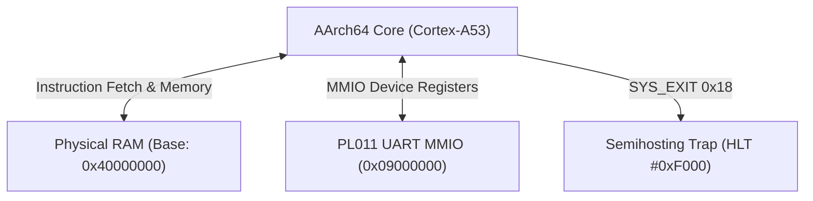

# Target Specification: AArch64 Architecture & Execution Models

This document defines the machine state model, native memory addressing modes, instruction set surface, ABI calling conventions, execution harnesses (Bare Metal and Linux), Cortex-A53 performance model, and mechanical verification obligations for the 64-bit ARM architecture (**AArch64 / ARMv8-A / ARMv9-A little-endian**).

---

## Features Discovered
| # | Category | Feature | Description | Inputs | Outputs | Error Behavior | Discovered Via |
|---|----------|---------|-------------|--------|---------|----------------|----------------|
| 1 | Architectural State | General Purpose Registers (`X0`–`X30`) | 31 64-bit integer registers accessed as 64-bit (`X`) or 32-bit (`W`) | Register identifier (0–30), width (`w64`/`w32`), value (`UInt64`/`UInt32`) | Updated machine register state | Register index > 30 is out-of-bounds | ARM DDI 0487, X86_64.md pattern |
| 2 | Architectural State | Zero Register (`XZR`/`WZR`) | Register 31 in data-processing contexts; reads 0, writes discarded | Register 31 in ALU / logical / load-store operand | Always `0` on read, no state change on write | Ignored write | ARM DDI 0487 §B1.2.1 |
| 3 | Architectural State | Stack Pointer (`SP`/`WSP`) | Register 31 in stack-modifying instructions and memory base operands | Value (`UInt64`), must maintain 16-byte alignment | Updated SP register | Misaligned SP generates alignment fault | ARM DDI 0487 §B1.2.2, AAPCS64 |
| 4 | Architectural State | Sub-Register Zero-Extension | Writes to 32-bit `W` registers zero-extend into upper 32 bits of 64-bit `X` | `UInt32` value written to `Wn` | Upper 32 bits cleared to 0 in `Xn` | None | ARM DDI 0487 §B1.2.1 |
| 5 | Architectural State | Condition Flags (`PSTATE.NZCV`) | Architectural status flags: Negative (N:31), Zero (Z:30), Carry (C:29), Overflow (V:28) | ALU result and operand sign/overflow properties | `UInt32` condition mask | Arithmetic wrap / borrow inverted | ARM DDI 0487 §B1.2.3 |
| 6 | Memory Addressing | Immediate Offset Addressing | Base register `Xn` plus scaled or unscaled immediate displacement | `base: RegOrSp`, `offset: Int64` | `base + offset`, writeback = `none` | Out-of-range displacement | ARM DDI 0487 §C4.1.4 |
| 7 | Memory Addressing | Pre-Indexed Writeback Addressing | Base register `Xn` plus immediate displacement with base writeback | `base: RegOrSp`, `offset: Int64` | `base + offset`, writeback = `some (base, base + offset)` | Base writeback to `XZR` invalid | ARM DDI 0487 §C4.1.4 |
| 8 | Memory Addressing | Post-Indexed Writeback Addressing | Base register `Xn` accessed, then base updated by immediate offset | `base: RegOrSp`, `offset: Int64` | `base`, writeback = `some (base, base + offset)` | Base writeback to `XZR` invalid | ARM DDI 0487 §C4.1.4 |
| 9 | Memory Addressing | Register Offset with Shift | Base register `Xn` plus shifted/extended index register `Xm` | `base: RegOrSp`, `index: Reg64`, `shift: Nat` | `base + (index <<< shift)`, writeback = `none` | Shift > 4 invalid for standard loads | ARM DDI 0487 §C4.1.4 |
| 10 | Memory Addressing | PC-Relative Literal Addressing | Program counter `PC` plus signed 19-bit/21-bit immediate offset | `PC`, `offset: Int64` | `PC + offset`, writeback = `none` | Offset unaligned to 4 bytes | ARM DDI 0487 §C4.1.5 |
| 11 | Instruction Surface | 15 Core Instruction Families | Instruction families covering arithmetic, logic, shift, wide move, mul/div, memory, branch, adr, system | 32-bit instruction word | State transition on machine | Unallocated opcode throws decode error | PROJECT.md, Spikes 1–5 |
| 12 | ABI & Calling Conv | AAPCS64 Calling Convention | Standard procedure call ABI: `X0`–`X7` args/returns, `X19`–`X28` callee-saved, `X29` FP, `X30` LR | Stack pointer, arguments, registers | Return value in `X0`, restored callee-saved regs | Misaligned stack on public call fails ABI | AAPCS64 specification |
| 13 | Bare Metal Target | QEMU `virt` Platform Execution | Direct ELF64 boot at physical RAM base `0x40000000` with PL011 UART MMIO and semihosting exit | Flat ELF64 binary loaded via QEMU `-kernel` | Serial output over PL011 (`0x09000000`), exit code via semihosting `HLT #0xF000` | Missing semihosting handler hangs CPU | ARM64.md reconnaissance, QEMU virt |
| 14 | Linux Target | Static ELF64 & `SVC #0` ABI | Linux user execution: `SVC #0`, `X8` syscall nr, `X0`–`X5` args, asm-generic numbers | Static ELF64 (`EM_AARCH64`), syscall operands | Syscall result in `X0`, negative `[-4095, -1]` on error | Unknown syscall returns `-ENOSYS` (`-38`) | LINUX.md, Linux asm-generic |
| 15 | Performance Model | Cortex-A53 Microarchitecture | Dual-issue in-order 8-stage pipeline performance model with uop classification and cycle bounds | Instruction stream, micro-op classes | Cycle bounds (min, nominal, max), port pressure | Unvalidated instructions fail CI gate | Cortex-A53 TRM, REVIEW.md Law 14 |

---

## Edge Cases
| # | Feature | Input | Observed Behavior |
|---|---------|-------|-------------------|
| 1 | Register Zeroing | `SUBS XZR, Xn, Xm` (`CMP`) | Discards destination arithmetic result; sets `NZCV` condition flags based on `Xn - Xm`. `XZR` remains 0. |
| 2 | Register 31 Dual Identity | `ADD SP, SP, #16` vs `ADD X0, XZR, #1` | When instruction opcodes designate SP-capable field, register 31 accesses `SP`; in standard data processing, register 31 accesses `XZR`. |
| 3 | 32-bit Sub-Register Write | Write `0xFFFFFFFF` to `W0` | `X0` becomes `0x00000000FFFFFFFF`; upper 32 bits are unconditionally zeroed out, never preserved. |
| 4 | NZCV Subtraction Carry | `SUBS Xd, 10, 5` vs `SUBS Xd, 5, 10` | ARM subtraction evaluates `C = 1` when no borrow occurs (`10 >= 5` yields `C=1`), and `C = 0` when borrow occurs (`5 < 10` yields `C=0`). Inverted relative to x86 CF! |
| 5 | NZCV Overflow Flag | `ADDS Xd, 0x7FFFFFFFFFFFFFFF, 1` | Adding 1 to maximum positive signed 64-bit integer produces negative result `0x8000000000000000`; sets `V = 1` (overflow) and `N = 1`. |
| 6 | Pre-Index Writeback | `LDR X0, [X1, #16]!` | Memory loaded from `X1 + 16`; `X1` updated to `X1 + 16` before data load completes. |
| 7 | Post-Index Writeback | `LDR X0, [X1], #16` | Memory loaded from `X1`; `X1` updated to `X1 + 16` after data load address is latched. |
| 8 | Load/Store Pair Alignment | `STP X29, X30, [SP, #-16]!` | Decrements `SP` by 16, stores `X29` at `SP`, `X30` at `SP + 8`. Requires 8-byte alignment (natively quadword aligned). |
| 9 | Unconditional Branch Range | `B offset26` | 26-bit signed immediate shifted left by 2 provides branch range of `±128 MB` around `PC`. |
| 10 | Direct Call Linkage | `BL offset26` | Saves sequential address `PC + 4` into Link Register `X30`, then jumps to target address. |
| 11 | Integer Division by Zero | `UDIV X0, X1, XZR` | In AArch64 hardware, integer division by zero does NOT generate a hardware trap or exception; it returns `0` in destination register `X0`. |
| 12 | Semihosting Clean Exit | `HLT #0xF000` with `SYS_EXIT` | Traps to QEMU semihosting handler; propagates guest exit code directly without bit shifts (unlike x86 isa-debug-exit). |
| 13 | Red Zone Absence | Stack frame leaf allocation | AAPCS64 specifies NO red zone. Any memory below `SP` is immediately subject to asynchronous corruption by interrupts or signal frames. |
| 14 | Linux Syscall Numbering | `SYS_write` on AArch64 vs x86-64 | `SYS_write` is 64 on AArch64 (asm-generic), whereas it is 1 on x86-64. Using 1 on AArch64 invokes `io_setup` and crashes. |
| 15 | PL011 UART Transmit FIFO | Burst writes to `UARTDR` | Writing to `UARTDR` when Flag Register bit 5 (`TXFF`) is 1 drops bytes or stalls; transmitter polling must check `TXFF == 0`. |

---

## Machine State

The native execution state for the 64-bit ARM architecture is formalized by the `AArch64MachineState` record, which models registers, execution pointers, condition flags, sealed memory, effect buffers, and execution stop conditions without OS abstractions.

```lean
structure AArch64MachineState where
  pc               : Address
  gprs             : Reg64 → UInt64
  sp               : Address
  nzcv             : UInt32
  memory           : AArch64Memory
  stdinBuffer      : ByteArray := ByteArray.empty
  incomingRequests : List String := []
  fault            : Option AArch64Fault := none
```

### Architectural State Components
1. **Program Counter (`pc : Address`)**: A 64-bit unsigned virtual address designating the currently fetched instruction word. Instructions in AArch64 are strictly 32-bit wide (4 bytes) and must be aligned to 4-byte boundaries. Normal sequential execution advances `pc` by 4 (`pc := pc + 4`).
2. **General Purpose Registers (`gprs : Reg64 → UInt64`)**: Mapping from 64-bit register identifiers (`X0`–`X30`) to their current 64-bit contents. When `XZR` is queried, it returns `0`.
3. **Dedicated Stack Pointer (`sp : Address`)**: A distinct 64-bit register representing the current stack top. The stack pointer is separate from general-purpose registers `X0`–`X30`, though it shares register encoding index 31 in instructions that support SP addressing.
4. **Condition Flags (`nzcv : UInt32`)**: Holds the architectural condition flags in bits 31:28 of `PSTATE.NZCV`.
5. **Sealed Memory Cell (`memory : AArch64Memory`)**: The sealed linear address space managed under `MemoryCell.lean`. Direct projection or synthesis is forbidden; all reads and writes route through `AArch64Mem.read` and `AArch64Mem.write`.
6. **Execution Stop Condition (`fault : Option AArch64Fault`)**: Encapsulates terminal machine states, differentiating clean halts, semihosting application termination, and illegal architectural conditions.

```lean
inductive AArch64Fault where
  | divideError
  | memFault (kind : MemAccessKind) (width : MemWidth) (addr : Address)
  | alignmentFault (addr : Address)
  | halted
  deriving DecidableEq, Repr, Inhabited
```

---

## Registers

AArch64 provides 31 general-purpose 64-bit registers designated `X0` through `X30`. In instruction encodings, a 5-bit register field (bits 0–31) specifies the register operand.

| 64-bit Register | 32-bit Sub-Register | Architectural Role | AAPCS64 Preserved Across Calls? |
| :--- | :--- | :--- | :--- |
| `X0` | `W0` | Argument 1 / Return Value 1 / Syscall Arg 1 & Return | No (Caller-Saved) |
| `X1` | `W1` | Argument 2 / Return Value 2 / Syscall Arg 2 | No (Caller-Saved) |
| `X2`–`X7` | `W2`–`W7` | Arguments 3–8 / Syscall Arguments 3–6 (`X2`–`X5`) | No (Caller-Saved) |
| `X8` | `W8` | Indirect Result Location (Struct Return) / Linux Syscall Number | No (Caller-Saved) |
| `X9`–`X15` | `W9`–`W15` | Temporary / Scratch Registers | No (Caller-Saved) |
| `X16` | `W16` | Intra-Procedure Call Temporary 0 (IP0) / Vendor PLT | No (Caller-Saved) |
| `X17` | `W17` | Intra-Procedure Call Temporary 1 (IP1) / Vendor PLT | No (Caller-Saved) |
| `X18` | `W18` | Platform Register (Reserved by platform ABIs, scratch on Linux) | Platform Dependent |
| `X19`–`X28` | `W19`–`W28` | Callee-Saved Registers | **Yes (Callee-Saved)** |
| `X29` | `W29` | Frame Pointer (FP) | **Yes (Callee-Saved)** |
| `X30` | `W30` | Link Register (LR) (Target of `BL`/`BLR`, return address) | Caller-Saved / Callee-Restored |
| `XZR` | `WZR` | Zero Register (reads 0, writes discarded) | N/A |
| `SP` | `WSP` | Stack Pointer (16-byte aligned) | **Yes (Preserved)** |

### Register Index 31 Dual Identity
In A64 assembly and machine code, register index 31 (`0b11111`) is dual-purposed depending on the instruction context:
1. **Zero Register (`XZR` / `WZR`)**: Used in standard integer arithmetic and logical data processing. Reads from register 31 return zero (`0x0000000000000000`), and writes to register 31 are silently discarded.
2. **Stack Pointer (`SP` / `WSP`)**: Used in load and store instructions as the base address, and in immediate arithmetic instructions (`ADD`/`SUB` immediate with SP).

```lean
inductive Reg64 where
  | x0  | x1  | x2  | x3  | x4  | x5  | x6  | x7
  | x8  | x9  | x10 | x11 | x12 | x13 | x14 | x15
  | x16 | x17 | x18 | x19 | x20 | x21 | x22 | x23
  | x24 | x25 | x26 | x27 | x28 | x29 | x30
  deriving DecidableEq, Repr, Inhabited

inductive Reg32 where
  | w0  | w1  | w2  | w3  | w4  | w5  | w6  | w7
  | w8  | w9  | w10 | w11 | w12 | w13 | w14 | w15
  | w16 | w17 | w18 | w19 | w20 | w21 | w22 | w23
  | w24 | w25 | w26 | w27 | w28 | w29 | w30
  deriving DecidableEq, Repr, Inhabited

inductive RegOrSp where
  | reg (r : Reg64)
  | sp
  deriving DecidableEq, Repr, Inhabited
```

---

## Sub-Register Aliasing & 32-Bit Zero-Extension Invariant

In AArch64 hardware:
- Every 32-bit register `Wn` represents the lower 32 bits of the corresponding 64-bit register `Xn`.
- **Zero-Extension Law**: Any write to a 32-bit sub-register `Wn` **unconditionally clears the upper 32 bits** (bits 63:32) of `Xn`. The 32-bit result is zero-extended into the 64-bit register cell.
- Unlike x86-64, where writes to 8-bit (`AL`, `AH`) or 16-bit (`AX`) registers preserve the upper bits of `RAX`, AArch64 has no native 8-bit or 16-bit GPR write instructions that preserve upper bits. Byte and halfword memory loads (`LDRB`, `LDRH`) write to `Wn` or `Xn` and either zero-extend or sign-extend (`LDRSB`, `LDRSH`) across the entire 32-bit or 64-bit destination.

```lean
/-- 32-bit sub-register write zero-extends into the upper 32 bits of the 64-bit register -/
def AArch64MachineState.setGpr32 (s : AArch64MachineState) (r : Reg32) (val : UInt32) : AArch64MachineState :=
  s.setGpr64 (reg32To64 r) val.toUInt64
```

---

## Condition Flags & NZCV Evaluation

AArch64 maintains four architectural condition flags stored in bits 31:28 of the `PSTATE.NZCV` system register:

| Flag | Bit Index | Bit Mask | Semantic Meaning | Evaluated By |
| :--- | :--- | :--- | :--- | :--- |
| **N** (Negative) | 31 | `0x80000000` | Most significant bit of result is 1 (signed negative) | `res >>> (width - 1) == 1` |
| **Z** (Zero) | 30 | `0x40000000` | Result of operation is exactly zero | `res == 0` |
| **C** (Carry) | 29 | `0x20000000` | Unsigned carry-out (addition) or NOT borrow (subtraction) | `Add: sum < a`, `Sub: a >= b` |
| **V** (Overflow) | 28 | `0x10000000` | Signed two's-complement arithmetic overflow | `Add: ((a ^ ~b) & (a ^ sum) & sign) != 0` |

### Inverted Carry Borrow Invariant
On AArch64, during subtraction operations (`SUBS`, `CMP`, `NEGS`):
- The Carry flag represents **NOT borrow**:
  - If `a >= b` (unsigned comparison), no borrow is required, and `C` is set to **`1`**.
  - If `a < b`, a borrow is required, and `C` is cleared to **`0`**.
- This is the exact inverse of x86-64 subtraction, where `CF = 1` denotes a borrow.

```lean
/-- Updates NZCV condition flags following a 64-bit subtraction (a - b) -/
def AArch64MachineState.setFlagsSub64 (s : AArch64MachineState) (a b : UInt64) : AArch64MachineState :=
  let diff := a - b
  let n : UInt32 := if (diff >>> 63) == 1 then 0x80000000 else 0
  let z : UInt32 := if diff == 0 then 0x40000000 else 0
  let c : UInt32 := if a >= b then 0x20000000 else 0
  let v : UInt32 := if (((a ^^^ b) &&& (a ^^^ diff) &&& 0x8000000000000000) != 0) then 0x10000000 else 0
  let preserved := s.nzcv &&& 0x0FFFFFFF
  { s with nzcv := preserved ||| n ||| z ||| c ||| v }
```

### Condition Code Evaluation Table
Conditional branches (`B.cond`) test `PSTATE.NZCV` using a 4-bit condition code field (`cond : UInt4`):

| Code (`cond`) | Mnemonic | Tested Condition | Description |
| :--- | :--- | :--- | :--- |
| `0000` | `EQ` | `Z == 1` | Equal |
| `0001` | `NE` | `Z == 0` | Not Equal |
| `0010` | `CS` / `HS` | `C == 1` | Carry Set / Unsigned Higher or Same |
| `0011` | `CC` / `LO` | `C == 0` | Carry Clear / Unsigned Lower |
| `0100` | `MI` | `N == 1` | Minus / Negative |
| `0101` | `PL` | `N == 0` | Plus / Positive or Zero |
| `0110` | `VS` | `V == 1` | Signed Overflow |
| `0111` | `VC` | `V == 0` | No Signed Overflow |
| `1000` | `HI` | `C == 1 && Z == 0` | Unsigned Higher |
| `1001` | `LS` | `!(C == 1 && Z == 0)` | Unsigned Lower or Same |
| `1010` | `GE` | `N == V` | Signed Greater Than or Equal |
| `1011` | `LT` | `N != V` | Signed Less Than |
| `1100` | `GT` | `Z == 0 && N == V` | Signed Greater Than |
| `1101` | `LE` | `!(Z == 0 && N == V)` | Signed Less Than or Equal |
| `1110` | `AL` | `true` | Always executed |
| `1111` | `NV` | `true` | Always executed (Reserved alias) |

---

## Addressing Modes

AArch64 memory instructions support five native addressing modes formalized by the `AArch64AddrMode` inductive type:

```lean
inductive AArch64AddrMode where
  | immOffset (base : RegOrSp) (offset : Int64)
  | preIndex  (base : RegOrSp) (offset : Int64)
  | postIndex (base : RegOrSp) (offset : Int64)
  | regOffset (base : RegOrSp) (index : Reg64) (shift : Nat)
  | literal   (offset : Int64)
  deriving DecidableEq, Repr, Inhabited
```

### Addressing Mode Mechanics & Evaluation
Evaluation produces an effective memory address along with an optional base register writeback pair:
`evalAddr : AArch64AddrMode → AArch64MachineState → Address × Option (RegOrSp × Address)`

1. **Immediate Offset (`[Xn, #offset]`)**:
   - Computes address: `address := baseValue + offset`.
   - Base register is unmodified (`writeback := none`).
   - Supports 12-bit unsigned immediate scaled by access size (0 to 32760 for 64-bit), or 9-bit signed unscaled immediate (`LDUR`/`STUR`, range -256 to +255).
2. **Pre-Indexed Writeback (`[Xn, #offset]!`)**:
   - Computes address: `address := baseValue + offset`.
   - Base register is updated before memory access (`writeback := some (base, address)`).
   - Signed 9-bit immediate in range `[-256, 255]`.
3. **Post-Indexed Writeback (`[Xn], #offset`)**:
   - Computes address: `address := baseValue`.
   - Base register is updated after memory access (`writeback := some (base, baseValue + offset)`).
   - Signed 9-bit immediate in range `[-256, 255]`.
4. **Register Offset (`[Xn, Xm{, LSL #shift}]`)**:
   - Computes address: `address := baseValue + (indexValue <<< shift)`.
   - Shift amount is `0` or `log2(access_bytes)` (e.g. `3` for 64-bit, `2` for 32-bit).
   - Base register is unmodified (`writeback := none`).
5. **PC-Relative Literal (`literal offset`)**:
   - Computes address: `address := pc + offset`.
   - Signed 19-bit immediate scaled by 4 (range `±1 MB`) used in `LDR Xd, label`.
   - Base register is unmodified (`writeback := none`).

---

## Instruction Surface & 15 Core Instruction Families

The instruction surface for AArch64 comprises 15 instruction families required for Spikes 1–5, implemented via the `AArch64Instruction` typeclass interface with modular 32-bit codecs, micro-op decompositions, and round-trip verification obligations.

### 1. AddSubImm Family
Immediate arithmetic supporting 12-bit unsigned immediates with optional 12-bit left shift (`LSL #0` or `LSL #12`):
- `ADD Xd|Wd, Xn|Wn, #imm12{, LSL #0|#12}`: Integer addition without flag update.
- `ADDS Xd|Wd, Xn|Wn, #imm12{, LSL #0|#12}`: Integer addition updating `NZCV` flags.
- `SUB Xd|Wd, Xn|Wn, #imm12{, LSL #0|#12}`: Integer subtraction without flag update.
- `SUBS Xd|Wd, Xn|Wn, #imm12{, LSL #0|#12}`: Integer subtraction updating `NZCV` flags.
- **Aliases**: `CMP Xn|Wn, #imm12` is encoded as `SUBS XZR|WZR, Xn|Wn, #imm12`.
- **Opcode Template**: `[sf:1][op:1][S:1][100010][shift:2][imm12:12][Rn:5][Rd:5]`

### 2. AddSubReg Family
Register arithmetic supporting shifted register operands (shift by 0 to 63):
- `ADD Xd|Wd, Xn|Wn, Xm|Wm{, shift #amount}`: Register addition.
- `ADDS Xd|Wd, Xn|Wn, Xm|Wm{, shift #amount}`: Register addition setting `NZCV` flags.
- `SUB Xd|Wd, Xn|Wn, Xm|Wm{, shift #amount}`: Register subtraction.
- `SUBS Xd|Wd, Xn|Wn, Xm|Wm{, shift #amount}`: Register subtraction setting `NZCV` flags.
- **Aliases**: `CMP Xn|Wn, Xm|Wm` is encoded as `SUBS XZR|WZR, Xn|Wn, Xm|Wm`. `CMN` is encoded as `ADDS`.
- **Opcode Template**: `[sf:1][op:1][S:1][01011][shift:2][0][Rm:5][imm6:6][Rn:5][Rd:5]`

### 3. LogicalImm Family
Bitwise logical operations against repeating bitmask immediates:
- `AND Xd|Wd, Xn|Wn, #bitmask`: Bitwise AND.
- `ANDS Xd|Wd, Xn|Wn, #bitmask`: Bitwise AND updating `NZCV` flags (`N` and `Z` set from result, `C=0, V=0`).
- `ORR Xd|Wd, Xn|Wn, #bitmask`: Bitwise OR.
- `EOR Xd|Wd, Xn|Wn, #bitmask`: Bitwise Exclusive-OR.
- **Aliases**: `TST Xn|Wn, #bitmask` is encoded as `ANDS XZR|WZR, Xn|Wn, #bitmask`.
- **Opcode Template**: `[sf:1][opc:2][100100][N:1][immr:6][imms:6][Rn:5][Rd:5]`

### 4. LogicalReg Family
Bitwise register logical operations with optional shifted operands:
- `AND Xd|Wd, Xn|Wn, Xm|Wm{, shift #amount}`: Bitwise AND.
- `ANDS Xd|Wd, Xn|Wn, Xm|Wm{, shift #amount}`: Bitwise AND setting `N` and `Z` flags.
- `ORR Xd|Wd, Xn|Wn, Xm|Wm{, shift #amount}`: Bitwise OR. Includes register move `MOV Xd, Xm` (encoded as `ORR Xd, XZR, Xm`).
- `EOR Xd|Wd, Xn|Wn, Xm|Wm{, shift #amount}`: Bitwise Exclusive-OR.
- `BIC Xd|Wd, Xn|Wn, Xm|Wm{, shift #amount}`: Bit clear: `Xn AND NOT(Xm)`.
- `ORN Xd|Wd, Xn|Wn, Xm|Wm{, shift #amount}`: Bitwise OR NOT: `Xn OR NOT(Xm)`.
- `EON Xd|Wd, Xn|Wn, Xm|Wm{, shift #amount}`: Bitwise Equivalent: `Xn EOR NOT(Xm)`.
- **Opcode Template**: `[sf:1][opc:2][01010][shift:2][N:1][Rm:5][imm6:6][Rn:5][Rd:5]`

### 5. Shift Family
Logical and arithmetic register shifts:
- `LSL Xd|Wd, Xn|Wn, #shift`: Logical Shift Left (immediate).
- `LSR Xd|Wd, Xn|Wn, #shift`: Logical Shift Right (immediate).
- `ASR Xd|Wd, Xn|Wn, #shift`: Arithmetic Shift Right (immediate).
- `ROR Xd|Wd, Xn|Wn, #shift`: Rotate Right (immediate).
- `LSLV`, `LSRV`, `ASRV`, `RORV`: Variable shifts taking register amount `Xm|Wm`.
- **Opcode Template**: Variable shifts encoded under data processing 2-source: `[sf:1][0][0][11010110][Rm:5][0010][op:2][Rn:5][Rd:5]`.

### 6. MoveWide Family
Loading 16-bit immediates into any 16-bit quarter of a 64-bit or 32-bit register:
- `MOVZ Xd|Wd, #imm16{, LSL #hw}`: Move Wide with Zero (clears all other quarters to 0).
- `MOVN Xd|Wd, #imm16{, LSL #hw}`: Move Wide with NOT (inverts all bits of the immediate).
- `MOVK Xd|Wd, #imm16{, LSL #hw}`: Move Wide with Keep (updates specified 16-bit quarter, preserving others).
- `hw`: Quarter index: `0` (shift 0), `1` (shift 16), `2` (shift 32), `3` (shift 48).
- **Opcode Template**: `[sf:1][opc:2][100101][hw:2][imm16:16][Rd:5]`

### 7. MultiplyDivide Family
Integer multiplication and division:
- `MUL Xd|Wd, Xn|Wn, Xm|Wm`: Integer multiply `Xd := Xn * Xm`.
- `MADD Xd|Wd, Xn|Wn, Xm|Wm, Xa|Wa`: Multiply-Add `Xd := Xa + (Xn * Xm)`.
- `MSUB Xd|Wd, Xn|Wn, Xm|Wm, Xa|Wa`: Multiply-Subtract `Xd := Xa - (Xn * Xm)`.
- `SMULL Xd, Wn, Wm`: Signed multiply long (32×32 → 64-bit signed).
- `UMULL Xd, Wn, Wm`: Unsigned multiply long (32×32 → 64-bit unsigned).
- `SDIV Xd|Wd, Xn|Wn, Xm|Wm`: Signed integer division. Division by zero returns `0`.
- `UDIV Xd|Wd, Xn|Wn, Xm|Wm`: Unsigned integer division. Division by zero returns `0`.
- **Opcode Template**: 3-source multiply: `[sf:1][00][11011][000][Rm:5][0][Ra:5][Rn:5][Rd:5]`; division: `[sf:1][00][11010110][Rm:5][00001][op:1][Rn:5][Rd:5]`.

### 8. LoadStoreImm Family
Load and store with immediate offsets, covering 64-bit, 32-bit, 16-bit, and 8-bit widths:
- `LDR Xd|Wd, [Xn, #imm12]`: Load register (unsigned scaled offset).
- `STR Xd|Wd, [Xn, #imm12]`: Store register (unsigned scaled offset).
- `LDRB Wt, [Xn, #imm12]`: Load byte, zero-extending into `Wt`.
- `STRB Wt, [Xn, #imm12]`: Store byte (lowest 8 bits of `Wt`).
- `LDRH Wt, [Xn, #imm12]`: Load halfword, zero-extending into `Wt`.
- `STRH Wt, [Xn, #imm12]`: Store halfword (lowest 16 bits of `Wt`).
- `LDRSB Xd|Wt, [Xn, #imm12]`: Load signed byte (sign-extended to 64 or 32 bits).
- `LDRSH Xd|Wt, [Xn, #imm12]`: Load signed halfword.
- `LDRSW Xd, [Xn, #imm12]`: Load signed word (sign-extends 32 bits to 64-bit `Xd`).
- `LDUR` / `STUR`: Unscaled 9-bit signed immediate offset load/store (`[-256, 255]`).
- Pre/Post-Indexed forms: `LDR Xd, [Xn, #imm9]!` and `LDR Xd, [Xn], #imm9`.
- **Opcode Template**: Unsigned immediate: `[size:2][111][V:0][01][opc:2][imm12:12][Rn:5][Rt:5]`.

### 9. LoadStoreReg Family
Load and store with register offset:
- `LDR Xt|Wt, [Xn, Xm{, LSL #shift}]`: Load using base + shifted index.
- `STR Xt|Wt, [Xn, Xm{, LSL #shift}]`: Store using base + shifted index.
- `LDRB` / `STRB`, `LDRH` / `STRH` register-offset forms.
- **Opcode Template**: `[size:2][111][V:0][00][opc:2][1][Rm:5][option:3][S:1][10][Rn:5][Rt:5]`.

### 10. LoadStorePair Family
Atomic loading and storing of two adjacent 64-bit or 32-bit registers (crucial for stack management):
- `STP Xt1, Xt2, [Xn, #imm7]`: Store Pair of registers with signed scaled 7-bit immediate offset.
- `LDP Xt1, Xt2, [Xn, #imm7]`: Load Pair of registers.
- `STP Xt1, Xt2, [Xn, #imm7]!`: Pre-index writeback store pair (e.g. `STP X29, X30, [SP, #-16]!`).
- `LDP Xt1, Xt2, [Xn], #imm7`: Post-index writeback load pair (e.g. `LDP X29, X30, [SP], #16`).
- **Opcode Template**: `[opc:2][101][0][V:0][mode:2][L:1][imm7:7][Rt2:5][Rn:5][Rt1:5]`.

### 11. BranchImm Family
Unconditional PC-relative branch instructions:
- `B label`: Direct branch to `PC + signExtend(imm26 << 2)`. Range is `±128 MB`.
- `BL label`: Branch with Link. Saves sequential return address `PC + 4` into Link Register `X30`, then jumps to `label`.
- **Opcode Template**: `[op:1][00101][imm26:26]`, where `op=0` is `B` and `op=1` is `BL`.

### 12. BranchCond Family
Conditional branch instructions:
- `B.cond label`: Branches to `PC + signExtend(imm19 << 2)` if condition code `cond` matches `NZCV`. Range is `±1 MB`.
- `CBZ Rt, label`: Compare and Branch on Zero. Branches if `Rt == 0` without updating flags.
- `CBNZ Rt, label`: Compare and Branch on Non-Zero.
- **Opcode Template**: `B.cond`: `[0101010][0][imm19:19][0][cond:4]`; `CBZ/CBNZ`: `[sf:1][011010][op:1][imm19:19][Rt:5]`.

### 13. BranchReg Family
Register indirect branches:
- `BR Xn`: Branch to address held in register `Xn`.
- `BLR Xn`: Branch with Link to register. Sets `X30 := PC + 4` and branches to `Xn`.
- `RET {Xn}`: Return from subroutine. Branches to address held in register `Xn` (defaults to `X30` / LR).
- **Opcode Template**: `[1101011][0000][11111][00000][op:2][Rn:5][00000]`, where `op=0` is `BR`, `op=1` is `BLR`, `op=2` is `RET`.

### 14. Adr Family
PC-relative address calculation instructions:
- `ADR Xd, label`: Computes address `PC + signExtend(imm21)` within `±1 MB` of current instruction.
- `ADRP Xd, label`: Computes 4 KB page base address `(PC & ~0xFFF) + signExtend(imm21 << 12)` within `±4 GB`. Used with `ADD` or `LDR` to load arbitrary global data addresses.
- **Opcode Template**: `[op:1][immlo:2][10000][immhi:19][Rd:5]`, where `op=0` is `ADR` and `op=1` is `ADRP`.

### 15. System Family
Hardware control, exception generation, and barrier instructions:
- `HLT #imm16`: Halts processor core or invokes host debug/semihosting handler (`HLT #0xF000` on AArch64).
- `SVC #imm16`: Supervisor Call. Generates system call exception to EL1 (`SVC #0` for Linux syscalls).
- `NOP`: No-operation instruction (`0xD503201F`).
- `DMB #opt` / `DSB #opt` / `ISB`: Data Memory Barrier, Data Synchronization Barrier, Instruction Synchronization Barrier.
- `MRS Xd, S3_...` / `MSR S3_..., Xn`: System register access (e.g. reading/writing `NZCV`).

---

## AAPCS64 Calling Convention & ABI Disciplines

Subroutine calls adhere to the Procedure Call Standard for the Arm 64-bit Architecture (**AAPCS64**):

```
+-------------------------------------------------------------+
| Higher Memory Addresses (Caller's Stack Frame)              |
+-------------------------------------------------------------+
| Incoming Arguments (Beyond 8th parameter, pushed on stack)  |
+-------------------------------------------------------------+ <- SP at entry
| Saved Link Register (X30) (8 bytes)                         |
+-------------------------------------------------------------+
| Saved Frame Pointer (X29) (8 bytes)                         | <- X29 (FP) points here
+-------------------------------------------------------------+
| Callee-Saved Registers (X19–X28)                            |
+-------------------------------------------------------------+
| Local Variables & Spills                                    |
+-------------------------------------------------------------+
| Outgoing Arguments for Child Subroutines                    |
+-------------------------------------------------------------+ <- SP at child call (16-byte aligned)
```

### Argument & Return Value Allocation
- **General Integer Arguments (1 to 8)**: Passed in registers `X0` through `X7` (or `W0` through `W7` for 32-bit values).
- **Excess Arguments**: Arguments 9 and beyond are passed on the stack, pushed right-to-left.
- **Return Values**:
  - Up to 64 bits: Returned in `X0`.
  - 128-bit values: Returned in `X0` (low 64 bits) and `X1` (high 64 bits).
  - Large structures: The caller allocates memory and passes an indirect result pointer in `X8`.

### Stack Alignment Invariant
- At every public interface call boundary and whenever memory is accessed via `SP`, `SP` **must be 16-byte aligned**:
  `SP ≡ 0 (mod 16)`.
- If an instruction accesses memory using an unaligned `SP`, the core raises an SP alignment fault exception.

### Strict Prohibition of the Red Zone
- Unlike the x86-64 System V AMD64 ABI (which designates a 128-byte red zone below `RSP`), **standard AAPCS64 provides ZERO Red Zone**.
- The stack pointer `SP` must always point at or below all live stack data.
- Asynchronous events (Linux kernel signal handlers, hardware interrupts in bare metal) write exception frames directly below `SP`. Any routine storing temporary data below `SP` without allocating space via `SUB SP, SP, #size` suffers non-deterministic memory corruption upon interrupt or signal arrival.

### Standard Function Linkage Sequence
```asm
// Subroutine Prologue
stp  x29, x30, [sp, #-16]!   // Push FP and LR, decrement SP by 16 (16-byte aligned)
mov  x29, sp                 // Set FP to current frame record

// Subroutine Body
// ... (callee-saved registers X19-X28 pushed via STP if used)

// Subroutine Epilogue
mov  sp, x29                 // Restore SP to frame base
ldp  x29, x30, [sp], #16     // Pop FP and LR, increment SP by 16
ret                          // Return to caller via LR (X30)
```

---

## 13. Bare Metal Target: QEMU virt Platform Execution

The bare-metal execution environment executes directly on physical hardware or virtualized hardware without an operating system kernel.



### 1. QEMU Virt Board Layout & ELF Loading
- **Target Platform**: `qemu-system-aarch64 -M virt -cpu cortex-a53 -semihosting`.
- **Physical Memory Base**: `0x40000000` (1 GB physical DRAM base in QEMU `virt`).
- **Binary Format**: Flat ELF64 executable (`ET_EXEC = 2`, `EM_AARCH64 = 183` / `0xB7`).
- **Direct ELF Loading**: QEMU's `-kernel` loader directly parses `PT_LOAD` segments, maps them to physical RAM at `p_paddr`, and jumps to `e_entry`.
- **No PVH Note Segment**: Unlike x86-64 bare metal (which requires a Xen PVH `PT_NOTE` segment), AArch64 bare metal requires no PVH boot note and no Linux boot header.

### 2. PrimeCell PL011 UART MMIO Protocol
Console serial I/O communicates with ARM's PrimeCell PL011 UART mapped at fixed physical address `0x09000000`:
- **`UARTDR` (`0x09000000`)**: Data Register (Offset `0x00`).
  - Writes: Byte transmitted over serial line.
  - Reads: Next received byte popped from RX FIFO.
- **`UARTFR` (`0x09000018`)**: Flag Register (Offset `0x18`).
  - Bit 5 (`TXFF`, `0x20`): Transmit FIFO Full.
  - Bit 3 (`BUSY`, `0x08`): UART Busy.
  - Bit 4 (`RXFE`, `0x10`): Receive FIFO Empty.

#### Transmit Polling Driver
Before writing each byte, software polls `UARTFR` until `TXFF` is 0:
```asm
// x0 = PL011 Base Address (0x09000000)
// w1 = Character to transmit
1:  ldr  w2, [x0, #0x18]      // Read UARTFR
    tst  w2, #0x20            // Test TXFF (bit 5)
    b.ne 1b                   // If full, loop until ready
    strb w1, [x0]             // Write byte to UARTDR
```

### 3. AArch64 Semihosting Programmatic Exit
Program termination under virtualized test harnesses uses ARM Semihosting:
- **Instruction**: `HLT #0xF000` (`0xD45E0000`).
- **Register Interface**:
  - `W0` = `0x18` (`SYS_EXIT`).
  - `X1` = Address of 16-byte parameter block in memory:
    - Offset `0x00`: Reason code `ADP_Stopped_ApplicationExit` (`0x20026`).
    - Offset `0x08`: Guest process exit code (e.g. `0` for success, or custom code `42`).
- **Exit Code Propagation**: QEMU propagates the exit code directly as its process exit code without arithmetic modifications (unlike x86-64 `isa-debug-exit` which computes `(val << 1) | 1`).

---

## 14. Linux Target: Static ELF64 & SVC #0 ABI

Under the Linux platform target, user executables interact with the Linux kernel through static ELF64 emission and the AArch64 Linux system call ABI.

### 1. Static ELF64 Executable Format
Executables are emitted with standard ELF64 headers targeting `EM_AARCH64`:
- `e_machine`: `183` (`0xB7` / `EM_AARCH64`).
- Standard User Base Address: `0x400000`.
- Standard Stack Initialization: `0x7FFFFFFF0000`.

### 2. System Call ABI Conventions
- **Syscall Instruction**: `SVC #0` (`0xD4000001`).
- **Syscall Number**: Loaded into register **`X8`**.
- **Arguments (1 to 6)**: Passed in registers **`X0, X1, X2, X3, X4, X5`**.
- **Return Value**: Returned in register **`X0`**.
- **Error Return Protocol**: Return values in the range `[-4095, -1]` (unsigned `0xFFFFFFFFFFFFF001` .. `0xFFFFFFFFFFFFFFFF`) denote negative error codes (`-errno`).
- **Preserved Registers**: Registers `X19`–`X28` and `X29` (FP) are preserved across system calls by the kernel.

### 3. Linux asm-generic Syscall Mapping
AArch64 uses the modern Linux `asm-generic` unistd table, differing substantially from legacy x86-64 numbers:

| System Call | AArch64 Syscall Nr (`X8`) | x86-64 Syscall Nr (`RAX`) | Arguments (`X0`–`X5` on AArch64) |
| :--- | :--- | :--- | :--- |
| `SYS_io_setup` | 0 | (N/A) | `nr_events`, `ctx_id` |
| `SYS_close` | **57** | 3 | `fd` |
| `SYS_read` | **63** | 0 | `fd`, `buf`, `count` |
| `SYS_write` | **64** | 1 | `fd`, `buf`, `count` |
| `SYS_exit` | **93** | 60 | `error_code` |
| `SYS_exit_group` | **94** | 231 | `error_code` |
| `SYS_socket` | **198** | 41 | `domain`, `type`, `protocol` |
| `SYS_bind` | **200** | 49 | `fd`, `addr`, `addrlen` |
| `SYS_listen` | **201** | 50 | `fd`, `backlog` |
| `SYS_accept` | **202** | 43 | `fd`, `addr`, `addrlen` |
| `SYS_sendto` | **206** | 44 | `fd`, `buf`, `len`, `flags`, `dest_addr`, `addrlen` |
| `SYS_recvfrom` | **207** | 45 | `fd`, `buf`, `len`, `flags`, `src_addr`, `addrlen` |
| `SYS_munmap` | **215** | 11 | `addr`, `length` |
| `SYS_mmap` | **222** | 9 | `addr`, `length`, `prot`, `flags`, `fd`, `offset` |

---

## Cortex-A53 Performance Model & Validation Obligations

Instruction latency and micro-op scheduling are parameterized against the **ARM Cortex-A53** processor, a canonical power-efficient 64-bit core featuring an in-order, 8-stage superscalar dual-issue pipeline.

### 1. Pipeline Microarchitecture & Dual-Issue Rules
- **Fetch & Decode Width**: 2 instructions per cycle.
- **Execution Pipelines**:
  - **Pipe 0 (ALU0 / Branch / Load-Store)**: Can execute simple ALU, branch, and memory operations.
  - **Pipe 1 (ALU1 / Shift / Crypto)**: Can execute simple ALU and shifted operations.
- **Dual-Issue Pairing Restrictions**:
  - Two integer ALU instructions can dual-issue (one on Pipe 0, one on Pipe 1).
  - An integer ALU instruction and a Branch or Load/Store can dual-issue.
  - Two Load/Store instructions cannot dual-issue.
  - Two Branch instructions cannot dual-issue.

### 2. Execution Latencies & Micro-Op Classification
```lean
inductive AArch64UopClass where
  | intALU
  | intShift
  | intMul
  | intDiv
  | load
  | store
  | branch
  | system
  deriving Repr, DecidableEq, Inhabited

structure AArch64Uop where
  mnemonic             : String := "NOP"
  uopClass             : AArch64UopClass := .intALU
  latencyCycles        : Nat := 1
  reciprocalThroughput : Float := 0.5
  deriving Repr, Inhabited
```

| Instruction Category | Execution Unit | Latency (Cycles) | Reciprocal Throughput (Cycles/Instr) |
| :--- | :--- | :--- | :--- |
| Simple ALU (`ADD`, `SUB`, `AND`, `ORR`, `MOV`) | ALU0 / ALU1 | 1 | 0.5 (Dual-issue) |
| Shifted ALU (`ADD Xd, Xn, Xm, LSL #2`) | ALU1 | 2 | 1.0 |
| Multiply 32-bit (`MUL Wd, Wn, Wm`) | Multiplier | 3 | 1.0 |
| Multiply 64-bit (`MUL Xd, Xn, Xm`) | Multiplier | 4 | 2.0 |
| Integer Divide (`SDIV`, `UDIV`) | Divider | 4 to 20 (Iterative) | 4 to 20 (Unpipelined) |
| Load (`LDR Xd, [Xn]`) | Load/Store Unit | 3 (L1 D-Cache Hit) | 1.0 |
| Store (`STR Xd, [Xn]`) | Load/Store Unit | 1 | 1.0 |
| Direct Branch (`B`, `BL`) | Branch Unit | 1 | 1.0 (8 cycles on mispredict) |

### 3. Mandatory Validation Obligations & Cost Provenance (Laws 13 & 14)
Per repository governance (P4/P5 unified obligations), every AArch64 instruction instance must declare:
```lean
inductive AArch64ValidationOracle where
  | silicon
  | llvmMcEncoding (reason : String)
  | optedOut       (reason : String)
  deriving Repr, DecidableEq, Inhabited

inductive CoefficientProvenance where
  | cited (artifact : String)
  | modelInternalUnvalidated (reason : String)
  deriving Repr, DecidableEq, Inhabited
```

- **Validation Oracle Enforcement**: `CheckAArch64Obligations.lean` verifies that instances claiming `.llvmMcEncoding` or `.optedOut` carry non-empty, justified rationale strings (≥ 20 characters).
- **Cost Provenance Honesty**: Since RDTSC / PMU calibration data for Cortex-A53 is not yet measured in-tree, all coefficients must honestly declare `.modelInternalUnvalidated "Cortex-A53 TRM initial nominal estimates uncalibrated against hardware PMU harness"`.

---

## Encodable Instruction Registry, Codec & Roundtrip Gate

Soundness of the 32-bit binary encoder and decoder is mechanically proven using Lean's kernel:

### 1. The `roundtripCases` Requirement
Every instruction instance must implement `roundtripCases : List ι` enumerating a representative finite sample of its operand space:
- All 31 registers across every register operand slot.
- Zero register `XZR` and `SP` in all valid configurations.
- Boundary immediates (0, small values, boundary bitmasks, signed extremes).

### 2. Sharded Roundtrip Gate Architecture
To prevent parallel elaboration memory pressure and isolate proof dependencies:
- Each instruction family `Gasm/Targets/AArch64/Instructions/<Family>.lean` exports `<family>TryDecode : ByteArray → Nat → Except String (AnyAArch64Instruction × Nat)`.
- A dedicated shard `Gasm/Targets/AArch64/RoundtripGate/<Family>.lean` proves:
  ```lean
  theorem <family>_roundtripGate : (<family>Cases).all (decodesOk <family>TryDecode) = true := by decide
  ```
- The global decoder `Gasm/Targets/AArch64/Decoder.lean` acts as an ordered dispatcher trying each family decoder.

---

## Vertical Spikes 1–5 on AArch64

| Spike | Title | Bare Metal / Linux | Key Instructions Exercised | Verification Surface |
| :--- | :--- | :--- | :--- | :--- |
| **Spike 1** | Hello World | Both | `MOVZ`, `MOVK`, `STRB`, `B`, `HLT` (Bare Metal); `MOVZ`, `ADR`, `SVC #0` (Linux) | Exact stdout bytes (`"Hello, World!\n"`) and process exit code 0 |
| **Spike 2** | Fibonacci | Linux | `ADD`, `SUBS`, `B.cond`, `UDIV`, `MSUB`, `BL`, `RET`, `STP`, `LDP` | Trace equivalence between iterative machine execution and mathematical Fibonacci function |
| **Spike 3** | Sort Lines | Linux | `SmolAlloc` dynamic memory, `LDR`, `STR`, `LDRB`, pointer arithmetic, quicksort swap | Sorting arbitrary line buffers, verified against spec trace |
| **Spike 4** | HTTP Server | Linux | Linux socket syscalls (`socket`, `bind`, `listen`, `accept`, `sendto`, `recvfrom`), request routing | HTTP 1.1 GET `/` and `/status` route responses, tested against QEMU |
| **Spike 5** | GZIP / GUNZIP | Linux | DEFLATE RFC 1951 bitstream shifts (`LSL`, `LSR`), bitwise logic (`AND`, `ORR`, `EOR`), CRC32 table loop | Bit-for-bit RFC 1952 gzip archive compression and decompression equivalence |

---

## Empirical QEMU Bring-Up & Verification Traces

During Milestone M1 reconnaissance, exact byte streams were generated by hand and booted under `qemu-system-aarch64` to establish empirical ground truth:

### 1. Probe 1: Direct Serial Output over PL011 UART
```
entry=0x40000078  8 instruction words, 32 bytes of code
  0xd2a12000   movz x0, #0x0900, lsl #16      ; x0 = 0x09000000 (PL011 base)
  0x52800901   movz w1, #0x48                 ; 'H'
  0x39000001   strb w1, [x0]
  0x52800d21   movz w1, #0x69                 ; 'i'
  0x39000001   strb w1, [x0]
  0x52800141   movz w1, #0x0a                 ; '\n'
  0x39000001   strb w1, [x0]
  0x14000000   b .                            ; spin forever
```
- Invocations: `qemu-system-aarch64 -M virt -cpu cortex-a53 -kernel spike_arm_hello.elf -serial stdio -display none -nodefaults`
- Observed Output: Exact bytes `Hi\n`.

### 2. Probe 2: PL011 UART Output + Semihosting Programmatic Exit
```
entry=0x40000078  11 instruction words + 16 bytes of data block
  0xd2a12000   movz x0, #0x0900, lsl #16
  0x52800901   movz w1, #0x48
  0x39000001   strb w1, [x0]
  0x52800d21   movz w1, #0x69
  0x39000001   strb w1, [x0]
  0x52800141   movz w1, #0x0a
  0x39000001   strb w1, [x0]
  0xd2a80001   movz x1, #0x4000, lsl #16      ; x1 = 0x400000a4 (data block)
  0xf2801481   movk x1, #0x00a4
  0x52800300   movz w0, #0x18                 ; SYS_EXIT
  0xd45e0000   hlt  #0xf000                   ; semihosting trap
  ; trailing data at 0x400000a4: [0x0000000000020026, 0x000000000000002a] (reason, code=42)
```


Each is wrapped in the smallest possible `ET_EXEC` / `EM_AARCH64` (`e_machine = 183`) ELF64:
64-byte ELF header + one 56-byte `PT_LOAD` program header (R+X, `p_vaddr = p_paddr =
0x40000000`, `p_filesz = p_memsz` = whole file, `p_align = 0x10000`) immediately followed by
the code (and, for probe 2, the trailing data block). `e_entry = 0x40000078` (base + header
size). No section headers, no relocations, no linker — this is the same "flat physical
memory model" `docs/TARGETS/BARE_METAL.md` §3.3 already describes for x86-64, just without
that section's Xen PVH note requirement (see §1 above).

The full generator (self-contained, stdlib-only Python, ~70 lines per probe) computes every
word directly from field formulas — e.g. `MOVZ` 64-bit: `(1<<31)|(0b10<<29)|(0b100101<<23)|
(hw<<21)|(imm16<<5)|Rd`, `STRB` (immediate, unsigned offset): `(0b00<<30)|(0b111<<27)|
(0<<26)|(0b01<<24)|(0b00<<22)|(imm12<<10)|(Rn<<5)|Rt` — cross-checked against known hex
patterns (`0xD2800000` = bare `MOVZ Xd,#0` with `hw=0`, `0x39000000` = bare `STRB` with
`imm12=Rn=Rt=0`) before use. Available on request; not committed to the tree since it is
throwaway reconnaissance tooling, not part of any target implementation.

### 2.3 Boot commands and observed output

**Probe 1** (serial only, no exit device — the program spins forever by design, so the
observer applies its own timeout and kills the process after capturing output):

```
qemu-system-aarch64.exe -M virt -cpu cortex-a53 -kernel spike_arm_hello.elf \
  -serial stdio -display none -nodefaults
```

Observed stdout, byte for byte: `Hi\n` — then the process was killed externally after 10s
(exit status reflects the kill, not the guest program, since probe 1 has no exit path by
construction).

**Probe 2** (serial + semihosting exit):

```
qemu-system-aarch64.exe -M virt -cpu cortex-a53 -semihosting -kernel spike_arm_exit.elf \
  -serial stdio -display none -nodefaults
```

Observed stdout, byte for byte: `Hi\n`. **Observed process exit code: `42`** — exactly the
value placed in the guest's semihosting exit-code block, propagated unmodified as QEMU's own
process exit status. `-semihosting-config help` on this same QEMU build confirms
`semihosting-config` is a real, present option for this target (`arg`, `chardev`, `enable`,
`target`, `userspace`) — semihosting on `virt` is not a hypothetical.

This is the complete demonstrated loop: hand-written bytes → emulator → observed serial
output → observed programmatic exit, both halves closed and both directly witnessed, not
inferred from documentation.

---

## 3. Options evaluated

- **`qemu-system-aarch64` bare metal, `-M virt` (recommended).** Directly demonstrated
  above. Least OS surface between emitted bytes and the CPU — the same property that made
  bare-metal x86 the right first target rather than Linux/Windows. PL011 UART + semihosting
  exit is a complete, minimal I/O story, mirroring 16550 UART + `isa-debug-exit` on x86
  almost exactly (see §4 for where the two conventions diverge).
- **`qemu-aarch64` user-mode.** Not tried in this reconnaissance — noted as cheaper to reach
  *if* an ARM target were emitting ELF64 Linux binaries (the way the existing Linux/x86-64
  target does), since it runs a static ARM Linux ELF directly against the host kernel's
  syscall translation, no machine model needed at all. But it validates strictly less of the
  stack: no MMIO, no device model, no boot sequence, and Linux user-mode syscall ABI is a
  different, larger surface than a bare-metal UART loop. Given bare metal is already proven
  reachable and is the more informative target (see the memory-model argument in §7), this
  option is not the recommendation, but it remains available later as a second, cheaper
  AArch64 target once a Linux-target-style ARM story exists, the same way x86-64 has both a
  bare-metal and a Linux/SysV target today.
- **Nothing else was seriously considered.** `sbsa-ref` and the various vendor `virt` boards
  QEMU also ships are real machine models but add fidelity (ACPI/SBSA compliance surface)
  this project has no present use for; `virt` is QEMU's own minimal reference platform for
  exactly this kind of bring-up.

---

## 4. Exit-code and serial conventions: AArch64 vs. the existing x86 harness

| | x86-64 bare metal (existing, `QEMU.lean` / `Spike1Hello/BareMetal/Test.lean`) | AArch64 bare metal (this reconnaissance) |
|---|---|---|
| Serial device | 16550 UART, port I/O, COM1 `0x3F8` | PL011 UART, **memory-mapped**, fixed base `0x09000000` on `virt` |
| Serial access | `IN`/`OUT` instructions, poll LSR bit 5 (THRE) before each byte | `STRB` to the data register; this reconnaissance did not poll the flags register (`UARTFR`, TX-full bit) before writing — safe for a 3-byte burst into an empty FIFO, but a real target's UART driver should poll `UARTFR` the way the x86 side polls LSR, for the same reason |
| Exit mechanism | `isa-debug-exit` device, `OUT 0xF4, val` | Semihosting `HLT #0xF000` trap, `SYS_EXIT` (`W0=0x18`) with extended reason `ADP_Stopped_ApplicationExit` (`0x20026`), `X1` → `{reason, code}` block |
| QEMU flag needed | `-device isa-debug-exit,iobase=0xf4,iosize=0x04` | `-semihosting` (confirmed present: `-semihosting-config help` responds) |
| Exit-code arithmetic | `(val << 1) \| 1` — writing `0` yields process exit `1` | **Passed straight through** — writing `42` yields process exit `42`, empirically confirmed in §2.3. A test harness checking `exitCode == 1` (the x86 pattern) would be wrong for AArch64; it should check the exact code the guest chose (e.g. `0` for success, matching the ordinary Unix convention, not `1`) |
| ELF boot requirement | Needs a `PT_NOTE` Xen PVH note (`BARE_METAL.md` §3.2) | None observed — a bare `PT_LOAD` `ET_EXEC`/`EM_AARCH64` ELF booted with no note segment at all |

---

## 5. What a real ARM target would cost

Grounded in what was actually run above, not estimated in the abstract:

- **A `Gasm/Targets/BareMetal/QEMUAArch64.lean` (or equivalent) resolver**, structurally
  identical to `findQemuPath` in `Gasm/Targets/BareMetal/QEMU.lean` — same override chain
  (explicit path → `GASM_QEMU_AARCH64` env var → PATH → standard install locations), just
  probing `qemu-system-aarch64(.exe)` instead. Since both binaries live in the same install
  directory on this machine, a shared `C:\Program Files\qemu\` candidate path covers both;
  Linux CI's `/usr/bin/qemu-system-aarch64` is the parallel case to the existing
  `/usr/bin/qemu-system-x86_64` candidate.
- **An AArch64 test harness alongside `Spikes/Spike1Hello/BareMetal/Test.lean`**, following
  its exact shape: spawn QEMU with the args demonstrated in §2.3 (`-M virt -cpu cortex-a53
  -semihosting -kernel <elf> -serial stdio -display none`), capture stdout, capture the exit
  code, and check it against the AArch64 convention in §4 (not the x86 one — this is the one
  concrete place a copy-paste from the x86 harness would silently produce a wrong assertion).
- **`run_gates.py` wiring**: a `detect_qemu_aarch64()` mirroring `detect_qemu()`
  (`scripts/run_gates.py` lines ~268–315) — same override-does-not-fall-through discipline,
  same "explicit broken override reported as NOT FOUND, never silently substituted" rule —
  registered in `PREREQ_DETECTORS`, plus a new gate table entry with `"tools": ["lean",
  "qemu_aarch64"]` following `test_spike1_baremetal`'s pattern exactly.
- **CI**: `ubuntu-latest` can `apt-get install qemu-system-arm` (the Debian/Ubuntu package
  that provides `qemu-system-aarch64`, confusingly named after the 32-bit architecture) the
  same way the existing pipeline presumably provisions `qemu-system-x86`.
- **The actual instruction model, encoder, and semantics** — an `AArch64Instruction`
  typeclass, a decoder, `step` semantics, a roundtrip registry — is the large remaining cost
  and is explicitly out of scope for this reconnaissance and for this document. §6 below
  exists so whoever takes that on knows the shape of the gates they will be building against
  before they start, not after.
- *(Added 2026-08-28.)* **This list is Spike-1-scoped.** It says what it costs to boot and
  observe an ARM program, not what it costs to reach Spike 5. §10 enumerates the rest:
  the syscall table and syscall instruction (`Gasm/Targets/Linux/Syscall.lean` is entirely
  x86-64 numbers and `RAX`/`RDI`/`RCX` conventions), the ELF `e_machine` default
  (`Gasm/Targets/ELF/Format.lean:34`, `:93`), a sibling `ExternalCallInterceptor` instance
  (`Gasm/Targets/Dispatcher.lean:40-46`), and — the largest single item in the whole port —
  an ARM equivalent of `Stdlib/Zlib/X86_64.lean`'s 2245 lines of DEFLATE/CRC32 code
  generation, which is what Spike 5 actually runs.

---

## 6. The conventions an ARM implementor will be gated by

These are not suggestions — they are mechanically enforced today, on every instruction of
every existing target, and will fire on ARM work exactly as they fire on everything else.
Stated explicitly here, with the real x86 files as worked examples, because a competent
implementor with no other context should not have to discover any of these by hitting a red
gate first.

- **Every instruction type needs a mandatory `validationOracle` and `costProvenance` — no
  defaults exist for either field.** See `Gasm/Targets/X86_64/Instructions/Base.lean`'s
  `X86_64Instruction` class (`validationOracle : ι → ValidationOracle`, `costProvenance : ι →
  CoefficientProvenance`, both with no `:=` default, unlike e.g. `canFuzzHardware := fun _ =>
  true`) and `Gasm/Targets/X86_64/Instructions/Obligations.lean` for the two option types
  (`ValidationOracle = .silicon | .nasmEncoding reason | .optedOut reason`;
  `CoefficientProvenance = .cited artifact | .modelInternalUnvalidated reason`). The gate is
  `lake exe check_x86_obligations` (`Tools/CheckX86Obligations.lean`); an ARM equivalent
  (`check_arm_obligations`, or a generalization of the x86 one) would need to exist before
  ARM instructions could pass CI, and every `.nasmEncoding`/`.optedOut`/
  `.modelInternalUnvalidated` reason string is length-checked, so a placeholder reason will
  not pass.
- **`.silicon` and NASM-encoding cross-checks are both x86-specific machinery, not available
  to ARM as-is.** `.silicon` claims real-hardware differential fuzzing via `HardwareHarness`
  running on the CPU actually executing the build — there is no ARM silicon in this loop (the
  machine running CI is x86). `.nasmEncoding` claims NASM cross-validated the encoding — NASM
  does not assemble AArch64. **This is genuinely open, not decided**: an ARM target needs its
  own encoding-oracle equivalent (candidates: `llvm-mc`, GNU binutils' `aarch64-*-as`) and
  its own answer to what, if anything, plays `HardwareHarness`'s role — running under
  `qemu-system-aarch64` and comparing against the Lean model is a plausible oracle (this
  reconnaissance's §2 demonstrates the boot loop such a harness would ride on) but is
  *emulated*, not silicon, and whether `.silicon` may honestly be claimed for
  emulator-validated instructions, or whether a third `ValidationOracle` constructor is
  needed, is a real design decision this document does not make.
- **`.modelInternalUnvalidated` is available to ARM on exactly the same honest footing it is
  used on today — checked, not assumed.** *(Figure corrected 2026-08-28: the earlier "~1611"
  here was the roundtrip test count, not the provenance count.)* All 88 of this project's 88
  x86-64 instruction forms declare `costProvenance := .modelInternalUnvalidated "toUops
  coefficient…"` and exactly zero declare `.cited` — measured by grep over
  `Gasm/Targets/X86_64/Instructions/*.lean`, and independently recorded as "0 of 88
  coefficients cite any source" in `docs/adr/0039-x86-isa-expansion-prerequisites.md`. This
  is because the RDTSC calibration harness
  (`docs/CALIBRATION_GOVERNANCE.md`'s "F1") does not exist yet, and that document's §9 rules
  out third-party tables (Agner Fog, uops.info) as a `.cited` source for any shipped
  coefficient. The gate (`Tools/CheckX86Obligations.lean`) only requires a non-empty, honest
  *reason string* for `.modelInternalUnvalidated` — it does not require the coefficient to be
  measured. An ARM implementor declaring every `costProvenance` as
  `.modelInternalUnvalidated "no calibration source exists yet"` is not taking a shortcut;
  it is doing exactly what this project's own x86 side does everywhere today, and the gate
  will accept it. **This is not a D29 problem** (`docs/adr/0038-standards-are-earned-before-imposed.md`
  — "we get to hold standards of others when we can hold them of ourselves"): the standard
  this specific gate enforces is *honest disclosure of provenance*, not *validated
  provenance*, and that is a standard this project already meets on every one of its own
  instructions. An ARM contributor cannot be blocked by it doing what x86 already does.
- **Every declaration needs a `REF:` citation** — a `docs/` path + anchor, or a
  `references.json` slug + anchor (see `Gasm/Targets/X86_64/Instructions/Base.lean`'s
  `/- REF: docs/TARGETS/X86_64.md#... -/` comments immediately above each declaration, and
  `references.json`'s existing `intel-sdm` entry as the pattern for a future
  `arm-architecture-reference-manual`-style slug). `scripts/check_refs.py` validates that the
  cited anchor actually resolves; **inventing an anchor that doesn't exist fails the gate**,
  it is not merely a lint warning.
- **No `partial def`, anywhere.** It compiles to a kernel-opaque constant with zero equation
  lemmas, and (per this repository's own finding, `PLAN.md` line ~535) has already blocked
  proofs in four subsystems here. A decoder, an interpreter loop, or any recursive AArch64
  machinery must be structurally or well-founded recursive, provably terminating — the same
  discipline the x86 decoder/interpreter already follows.
- **Registration in the roundtrip registry is build-enforced, not optional.**
  `roundtripCases : List ι` on `X86_64Instruction` has no default either — see the same
  `Base.lean` class definition — every instance must enumerate a finite, representative
  sample of its own argument domain (registers, boundary immediates) or the type does not
  compile. `Gasm/Targets/X86_64/Registry.lean`'s `allEncodableInstructions` and the sharded
  `RoundtripGate/*.lean` theorems consume this list to make `decode (encode i) = i` a
  build-failure gate, not a hand-run test. An ARM registry would need the equivalent
  aggregate list and gate theorem(s), sharded the same way (one Lean module per instruction
  family, per `PLAN.md`'s D-series decoder-modularization decision) if the ARM ISA subset
  grows large enough for build-time cost to matter the way it already does for x86.
- **The memory-access declaration convention (`memAccesses : ι → List MemAccessSpec`, also
  no default) is the newest of these**, landed via `docs/MEMORY_HOOK.md` (D30/D31, approved
  2026-08-28) as the single chokepoint for Law 11 permission-checking and the performance
  model's latency/cache accounting. *(Updated 2026-08-28: MH1 has landed since this section
  was written — the field is live on the typeclass at
  `Gasm/Targets/X86_64/Instructions/Base.lean:66`, and 74 forms declare `memAccesses _ := []`
  while 14 declare real accesses.)* It is x86-only: the field lives on `X86_64Instruction`
  and the descriptor vocabulary is in `Gasm/Targets/X86_64/Memory.lean`, so there is no
  target-generic hook to instantiate. **Status**: a target-generic memory hook does not
  exist and is not designed; §13 states in detail which parts of this surface are stable to
  build against and which are being actively reshaped right now.

---

## 7. What is settled for x86 only, versus what ARM must decide

The x86 target made several concrete conventions that read, from inside `Gasm/Targets/
X86_64/`, as though they were architectural requirements. They are not — they are x86-64
choices, and an ARM target is not bound by them:

- **`MemRef` (`Gasm/Targets/X86_64/Memory.lean`: `base + index*scale + disp`) is the
  operand shape for x86-64's SIB-byte-derived addressing modes specifically** — approved as
  "the operand convention for the expansion's new memory forms" in D31/Q2, but that ruling is
  scoped to x86-64's own instruction expansion, not stated as a cross-target requirement.
  AArch64 addressing is a substantially different shape: pre/post-indexed writeback
  (`STR X0, [X1], #16`), register-offset with optional extend/shift
  (`STR X0, [X1, X2, LSL #3]`), and PC-relative literal-pool loads (`LDR X0, =const` /
  `ADR`/`ADRP`) have no direct `base+index*scale+disp` analogue for the writeback and
  PC-relative forms. **Open**: whether ARM gets its own `MemRef`-shaped operand type, reuses
  `MemAccessSpec`'s declarative-access-list *idea* with a different concrete operand
  representation, or something else — this document does not decide it, it flags that reusing
  x86's `MemRef` verbatim will not fit AArch64's addressing modes without modification.
- **The memory model is the sharpest of these, and may be a genuine prerequisite, not a
  deferrable choice.** x86-64 is TSO; AArch64 is a weak memory model (relaxed load/store
  ordering, `LDAR`/`STLR` for acquire/release, `DMB`/`DSB` barriers, `LDXR`/`STXR` exclusive
  monitors — `docs/TARGETS/ARM.md` §4 already sketches proof obligations for these, though
  that section is design-only, unimplemented). *(Updated 2026-08-28: when this bullet was
  written, the memory-model work was described as "being worked on concurrently, elsewhere."
  It has since landed as a design — `docs/X86_MEMORY_MODEL.md`, and the multithreading spike
  as `docs/SPIKES/SPIKE8_MULTITHREADING.md`. The prediction below was correct and is now
  concrete; §12 replaces the speculation with specific locations.)* **If the emerging
  memory-model abstraction is written in a way that is only ever exercised by a TSO target,
  an AArch64 implementor inherits an unstated assumption they may not be able to satisfy** —
  ARM will observably reorder accesses that a TSO-shaped abstraction assumes cannot reorder.
  Whether the memory-model design needs to be target-generic *before* ARM instruction work
  starts, or whether ARM can safely defer to a restricted subset (e.g. no relaxed atomics,
  full barriers on every shared access, as a first cut) and tighten later, is not decided.
  **Status**: no ARM memory model is designed, and `docs/X86_MEMORY_MODEL.md` scopes itself
  to x86-TSO over Write-Back memory only. See §12.
- **The `.silicon`/`.nasmEncoding` oracle split (§6) is x86-shaped by construction** — it
  names NASM and `HardwareHarness` specifically. Genuinely open for ARM, not merely
  unimplemented; see §6's bullet on this.
- **Everything else in §6 — mandatory `validationOracle`/`costProvenance`, `REF:` citation
  discipline, the `partial def` ban, roundtrip-registry build enforcement — is
  target-generic.** These are properties of how this codebase is built and gated, not of
  x86-64 specifically, and apply to ARM (or any future target) exactly as written.

---

## 8. Strategic note (not a task for this reconnaissance)

ARM's weak memory model is not just a checkbox difference from x86's TSO — it is the
strongest available empirical check on whether a concurrency memory-model design is real
semantics or x86-shaped hand-waving. A memory-model abstraction that only ever runs against
a TSO target cannot distinguish "correctly models relaxed ordering" from "happens to work
because the only target tested never reorders anything." An AArch64 target, once it exists,
is a genuine adversarial witness for that work: ARM will observably reorder accesses where
x86 will not, and a multithreading spike that passes on both targets is evidence the model
is actually sound, not merely x86-compatible. This is worth keeping in view when the
memory-model and multithreading-spike design work referenced in §7 reaches the point of
deciding what its own test matrix should include — but building that target is out of scope
here, and this section states the argument, not a plan.

*(2026-08-28: that design work has since landed as `docs/X86_MEMORY_MODEL.md` and
`docs/SPIKES/SPIKE8_MULTITHREADING.md`, and its own §7 asks the falsification question this
section anticipated. §12 names the specific places in the tree where the TSO assumption sits,
so the argument above can be acted on rather than only agreed with.)*

---

## 9. Blockers

None found on this machine. `qemu-system-aarch64` is present and working, the `virt`
machine boots a hand-built bare-metal ELF with no special preparation beyond what's
documented in §2, PL011 UART output was captured byte-exact, and semihosting `SYS_EXIT`
propagates a chosen exit code through to QEMU's own process exit status. Everything in §5–§8
is scoping and design-dependency information for the follow-on implementation work, not a
list of things preventing it from starting.

**Correction of emphasis, 2026-08-28.** "No blockers" was and remains true for the question
§2 asked — *can the loop close on this machine* — and is a claim about Spike 1's shape only.
It is not a claim about Spike 5. Nothing prevents work starting, but §10 identifies one
structural gap that was not visible from a Spike-1-scoped reconnaissance: **no target of any
architecture has ever run a spike above Spike 1 on bare metal**, and the bare-metal
whole-program contract has no way to deliver input to a program. Spikes 3, 4 and 5 all
consume input. Read §10 before committing to bare metal as the route to Spike 5.

---

## 10. Building out to Spike 5: what each spike demands of a target

The five spikes are enumerated in `docs/SPIKES.md` §3 and realised under `Spikes/`. This
section says what each one demands of the *target* layer — syscall/ABI surface, memory,
I/O, emitted binary format — rather than what it demands of the ISA, and it grounds the
ordering advice in what the x86-64 and Linux targets actually did rather than in the
roadmap's numbering.

### 10.1 Where each target actually reaches today

Verified from `lakefile.toml`'s `defaultTargets` (lines 26–47) and the `Spikes/` tree at
commit `38efb5f`:

| Spike | Windows (PE) | Linux (ELF) | Wasm/WASI | Bare metal x86-64 |
| :-- | :-- | :-- | :-- | :-- |
| 1 Hello World | yes | yes | yes | **yes** |
| 2 Fibonacci | yes | yes | yes | no |
| 3 Sort lines | yes | yes | yes | no |
| 4 HTTP server | yes | yes | yes | no |
| 5 Gzip / Gunzip | yes (both) | yes (both) | gzip only | no |

`Spikes/Spike1Hello/` is the only spike directory with a `BareMetal/` subdirectory. That is
the whole of bare metal's spike coverage, on any architecture.

### 10.2 Bare metal stops at Spike 1, and the reason is structural, not incidental

Two facts, both mechanical:

- **The bare-metal whole-program contract cannot receive input.**
  `VerifiedBareMetalProgram.traceEquivalence` (`Gasm/Targets/BareMetal/Executable.lean:83-84`)
  is stated as `∀ (env : Env), (runBareMetalTrace instructions executable.load == spec env)
  = true` — but `env` appears only on the specification side. `BareMetalExecutable.load`
  (`Gasm/Targets/BareMetal/Executable.lean:55-70`) takes no argument at all. Compare
  `VerifiedProgram` (`Gasm/Core/Verification.lean:88-90`) and `VerifiedLinuxProgram`
  (`Gasm/Core/Verification.lean:167-169`): both route `env` through an
  `EnvironmentLoader`/`LinuxEnvironmentLoader` instance whose `loadEnvironment` calls
  `exe.loadWithStdin env.stdin` (`Gasm/Core/Verification.lean:70`, `:154`). The bare-metal
  side has no such instance and no such loader.
- **Bare metal has no OS to ask.** The x86-64 bare-metal Spike 1 program is 125 lines of
  port I/O: a 16550 UART init sequence and a byte-transmit loop
  (`Spikes/Spike1Hello/BareMetal/Program.lean:56-101`), exiting through QEMU's
  `isa-debug-exit` port (`:104-108`). There is no `read`, no socket, no file. Spike 3 reads
  stdin to EOF, Spike 4 opens a TCP listener, Spike 5 streams bytes in and out.

**Status**: a bare-metal input path — a device-backed console-input model, a
loader that installs an input image, and a contract shape that binds it — does not exist,
is not designed, and is not tracked by any task in `docs/tasks/`. Building one is a genuine
design task under Law 5 (`docs/REVIEW.md:63`), not an afternoon's plumbing.

### 10.3 The consequence: two routes to Spike 5, and they are not equal

**Route A — AArch64 Linux (static ELF64 + `SVC`).** Every spike above 1 already exists in a
Linux-shaped form. This route reuses the spike specs, the trace machinery, the effect
vocabulary, and the whole-program contract shape unchanged; what changes is the syscall
table, the syscall instruction, the register conventions, and `e_machine`. §10.4 enumerates
that. `qemu-aarch64` user-mode (§3) runs a static AArch64 Linux binary against the host
kernel's syscall translation with no machine model at all, so the execution oracle is
cheap. **Status**: no `qemu-aarch64` user-mode invocation has been reproduced on this
machine; §3 records it as evaluated-but-untried, and §2's demonstration is
`qemu-system-aarch64` bare metal only.

**Route B — AArch64 bare metal.** This is what §2 empirically demonstrated, and it is the
better target for the memory-model reasons in §8 and §12. It reaches Spike 1 with a
directly-witnessed boot loop. Reaching Spike 3 or beyond on it requires solving §10.2's
input problem first — a problem the x86-64 bare-metal target has never had to solve.

Doing both is coherent: x86-64 has a bare-metal target and a Linux target simultaneously,
and §3 already recommends the same shape for ARM. If the objective is "out to Spike 5",
Route A carries far less unbuilt design; if the objective is the weak-memory evidence in
§8, Route B at Spike 1 already delivers most of it.

### 10.4 What each spike demands of a Linux-shaped target

Syscall numbers below are the **x86-64** ones the existing Linux target uses
(`Gasm/Targets/Linux/Syscall.lean:36-80`). AArch64 Linux uses the asm-generic table, so
every number differs, `open` does not exist (only `openat`), and the trap instruction is
`SVC #0` with the number in `X8` rather than `SYSCALL` with it in `RAX`.

| Spike | Observable effects | Syscalls used by the Linux program | Dynamic memory | Program size |
| :-- | :-- | :-- | :-- | :-- |
| 1 Hello | stdout write, exit | `write`(1), `exit`(60) — `Spikes/Spike1Hello/Linux/Program.lean:46-55` | none, `.rodata` string | 73 lines |
| 2 Fibonacci | stdout write, exit | `write`(1), `exit`(60) — `Spikes/Spike2Fibonacci/Linux/Program.lean:167-182` | none, 136-byte frame; integer division for decimal formatting | 200 lines |
| 3 Sort lines | stdin read to EOF, stdout write, exit | `mmap`(9), `read`(0), `write`(1), `exit`(60) — `Spikes/Spike3SortLines/Linux/Program.lean:77-113`, `:460-507` | **yes** — `Stdlib.SmolAlloc` over a 64 KB `mmap` arena | 534 lines |
| 4 HTTP server | TCP listen/accept/recv/send/close | `socket`(41), `bind`(49), `listen`(50), `accept`(43), `read`(0), `write`(1), `close`(3) — `Spikes/Spike4HttpServer/Linux/Program.lean:86-188` | none, 320-byte frame | 211 lines |
| 5 Gzip/Gunzip | stdin bytes in, stdout bytes out, exit 0 or 1 | `mmap`(9), `read`(0), `write`(1), `munmap`(11), `exit`(60) — `Stdlib/Zlib/Linux.lean:57-199` | raw 16 MB `mmap` arena used directly | 77 lines of spike glue over **207 + 2245 lines** of codegen |

Two details in that table are load-bearing and easy to miss:

- **Spike 4 packs a `sockaddr_in` as one 64-bit little-endian immediate**
  (`Spikes/Spike4HttpServer/Linux/Program.lean:95-97`: `0x901F0002` = `AF_INET` plus
  `htons(8080)`). AArch64 Linux is also little-endian in every configuration this project
  would target, so the constant survives; the immediate-construction sequence does not
  (`MOVZ`/`MOVK` pairs rather than a single `mov r64, imm64`).
- **Spike 3 saves and restores allocator state around every syscall** because x86-64
  `SYSCALL` clobbers `RCX` and `R11` (`Spikes/Spike3SortLines/Linux/Program.lean:110-112`,
  matching `LinuxSyscallABI.clobberedRegs` at `Gasm/Targets/Linux/ABI.lean:49-53`). AArch64
  `SVC` has a different clobber set, so this workaround is x86-specific and its ARM
  equivalent has to be re-derived rather than translated.

### 10.5 The single largest item, by a wide margin

Spike 5's machine code is not in the spike. `Spikes/Spike5Gzip/Linux/Program.lean` is a
77-line re-export; the real payload is `Stdlib/Zlib/Linux.lean` (207 lines) sitting on
`Stdlib/Zlib/X86_64.lean` — **2245 lines of hand-authored x86-64 DEFLATE, Huffman and CRC32
code generation**. Law 7 (`docs/REVIEW.md:75`) is why it lives under `Stdlib/Zlib/` with an
architecture in its filename rather than inside the spike: target-specific assembly is
relocated out of the spike trio. The corresponding ARM file has no shortcut — it is a
from-scratch port, and it is larger than every other spike's program combined.

### 10.6 Ordering, grounded in what the two existing teams did

The x86-64 side built Spikes 1→5 in numeric order over months. The Linux team did not: it
landed **all five spikes plus the target foundation in one commit** (`d3c2fc2`, "implement
Linux x86-64 target, unified ELF64 subsystem, and all 5 Spikes"), which was possible because
the specs, the trace machinery, the effect vocabulary and the x86-64 instruction model
already existed and only the OS layer was new. An ARM target has neither the instruction
model nor the OS layer, so it is closer to the x86-64 situation than the Linux one.

What the two histories jointly suggest, offered as observation rather than instruction:

1. **Spike 1 first, on bare metal**, because §2 has already demonstrated the boot-and-observe
   loop for it and it needs no input path. It forces the encoder, the ELF packaging, the
   device model and the harness — everything except the ISA breadth.
2. **Spike 2 next**: same I/O surface as Spike 1, but it forces control flow, loops and
   integer division. It is the first spike where the *proof* gets hard rather than the
   emission — see §11, and note that `fib_iter_asm_soundness`
   (`Spikes/Spike2Fibonacci/Windows/Equivalence.lean:65-66`) is the tree's one worked example
   of a spike routine proved by structural induction instead of by evaluation.
3. **Spike 4 before Spike 3**, contrary to the numbering. Spike 4 is 211 lines with no
   allocator; Spike 3 is 534 lines and drags in `Stdlib.SmolAlloc`. Spike 4's cost is a
   larger syscall set, which is table-driven work; Spike 3's cost is an allocator interacting
   with syscall clobbers, which is not.
4. **Spike 5 last**, and budget it against §10.5's line count rather than against its
   position in the list.

---

## 11. The pointwise spike-equivalence convention, and the debt it mints

### 11.1 What the ledger says

`scripts/gate_allowlist.txt` is this project's oracle-debt ledger. Each non-comment line has
five `::`-delimited fields — relative path, bare declaration name, fully-qualified name,
category, justification (format documented at `scripts/gate_allowlist.txt:3-42`). Every
`native_decide` or `bv_decide` occurrence in the tree needs a matching entry under an honest
category; a bare `decide` needs none, because the kernel performs that evaluation itself and
no axiom is introduced (`docs/REVIEW.md:106`, Law 10, rungs 2–4).

Counted at commit `38efb5f`: **81 entries — 34 `grandfathered`, 45 `axiom-only`, 2
`finite-forall`.** The target the owner has stated is zero; the count is the score
(`docs/adr/0038-standards-are-earned-before-imposed.md`). `docs/ORACLE_DEBT.md` is the
full audit of this ledger and the mapped path to zero — note its headline figures are from
2026-08-27 at 80 entries and the distribution has since moved, so read it for the shapes and
the task mapping rather than for the counts.

### 11.2 The debt is minted by the target convention, not by instructions

This was measured, and the measurement corrected a coordinator's assumption:

- **Instructions add zero allowlist entries.** `SyscallOp`
  (`Gasm/Targets/X86_64/Instructions/Syscall.lean:33`) — the instruction that made the entire
  Linux target possible — added none. Roundtrip proofs are discharged by kernel-checked
  `decide` across the sharded `Gasm/Targets/X86_64/RoundtripGate/*` gate theorems.
- **The Linux target added a net 24 entries.** Measured directly:
  `git show d3c2fc2 --numstat -- scripts/gate_allowlist.txt` reports 30 added, 6 removed.
- The conclusion, recorded in `docs/adr/0039-x86-isa-expansion-prerequisites.md`: "instructions
  add **zero** allowlist entries…; the ~24 came from the *target*. The debt mint is the
  pointwise spike-equivalence convention, not the ISA."

The convention is this: each spike's `Equivalence.lean` states a whole-program claim of the
shape `(runAsmTrace instructions executable.load == runModelTrace spec) = true` and proves it
by evaluating both sides at **one hardcoded environment**. The claim's *type* is universal;
the proof is a single point. Law 9 (`docs/REVIEW.md:98`) prohibits exactly that, and Law 10's
third bullet says the ~25 contracts of this shape are "grandfathered migration backlog…, not
compliant instances."

Five spikes on ARM, authored the way the Linux target authored them, lands a comparable
number of entries.

### 11.3 The convention is ours, and it is known-bad

Per `docs/adr/0038-standards-are-earned-before-imposed.md`, we do not get to gate you on a
standard we do not meet at 81 entries; the proposed ratchet gate on this count was explicitly
declined for that reason. Telling you is not the same as gating you. The alternative to
telling you is exporting a defect silently, which is worse for you than knowing.

### 11.4 What has been tried, and what it cost

Recent, and directly relevant, because it bounds your options:

- **The oracle was retired and then partly reinstated.** Commit `7a1a3e2` moved 23 spike
  trace-equivalence tactic sites from `native_decide` to `decide` / `decide +kernel`. Commit
  `d239d21` reverted most of them: Spike 1 Linux converted in 139 s, comparable to the
  `native_decide` it replaced, but Spikes 2 and 3 both exceeded 560 s and were killed —
  "kernel reduction pays for every loop iteration, and build time is a standing constraint
  here." So `decide` is a real option at Spike 1 scale and a measured non-option above it.
- **Spike 1 bare metal on x86-64 is proved by `decide` today and carries no allowlist entry.**
  `Spikes/Spike1Hello/BareMetal/Equivalence.lean:52-56` discharges
  `spike1_baremetal_canonical_effect_trace_equivalence` with `set_option maxRecDepth 4000 in
  decide`. The only obstacle found was elaborator recursion depth, not opacity. This is the
  precedent directly under an ARM Spike 1, and it is a clean one.
- **The one spike routine closed structurally is `fib_iter_asm_soundness`**
  (`Spikes/Spike2Fibonacci/Windows/Equivalence.lean:65-66`): `∀ n ≤ 124, runFibIterAsm n =
  (fibIter n).toUInt64`, proved by loop-invariant induction through
  `Spikes/Spike2Fibonacci/Windows/LoopInvariant.lean` rather than by enumerating 91 concrete
  inputs. Directly beneath it in the same file, `spike2_canonical_effect_trace_equivalence`
  is still `native_decide`. That pairing is the whole state of the art here: the routine-level
  claim was closed; the whole-program trace claim was not.

### 11.5 A recommendation, not a requirement

If you author five spikes' equivalence proofs pointwise, the result will build, the gates
will pass with honest allowlist entries, and you will have followed the convention this
codebase actually practises. Nobody will block it, and per §11.3 nobody has standing to.

The recommendation, offered because you would otherwise have to discover the alternatives by
hitting them: **prove the routine, then derive the trace.** `fib_iter_asm_soundness` shows
the routine half is reachable with loop-invariant induction. The tracked work on the other
half is `docs/tasks/PA8-law9-migration.md` (the Law 9 migration itself),
`docs/tasks/PA15-fibonacci-loop-invariant-induction.md` (the technique),
`docs/tasks/PA18-small-domain-decide-migration.md` (which domains are small enough for rung
2), `docs/tasks/PA16-codec-roundtrip-universal-soundness.md` (Spike 5's roundtrip claims),
and `docs/tasks/PA14-crc32-table-identity-structural-closure.md` (structural closure of the
CRC table identity). **Status**: none of PA8, PA14, PA15, PA16 or PA18 has landed; each is
`status: ready` in its own frontmatter, and `docs/ORACLE_DEBT.md` Part 4 classifies PA14 and
PA16 as not confidently reaching zero on any bounded timeline. Read Law 9
(`docs/REVIEW.md:98`) and Law 10 (`docs/REVIEW.md:106`) and choose knowingly.

If you do land pointwise entries, the one thing that genuinely matters is that the
justification field is honest and specific. `check_gates.py` reports stale entries and
`lake exe check_gates_axioms` requires every `axiom-only` entry to match a real finding in
its own scan — a decorative justification is the only failure mode here that is nobody's
debt but the author's.

---

## 12. Weak memory: where our x86-TSO assumptions live, and what ARM will find

§8 argued that an AArch64 target is the strongest available adversarial witness for a
concurrency memory model. That argument is unchanged. What has changed since §7 was written
is that the x86 side of it is now a written design rather than rumour, so the specific
places where a TSO assumption could hide can be named.

### 12.1 The state of the memory model

`docs/X86_MEMORY_MODEL.md` landed 2026-08-28. Its own §1 states: "this is a design document,
not a report of built machinery. **Nothing specified here exists in the tree**." Its scope is
x86-TSO as an operational store-buffer machine over Write-Back memory only. Its verified
findings, which are the useful part for you:

- Zero atomic instruction forms exist: no `LOCK` prefix, no `CMPXCHG`, no `XADD`, no
  `MFENCE`/`LFENCE`/`SFENCE`, no non-temporal store.
- The machine model is single-threaded: one sealed byte image, one interpreter, program order.
- `ThreadId` exists only in trace-layer vocabulary; happens-before vocabulary
  (`VectorClock.happensBefore`/`join`/`tick`) exists in `Gasm/Core/Types.lean:48-64`, and the
  trace layer is single-thread-degenerate by construction.
- A previously-displayed ordering theorem in `docs/TARGETS/X86_64.md` §3 was fiction and was
  removed (commit `f597a53`). See §12.4.

`docs/SPIKES/SPIKE8_MULTITHREADING.md` is the paired spike design (tasks MT1–MT6), also
design-only. The owner's ruling that couples the two to ISA growth is quoted verbatim in
`docs/BORROW_MODEL.md:40`: *"isa scale up: we need multithreading and borrowing resolved"*.

### 12.2 Where a TSO assumption plausibly hides

Named so that you recognise one when you hit it, not as a list of defects — each of these is
correct for x86 today:

1. **`MemAccessKind` has exactly two constructors, `load` and `store`**
   (`Gasm/Targets/X86_64/MemoryCell.lean:41-43`). There is no read-modify-write kind, no
   acquire/release marking, and no barrier kind. AArch64's `LDXR`/`STXR` exclusive pairs,
   `LDAR`/`STLR`, and `DMB`/`DSB` have no descriptor to declare themselves in.
   `docs/X86_MEMORY_MODEL.md` §4 plans a `.rmw` kind as MT1's deliverable. **Status**: `.rmw`
   does not exist; it is named only in doc comments and design prose.
2. **The store footprint is the ordering model.** `WritesWithin` and `ReadsWithin`
   (`Gasm/Targets/X86_64/MemoryFrame/Common.lean:39-42`, `:73-78`) relate a single `step` to
   a single pre-state and post-state. There is no interleaving, no buffer, no drain. A frame
   lemma of this shape is a statement about one thread in program order, and it is silent —
   not wrong, silent — about what another observer sees.
3. **`XCHG` is the tripwire that was deliberately placed for exactly this.**
   `Gasm/Targets/X86_64/Instructions/Xchg.lean:27-37` carries a note that the tree's only
   form is register-register with `memAccesses _ := []`, that the *memory* form is
   architecturally LOCK'd on x86 whether or not the prefix is written, and that its
   sanctioned landing is MT1. On AArch64 the corresponding construct is not one instruction
   with implicit atomicity but an `LDXR`/`STXR` pair whose exclusive monitor is invalidated by
   interrupts, context switches, and any intervening exclusive load —
   `docs/TARGETS/ARM.md:73-79` sketches the proof obligations, and its restriction of such
   sequences to tight barrier-free basic blocks is a design sketch, not implemented.
4. **MMIO ordering is already flagged as an x86/ARM divergence.**
   `docs/TARGETS/BARE_METAL.md:48-60` ("MMIO Device Barriers (ARM `DSB`/`DMB` & x86
   Serialization)") is the one place in the tree that already states the ARM side. Your PL011
   writes are memory-mapped where x86's 16550 writes are port I/O (§4's table), so a device
   ordering question that x86 gets for free is a real question for you on the very first
   spike.
5. **`Spikes/Spike1Hello/BareMetal/Program.lean:93-101` polls the 16550 LSR before each byte
   and §4 of this document already notes the ARM analogue should poll `UARTFR`.** On a weak
   memory model, "poll a flag then store a byte" is a place where ordering is load-bearing in
   a way it is not on TSO.

**Status**: no ARM memory model is designed, no `.rmw` or ordering descriptor exists, and
`docs/SPIKES/SPIKE8_MULTITHREADING.md` §6.3 sequences even *x86* bare-metal SMP last, at cost
"roughly comparable to the original bare-metal target bring-up itself."

### 12.3 Why finding one of these is a service

If you write a single-threaded AArch64 Spike 1 and it passes, you have not tested any of the
above — a single-threaded program on a weak model behaves like a single-threaded program on
TSO. The value arrives the first time an ARM construct has nowhere honest to declare itself:
the first `DMB`, the first `LDXR`/`STXR` pair, the first PL011 flag-poll whose ordering
matters. The correct response at that moment is not to widen `MemAccessKind` locally — it is
to record that the descriptor vocabulary does not cover the construct, because that is
evidence the model needs, and it is evidence nobody can generate on x86.
`docs/X86_MEMORY_MODEL.md` §7 sets out how TSO claims get falsified rather than merely
stated; ARM is the falsifier that x86 cannot be.

### 12.4 One precedent worth knowing before you write documentation

`docs/TARGETS/X86_64.md` §3 displayed a fenced Lean theorem, `x86_mov_store_is_release`,
asserting a store-ordering property. No such declaration existed anywhere in the tree. It was
removed in commit `f597a53`. The doc-facade linter had a real gap here — checks 1 and 2 of
`scripts/check_doc_facade.py` operate on prose with fenced blocks stripped, so a fabricated
theorem displayed as code was structurally invisible. That gap is filed as
`docs/tasks/TC22-doc-lean-fence-facade.md` and a `THEOREM_FENCE_ABSENT` check now exists in
the linter, but the episode is the reason for the standing rule: **do not display a theorem
that does not exist.** A displayed theorem carries the visual authority of checked code in a
project whose entire premise is that displayed theorems are real.

---

## 13. The memory-access surface is moving under you

If you are writing memory-touching ARM instructions, this section is the one to read before
you copy a shape from `Gasm/Targets/X86_64/`. Some of what you would copy is one week old and
still being reshaped.

### 13.1 What is stable to build against

- **`Gasm/Core/Arch.lean:23`, `class TargetArch (Arch : Type)`** — word width, machine state
  type, instruction AST, pure step. This is the extension point for an AArch64 arch tag and
  it has been stable.
- **`Gasm/Core/ABI.lean:26-35`, `class AbiDiscipline`** — parameterised over
  `Register Arch (TargetArch.wordWidth Arch)`, so an AAPCS64 instance slots in cleanly beside
  `SystemVAMD64` (`Gasm/Targets/Linux/ABI.lean:32-45`). Note that `LinuxSyscallABI`
  (`Gasm/Targets/Linux/ABI.lean:49-53`) is *not* parameterised — its fields are typed `Reg64`
  — so an AArch64 syscall ABI needs its own structure rather than an instance.
- **The effect vocabulary** — `Gasm/Effects/` (`Console`, `Network`, `Process`,
  `FileSystem`, `Trace`, `Inject`) and the spike `Spec.lean` files that sit on it are
  architecture-neutral by construction and are what makes Route A in §10.3 cheap.
- **`Gasm/Targets/ELF/Format.lean`** — one `Elf64_Ehdr` structure shared by the bare-metal and
  Linux emitters. `e_machine` defaults to `EM_X86_64` (`:34`, `:93`) and neither emitter sets
  it explicitly, so this is a single well-located change rather than a scattered one.

### 13.2 What landed a week ago and is still settling

**MH1, the semantic memory hook**, merged at `27ab4ed` and refined through `55b87ad`. What is
actually in the tree, verified rather than quoted from the design:

- A sealed memory cell: `structure X86_64Memory` with `private mk ::` and `private raw`
  (`Gasm/Targets/X86_64/MemoryCell.lean:72-74`).
- `MemAccessKind` (`load`/`store`), `MemWidth`, `MemRef`, `MemAccessSpec`, and the footprint
  functions (`Gasm/Targets/X86_64/MemoryCell.lean:41-43`, `Gasm/Targets/X86_64/Memory.lean:49-105`).
- `memAccesses : ι → List MemAccessSpec` on the instruction class with **no default**
  (`Gasm/Targets/X86_64/Instructions/Base.lean:66`) — 74 forms declare `memAccesses _ := []`,
  14 declare real accesses; 74 + 14 = the 88 forms.
- `WritesWithin`/`ReadsWithin` obligations (`Gasm/Targets/X86_64/MemoryFrame/Common.lean:39-78`)
  discharged for the 14 memory forms across six per-family shards, aggregated by
  `Gasm/Targets/X86_64/MemoryFrame.lean` so they elaborate whenever `Gasm` builds.

Two corrections to figures that circulate about MH1, both verified here: the frame-lemma
count is not 88 × 2. There are 30 theorems under `Gasm/Targets/X86_64/MemoryFrame/`, of which
28 are the 14 memory forms' `writesWithin`/`readsWithin` pairs and 2 are the shared batch
lemmas `registerOnly_writesWithin`/`registerOnly_readsWithin`
(`Gasm/Targets/X86_64/MemoryFrame/Common.lean:88`, `:107`). The 74 register-only forms are
covered *in principle* by those batch lemmas; they are not individually instantiated today.

Two defects in this surface were found by adversarial review on 2026-08-28 and are recorded
in the code rather than left implicit — read both notes before you design an ARM equivalent,
because they are the design's own account of what a seal does and does not buy:

- **The seal is bypassable.** `private mk ::` does not privatise the auto-generated
  eliminators; `m.casesOn (fun f => f)` yields the raw `Address → Byte` from any module.
  The note at `Gasm/Targets/X86_64/MemoryCell.lean:60-77` explains why that leak is
  semantically empty (the blessed API is total and public, so the bytes were never secret)
  and states the property the seal actually buys: every memory touch goes through a *named*
  function, so access sites are enumerable and future instrumentation has one place to land.
  **Status** (retracted 2026-08-28): a paragraph here previously reported that the note named
  its enforcement `Tools/CheckMemoryHookSeal.lean`, that no such file existed, and that the
  chokepoint was therefore "documented and intended-to-be-linted, not one that is currently
  enforced." **That finding was an artifact of sampling.** `CheckMemoryHookSeal` was a
  placeholder name that the note carried for about nine minutes before its author replaced it;
  an adversarial-review pass read the file inside that window and recorded the placeholder as a
  defect. The enforcement is real and is named correctly in the note today:
  `Gasm/Targets/X86_64/MemoryFrameAudit.lean`'s seal audit, which fails the build if any
  declaration outside the hook module mentions `X86_64Memory.casesOn`/`.rec`/`.recOn`. The
  bullet's substantive point stands unchanged and is the part worth carrying to ARM: the seal
  is enforced at Law 13 preference-tier **3** — the bypass is linted, not unrepresentable — and
  that was a measured choice, not a shortfall. Tier 1 would mean making the type genuinely
  opaque, which removes definitional unfolding and so forces an axiomatized memory API; the
  `casesOn` leak it would close is semantically empty anyway, since `readByte` is public and
  total. Trading an empty lint gap for real non-standard axioms is a bad trade in an
  axiom-gated tree. See `docs/MEMORY_HOOK.md` §3.2.
- **`ReadsWithin` originally did not constrain the resulting memory**, so an instruction could
  load from an undeclared address, store the loaded value, and still satisfy the obligation.
  The repair is the `StoreAgreeOn` conjunct (`Gasm/Targets/X86_64/MemoryFrame/Common.lean:56-59`,
  folded into `ReadsWithin` at `:73-78`). The comment at `:48-55` cites a negative control in
  `MemoryFrame/NegativeControl.lean`. **Status**: that file does not exist in the tree at
  commit `38efb5f`; the conjunct is present and the refutation witness it cites is not.

### 13.3 What is being designed right now and will change the authoring surface

- **`docs/BORROW_MODEL.md`** (2026-08-28) designs borrowing as obligation dispatch: an
  indexed monad, a custom weaving DSL, and capability transfer where lending a read costs the
  write capability until every read is discharged. Tasks BR1–BR3. It already cites §7 of this
  document. **Status**: design only — "**No borrow mechanism exists in the tree**" is its own
  §1. `Gasm/Core/BlockM.lean` (Atkey's parameterised monad) exists and is used by nothing.
- **MH2** (uop centralisation) and **MH3** (the Law 11 capability authoring surface) are both
  `status: ready` and unstarted; `docs/MEMORY_HOOK.md` §8 sequences them after MH1.
- **MT1** (atomic primitives) is `status: blocked` on `docs/X86_MEMORY_MODEL.md`.

The practical consequence: **the descriptor layer (`MemAccessSpec`, `memAccesses`,
footprints, frame lemmas) is the part to mirror; the capability and permission layer is
not**, because it is about to be replaced by the borrow model rather than extended.

### 13.4 The permissions slot ARM already has, and what it is worth

`MemoryPermissions` is parameterised by architecture — `structure MemoryPermissions (Arch :
Type)` at `Gasm/Core/Permissions.lean:66-68` — so an ARM permissions type is representable
today with no change to Core. Be clear-eyed about what that is worth: the `Arch` parameter is
phantom. Neither field (`tokens`, `disjoint`) mentions it, and the whole container has exactly
one consumer in the tree, `ComposedState.perms` at `Gasm/Core/State.lean:31`. Splitting
(`MemoryPerm.split`, `Gasm/Core/Permissions.lean:38-49`) is spatial only and carries the same
`share` into both halves; there is no `Exclusive → ReadOnly ⊗ ReadOnly` operation anywhere,
which is precisely the primitive `docs/BORROW_MODEL.md` §1.1 identifies as missing. Law 11
(`docs/REVIEW.md:127`) states its own position plainly: "zero modules are migrated to the
capability-authoring path today… Any claim that current artifacts satisfy this law is false."

So: the slot exists, nothing occupies it on any architecture, and filling it for ARM before
the borrow model resolves would be building against a moving part.

### 13.5 One more moving part, outside memory

`docs/TARGETS/TARGET_MODEL.md` describes the target-slice structure in terms of
`Gasm/X86_64/`, `Gasm/ARM/`, per-target `Machine.lean`/`DSL.lean`/`ABI.lean`/`Emit.lean`, and
a `Gasm.Common.*` family of shared proof libraries. **Status**: none of that layout exists.
The tree is `Gasm/Core/`, `Gasm/Effects/`, `Gasm/Targets/<Target>/`, and there is no
`Gasm/Common/` directory of any kind. Read `docs/TARGETS/TARGET_MODEL.md` for the *intent*
(independent vertical slices, thin shared helpers) and `Gasm/Targets/X86_64/` for the shape.

---

## 14. Where to write things down

The repository is the only channel between us, in both directions, and it is more asymmetric
than it looks: **commit messages are not a durable record here.** ADR-0031 (D23) rules that
`PLAN.md`, `docs/adr/` and `docs/tasks/` become the sole surviving decision history once the
repository is flattened, and `scripts/check_record.py` gates that record — duplicate decision
IDs, decisions without ADRs, ADRs without a `## Provenance` section, and dangling
cross-references inside those files all fail the build. A decision explained only in a commit
message is a decision that will be lost.

Concretely, and offered as orientation rather than as process imposed on you:

- **This file** is the right place for ARM target facts — what you measured, what you chose,
  what surprised you. Extending it is what it is for; §1–§9 were written by someone who
  expected to be replaced by whoever read them.
- **`docs/tasks/`** holds one markdown file per unit of work with YAML frontmatter
  (`id`, `title`, `status`, `blocked_on`, `after`, `related`, `track`, `priority`, `design`,
  `date`). `scripts/task_frontier.py --validate` checks the DAG. `docs/tasks/MH1-semantic-memory-hook.md`
  is a representative worked example.
- **`docs/adr/`** records decisions; `PLAN.md` records the owner's rulings. Both are owned by
  the coordinating session, and both are gated by `check_record.py`, so a change there that
  does not match its counterpart fails.
- **`CONTRIBUTING.md`** §"The gates that must pass" lists the merge-gate commands, and
  §"Describing not-yet-built machinery" documents the `**Status**:` convention that
  `scripts/check_doc_facade.py` keys on. Every unbuilt claim in a document needs one; that is
  Law 9's requirement and it is mechanically checked.

The most useful thing you can write down is a place where this codebase's conventions did not
fit AArch64. §12.3 is the example: a construct with nowhere honest to declare itself is
evidence, and it is evidence only if it is recorded where somebody will read it.

