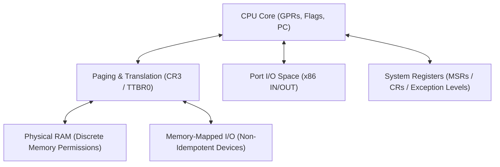

# Target Specification: Bare Metal & Freestanding Execution

**Status (2026-08-28): current single-CPU substrate plus design sketch.** The tree has an x86-64
Spike 1/QEMU bare-metal path and preliminary AArch64 machine/MMIO pieces. It does not have a generic
MMU, the illustrated MMIO transition API, proved device barriers, TLB invalidation, IDT/VBAR
machinery, multi-CPU/PE state, AP/secondary bring-up, or bare-metal locks. Fenced Lean below is
design-only unless tied to a source declaration. The canonical dual-architecture SMP and
device-memory design is `docs/MEMORY_MODEL.md` §10 and stages M7-X/M7-A.

This document records the design space for machine state, hardware control, I/O protocols, binary
packaging, and QEMU boot in **bare-metal execution**.

---

## 1. Machine Model in Freestanding Mode

In bare-metal environments, hardware state is modeled directly without OS abstractions:



### 1.1 Strict Prohibition of Red Zone in Bare-Metal / Kernel Mode
In bare-metal execution and OS kernels, **the 128-byte Red Zone is strictly prohibited**. 
Asynchronous hardware interrupts (timer interrupts, device IRQs) push the interrupt frame (`SS, RSP, RFLAGS, CS, RIP` on x86-64) directly onto the current stack without adjusting for space below `RSP`. Any leaf routine using memory below `RSP` would suffer non-deterministic stack corruption upon hardware interrupt delivery.

---

## 2. Memory-Mapped I/O (MMIO) vs Port I/O

The required model strictly distinguishes **Port I/O** (x86-specific separate address space) from
**MMIO** (physical address space):

### 2.1 Non-Idempotent Destructive Reads
Unlike standard RAM (where reads are idempotent), MMIO device registers often have **destructive side effects** (e.g. reading a UART FIFO register pops the next byte from hardware buffers, and reading an interrupt status register clears the pending interrupt).

The planned model represents MMIO reads as **explicit state-transforming transitions targeting
hardware registers**:

```lean
/-- MMIO read is a non-idempotent transition updating a destination register -/
def mmioReadByte (dev : MMIODevice) (offset : Nat) (dest : Register Arch .w8) :
    BlockM Arch (DeviceState dev) (DeviceState dev) Unit
```

### 2.2 MMIO Device Ordering, Architectural Completion, and Device Completion
On weakly-ordered architectures like ARM, MMIO reads and writes over Device memory (`nGnRnE`)
require the barrier selected by the device protocol and shareability domain. These are three distinct
claims: `DMB` orders applicable accesses; `DSB` can additionally wait for the architecture-defined
completion point of applicable explicit accesses; neither alone proves that a peripheral's internal
operation has finished. Device-effect completion requires a device-specific acknowledgement, status
read/poll, interrupt, or other cited protocol. A proof must state which of the three consequences it
needs and may not upgrade ordering into completion.

```lean
def uartConfigureBaud (baud : Nat) : BlockM arm (DeviceState .UART) (DeviceState .UART) Unit := do
  mmioStore32 UART_IBRD_ADDR (calculateIBRD baud)
  mmioStore32 UART_FBRD_ADDR (calculateFBRD baud)
  -- Architectural access completion only; a device-effect completion claim
  -- additionally needs the UART's documented status/acknowledgement protocol.
  emitInstruction (Opcode.dsb .sy)
```

---

## 3. Minimal 64-Bit ELF Executable Packaging & PVH Boot Protocol

Bare-metal x86-64 targets emit a minimal, self-contained 64-bit ELF executable directly loadable by QEMU via `-kernel` or hardware firmware loaders.

### 3.1 ELF64 Header & Program Headers
- **ELF Identification (`e_ident`)**:
  - `EI_MAG0..3`: `0x7F, 'E', 'L', 'F'`
  - `EI_CLASS`: `ELFCLASS64` (`2`)
  - `EI_DATA`: `ELFDATA2LSB` (`1`, 2's complement little-endian)
  - `EI_VERSION`: `EV_CURRENT` (`1`)
  - `EI_OSABI`: `ELFOSABI_NONE` (`0` / System V)
- **Header Fields**:
  - `e_type`: `ET_EXEC` (`2`)
  - `e_machine`: `EM_X86_64` (`0x3E` / `62`)
  - `e_version`: `1`
  - `e_entry`: Flat 64-bit physical/virtual load address (e.g., `0x200000` / 2 MB)
  - `e_phoff`: Offset to Program Header Table (`0x40` / 64 bytes)
  - `e_ehsize`: 64 bytes (`0x40`)
  - `e_phentsize`: 56 bytes (`0x38`)
  - `e_phnum`: 2 (`PT_LOAD` segment + `PT_NOTE` segment)

### 3.2 Xen PVH ELF Note (`XEN_ELFNOTE_PHYS32_ENTRY`)
When booting uncompressed 64-bit ELF images directly with QEMU `-kernel`, QEMU enforces the Xen PVH ELF boot specification. The image must contain a `PT_NOTE` segment with:
- **`namesz`**: 4 (`"Xen\0"`)
- **`descsz`**: 4 (`UInt32` little-endian physical entry point address)
- **`type`**: 18 (`XEN_ELFNOTE_PHYS32_ENTRY`)
- **Payload**: String `"Xen\0"` followed by 32-bit entry address.

### 3.3 Flat Physical Memory Model & Linker Layout
- Physical Load Base: `0x200000` (2 MB aligned).
- Flat binary layout:
  - Header Page (`0x00`..`0x1000`): ELF Header, Program Headers (`PT_LOAD`, `PT_NOTE`), Xen PVH Note.
  - `.text` / `.data` payload at `0x200000 + 0x1000` (or mapped directly at `0x200000`).

---

## 4. Hardware Peripherals & Control

Bare-metal x86-64 execution interacts directly with hardware I/O ports using `IN` and `OUT` instructions:

### 4.1 16550 UART Serial Port Protocol (`0x3F8` COM1)
The primary console output device is the 16550 compatible UART on COM1 (`0x3F8`–`0x3FF`):
- `0x3F8` (DLAB=0): Transmitter Holding Register (THR) / Receiver Buffer (RBR).
- `0x3F8` (DLAB=1): Divisor Latch Low (DLL) (`0x01` for 115,200 baud).
- `0x3F9` (DLAB=0): Interrupt Enable Register (IER) (Write `0x00` to disable interrupts).
- `0x3F9` (DLAB=1): Divisor Latch High (DLM) (`0x00` for 115,200 baud).
- `0x3FA`: FIFO Control Register (FCR) (Write `0xC7` to enable FIFO, clear FIFOs, 14-byte threshold).
- `0x3FB`: Line Control Register (LCR) (Write `0x80` to set DLAB, write divisor, write `0x03` for 8N1).
- `0x3FC`: Modem Control Register (MCR) (Write `0x0B` for DTR, RTS, OUT2).
- `0x3FD`: Line Status Register (LSR) (Bit 5 `0x20` = Transmitter Holding Register Empty `THRE`).

Polling transmission protocol:
1. Poll `IN AL, 0x3FD` until `(AL & 0x20) != 0`.
2. Write character: `OUT 0x3F8, AL`.

### 4.2 QEMU `isa-debug-exit` Port Control (`0xF4` / `0x501`)
For automated test termination in virtualized environments:
- QEMU device: `-device isa-debug-exit,iobase=0xf4,iosize=0x04`
- Writing byte `val` to port `0xF4` triggers immediate virtual machine exit with process exit code `(val << 1) | 1`.
- Writing `0` exits with process status code `1` (indicating success in `isa-debug-exit` convention).

### 4.3 Processor Halt Protocol (`HLT`)
- The `HLT` instruction (`0xF4`) stops CPU execution until an interrupt occurs.
- In bare-metal exit or unrecoverable fault handlers with interrupts disabled (`CLI`), `HLT` places the CPU in permanent quiescent halt.

---

## 5. Paging & Translation Invariants

**Status: design-only.** The current bare-metal machine does not implement the following generic
translation or invalidation proofs.

- **4-Level / 5-Level Paging**: Page table entries (PTEs) must be 4 KB aligned.
- **TLB Invalidation Proofs**: Modifying a mapping requires proof of `invlpg` (x86) or `tlbi` (ARM) before referencing the virtual address.

---

## 6. Interrupt & Exception Vector Management

**Status: design-only.** The current bare-metal path does not provide the following verified vector
tables.

- **x86 IDT**: Verified 64-bit interrupt descriptor table loaded via `lidt`.
- **ARM VBAR_EL1**: 16 vector entries spaced by 128 bytes with verified exception handler bindings.

---

### 6.1 SMP Lifecycle and Memory Ordering

The portable SMP contract starts a finite set of CPUs/PEs, gives each a unique identity and stack,
establishes coherent shared memory, and joins secondaries to a generic scheduler rendezvous.
Startup and notification are not synchronization by themselves:

- x86-64 needs an INIT–SIPI–SIPI/xAPIC or justified x2APIC path, a verified real-mode trampoline or
  declared TCB blob, and a WB-memory release/acquire boot-mailbox publication;
- AArch64 needs a selected PSCI `CPU_ON` or spin-table profile, exception-level/conduit assumptions,
  `MPIDR_EL1` identity, and an acquire/release mailbox protocol; `WFE`/`SEV` do not act as RAM
  fences;
- LAPIC, GIC, and UART accesses use target-specific device-memory events and barrier/completion
  rules, not ordinary-RAM assumptions;
- QEMU TCG can validate boot and functional controls, but cannot establish weak-memory outcomes.

The generic contract, target refinements, proof obligations, and backend-honesty rule are in
`docs/MEMORY_MODEL.md` §10. The executable validation matrix is
`docs/SPIKES/SPIKE8_MULTITHREADING.md`.

---

## 7. Spike 1: Bare Metal Hello World Verification

Spike 1 for bare-metal x86-64 verifies:
1. Construction of symbolic UART initialization and string transmission loop.
2. Linking into `BareMetalExecutable` with valid ELF64 header and PVH boot note.
3. Formal trace equivalence proof between `helloWorldSpec` and concrete execution in `BareMetalDeviceState`.
4. Differential execution in `qemu-system-x86_64` verifying byte-exact serial console output `"Hello, World!\n"` and clean programmatic exit.
