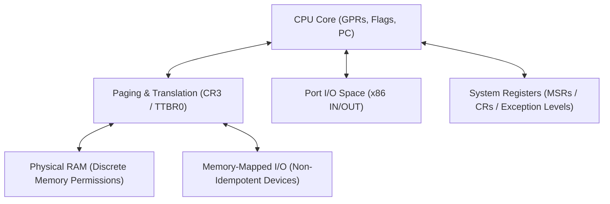

# Target Specification: Bare Metal & Freestanding Execution

This document defines the machine state model, hardware control mechanisms, and MMIO protocol proofs for **bare-metal execution** (operating system kernels, embedded hypervisors, and firmware).

---

## 1. Machine Model in Freestanding Mode

In bare-metal environments, hardware state is modeled directly without OS abstractions:



### 1.1 Strict Prohibition of Red Zone in Bare-Metal / Kernel Mode
In bare-metal execution and OS kernels, **the 128-byte Red Zone is strictly prohibited**. 
Asynchronous hardware interrupts (timer interrupts, device IRQs) push the interrupt frame (`SS, RSP, RFLAGS, CS, RIP` on x86-64) directly onto the current stack without adjusting for space below `RSP`. Any leaf routine using memory below `RSP` would suffer non-deterministic stack corruption upon hardware interrupt delivery.

---

## 2. Memory-Mapped I/O (MMIO) vs Port I/O

`gasm` strictly distinguishes between **Port I/O** (x86 specific separate address space) and **MMIO** (physical address space):

### 2.1 Non-Idempotent Destructive Reads
Unlike standard RAM (where reads are idempotent), MMIO device registers often have **destructive side effects** (e.g. reading a UART FIFO register pops the next byte from hardware buffers, and reading an interrupt status register clears the pending interrupt).

`gasm` models MMIO reads as **explicit state-transforming transitions targeting hardware registers**:

```lean
/-- MMIO read is a non-idempotent transition updating a destination register -/
def mmioReadByte (dev : MMIODevice) (offset : Nat) (dest : Register Arch .w8) :
    BlockM Arch (DeviceState dev) (DeviceState dev) Unit
```

### 2.2 MMIO Device Barriers (ARM `DSB`/`DMB` & x86 Serialization)
On weakly-ordered architectures like ARM, MMIO reads and writes over Device memory (`nGnRnE`) require explicit memory barriers (`DSB SY` / `DMB OSH`) to guarantee that peripheral configuration writes complete before subsequent execution:

```lean
def uartConfigureBaud (baud : Nat) : BlockM arm (DeviceState .UART) (DeviceState .UART) Unit := do
  mmioStore32 UART_IBRD_ADDR (calculateIBRD baud)
  mmioStore32 UART_FBRD_ADDR (calculateFBRD baud)
  -- Mandatory Device Synchronization Barrier
  emitInstruction (Opcode.dsb .sy)
```

---

## 3. Paging & Translation Invariants

- **4-Level / 5-Level Paging**: Page table entries (PTEs) must be 4 KB aligned.
- **TLB Invalidation Proofs**: Modifying a mapping requires proof of `invlpg` (x86) or `tlbi` (ARM) before referencing the virtual address.

---

## 4. Interrupt & Exception Vector Management

- **x86 IDT**: Verified 64-bit interrupt descriptor table loaded via `lidt`.
- **ARM VBAR_EL1**: 16 vector entries spaced by 128 bytes with verified exception handler bindings.
