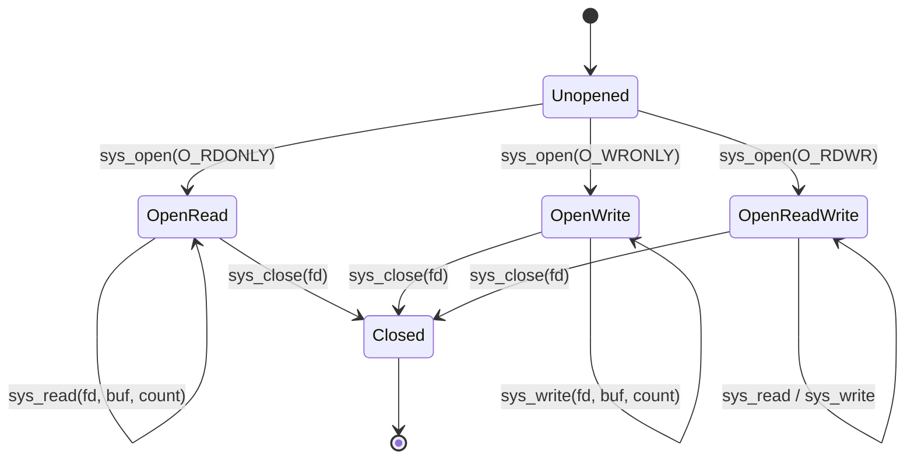

# Target Specification: Linux Platform

This document defines the system call ABIs, kernel interface state models, and ELF binary emission standards for the **Linux platform target**.

---

## 1. System Call ABIs Across Architectures

| Architecture | Instruction | Syscall Number Register | Argument Registers (1 to 6) | Return Register | Kernel Clobbered Registers |
| :--- | :--- | :--- | :--- | :--- | :--- |
| **x86-64** | `syscall` | `RAX` | `RDI, RSI, RDX, R10, R8, R9` | `RAX` | `RCX, R11` |
| **x86-32** | `int 0x80` | `EAX` | `EBX, ECX, EDX, ESI, EDI, EBP` | `EAX` | None |
| **AArch64** | `svc #0` | `X8` | `X0, X1, X2, X3, X4, X5` | `X0` | None |

### Error Return Value Convention
On Linux, return values in the range `[-4095, -1]` (unsigned `[0xFFFFF001, 0xFFFFFFFF]`) indicate negative error numbers (`-errno`).

---

## 2. Linux Kernel API State Models

In `gasm`, interactions with the Linux kernel are guarded by formal state transitions.

### 2.1 File Descriptor State Machine



### 2.2 Memory Mapping (`mmap`) State Model
- Tracks address ranges as `Unmapped → Mapped(addr, len, PROT_READ|PROT_WRITE) → Unmapped`.
- Proves memory access safety: Reading or writing to an address requires a proof witness that the address falls within a currently mapped region with compatible protection bits.

---

## 3. ELF Binary Emission

For freestanding Linux executables, `gasm` directly emits standard ELF binaries (ELF64 / ELF32):

```
+-------------------------------------------------------------+
| ELF Header (e_ident, e_type=ET_EXEC, e_machine, e_entry)    |
+-------------------------------------------------------------+
| Program Header Table:                                       |
|   - PHDR (PT_PHDR)                                          |
|   - LOAD Header (.text, RX, 2MB/4KB aligned)                |
|   - LOAD Header (.rodata / .data / .bss, RW)                |
+-------------------------------------------------------------+
| Section Data (.text, .rodata)                               |
+-------------------------------------------------------------+
```

Emitted ELF files require zero external linkers or C runtime (`crt0`) dependencies.
