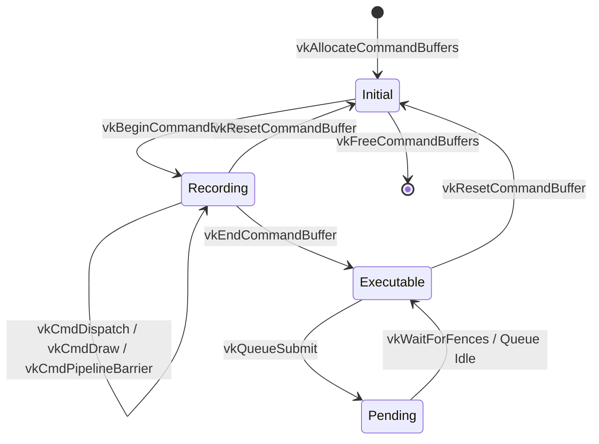

# Target Specification: SPIR-V & Vulkan Host API

This document defines the binary generation model for **SPIR-V shaders** and the formal state machine model for the **Vulkan Host API**.

> **Status note (2026-08-27)**: Following the graphics pre-build review, this document's
> `returnVoid` quantifier bug is
> fixed below (§1.2) by indexing `SpirvTerminator` on the reached exit state (matching
> `CpuTerminator`'s pattern), and its synchronization model (§2) is marked **SUPERSEDED** —
> the prior WAR/WAW-only layout-FSM claim omitted Read-After-Write hazards entirely, and its
> replacement (Vulkan's execution, synchronization, scope, and availability/visibility relations)
> is a separate design, not
> authored in this document. A pointer to the floating-point determinism question is likewise
> added rather than answered here. The `spirv-val`
> "guarantee" claim at the end of §1.2 is marked **UNSUBSTANTIATED** (no validator exists);
> replacing it with a build-time Lean validator remains graphics-roadmap work, out of scope
> for this rewrite (`docs/ROADMAP.md` §1).

---

## 1. SPIR-V Binary Shader Generation

SPIR-V is a standardized, binary intermediate language for graphics and compute shaders. `gasm` models SPIR-V with strict Static Single Assignment (SSA) form and structured control flow.

### 1.1 Physical Header Layout (5 Words)

```
Word 0: Magic Number (0x07230203)
Word 1: Version Number (e.g. 0x00010600 for SPIR-V 1.6)
Word 2: Generator Magic Number (Registered gasm Tool ID)
Word 3: Bound (Maximum %result-id allocated + 1)
Word 4: Reserved / Schema (0x00000000)
```

### 1.2 Structured Control Flow & Merge Block Mandate

SPIR-V strictly prohibits unstructured branches. Every conditional branch (`OpBranchConditional`) or switch must be preceded by an explicit **merge instruction**:

- **Selection Merge**: `OpSelectionMerge %mergeBlock None` declaring the convergence point for `if-then-else` blocks.
- **Loop Merge**: `OpLoopMerge %mergeBlock %continueTarget None` declaring the loop header, continue construct, and loop exit.

In `gasm`, `SpirvTerminator s_exit` directly incorporates structured merge headers, allowing branch branches to transition typestates before converging into `MergeIn`. The family is indexed by the specific exit state `s_exit` reached at the point of termination — the same shape as `CpuTerminator` (`docs/OBLIGATIONS_AND_CAUSALITY.md` §2.1, `Arch [TargetArch Arch] {S : Type} (s_exit : ComposedState Arch S)`) — so that a constructor's proof obligation is pinned to that one state, not to an arbitrary state a caller could supply:

```lean
inductive SpirvTerminator {S : Type} (s_exit : ComposedState spirv S) where
  | branch     {TargetIn : Type}
               (target : BasicBlock spirv TargetIn) (h_match : S = TargetIn) : SpirvTerminator s_exit
  | branchCond {TrueIn FalseIn MergeIn : Type}
               (cond : SpirvId)
               (targetTrue  : BasicBlock spirv TrueIn)  (h_true  : S = TrueIn)
               (targetFalse : BasicBlock spirv FalseIn) (h_false : S = FalseIn)
               (mergeBlock  : BasicBlock spirv MergeIn) : SpirvTerminator s_exit
  | loopBranch {BodyIn ContIn MergeIn : Type}
               (loopBody       : BasicBlock spirv BodyIn)  (h_body  : S = BodyIn)
               (continueTarget : BasicBlock spirv ContIn)
               (mergeBlock     : BasicBlock spirv MergeIn) : SpirvTerminator s_exit
  | returnVoid (h_clean : s_exit.obligations = []) : SpirvTerminator s_exit
```

> **Bug fix (2026-08-27; corrected the same day after review)**:
> the original signature was
> `returnVoid (h_clean : ∀ (s : ComposedState spirv S), s.obligations = []) : SpirvTerminator S`
> — it quantified over **all** states inhabiting typestate `S`, not the specific state
> actually reached at the point of return, and was unprovable for any inhabited state type
> with a nonempty ledger (unconstructible — fails closed). An earlier revision of this fix
> replaced it with `returnVoid (s : ComposedState spirv S) (h_clean : s.obligations = [])`,
> which is **also wrong**, in the opposite direction: with the family still indexed only by
> `S`, `s` there is an ordinary constructor field chosen freely by whoever builds the term —
> nothing ties it to the actually-reached state, so any fresh state with `obligations := []`
> discharges `h_clean` by `rfl` regardless of what was really outstanding (unconditionally
> constructible — fails open, a canned-output pattern in the type itself). The fix above
> instead indexes the whole family by the exit state (`s_exit` becomes a family parameter,
> not a field), so `SpirvTerminator s_exit` is a type specific to that one state; the only
> way to produce a `returnVoid` term of it is to discharge `s_exit.obligations = []` for the
> `s_exit` the type itself already fixes — there is no free state left to substitute.

The `gasm` SPIR-V DSL automatically generates and typechecks structured merge declarations.
**UNSUBSTANTIATED** — the previous sentence claimed this "guarantee[s] that emitted SPIR-V
passes Khronos validation (`spirv-val`)"; zero graphics Lean exists, so no DSL currently
generates or typechecks anything, and no such guarantee is established. `spirv-val` is an
external cross-check, not a proof this codebase currently produces; a build-time Lean
SPIR-V validator plus a ∀-registered-shaders validity theorem is future work in
`docs/ROADMAP.md` §1 — until that validator lands, no validity claim for
emitted SPIR-V is made here.

### 1.3 Floating-Point Determinism — replacement design pending

SPIR-V execution modes and decorations (`NoContraction`, `float-controls`) are exactly the
mechanism a future **Deterministic Shader Profile** would declare as hard device
preconditions. That profile's grammar, and the both-ways-equality-vs-ULP-refinement contract
split it enables, are not designed in this document — see `docs/GRAPHICS_ARCHITECTURE.md`
§3.4 and `docs/ROADMAP.md` §1.

---

## 2. Vulkan Host API State Machine & Pipeline Barriers



### Pipeline Barrier Synchronization Proofs — SUPERSEDED, replacement pending

> **SUPERSEDED.** The paragraph below is retained for historical context only; it is not
> the ratified synchronization model. The graphics pre-build review diagnosed its defect
> precisely: modeling barriers as a resource-layout FSM that claims WAR/WAW prevention
> **omits Read-After-Write hazards entirely** — Spike 6's own critical hazard (shader store
> → transfer read) — and a layout FSM can "prove" a barrier correct with an empty
> `srcAccessMask` (a real, classic class of Vulkan bug). The prior claim, verbatim:
>
> > In Vulkan, issuing a compute dispatch or draw command before previous write hazards are
> > flushed produces undefined GPU behavior. `gasm` requires formal proof of
> > `ValidBarrierTransition` before dispatches, preventing Write-After-Read (WAR) and
> > Write-After-Write (WAW) pipeline hazards.
>
> **Ratified direction** (not designed in this document): retain Vulkan's program order,
> storage-class-parameterized inter-thread happens-before, system-synchronizes-with, execution and
> memory dependencies, scopes, memory domains, and availability/visibility as first-class profile
> semantics. Vulkan happens-before is non-transitive and does not alone imply visibility; it must
> not be mapped directly to the repository's transitive `VectorClock` relation. Clocks may cache
> only a proved causal projection while the labelled Vulkan relations remain authoritative.
> Submission order alone is not a dependency, and queue submission, fence signal/host observation,
> semaphore signal/wait, events, and barriers each require their exact profile-defined scopes and
> consequences, with **RAW included** alongside WAR/WAW. The full DSL — total race-freedom,
> relation-soundness, visibility, and host/queue/shader refinement theorems over the command-stream
> language, per `docs/DECISIONS.md` §2 — remains prerequisite work in `docs/ROADMAP.md` §1. See
> `docs/GRAPHICS_ARCHITECTURE.md` §3.3 for the same requirement stated
> alongside the contract/audit trace split it depends on.
