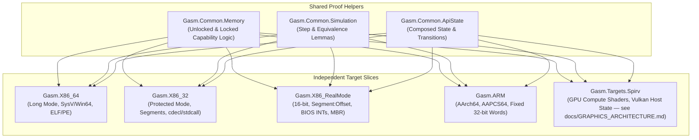

# Target Architecture Slices & Common Idioms

In `gasm`, each target architecture is implemented as an **independent vertical slice** rather than being constrained by a monolithic mega-framework. Common concepts (memory capability models, simulation relations, ABI disciplines) are shared via lightweight helper libraries.

---

## 1. Vertical Slice Target Structure

Each target directory (e.g. `Gasm/X86_64/`, `Gasm/X86_RealMode/`, `Gasm/ARM/`) is self-contained:

1. **`Machine.lean`**:
   - Target-specific registers (e.g. 64-bit GPRs, segment registers, NZCV flags, or SSA IDs).
   - Target-specific memory model and addressing math.
   - Grounded single-step operational semantics strictly derived from reference manuals.
2. **`DSL.lean`**:
   - Typed assembly builders tailored to the target's native instruction format.
   - Weaving of memory permissions (unlocked / locked) and state transitions.
3. **`ABI.lean`**:
   - Target calling conventions with dedicated caller-side and callee-side proof disciplines.
   - Concrete realizations of the placements defined by
     [Composable Boundary ABI Contexts](../ABI_CONTEXT.md). Logical library requirements and their
     composition remain target-independent; the target proves how arguments, TLS, reserved
     registers, or capability tables realize them.
4. **`Emit.lean`**:
   - Direct byte serializers (ELF, PE, Flat MBR binary, SPIR-V word stream).

---

## 2. Common Proof Helper Libraries (`Gasm.Common.*`)

Cross-cutting proof machinery is provided as reusable libraries:

- **`Gasm.Common.Memory`**:
  - `UnlockedReadable` & `UnlockedWritable` definitions.
  - `LockedExclusive` & `LockedShared` atomic capability models.
- **`Gasm.Common.Simulation`**:
  - Lemmas for forward simulation, step composition, and termination.
- **`Gasm.Common.ApiState`**:
  - Composed state structures (`ComposedState Arch Api`) and boundary transition definitions.

---

## 3. Target Slices Matrix

